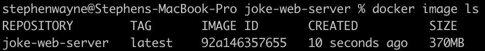

# 将 Go 应用程序归档，并优化其图像大小

> 原文：<https://betterprogramming.pub/dockerizing-a-go-app-45ca034263ca>

## 多阶段构建比单阶段构建提高了约 51 倍


# Docker 是什么？

Docker 是一个开源工具，可以为您的后端服务或应用程序生成和运行可移植的、自给自足的容器。容器可以在任何支持 Docker 的设备上运行——云服务、本地设备，甚至是您的本地开发机器。

开发人员(您)能够以可重复的、基础设施即代码的方式定义程序可用的环境和依赖关系。

构建过程使用`Dockerfile`定义，设置说明可以在[这里](https://docs.docker.com/get-started/)找到。

# 为什么要用 Docker？

Docker 有一个[伟大的解释者](https://www.docker.com/why-docker/)，但它归结为开发者效率。通过定义代码运行的确切环境，每个人都可以在同一个页面上，无论他们是在本地以开发模式运行、调试生产中断，还是探索多云部署。不再需要花费几天时间来设置开发环境，并且“在我的机器上运行良好”的紧张感消失了。Docker 并不是唯一提供这些好处的工具，但是它确实很受欢迎，并且有一个庞大的社区围绕着它。

# 我们的第一个容器

我们将集中在容器化 Chuck Norris 笑话服务器 T10 上，这是我之前写的。

我们将从 [Alpine Linux](https://www.alpinelinux.org) 开始构建，这是一个轻量级发行版，它有一个包管理器和其他我们在构建代码时可能需要的工具。在这种情况下，我们将使用一个特定于 Golang 1.17 的。

接下来，我们将使用我们的包管理器`apk`，安装构建我们的应用程序所需的任何依赖项。在这种情况下，我们只需要`ca-certificates`来提供客户端和服务器之间的安全连接。

接下来，我们将建立一个工作目录来构建我们的应用程序。从 Dockerfile 文件的这一点开始，我们将在这个目录中工作。在这里，我们将本地目录中的所有内容复制到 Docker 映像的工作目录中，但是如果有构建映像不需要的文件，您可以更有选择性。

`Copy`的形式是`Copy <source location> <destination location>`，所以我们说“将本地机器上这个目录中的内容复制到我们正在构建的映像的工作目录中。”

接下来，我们将构建我们的代码。对于 Go，我们从源材料编译并构建一个二进制文件。

如果你已经构建了许多 Go 应用程序，这看起来会很熟悉，但如果没有，它实际上是在说“使用这个代码构建一个名为`joke-web-server`的二进制文件，并将这个二进制文件放在‘这里’”。这个二进制可以静态链接(二进制不会依赖于操作系统的库)，我们打算在 linux 上运行它。”

我们将通过记录应用程序监听的端口(在容器内部)来完成我们的`Dockerfile`，并且我们将定义当结果映像运行时如何运行应用程序。

`EXPOSE`实际上并没有做太多，它本质上是应用程序在 Docker 内部的端口 5000 *上监听的文档。应用程序代码监听端口 5000，所以我们在这里记录下来。我们将在运行映像时在主机上设置端口。*

`ENTRYPOINT`是运行映像时运行的命令。所以在这种情况下，它运行的是位于`WORKDIR`的二进制代码，称为`joke-web-server`。

# 建立和运行我们的形象

我们可以通过跑步来建立我们的形象:

```
docker build -t joke-web-server .
```

该命令的格式是`docker build [OPTIONS] PATH`，所以我们说“使用位于当前目录中的 Dockerfile(和其他东西)来构建一个名为‘joke-we b-server’的映像”。流程完成后，我们可以看到我们的图像是通过用`docker image ls`列出 Docker 图像构建的:



为了运行映像，我们需要将 *Docker 端口* (由我们之前的`EXPOSE`指令粗略定义)链接到我们主机上的端口。这是一个形式为`p <local machine port>:<docker port>`的命令行选项。所以，如果我们把我们的形象表现为:

`docker run -p 5001:5000 joke-web-server`

我们告诉 Docker 将内部端口 5000(我们的应用程序正在侦听的端口)链接到本地端口 5001(您将用来访问 Docker 外部的应用程序的端口)。

旧的、可靠的`ctrl-c`可以用来在你完成后停止服务器。

我们做到了！这个通用公式可以应用于运行各种程序，内置 Go 或其他。

# 但是我们能做得更好吗？

上面的结果是一个 370MB 的图像——对于这样一个小应用程序来说不太好。如果我在我的开发机器(Max MacBook Pro)上做一个`go build`，我最终得到一个 6.7MB 的图像。这是怎么回事？

我们 Dockerfile 中的每条指令都向图像添加了一层，这可以被认为是到前一状态的`diff`。当我们构建的时候，我们会带着许多构建应用程序所需的工件进入最终的容器。我们为映像选择的操作系统也在那里，可能有我们不需要的东西，我们安装的任何包也包括在内。甚至用于构建我们的二进制文件的文件也仍然存在！所有这些都增加了最终结果的规模，更不用说当我们在现实世界中部署它时会增加潜在的攻击面。

我们可以在进行过程中集中精力清理所有不必要的部分，但是这样会大大增加复杂性(以及将来出现 bug 或安全问题的机会)。输入 Docker 多阶段构建。

多阶段构建基本上是一个管道，我们通过构建一系列图像来构建各种输出工件。这些工件然后被转移到构建的下一个“阶段”。

但是！我们不再需要保留*创建* 工件所需的位。我们一直这样做，直到我们得到一个最终的容器，它包含了部署我们的应用程序的最小依赖集。通常，这表现为两个阶段的构建:一个阶段构建应用程序的二进制文件，另一个阶段存储应用程序(以及任何依赖项)以供部署。

对于我们上面的例子，看起来如下:

阶段 1:构建

注意第一行`FROM Golang:1.17-alpine as build-stage`——我们称这个第一阶段为`build-stage`，下一步我们可以从它的文件系统中提取工件。

阶段 2:建立我们的最终形象

这里，我们复制了在`build-stage`中创建的`ca-certificates`依赖项和应用程序二进制文件。我们留下了用于构建二进制文件(及其依赖项)的所有位。

因为我们的应用程序二进制文件是静态链接的，所以我们能够为一个极简的 Docker 图像构建`FROM scratch`。你可以在这里阅读更多关于`scratch`关键词[的内容。](https://www.cloudsavvyit.com/14340/how-to-create-your-own-docker-base-images-from-scratch/)

我们现在有了一个 7.2MB 的可部署映像——比单阶段构建提高了大约 51 倍，比为我的机器构建原始二进制文件只增加了大约 7%。对于一个可移植的、易于部署的应用程序来说，这似乎是一个很好的权衡。

您可以像运行单级映像一样运行此映像，但现在它要小得多，相对攻击面非常小。

# 包扎

Docker 是一个大项目，有许多许多可能的配置，这些配置将特定于你的应用程序，但对我来说，开始是最难的部分。我希望这可以作为一个很好的跳板，并希望得到任何关于如何改进的反馈！