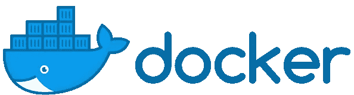

# 对 Ruby on Rails API 进行 Dockerizing

> 原文：<https://betterprogramming.pub/dockerizing-a-ruby-on-rails-api-aca8a0cb963c>

容器提供了一种在与实际运行环境完全隔离的环境中打包应用程序的方法。作为软件的一个标准单元，容器封装了代码及其所有的依赖项，因此它可以从一个环境高效地运行到另一个环境。

这种抽象将开发过程与部署过程分离开来，提供了一种灵活、可移植、可扩展的轻量级替代方案，可以将应用程序部署在私有数据中心、公共云甚至本地个人计算机上。

[Docker](https://www.docker.com/) 是一个平台，使开发者能够将他们的应用容器化，他们可以在 Linux 容器中部署、构建和运行它们。

我们如何着手把本地运行的 [Ruby on Rails](https://rubyonrails.org/) 应用程序转换成在容器中运行的 Dockerized 应用程序？

# 步骤 1:环境设置

通过选择所需的操作系统并按照屏幕上的说明安装 [Docker Desktop](https://docs.docker.com/install/) 。

安装后，打开终端并运行以下命令，确保安装正确:

`docker --version`

期待看到你刚刚安装的 Docker 版本。说明 docker 不是可识别命令的错误表明 Docker 没有正确安装或没有完成安装。

`docker run hello-world`

这个命令将运行一个简单的 *Hello，World* 应用程序。

您可能会注意到一条消息，说明 Docker 找不到名为 *hello-world，*的图像，但是正确的消息打印到了屏幕上。这是因为 Docker 有一组托管在 Docker Hub 上的存储库，为新用户和有经验的用户提供了一个将他们的应用程序归档的起点，并通过记录良好的示例展示了最佳实践。

在我们的程序中，我们将使用 [Docker Compose](https://docs.docker.com/compose/) 来运行一个名为 ParkMe 的应用程序，在一个 [Node.js](https://nodejs.org/) 服务器上运行 Ruby，带有一个 [PostgreSQL](https://www.postgresql.org/) 数据库。

ParkMe 的源代码可以在下面找到。您可以随意派生和克隆这个存储库，并查看 docker 分支。

 [## mshapir/park me-Final-back end-Rails

### 后端 api 使用 rails 停车应用程序。为 mshapir/park me-Final-back end-Rails 开发做出贡献，创建一个…

github.com](https://github.com/mshapir/ParkMe-Final-Backend-Rails/tree/docker/ParkMe) 

现在我们可以开始整理了！

# 步骤 2:创建 Dockerfile 文件

Dockerfile 确切地定义了容器环境内部发生的事情。在项目的根目录下，创建一个名为`Dockerfile`的新文件，并将以下内容粘贴到内容中:

我们可以通过 docker 文件中定义的命令流快速查看我们的应用程序正在使用的工具——Ruby 2 . 3 . 4 版、Node.js 服务器和 PostgreSQL 数据库——所有这些工具都可以很容易地进行调整，以匹配您的应用程序堆栈。

一旦运行了 Docker 映像，Docker 就会一行一行地运行这个文件，以安装最新版本的工具，创建必要的目录和文件，用于基于工具的依赖性管理。我们的是 Ruby，所以我们使用的是一个 [Gemfile](https://bundler.io/v1.5/gemfile.html) 。然后，我们可以在端口 3000 上通过 entrypoint.sh 脚本运行应用程序。

# 步骤 3:创建 Entrypoint.sh

在与 Dockerfile 相同的目录中，创建一个名为`entrypoint.sh`的文件，并将以下内容粘贴到其内容中:

# 步骤 4:创建 Docker-compose.yml

Docker Compose 是一个定义和运行多容器 Docker 应用程序的工具。

我们将使用这个工具来设置自己，以便能够一起运行其他相关的 Docker 应用程序——例如，我们应用程序的前端。该文件还定义了我们的应用程序在生产环境中的行为。

在 Dockerfile 和 entrypoint.sh 文件所在的目录中，创建一个名为 docker-compose.yml 的文件，并将以下内容粘贴到其内容中:

这个文件定义了组成我们的应用程序的服务。一定要用你的 Docker API 密匙替换`YOUR_API_KEY`！

# 第五步:跑步

在您的终端中，运行下面的命令来读取您的`docker-compose.yml`，并在容器中调出应用程序服务:

`docker-compose up`

如果您从 Docker 指南中提取一个示例 Docker 文件，最后一行是:`CMD [“rails”, “server”, “-b”, “0.0.0.0”]`，您可能会遇到一些错误。

该命令与传递给 Docker Compose 的命令之间的冲突会阻止应用程序启动，因为这两个文件都指定了每次容器启动时要运行的命令。

我们在 Dockerfile 中注释掉这一行，以允许命令`bash -c “rm -f tmp/pids/server.pid && bundle exec rails s -p 3000 -b ‘0.0.0.0’”` 启动应用程序。

# 步骤 6:创建数据库实例

在真正能够使用像 ParkMe 这样的后端服务之前，您需要在您的容器内部配置您的数据库，即使它是在您的本地机器上完成的。请记住，您是在一个隔离的环境中运行您的应用程序！

在您的终端中运行以下命令:

`docker-compose run web rake db:create`

和

`docker-compose run web rake db:migrate`

# 第七步:测试

要验证服务是否启动并运行，请导航到 REST API 中的一个入口点。如果你以 ParkMe 为例，打开任何一个网页浏览器，粘贴如下:[http://localhost:3000/API/v1/users/](http://localhost:3000/api/v1/users/)。

您应该看到以 JSON 格式返回的用户列表(如果您在步骤 6 中向数据库添加了一些新用户)。

我们的应用程序作为 Docker 容器中的服务启动并运行！

# 步骤 8:部署

部署应用程序可以通过对 docker-compose.yml 文件做一些调整来完成，

`docker swarm init`

防止与您的节点不是群管理器相关的错误；

`docker stack deploy -c docker-compose.yml nameofyourapp`

# 摘要

容器化是抽象应用程序基础结构层的一种好方法，可以尽可能高效地运输代码。

只需几个额外的步骤，您也可以让您的应用程序在 Docker 容器中运行！