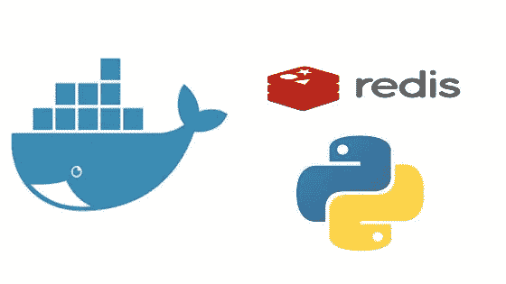
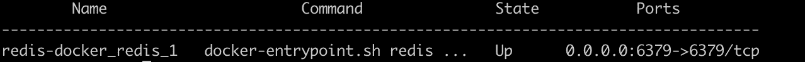

# 为 Redis 配置并运行 Docker 容器，并将其用于 Python

> 原文：<https://betterprogramming.pub/dockerizing-and-pythonizing-redis-41b1340979de>

## 容器化您的 Python 项目



如果你已经做了一段时间的程序员，你可能已经感觉到你的系统需要某种缓存机制。这就是 Redis 缓存发挥作用的地方。

Redis 是内存中的键值数据存储，是最流行的缓存工具之一。

在本文中，我们将从使用 [Docker](https://www.docker.com/) 进行设置，到使用 [Python](http://python.org) 使用 Redis。本文可分为以下三个部分:

1.  为 Redis 设置 Docker 容器。
2.  使用一些基本命令在 Redis 命令行上进行试验。
3.  用 Python 代码集成 Redis。

让我们一个一个地检查一下。

# 1.为 Redis 设置 Docker 容器

首先，我们需要为此创建一个目录和`docker-compose.yml`文件。

让我们首先创建目录:

```
mkdir redis-docker
cd redis-docker
```

此外，让我们添加一个自定义配置文件，我们将用于 Redis 容器。首先，在`redis-docker`中创建一个名为`config`的目录，然后添加一个名为`redis.conf`的文件。这个文件的内容可以在 GitHub 上找到[。](https://github.com/ashutoshkarna03/redis-docker-python/blob/master/config/redis.conf)

该文件中值得注意的一点是，我们需要将 bind 设为`bind 0.0.0.0`，否则您将无法在本地使用 Redis，只能在 Docker 环境中使用。

现在，让我们再次回到`redis-docker`目录，在这里创建包含以下内容的`docker-compose.yml`文件:

在上面的文件中，我们使用了最新的 Redis 映像，并在端口 6379 向外界公开了 Redis 容器的端口 6379。卷指定将`conf`目录的`redis.conf`文件映射到容器的`redis.conf`。

这可以通过使用我们指定的命令来加载和使用。
现在，我们已经做好了如下运行的准备:

`docker-compose up -d`

一旦 Redis 容器启动，我们可以用`docker-compose ps`来验证这一点，它应该显示如下内容:



# 2.使用一些基本命令在 Redis 命令行上进行试验

让我们连接到 redis 容器的 redis-cli 并使用它。要连接到 redis-cli，我们必须使用以下命令:

```
docker exec -it redis-docker_redis_1 redis-cli
```

注意:`redis-docker_redis_1`是这里的容器名，你也可以自己选择。默认情况下，redis-cli 将主机作为本地主机，端口作为 6379。

这将把我们连接到 redis-cli，我们可以用返回`PONG`的`ping`命令测试连接。如果是，那么您的设置是成功的。现在，我们可以尝试更多的命令，如:

```
127.0.0.1:6379> SET hello world
OK
```

这将把值`world`设置为键`hello`。我们可以用下面的命令获得这个键的值:

```
127.0.0.1:6379> GET hello 
"world"
```

Redis 最酷的 GUI 工具之一是 redis-commander。您可以使用命令`exit`从 redis-cli 注销。

# **3。将 Redis 与 Python 代码集成**

让我们快速浏览一下如何在 Python 代码中使用 Redis。

我们可以使用名为`redis`的 Python 库，它充当 Redis 到 Python 的驱动程序。我们可以使用`pip install redis`很容易地安装它。

让我们创建一个名为`py_redis.py`的文件，并将以下内容添加到其中:

我将添加更多 Redis 库支持的命令示例。

*   GitHub 上有完整版本[。](https://github.com/ashutoshkarna03/redis-docker-python/blob/master/py_redis.py)
*   本教程的全部代码可在 GitHub 上[获得。](https://github.com/ashutoshkarna03/redis-docker-python)

感谢阅读。随时欢迎评论和建议。