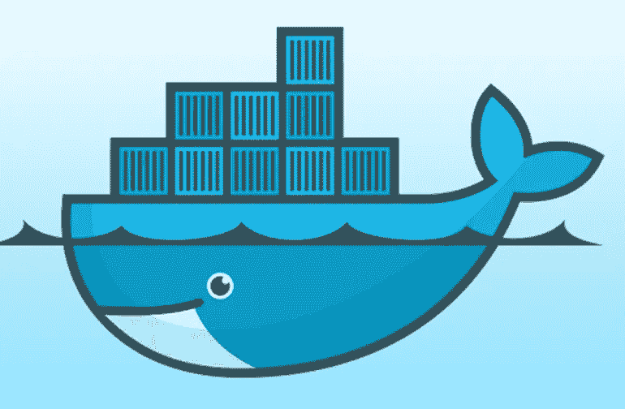

# Dockerizing Rails 应用程序第 1 部分:编写 Dockerfile

> 原文：<https://betterprogramming.pub/dockerizing-rails-applications-part-1-writing-the-dockerfile-dc32aa25a0da>

## 让我们开始编写一个 Rails 应用程序并编写一个优化的 Dockerfile



为服务和应用程序构建 Docker 映像可以通过从运行的容器提交新的 Docker 映像，或者通过在相应服务的`Dockerfile`中定义 Docker 映像来完成。在本文中，我将介绍一些为 Ruby/Rails 应用程序编写`Dockerfiles`的最佳实践。这也是描述 Ruby/Rails 应用程序 dockerizing 的最佳实践的三篇文章中的第一篇。

为了能够在 Docker 容器中运行应用程序/服务，有必要构建一个包含应用程序源代码或二进制文件及其所有依赖项的 Docker 映像。这项任务可以通过执行以下步骤来完成:

*   **为服务**创建一个`Dockerfile`**:`Dockerfile`描述了如何构建 Docker 镜像，设置 Docker 镜像的默认配置，以及安装应用程序的所有依赖项**
*   使用 Docker 命令`docker build`构建 Docker 镜像

从第一步开始，这个[链接](https://docs.docker.com/develop/develop-images/dockerfile_best-practices/)展示了支持的`Dockerfile` 指令，以及一些最佳实践。我想强调以下几点:

**仔细选择基础图像**:任何`Dockerfile`的第一条指令都是`FROM`指令。此指令为您的 Docker 映像指定基础映像。文件中的下一个指令将负责准备源代码和安装软件依赖项。选择基础映像时需要考虑的事项有:

*   仅使用官方图像作为您的图像的基础，以降低将漏洞引入 Docker 图像的风险
*   使用类似 [Alpine image](https://hub.docker.com/_/alpine/) 的小尺寸图像:这将减少部署/展示和回滚所需的时间。应用程序 Docker 映像需要在从该映像创建新容器之前下载到 Docker 主机上。
*   创建您自己的基本映像，以减少应用程序 Docker 映像的构建时间。如果您在 Docker 构建期间安装 Linux 应用程序依赖项和库，这一点非常重要。这些包和库的安装可能需要一段时间，这可能会增加部署时间(如果构建 docker 映像是部署的一部分)，或者会影响 CI/CD 管道的执行时间，因为依赖项需要安装在每个 Docker 构建上。作为一个解决方案，建议构建包含所有依赖项的基础映像，比如 Ruby 版本，然后将这些映像用作应用程序的基础映像。这篇文章描述了如何为 Ruby 应用程序构建基础 Docker 映像。

**始终使用** `entrypoint` : `entrypoint`通过将复杂的应用程序命令或脚本隐藏在一个关键字/命令之后，帮助我们为 Docker 图像创建一个简单的界面。这对于需要在运行实际服务之前执行某种逻辑的应用程序也很有帮助——例如，如果您想基于环境变量从模板中生成一些文件，然后启动您的服务。

`entrypoint`可以是一个简单的 shell 脚本，可以处理 Docker 镜像支持的命令或服务。Docker `entrypoint`文件的唯一要求是它应该是一个可执行文件。例如，要为提供两种服务的 Rails 应用程序添加一个 Docker `entrypoint`,可以遵循以下指令:

*   用以下内容创建 Docker `entrypoint`。

注意，上面的`entrypoint`也允许通过使用`*)`命令来执行其他命令。如果您想将 Docker 映像限制为仅支持的命令，您可以删除最后一种情况。只有当 Docker `entrypoint`被覆盖时，执行其他命令才是可行的。

*   使文件可执行:`chmod a+x docker-entrypoint.sh`。
*   将文件复制到 Docker 镜像并设置`ENTRYPOINT`。

```
COPY ./docker-entrypoint.sh /
ENTRYPOINT ["/docker-entrypoint.sh"]
```

**最小化 docker 图像的大小:**幸运的是在 Docker 的最新版本中，只有以下指令— `RUN`、`COPY`和`ADD` —会产生新的 Docker 图像层，因此，Docker 图像的大小会增加。为了使 Docker 图像尽可能小，您可以考虑以下几点

*   仅将需要的文件添加到 Docker 映像中
*   仅将所需的包和库安装到 Docker 映像中
*   如有可能，将多个`RUN`命令组合在一起(在一个`RUN`命令中)。这将减少 Docker 层的数量。例如，不要添加五个单独的`RUN`指令来安装`Dockerfile`中的包(这将在生成的 Docker 映像中引入五个 Docker 层)，而是尝试将这个指令合并到一个指令中，以将 Docker 层减少到只有一个。

```
# Instead ofRUN addgroup -g 1000 rails
RUN adduser -S -G rails -u 1000 -h /application railsRUN apk update
RUN apk add linux-headers build-base curl zlib-dev libxml2-dev libxslt-dev tzdata yaml-dev git nodejs file zip unzip
RUN rm -rf /var/cache/apk/*# It should be one RUN instruction
RUN addgroup -g 1000 rails && \
    adduser -S -G rails -u 1000 -h /application rails && \
    chown -R rails /usr/local/bundle && \
    apk update && \
    apk add linux-headers build-base curl zlib-dev libxml2-dev libxslt-dev tzdata yaml-dev git nodejs file zip unzip && \
    rm -rf /var/cache/apk/*
```

*   安装完依赖项后，删除不需要的软件包，例如安装软件所需的编译器或其他软件包。

**注意指令的顺序:**为了提高构建 Docker 映像的效率和性能，对`Dockerfile`中的指令进行排序，将不太可能改变的指令放在文件的顶部，而将更可能改变的指令放在底部。这个顺序将允许 Docker 更有效地构建图像缓存。例如，以下说明应放在`Dockerfile`的顶部。

```
ENV PORT 8080
ENV RACK_ENV=production RAILS_ENV=production
ENV RAILS_LOG_TO_STDOUT=true
ENV SECRET_KEY_BASE changeme
EXPOSE 8080COPY ./docker-entrypoint.sh /
ENTRYPOINT ["/docker-entrypoint.sh"]
```

综合以上做法，会产生以下`Dockerfile`。在这个文件中，我将运行 Ruby 2.6.3 和 MySQL 的 Rails 应用程序之间的所有共享指令都移到了 Docker 基本映像`wshihadeh/rails-base-image:2.6.3-mysql`中。

任何依赖于 Ruby 2.6.3 和 MySQL 的 Rails/Ruby 应用程序都可以重用这个映像。这一步大大减少了应用程序 Docker 映像的构建时间。接下来，我在文件的顶部添加了不太可能更改的命令，在底部添加了每次都需要执行的命令。

为应用程序构建 Docker 映像只需执行下面的 Docker 命令。

```
docker build -t ${IMG}:${IMG_TAG} Dockerfile
docker push ${IMG}:${IMG_TAG}
```

在下一篇[文章](https://medium.com/@wshihadeh/dockerizing-rails-applications-part-2-automation-3092975fa4bb)中，我将介绍我们如何引入一个简单的接口来构建、推送、测试和处理 Docker 图像。