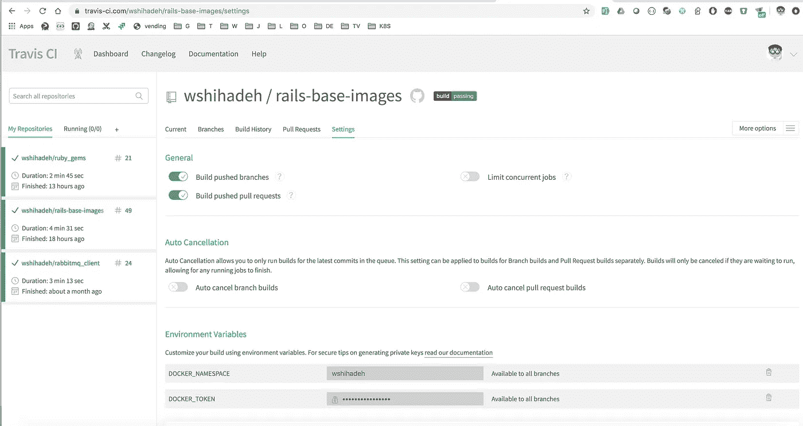

# Dockerizing Rails 应用程序第 3 部分:CI/CD 集成

> 原文：<https://betterprogramming.pub/dockerizing-rails-applications-part-3-ci-cd-integration-9f2dcd84780f>

## 让我们使用 CI/CD 工具来自动创建 Docker 映像


照片由[粘土堤](https://unsplash.com/@claybanks?utm_source=medium&utm_medium=referral)在 [Unsplash](https://unsplash.com?utm_source=medium&utm_medium=referral) 上拍摄

[](https://medium.com/faun/dockerizing-rails-applications-part-1-writing-the-dockerfile-dc32aa25a0da) [## Dockerizing Rails 应用程序第 1 部分:编写 Dockerfile

### 让我们开始编写一个优化的 Dockerfiles

medium.com](https://medium.com/faun/dockerizing-rails-applications-part-1-writing-the-dockerfile-dc32aa25a0da) [](https://medium.com/faun/dockerizing-rails-applications-part-2-automation-3092975fa4bb) [## 对接 Rails 应用第 2 部分:自动化

### 使用 Makefiles 简化 Rails 应用程序的 docker 构建

medium.com](https://medium.com/faun/dockerizing-rails-applications-part-2-automation-3092975fa4bb) 

在本系列的第 [1](https://medium.com/@wshihadeh/dockerizing-rails-applications-part-1-writing-the-dockerfile-dc32aa25a0da) 和 [2](https://medium.com/@wshihadeh/dockerizing-rails-applications-part-2-automation-3092975fa4bb) 部分中，我解释了如何通过为应用程序编写 Docker 文件来对 rails 应用程序进行 Docker 化，并查看了构建 Docker 映像的一些最佳实践。此外，我还解释了如何实现或创建一个简单、一致且易于使用的界面来构建跨多个应用程序的 Docker 图像。

在这篇文章中，我将介绍如何使用三种不同的 CI/CD 工具:`jenkins`、`travis`和`Github Actions`来集成构建 Docker 映像和将映像推送到 docker registry 的过程。

# 詹金斯

Jenkins 是一个免费的开源自动化服务器，用于自动运行软件部署、编译源代码或执行单元测试等任务。使用 [Jenkins Pipelines](https://jenkins.io/doc/book/pipeline/) 可以轻松定义自动化任务。我将使用这个特性来定义一个可用于构建 Docker 映像的管道。

除了 Jenkins 管道文件，我还将定义管道参数。这些将用于覆盖我们在之前的[文章](https://medium.com/@wshihadeh/dockerizing-rails-applications-part-2-automation-3092975fa4bb)中编写的`Makefile`中定义的配置项目。

管道的下一部分是 stages 部分。这里我们定义了属于管道的阶段以及这些阶段的执行顺序。

对于 Docker 构建管道，我们需要以下四个阶段

*   **Checkout SCM** :管道从`git`中签出应用库，切换到选择的分支。
*   **安装先决条件**:我们执行命令`make config`来准备构建 Docker 映像的工作目录。
*   **构建映像**:管道使用`make build`为应用程序构建 Docker 映像。
*   **推送图片** : `make push`将构建好的 Docker 图片推送至 Docker 注册表。

`post`段是管道的最后一段。在这里，我们运行可以在执行管道阶段后发生的操作。我们可以执行`make clean`命令来删除所有生成的文件或 docker 图像。

以下是詹金斯流水线的完整实现:

詹金斯文件

上面的詹金斯管道需要手动触发。如果需要用 Github 推送来触发这个管道，你可以按照这个[帖子](https://medium.com/@wshihadeh/how-too-add-github-webhook-to-a-jenkins-pipeline-62b0be84e006)中的步骤来做。

# **特拉维斯·CI**

Travis CI 是一个托管的持续集成服务，用于为 GitHub 中托管的应用程序运行持续集成作业。这项服务对开源项目是免费的。让我们看一下，每当有新的提交被推送到主分支或创建了拉取请求时，我们如何让 Travis CI 构建 Docker 映像。

只需在 GitHub 项目中启用`travis ci`，并在项目存储库的根目录中引入一个 Travis 文件，就可以实现 Travis CI 集成。Travis 文件是一个 YAML 文件，包含所有需要执行的任务，以及集成的配置，比如任务何时被触发。Travis 界面的完整描述可以在 Travis 网站[这里](https://docs.travis-ci.com/user/customizing-the-build/)找到。我们的`.travis.yml`文件包括以下配置部分:

*   项目编程语言和版本。
*   Git 分支到任务被启用的地方。我们将仅对`master`分支进行限制。
*   需要在脚本之前执行的操作。对于这个任务，我们需要确保`travis ci`工作者被允许将 Docker 图像推送到 Docker 注册中心。因此，我们需要在构建映像并将其推送到注册表之前执行`docker login`命令。幸运的是，Travis 提供了一种将安全变量存储为环境变量并将其传递给`ci workers`的方法——不需要将密码或任何敏感数据以纯文本形式存储在`.travis.yml`中。我们可以从项目的配置页面添加这些环境变量，如下所示:



在`.travis.yml`中，我们可以引用这些环境变量，而没有暴露秘密配置的风险:

```
echo $DOCKER_TOKEN | docker login -u $DOCKER_NAMESPACE  --password-stdin
```

`travis.yml`的下一部分执行实际完成工作的命令。这里，我们将使用命令`make release`来构建和发布 Docker 图像。

最后一部分是通知部分。这是一个可选的步骤，但很高兴有。这允许我们监控作业的状态——当它被触发时，我们会收到一个关于构建状态的 Slack 通知。

这里有一个完整的`.travis.yml`实现，它将实现上面讨论的要点:

可以使用以下命令生成松弛密钥值:

```
travis encrypt "${slack_room_token}" --add notifications.slack
```

# **Github 动作**

[GitHub Actions](https://github.com/features/actions) 是 GitHub 提供的一项服务，用于自动化 CI/CD 任务和工作。通过 Github 的动作，我们可以定义当 Github 事件被触发时要执行的 CI/CD 任务。支持事件的列表可在[这里](https://developer.github.com/webhooks/)找到。

要将 Docker 图像发布任务集成为 Github 动作，我们需要为我们的工作编写一个工作流。这个工作流只是一个 YAML 文件，存储在 GitHub 存储库的根路径(`.github/workflows`)中的以下路径下。工作流文件包含执行工作流所需的信息和需要执行的[动作](https://github.com/marketplace)列表。GitHub 为可以在工作流上执行的操作提供了一个[市场](https://github.com/marketplace)。另一方面，您可以开发自己的操作并发布到市场上，这样其他人也可以使用它。

为了自动化和集成使用 GitHub 动作构建 docker 图像的过程，我将介绍两个工作流。

## 工作流程一

一旦我们针对`master`分支创建了一个拉请求，或者如果一个新的提交被推送到`master`分支，第一个工作流就被执行。这个工作流将只执行`make build`命令，以确保我们的图像 Docker 构建没有被破坏(这些动作是为了演示的目的，可以根据需要进行更改)。

工作流首先定义何时需要触发操作，然后列出需要执行的步骤。最后一步是根据作业状态发送时差通知。

注意，应该创建秘密`SLACK_WEBHOOK_URL`并添加到各自的 GitHub 存储库中。你可以通过执行[这些步骤](https://help.github.com/en/actions/automating-your-workflow-with-github-actions/creating-and-using-encrypted-secrets#creating-encrypted-secrets)来实现。

## 第二工作流程

只有在 GitHub 上发布新版本时，才会执行第二个工作流。它将负责为该版本构建 docker 映像，并将它们推送到 Docker 注册中心。

这个工作流与第一个工作流的第一个区别是触发事件。在第一种情况下，它在每次推送到`master`或每次针对主分支机构的公关时被触发，但这个工作流只有在 GitHub 上发布新版本时才会被触发。如前所述，推送事件不是 GitHub 提供的唯一事件，事实上，工作流可以利用的事件有很长的[列表](https://developer.github.com/webhooks/)。

第二个区别是，这个工作流将构建、标记 Docker 图像并将其推送到 Docker 注册中心。这意味着我们需要添加一个额外的步骤来验证 Docker 注册表，这样它就可以将图像推送到注册表中(可以像这里的[所描述的那样添加秘密](https://help.github.com/en/actions/automating-your-workflow-with-github-actions/creating-and-using-encrypted-secrets#creating-encrypted-secrets))。

Docker 图像的标签也是从 GitHub 动作负载中提取的，并作为一个`Environment`变量传递给`make`命令，如下所示:`IMAGE_TAG=${{ github.ref}} make release`。

下面是第二个工作流的完整实现。将这些工作流文件添加到 GitHub 工作流路径将会自动在各自的存储库上启用 Github 操作:

# **结论**

将构建 Docker 映像的过程归档和自动化相对简单。要为自动化流程完整构建 CI/CD 集成管道，请执行以下步骤:

*   写一个`Dockerfile`将申请归档。
*   使用`Makefiles`提供简单的命令来构建 docker 映像。
*   使用一个或多个 CI/CD 工具(`Jenkins`、`Travis` 和`Github Actions`等)来自动化你的管道。