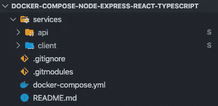

# 用 MongoDB 实现一个 React 应用和一个 Express API

> 原文：<https://betterprogramming.pub/dockerizing-react-app-and-express-api-with-mongodb-f3a06bebf570>

## 关于如何使用容器将 React 应用、Express API 和 MongoDB 迁移到 Docker 的简单指南


图片由[穆罕默德·哈桑](https://pxhere.com/en/photographer/767067)在 [PxHere](https://pxhere.com/en/photo/1449859) 上拍摄

为了简单起见，我假设您有一个工作的前端和后端，以及连接的数据库。

最好的想法是将 API 和客户端回购放在一个文件夹中。您可以使用一个远程 repo 来存储它们，或者使用两个独立的远程 repo，然后使用 Git 子模块将它们与父远程组合在一起。我就是这么做的。



父回购文件夹树

# React 应用

我为我的项目使用了 Create React App (CRA)和 TypeScript。这是一个简单的博客，有几个观点。

首先要做的是在客户机根文件夹中创建一个 Dockerfile。为此，只需键入:

```
$ touch Dockerfile
```

打开文件，让我们填写它。我在我的 CRA 上使用 TypeScript，所以首先我必须构建我的应用程序。然后，我把我得到的东西作为静态文件存放起来。为了实现这一点，我们将采用[两阶段 Docker 构建](https://docs.docker.com/develop/develop-images/multistage-build/)。

第一阶段是使用 Node 构建应用程序。我用的是阿尔卑斯版本——因为它最轻，所以我们的容器会很小。

```
FROM node:12-alpine as builderWORKDIR /app
COPY package.json /app/package.json
RUN npm install --only=prod
COPY . /app
RUN npm run build
```

docker 文件的开头看起来就是这样。我们使用`node:12-alpine as builder`，然后建立一个工作目录到`/app`。这将在我们的容器中创建一个新文件夹。我们将我们的`package.json`复制到容器中的一个新文件夹中，并安装所有的包。接下来，我们从`/services/client`文件夹中复制所有内容并粘贴到我们的容器中。这一步的最后一点是构建一切。

现在我们必须托管新创建的构建。为了做到这一点，我们将使用 NGINX——再次在 Alpine 版本中减少大小。

```
FROM nginx:1.16.0-alpine
COPY --from=builder /app/build /usr/share/nginx/html
EXPOSE 80
CMD ["nginx", "-g", "daemon off;"]
```

我们复制上一步的构建并粘贴到`nginx`文件夹中。然后暴露端口`80`——这将是我们的容器监听连接的端口。最后一行是启动 NGINX。

客户端部分到此为止。整个 docker 文件应该如下所示:

```
FROM node:12-alpine as buildWORKDIR /app
COPY package.json /app/package.json
RUN npm install --only=prod
COPY . /app
RUN npm run buildFROM nginx:1.16.0-alpine
COPY --from=build /app/build /usr/share/nginx/html
EXPOSE 80
CMD ["nginx", "-g", "daemon off;"]
```

# 快速 API

API 也非常简单——使用 RESTful 路由来创建帖子、处理授权等。让我们从在 API 根文件夹中创建一个 Dockerfiler 开始，方法与上一部分相同。

我用了 ES6 的特性，所以我必须把所有东西都编译成 Vanilla JS 来运行它，我用了 Babel。你可以猜到，这将是一个两阶段的建设了。

```
FROM node:12-alpine as builderWORKDIR /app
COPY package.json /app/package.json
RUN apk --no-cache add --virtual builds-deps build-base python
RUN npm install
COPY . /app
RUN npm run build
```

它与客户的 Dockerfile 非常相似，所以我不会再解释它了。不过，有一点不同。

```
RUN apk --no-cache add --virtual builds-deps build-base python
```

在将密码保存到数据库之前，我用 bcrypt 对密码进行了哈希处理。这是一个非常受欢迎的软件包，但它在使用阿尔卑斯山图像时存在一些问题。您可能会发现类似以下的错误:

```
node-pre-gyp WARN Pre-built binaries not found for bcrypt@3.0.8 and node@12.16.1 (node-v72 ABI, musl) (falling back to source compile with node-gyp)npm ERR! Failed at the bcrypt@3.0.8 install script.
```

这是一个众所周知的问题，[解决方案](https://github.com/kelektiv/node.bcrypt.js/wiki/Installation-Instructions#docker)是在安装 npm 包之前安装额外的包和 Python。

与客户端类似，下一步是获取构建 API 并使用 Node 运行它。

```
FROM node:12-alpine
WORKDIR /app
COPY --from=builder /app/dist /app
COPY package.json /app/package.json
RUN apk --no-cache add --virtual builds-deps build-base python
RUN npm install --only=prodEXPOSE 8080 
USER node
CMD ["node", "index.js"]
```

一个例外是只安装生产包。我们不再需要巴别塔——因为一切都在第一步中完成了。然后我们公开端口`8080`来监听请求并启动节点。

整个 docker 文件应该如下所示:

```
FROM node:12-alpine as builderWORKDIR /app
COPY package.json /app/package.json
RUN apk --no-cache add --virtual builds-deps build-base python
RUN npm install
COPY . /app
RUN npm run buildFROM node:12-alpine
WORKDIR /app
COPY --from=builder /app/dist /app
COPY package.json /app/package.json
RUN apk --no-cache add --virtual builds-deps build-base python
RUN npm install --only=prodEXPOSE 8080 
USER node
CMD ["node", "index.js"]
```

# Docker 撰写

最后一步是将 API 和客户机容器与 MongoDB 容器结合起来。为此，我们使用一个放在父回购根目录中的`docker-compose`文件——因为它必须访问客户端和 API 的 docker 文件。

让我们创建`docker-compose`文件:

```
$ touch docker-compose.yml
```

我们应该得到如下所示的文件结构。


父回购文件夹树

用下面的代码填充`docker-compose`文件，稍后我会解释。

```
version: "3"services:
  api:
    build: ./services/api
    ports:
      - "8080:8080"
    depends_on:
      - db
    container_name: blog-api client:
    build: ./services/client
    ports:
      - "80:80"
    container_name: blog-client db:
    image: mongo
    ports:
      - "27017:27017"
    container_name: blog-db
```

真的就这么简单。我们有三个服务:客户端、API 和 MongoDB。MongoDB 没有 Docker file——Docker 会从它的 hub 下载图像，然后用它们创建一个容器。这意味着我们的数据库是易腐的，但对于开始它是足够的。

在 API 和客户机中，我们有一个 build 键，它分别指向两个服务的 Dockerfile 位置(根文件夹)。other 文件中的端口容器被分配到我们的`docker-compose`网络端口，这样容器就可以相互通信。API 服务也有`depends_on`键。这告诉 Docker 等待启动它，直到数据库容器完全运行。因此，我们将避免来自 API 容器的连接错误。

MongoDB 还有一点:在我们后端的代码库中，我们必须更新 MongoDB 连接字符串。通常，我们指的是`localhost`:

```
mongodb://localhost:27017/blog
```

但是使用`docker-compose`，它必须指向一个容器名:

```
mongodb://blog-db:27017/blog
```

最后一步是在父 repo 根目录( `docker-compose.yml`所在的位置)中使用以下命令运行所有内容:

```
$ docker-compose up
```

仅此而已。我想更多的是阅读而不是编码。谢谢你坚持到最后！