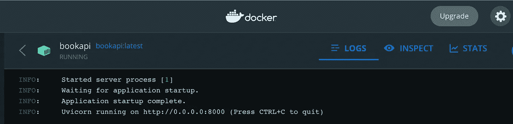
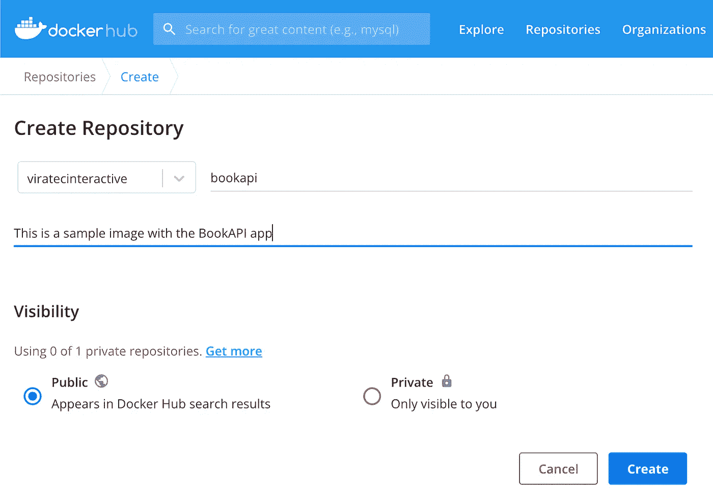
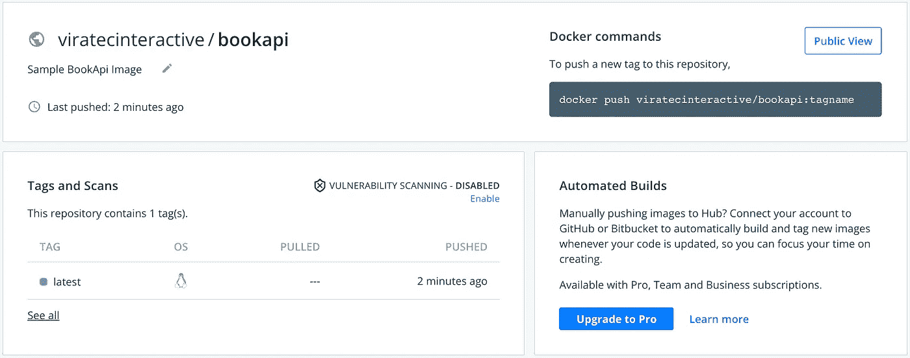

# 将您的 FastAPI 项目归档

> 原文：<https://betterprogramming.pub/dockerizing-your-fastapi-project-d8bb13ad6335>

## 5 分钟内集装箱化


photo by pix abay:[https://www . pexels . com/photo/business-cargo-cargo-container-city-262353/](https://www.pexels.com/photo/business-cargo-cargo-container-city-262353/)

# 概观

在这篇文章中，我简要地分析了 FastAPI 项目的 Docker 化以及如何将它上传到 Docker Hub。这里概述的概念在我最近出版的一本书《使用 FastAPI 和 AWS 构建无服务器 Python 应用程序》中有详细阐述事不宜迟，我们开始吧！

# 定义图像

## 安装依赖项

我们将使用 Python 3.9-slim 基础映像来帮助我们定义和安装 uvicorn、wheel 和 poem 以及其他一些依赖项。创建 Dockerfile 文件并添加以下内容:

```
FROM python:3.9.12-slim

RUN pip install fastapi uvicorn poetry wheel

EXPOSE 8000

WORKDIR /usr/src/projectname

ENV *PORT* 8000
ENV *HOST* "0.0.0.0"
```

在这里，您可以更改端口和您的应用程序正确配置所需的任何其他内容。

# 复制项目文件

下一部分将在一些假设下运行。首先，它假设除了`main.py`和依赖文件之外的所有文件都在 repo 中一个名为`src`的文件夹下。假设您的应用程序的端口和主机是从环境变量中提取的，而不是需要通过启动命令来传递。它还假设最终用户利用诗歌作为他们的依赖。

无论哪种方式，您都需要复制运行应用程序所需的最少文件，以避免添加额外的脚本、测试文件夹等。将以下内容添加到您的 docker 文件中:

```
COPY ./src/ /projectname/src
COPY ./main.py /projectname
COPY ./pyproject.toml /projectname

WORKDIR /projectname
```

现在我们只需要安装项目依赖项并添加入口点。将以下内容添加到文件中:

```
RUN poetry config virtualenvs.create false \
  && poetry install

CMD ["uvicorn", "main:app"]
```

# 审查文档

您的最终 docker 文件应该类似于以下内容，在端口和项目文件列表方面有所变化:

```
FROM python:3.9.12-slim

RUN pip install fastapi uvicorn poetry wheel virtualenv

EXPOSE 8000

WORKDIR /usr/src/projectname

ENV *PORT* 8000
ENV *HOST* "0.0.0.0"COPY ./src/ /projectname/src
COPY ./main.py /projectname
COPY ./pyproject.toml /projectname

WORKDIR /projectnameRUN poetry config virtualenvs.create false \
  && poetry install

CMD ["uvicorn", "main:app"]
```

如果您使用的是`requirements.txt`文件，那么您可能需要用`poetry`替换`pip`的依赖项安装。别忘了把它也抄一遍！

# 构建和测试

## 建筑物

要在本地构建，请使用项目所需的映像名称运行以下命令:

```
docker build -t imagename -f Dockerfile .
```

如果您的机器运行的是 Apple 硅芯片，请改为运行以下程序，以防止 AWS Fargate 和 Heroku(仅举几例)出现问题:

```
docker build --platform linux/amd64 -t imagename -f Dockerfile .
```

运行`docker images`命令检查生成的项目。一旦您确认了列表，我们就可以进入下一步了。

# 本地运行

我们准备尝试一个初始项目启动。如果您的应用程序需要环境变量，那么在您配置您的构建以拥有它之前，它不会准备好使用，但是您将能够知道整个设置是否接近下一步的工作。

从终端运行以下命令:

```
docker run --name imagename -p 8000:8000 imagename
```

您将看到终端的输出，除非您传递在后台运行的选项。当您单击容器时，还可以从 Docker 仪表板中看到日志。假设您在`port 8000` 上运行，并且没有对项目启动进行进一步的更改，您的输出应该类似于以下内容:



Docker Dashboard 中按作者列出的 bookapi 日志

# 上传到 Docker Hub

对于这一部分，你需要有一个 Docker 的帐户。一旦你这样做了，点击选项来创建一个新的存储库，并给它一个名字。



按作者分类的 DockerHub 示例快照

对于本例，您可以选择私有或公共。注意，练习完后可以删除。单击 create 获得最终的存储库和映像名称。您可以更改在构建中标记图像的方式，以包括存储库名称，如下所示:

```
docker build -t repositoryname/imagename -f Dockerfile .
```

当您设置好新标记的图像后，验证您的 DockerHub 帐户并使用以下命令推送您的图像(用您的条目替换存储库、图像和标记，例如`viratecinteractive/bookapi:latest`):

```
docker push repositoryname/imagename:tag
```

完成后，您将看到您的新上传，以及一些额外的详细信息和选项，如漏洞扫描。



作者已将 bookapi 图像上传到 DockerHub

就是这样！这只是使用 Docker Hub 作为注册中心的一个简单例子，但是您可以应用讨论的大多数步骤来上传到 AWS ECR 和 Heroku 容器注册中心。

```
**Want to Connect?**If you want to learn more about using AWS ECR and Fargate with a sample FastAPI project, go to [my website](https://www.eidanrosado.com/).
```