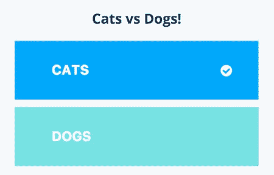
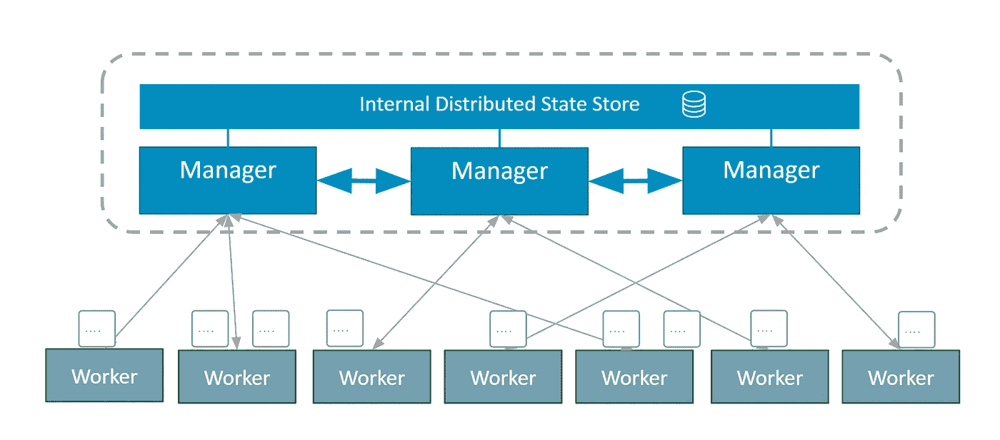
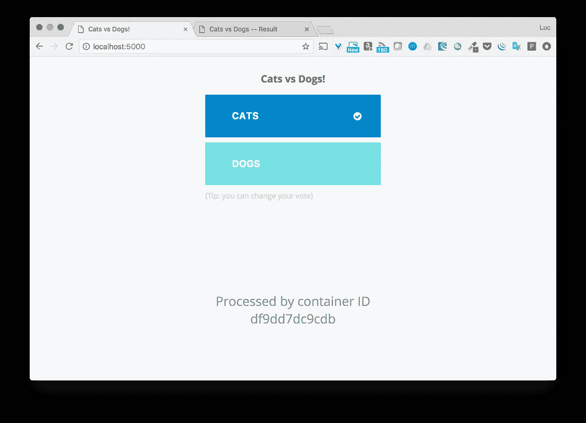
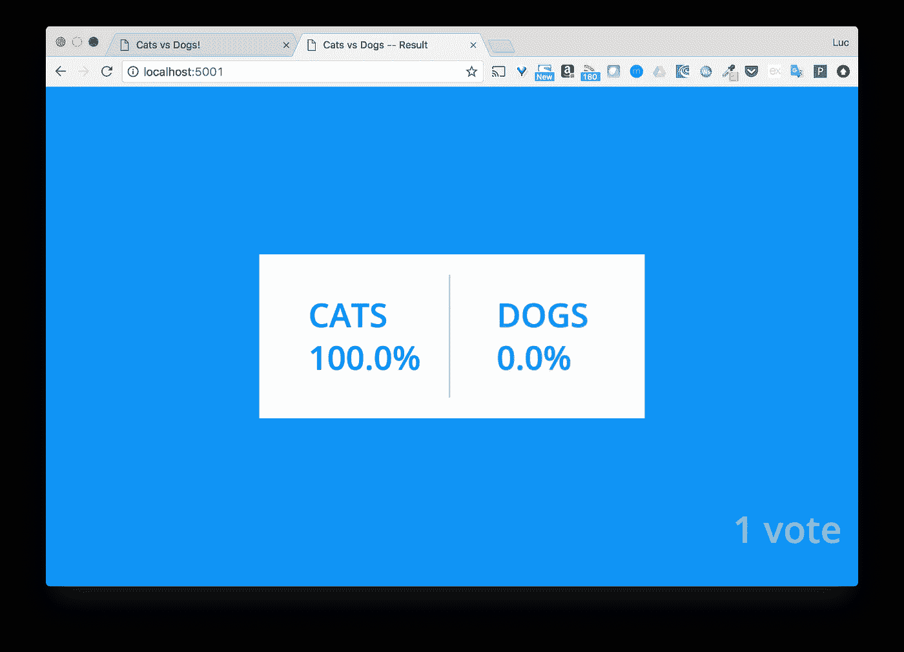
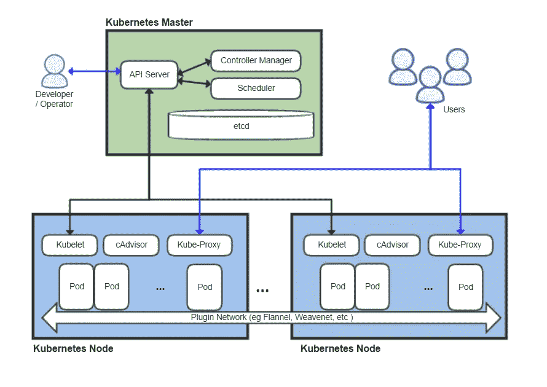
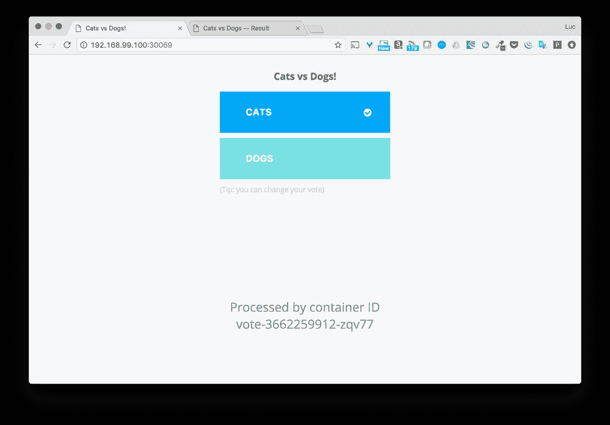
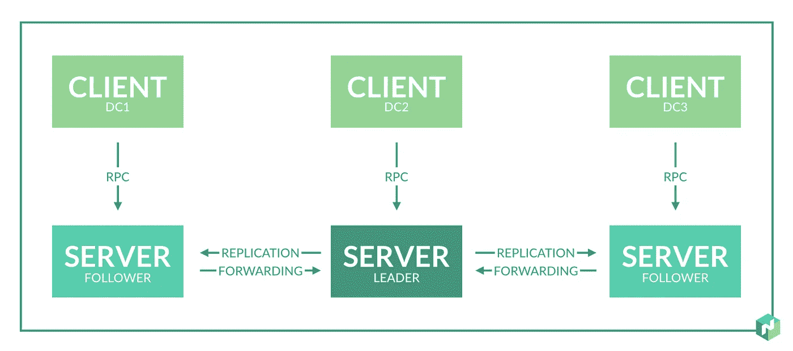
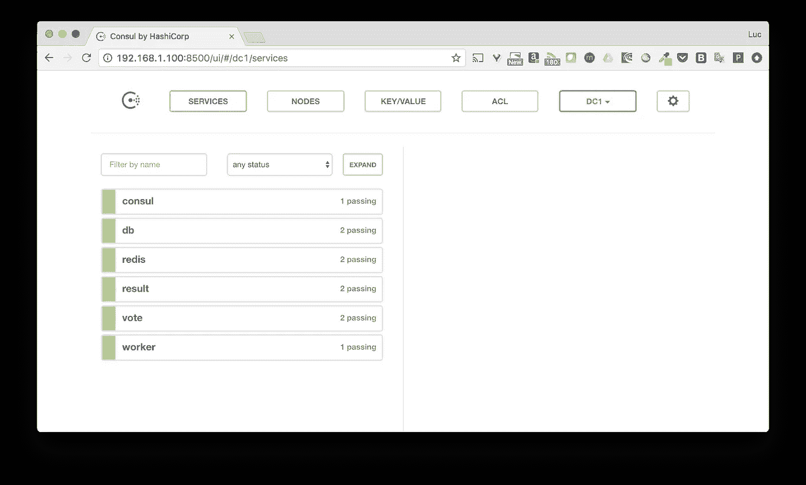
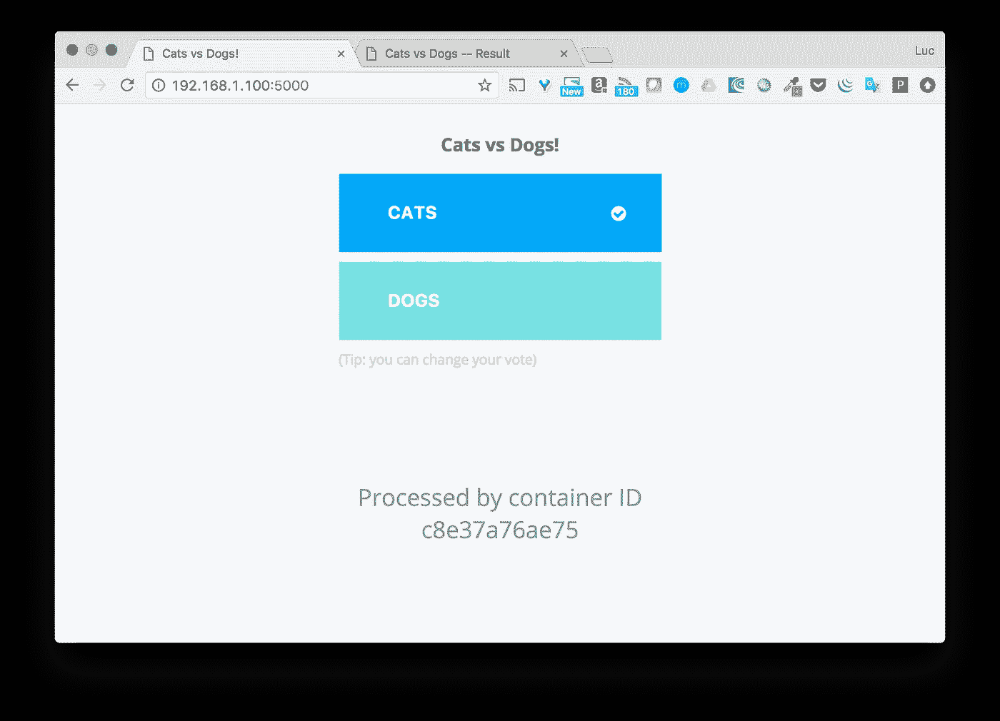
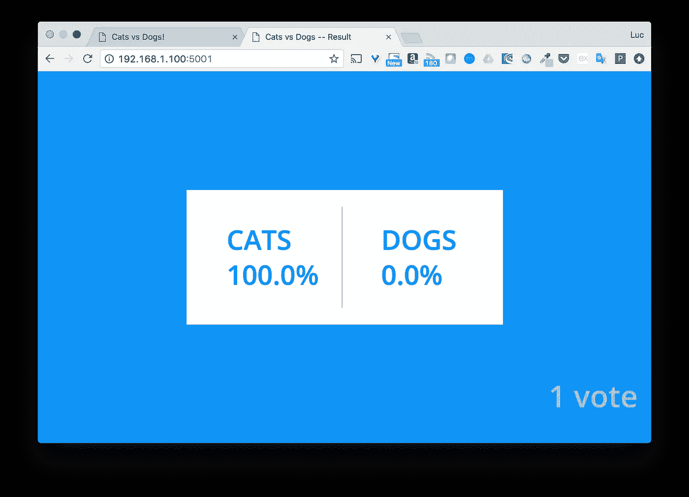

# Docker 在 Swarm、Kubernetes 和 Nomad 上的投票应用

> 原文：<https://betterprogramming.pub/dockers-voting-app-on-swarm-kubernetes-and-nomad-8835a82050cf>



# TL；速度三角形定位法(dead reckoning)

当你在技术领域工作时，你一定要有好奇心，因为保持学习和跟上时代是很重要的。这个地区的发展速度非常快。

容器编排是一个如此热门的话题，即使你有自己喜欢的工具(我的心属于 [Docker Swarm](https://docs.docker.com/engine/swarm/) )，看看其他工具是如何工作的，并从中学习也总是很有趣的。

在本文中，我们将使用 Docker 的投票应用程序，并将其部署在 Swarm、 [Kubernetes](https://kubernetes.io/) 和 [HashiCorp Nomad](https://www.nomadproject.io/) 上。我希望你在阅读这篇文章的时候会和我在做实验的时候一样开心。

# 投票应用程序

我在以前的文章中使用过(也滥用过)投票应用。这个应用程序遵循微服务架构。它由五个服务组成，如下图所示。


Docker 的投票应用架构([https://github.com/docker/example-voting-app](https://github.com/docker/example-voting-app))

*   投票-使用户能够在猫和狗之间进行选择的前端。
*   Redis —存储投票的数据库。
*   Worker —从 Redis 获取投票并将结果存储在 Postgres 数据库中的服务。
*   Db —存储投票结果的 Postgres 数据库。
*   结果—前端，显示投票结果。

正如我们在 GitHub 资源库中看到的，投票应用程序有几个合成文件。

[](https://github.com/docker/example-voting-app) [## docker/示例-投票-应用程序

### 示例-投票-应用程序-示例 Docker 编写应用程序

github.com](https://github.com/docker/example-voting-app) 

`docker-stack.yml`是应用程序的生产就绪表示。这个文件的内容是:

基本上，这个文件中定义了六个服务，但是投票 App 架构中只定义了五个服务。附加的一个是“可视化器”；一个伟大的工具，它提供了一个清晰的界面，显示服务的任务部署在哪里。

# 码头工人群

Docker Swarm 是 Docker 容器的集群和调度工具。借助 Swarm，IT 管理员和开发人员可以将 Docker 节点集群作为单个虚拟系统来建立和管理。

## 蜂群的概念

一个 Swarm 集群由几个节点组成——一些节点充当管理者，另一些节点充当工作者。

*   管理节点是负责集群内部状态的节点。
*   工作节点是执行任务(运行容器)的节点。



群集群的体系结构

正如我们所看到的，管理器共享一个内部分布式存储，以便维护集群的一致状态。这通过 Raft 分布式一致性算法的日志来确保。

注意:如果您想了解更多关于群中 Raft 日志的使用，您可能会对下面的文章感兴趣。

[](https://medium.com/lucjuggery/raft-logs-on-swarm-mode-1351eff1e690) [## 群体模式下的木筏日志

### TL；速度三角形定位法(dead reckoning)

medium.com](https://medium.com/lucjuggery/raft-logs-on-swarm-mode-1351eff1e690) 

在 Swarm 中，**服务**定义了应用程序的一部分需要如何在容器中运行和部署。

## 安装码头平台

如果您的机器上没有安装 Docker，您可以从以下位置下载适用于您的操作系统的社区版并进行安装。

[](https://www.docker.com/community-edition) [## 社区版

### 为主要的桌面和云平台安装 Docker 和易于使用的安装程序。

www.docker.com](https://www.docker.com/community-edition) 

## 蜂群的产生

一旦安装了 Docker，你只需要一个简单的命令就可以运行一个集群。

```
**$ docker swarm init**
```

是啊！这就是拥有一个蜂群所需要的一切。一个单节点集群，但仍然是一个包含所有相关进程的群集群。

## 应用程序的部署

在投票应用程序的 GitHub 存储库中提供的撰写文件中，docker-stack.yml 是需要用来在 Swarm 上部署应用程序的文件。

```
**$ docker stack deploy -c docker-stack.yml app**
Creating network app_backend
Creating network app_default
Creating network app_frontend
Creating service app_visualizer
Creating service app_redis
Creating service app_db
Creating service app_vote
Creating service app_result
Creating service app_worker
```

当我在 Docker for Mac 上运行堆栈时，我可以直接从本地主机访问应用程序。可以从投票界面(端口 5000)选择 CATS 或 DOGS，并在端口 5001 上查看结果。



我不会在这里讨论细节，但我只想向您展示这个应用程序在 Swarm 上部署是多么容易。

如果您想要更深入地了解如何在多节点集群上部署相同的应用程序，您可以查看下面的文章。

[](https://medium.com/lucjuggery/deploy-the-voting-apps-stack-on-a-docker-swarm-4390fd5eee4) [## 使用 Compose 版本 3 在 Docker Swarm 上部署投票应用程序

### 有了 Docker 1.13，现在可以从 docker-compose 文件部署堆栈。让我们测试一下并部署投票…

medium.com](https://medium.com/lucjuggery/deploy-the-voting-apps-stack-on-a-docker-swarm-4390fd5eee4) 

# 库伯内特斯

Kubernetes 是一个开源系统，用于自动化部署、扩展和管理容器化的应用程序。

## Kubernetes 概念

Kubernetes 集群由几个主节点和节点组成。

*   主设备处理集群的控制平面(管理集群的状态、调度任务、对集群的事件做出反应)。
*   节点(以前称为 Minions)提供运行时来执行应用程序容器(通过 Pods)。



Kubernetes 集群的架构

为了对 Kubernetes 集群运行命令，使用了`kubectl` 命令行工具。我们将在下面看到它用法的几个例子。

为了理解如何部署应用程序，我们需要了解 Kubernetes 的几个高级对象:

*   一艘`Pod`是能够部署在一艘`Node`T10 上的最小单位。这是一组必须一起运行的容器。然而，通常一个 Pod 只包含一个容器。
*   `ReplicaSet`确保指定数量的 pod 副本在任何给定时间运行。
*   一个`Deployment`管理`ReplicaSet`，并允许处理滚动更新、蓝/绿部署、金丝雀测试等。
*   一个`Service`定义了一个`Pods` 的逻辑集合和一个访问它们的策略。

在本章中，我们将为投票应用程序的每个服务使用一个`Deployment`和一个`Service`对象。

## 安装`kubectl`

`kubectl`是用于在 Kubernetes 上部署和管理应用程序的命令行工具。

 [## 安装并设置 kubectl

### 生产级容器编排

kubernetes.io](https://kubernetes.io/docs/tasks/tools/install-kubectl/) 

它可以很容易地按照官方文件安装。例如，要在 MacOS 上安装它，需要运行以下命令。

```
$ curl -LO https://storage.googleapis.com/kubernetes-release/release/$(curl -s https://storage.googleapis.com/kubernetes-release/release/stable.txt)/bin/darwin/amd64/kubectl$ chmod +x ./kubectl$ sudo mv ./kubectl /usr/local/bin/kubectl
```

## 安装 Minikube

[Minikube](https://kubernetes.io/docs/setup/minikube/) 是 Kubernetes 的一体化设置。它创建一个本地虚拟机，例如在 [VirtualBox](https://www.virtualbox.org/wiki/Downloads) 上，并运行一个运行所有 Kubernetes 进程的单节点集群。很明显，它不是一个应该用来设置生产集群的工具，但是对于开发和测试来说，它非常方便。

[](https://github.com/kubernetes/minikube) [## kubernetes/minikube

### minikube -在当地经营 Kubernetes

github.com](https://github.com/kubernetes/minikube) 

## 创建单节点集群

一旦安装了 Minikube，我们只需要发出`start`命令来设置我们的单节点 Kubernetes 集群。

```
**$ minikube start**
Starting local Kubernetes v1.7.0 cluster…
Starting VM…
Downloading Minikube ISO
 97.80 MB / 97.80 MB [==============================================] 100.00% 0s
Getting VM IP address…
Moving files into cluster…
Setting up certs…
Starting cluster components…
Connecting to cluster…
Setting up kubeconfig…
Kubectl is now configured to use the cluster.
```

## Kubernetes 描述符

在 Kubernetes 上，容器不是直接运行的，而是通过由`Deployment`管理的`ReplicaSet`。

下面是一个描述`Deployment`的. yml 文件的例子。一个`ReplicaSet`将确保一个使用 Nginx 的 Pod 的两个副本正在运行。

正如我们将在下面看到的，为了创建部署，我们需要使用`kubectl`命令行工具。

为了在 Kubernetes 中定义一个完整的微服务应用程序，我们需要为每个服务创建一个部署文件。我们可以手动操作，也可以使用 [Kompose](http://kompose.io) 来帮助我们完成这项任务。

# 使用 Kompose 创建部署和服务

Kompose 是一个很棒的工具，可以将 Docker 合成文件转换成 Kubernetes 使用的描述符文件(用于部署和服务)。这非常方便，而且确实加快了移民的进程。

 [## Kubernetes + Compose = Kompose

### kompose 是一个帮助熟悉 docker-compose 的用户迁移到 Kubernetes 的工具。它需要一个 Docker 合成文件和…

kompose.io](http://kompose.io) 

注意事项:

*   Kompose 没有*可以使用的*，因为描述符文件可以手动写入，但是当使用时，它确实可以加速部署。
*   Kompose 没有考虑 Docker 合成文件中使用的所有选项。

以下命令在 Linux 或 MacOS 上安装 kom pose 1 . 0 . 0 版。

```
# Linux
**$ curl -L https://github.com/kubernetes/kompose/releases/download/v1.0.0/kompose-linux-amd64 -o kompose**# macOS
**$ curl -L https://github.com/kubernetes/kompose/releases/download/v1.0.0/kompose-darwin-amd64 -o kompose

$ chmod +x kompose
$ sudo mv ./kompose /usr/local/bin/kompose**
```

在对原始的`docker-stack.yml`文件应用 Kompose 之前，我们将修改该文件，并删除每个服务的`deploy`键。不考虑该键，它会在生成描述符文件时引发错误。我们还可以删除有关网络的信息。然后，我们将使用下面的文件，重命名为`docker-stack-k8s.yml`，提供给 Kompose。

从`docker-stack-k8s.yml`文件中，我们可以使用下面的命令生成投票应用程序的描述符。

```
**$ kompose convert --file docker-stack-k8s.yml**
WARN Volume mount on the host "/var/run/docker.sock" isn't supported - ignoring path on the host
INFO Kubernetes file "db-service.yaml" created
INFO Kubernetes file "redis-service.yaml" created
INFO Kubernetes file "result-service.yaml" created
INFO Kubernetes file "visualizer-service.yaml" created
INFO Kubernetes file "vote-service.yaml" created
INFO Kubernetes file "worker-service.yaml" created
INFO Kubernetes file "db-deployment.yaml" created
INFO Kubernetes file "db-data-persistentvolumeclaim.yaml" created
INFO Kubernetes file "redis-deployment.yaml" created
INFO Kubernetes file "result-deployment.yaml" created
INFO Kubernetes file "visualizer-deployment.yaml" created
INFO Kubernetes file "visualizer-claim0-persistentvolumeclaim.yaml" created
INFO Kubernetes file "vote-deployment.yaml" created
INFO Kubernetes file "worker-deployment.yaml" created
```

我们可以看到，对于每个服务，都创建了一个部署和一个服务文件。

我们只收到一个与 visualizer 服务相关的警告，因为 Docker 套接字无法安装。但是，我们不会尝试运行这项服务，而是专注于其他服务。

## 应用程序的部署

使用 kubectl，我们将创建描述符文件中定义的所有组件。我们指出位于当前文件夹中的文件。

```
**$ kubectl create -f .** persistentvolumeclaim "db-data" created
deployment "db" created
service "db" created
deployment "redis" created
service "redis" created
deployment "result" created
service "result" created
persistentvolumeclaim "visualizer-claim0" created
deployment "visualizer" created
service "visualizer" created
deployment "vote" created
service "vote" created
deployment "worker" created
service "worker" created
unable to decode "docker-stack-k8s.yml":...
```

注意:当我们将修改后的合成文件留在当前文件夹中时，我们会得到一个错误，因为它无法被解析。这个错误可以被忽略而没有风险。

下面的命令显示了创建的服务和部署。

```
**$ kubectl get services**
NAME         CLUSTER-IP   EXTERNAL-IP   PORT(S)     AGE
db           None         <none>        55555/TCP   3m
kubernetes   10.0.0.1     <none>        443/TCP     4m
redis        10.0.0.64    <none>        6379/TCP    3m
result       10.0.0.121   <none>        5001/TCP    3m
visualizer   10.0.0.110   <none>        8080/TCP    3m
vote         10.0.0.142   <none>        5000/TCP    3m
worker       None         <none>        55555/TCP   3m**$ kubectl get deployment**
NAME         DESIRED   CURRENT   UP-TO-DATE   AVAILABLE   AGE
db           1         1         1            1           3m
redis        1         1         1            1           3m
result       1         1         1            1           3m
visualizer   1         1         1            1           3m
vote         1         1         1            1           3m
worker       1         1         1            1           3m
```

## 向外界公开应用程序

为了访问`vote`和`result`接口，我们需要稍微修改为它们创建的服务。

下面的文件是为`vote` **生成的描述符。**

```
apiVersion: v1
kind: Service
metadata:
  creationTimestamp: null
  labels:
    io.kompose.service: vote
  name: vote
spec:
  ports:
  - name: "5000"
    port: 5000
    targetPort: 80
  selector:
    io.kompose.service: vote
status:
  loadBalancer: {}
```

我们将修改服务类型，并将默认类型`ClusterIP`**改为`NodePort`。虽然`ClusterIP`允许内部访问服务，但是`NodePort`允许在集群的每个节点上发布一个端口，并使其对外部世界可用。我们将为`result`做同样的事情，因为我们希望`vote`和`result`都可以从外部访问。**

```
apiVersion: v1
kind: Service
metadata:
  labels:
    io.kompose.service: vote
  name: vote
spec:
  **type: NodePort**
  ports:
  - name: "5000"
    port: 5000
    targetPort: 80
  selector:
    io.kompose.service: vote
```

**一旦两个服务(投票和结果)的修改完成，我们就可以重新创建它们。**

```
**$ kubectl delete svc vote
$ kubectl delete svc result****$ kubectl create -f vote-service.yaml**
service "vote" created**$ kubectl create -f result-service.yaml**
service "result" created
```

## ****访问应用程序****

**现在让我们获取`vote`和`result`服务的详细信息，并检索每个服务公开的端口。**

```
**$ kubectl get svc vote result**
NAME      CLUSTER-IP   EXTERNAL-IP   PORT(S)          AGE
vote      10.0.0.215   <nodes>       5000:**30069**/TCP   15m
result    10.0.0.49    <nodes>       5001:**31873**/TCP   8m
```

**`Vote`在 30069 端口可用，`result`在 31873 端口可用。我们现在可以投票，看看结果。**

********

**对 Kubernetes 的组件有了一些基本的了解后，我们设法非常容易地部署了投票应用程序。Kompose 在这个过程中确实帮了我们。**

# **哈希公司的游牧者**

**Nomad 是一个管理机器集群并在其上运行应用程序的工具。Nomad 抛弃了抽象的机器和应用程序的位置，取而代之的是让用户声明他们想要运行什么。然后，Nomad 处理它们应该在哪里运行，以及如何运行。**

## **游牧者的概念**

**一个游牧集群由**代理**组成，它们可以在**服务器**或**客户端**模式下运行。**

*   **服务器承担作为[共识协议](https://www.nomadproject.io/docs/internals/consensus.html)的一部分的责任，该协议允许服务器执行领导者选举和状态复制。**
*   **客户端节点是非常轻量级的，因为它们与服务器节点交互，并且维护自己的很少状态。客户端节点是运行任务的地方。**

****

**游牧集群的体系结构**

**几种类型的任务可以在一个 Nomad 集群上运行。Docker 工作负载可以使用`docker`驱动程序运行。这是我们将用来运行投票应用程序的驱动程序。**

**为了在 Nomad 上部署应用程序，我们需要首先理解几个概念(Nomad 词汇表中的*节*):**

*   **一个*任务*是 Nomad 应该运行的任务的声明性规范。它是在作业文件(HCL 中的文本文件，Hashicorp 配置语言)中定义的。一个作业可以有多组任务中的一组**。**作业由用户提交，代表一种*期望状态*。**
*   **一个*组*包含一组位于同一台机器上的任务。**
*   **一个*任务*是一个正在运行的进程；我们示例中的 Docker 容器。**
*   **使用*分配*完成任务到客户端的映射。分配用于声明作业中的一组任务应该在特定节点上运行。**

**Nomad 的文档中描述了更多的章节。**

## **设置**

**在本例中，我们将在用 Docker Machine 创建的 Docker 主机上运行应用程序。它的本地 IP 是 192.168.1.100。我们将从运行 Consul 开始，用于服务注册和发现。然后我们将启动 Nomad，并将投票应用程序的服务部署为 Nomad 作业。**

## **获取服务注册和发现的咨询**

**为了确保服务注册和发现，建议使用一个工具，如 Consul，它不作为游牧作业运行。**

**领事可以从下面的网站下载。**

**[](https://www.consul.io/downloads.html) [## 下载领事-哈希公司的领事

### 下载领事

HashiCorp 领事下载 Consul ww . Consul . io](https://www.consul.io/downloads.html) 

以下命令在本地启动 Consul 服务器。

```
$ consul agent -dev -client=0.0.0.0 -dns-port=53 -recursor=8.8.8.8
```

让我们更详细地了解一下所使用的选项:

*   `-dev`是一个方便的标志，它建立了一个包含服务器和客户端的咨询集群。除非出于开发和测试目的，否则不得使用此选项
*   `-client=0.0.0.0`允许我们从主机的任何接口访问 consul 服务(API 和 DNS 服务器)。这是需要的，因为 Nomad 将在 localhost 接口上连接到 Consul，而容器将通过 Docker 桥(通常类似于 172.17.x.x)连接。
*   `-dns-port=53`指定领事的 DNS 服务器使用的端口(默认为 8600)。我们已经将它设置为标准的 53 端口，所以可以从容器内部使用 Consul DNS。
*   `-recursor=8.8.8.8`指定另一个 DNS 服务器来处理 Consul 无法处理的请求。

## 获得游牧民族

Nomad 是一个用 Go 编写的二进制文件，可以从下面的位置下载。

[](https://www.nomadproject.io/downloads.html) [## 下载 Nomad—hashi corp 的 Nomad

### 下载 Nomad

HashiCorp 的 Nomad 下载 Nomad ww . Nomad project . io](https://www.nomadproject.io/downloads.html) 

## 创建单节点集群

一旦下载了 Nomad，我们就可以使用以下配置运行代理。

```
// nomad.hcl
bind_addr = "0.0.0.0"data_dir  = "/var/lib/nomad"server {
  enabled          = true
  bootstrap_expect = 1
}client {
  enabled       = true
  network_speed = 100
}
```

该代理将同时作为服务器和客户端运行。我们指定了`bind_addr`来监听任何接口，因此可以从外部访问任务。让我们使用以下配置启动一个 Nomad 代理:

```
**$ nomad agent -config=nomad.hcl**
==> WARNING: Bootstrap mode enabled! Potentially unsafe operation.
    Loaded configuration from nomad-v2.hcl
==> Starting Nomad agent...
==> Nomad agent configuration:Client: true
             Log Level: INFO
                Region: global (DC: dc1)
                Server: true
               Version: 0.6.0==> Nomad agent started! Log data will stream in below:
```

注意:默认情况下，Nomad 连接到本地 Consul 实例。

我们刚刚设置了一个单节点集群。下面列出了唯一成员的信息。

```
**$ nomad server-members**
Name                  Address    Port  Status  Leader  Protocol  Build  Datacenter  Region
neptune.local.global  192.168.1.100  4648  alive   true    2         0.6.0  dc1         global
```

## 应用程序的部署

从前面的例子中，我们看到，为了在 Swarm 上部署投票应用程序，可以直接使用 Compose 文件。在 Kubernetes 上部署应用程序时，可以从这个相同的合成文件创建描述符文件。现在让我们看看如何在 Nomad 上部署我们的投票应用程序。

首先，在 Hashicorp 的世界里，没有像 Kompose 这样的工具可以顺利地将 Docker Compose 应用程序迁移到 Nomad。这可能是未来开源项目的一个想法。描述工作、组、任务(以及其他游牧节)的文件需要手动编写。

我们将详细讨论为 Redis 和我们的应用程序的投票服务定义作业。对于其他服务来说，这个过程非常相似。

## Redis 作业的定义

以下文件定义了应用程序的 Redis 部分。

```
// redis.nomad **job** "redis-nomad" {
  datacenters = ["dc1"]
  type = "service"
  **group** "redis-group" {
    **task** "redis" {
      driver = "docker"
      config {
        image = "redis:3.2"
        port_map {
          db = 6379
        }
      }
      resources {
        cpu    = 500 # 500 MHz
        memory = 256 # 256MB
        network {
          mbits = 10
          port "db" {}
        }
      }
      service {
        name = "redis"
        address_mode = "driver"
        port = "db"
        check {
          name     = "alive"
          type     = "tcp"
          interval = "10s"
          timeout  = "2s"
        }
      }
    }
  }
}
```

让我们再解释一下。

*   工作名称是`redis-nomad`。
*   作业的类型是 ***服务*** (这意味着一个长时间运行的任务)。
*   定义了一个组，用一个任意的名字；它包含一个单一的任务。
*   一个名为 Redis 的任务正在使用 Docker 驱动程序，这意味着它将在一个容器中运行。
*   Redis 任务被配置为使用 redis:3.2 Docker 映像，并在集群中公开标记为`db`的端口 6379。
*   在`resources`块中，定义了一些`cpu`和`memory`约束。
*   在`network`块中，我们指定端口`db`应该被动态分配。
*   `service`块定义了如何在 Consul 中处理注册；服务名、应该指定的 IP 地址(容器的 IP)以及健康检查的定义。

为了检查这个作业是否可以正确运行，我们首先使用`plan`命令。

```
**$ nomad plan redis.nomad**
+ Job: "nomad-redis"
+ Task Group: "cache" (1 create)
  + Task: "redis" (forces create)Scheduler dry-run:
- All tasks successfully allocated.Job Modify Index: 0
To submit the job with version verification run:nomad run -check-index 0 redis.nomadWhen running the job with the check-index flag, the job will only be run if the server side version matches the job modify index returned. If the index has changed, another user has modified the job and the plan's results are potentially invalid.
```

一切似乎都很好，现在让我们看看作业是否可以部署任务。

```
**$ nomad run redis.nomad**
==> Monitoring evaluation "1e729627"
    Evaluation triggered by job "nomad-redis"
    Allocation "**bf3fc4b2**" created: node "b0d927cd", group "cache"
    Evaluation status changed: "pending" -> "complete"
==> Evaluation "1e729627" finished with status "complete"
```

从这个输出中，我们可以看到一个分配被创建。我们来看看这个的状态。

```
**$ nomad alloc-status bf3fc4b2**
ID                  = bf3fc4b2
Eval ID             = 1e729627
Name                = nomad-redis.cache[0]
Node ID             = b0d927cd
Job ID              = nomad-redis
Job Version         = 0
Client Status       = running
Client Description  = <none>
Desired Status      = run
Desired Description = <none>
Created At          = 08/23/17 21:52:03 CEST**Task "redis" is "running"**
Task Resources
CPU        Memory           Disk     IOPS  Addresses
1/500 MHz  6.3 MiB/256 MiB  300 MiB  0     db: 192.168.1.100:21886Task Events:
Started At     = 08/23/17 19:52:03 UTC
Finished At    = N/A
Total Restarts = 0
Last Restart   = N/ARecent Events:
Time                    Type        Description
08/23/17 21:52:03 CEST  Started     Task started by client
08/23/17 21:52:03 CEST  Task Setup  Building Task Directory
08/23/17 21:52:03 CEST  Received    Task received by client
```

任务(容器)似乎运行正常。让我们检查一下 Consul DNS 服务器，确保服务注册正确。

```
**$ dig @localhost SRV redis.service.consul**; <<>> DiG 9.10.3-P4-Ubuntu <<>> [@localhost](http://twitter.com/localhost) SRV redis.service.consul
; (1 server found)
;; global options: +cmd
;; Got answer:
;; ->>HEADER<<- opcode: QUERY, status: NOERROR, id: 35884
;; flags: qr aa rd ra; QUERY: 1, ANSWER: 1, AUTHORITY: 0, ADDITIONAL: 2;; OPT PSEUDOSECTION:
; EDNS: version: 0, flags:; udp: 4096
;; QUESTION SECTION:
;redis.service.consul.  IN SRV;; ANSWER SECTION:
redis.service.consul. 0 IN SRV 1 1 **6379** ac110002.addr.dc1.consul.;; ADDITIONAL SECTION:
ac110002.addr.dc1.consul. 0 IN A **172.17.0.2**;; Query time: 0 msec
;; SERVER: 127.0.0.1#53(127.0.0.1)
;; WHEN: Wed Aug 23 23:08:36 CEST 2017
;; MSG SIZE  rcvd: 103
```

我们可以看到，该任务被分配了 IP 172.17.0.2(在 Docker 的网桥上),其端口是 6379，正如我们所定义的。

## 投票工作的定义

现在让我们为`vote`服务定义作业。我们将使用下面的作业文件。

```
// job.nomad **job** "vote-nomad" {
  datacenters = ["dc1"]
  type = "service"
  **group** "vote-group" {
    **task** "vote" {
      driver = "docker"
      config {
        image = "dockersamples/examplevotingapp_vote:before"
        **dns_search_domains = ["service.dc1.consul"]
        dns_servers = ["172.17.0.1", "8.8.8.8"]**
        port_map {
          http = 80
        }
      }
      service {
        name = "vote"
        port = "http"
        check {
          name = "vote interface running on 80"
          interval = "10s"
          timeout  = "5s"
          type     = "http"
          protocol = "http"
          path     = "/"
        }
      }
      resources {
        cpu    = 500 # 500 MHz
        memory = 256 # 256MB
        network {
          port "http" {
             static = 5000
          }
        }
      }
    }
  }
}
```

与我们用于 Redis 的作业文件有一些不同。

*   任务只使用任务名连接到 Redis。下面的例子是投票服务中使用的`app.py`文件的例外。

```
// app.py
def get_redis():    
    if not hasattr(g, 'redis'):        
       g.redis = Redis(host="**redis**", db=0, socket_timeout=5)  
    return g.redis
```

在这种情况下，投票的容器需要使用 Consul DNS 来获取 Redis 容器的 IP。容器的 DNS 请求通过 Docker 桥(172.17.0.1)处理。还指定了`dns_search_domains`，因为服务 X 在 Consul 中注册为`X.service.dc1.consul`。

*   我们定义了一个静态端口，以便可以从集群外部通过端口 5000 访问投票服务。

我们可以对其他服务使用相同的配置:`worker`、`postgres`和`result`。

## **访问应用程序**

一旦所有作业都已启动，我们就可以检查状态，应该会看到所有作业都在运行。

```
**$ nomad status**
ID              Type     Priority  Status   Submit Date
nomad-postgres  service  50        running  08/23/17 22:12:04 CEST
nomad-redis     service  50        running  08/23/17 22:11:46 CEST
result-nomad    service  50        running  08/23/17 22:12:10 CEST
vote-nomad      service  50        running  08/23/17 22:11:54 CEST
worker-nomad    service  50        running  08/23/17 22:13:19 CEST
```

我们还可以在 Consul 的界面中看到所有已注册且健康的服务。



从节点 IP(本例中为 192.168.1.100)，我们可以访问投票和结果接口。



# 摘要

Docker 的投票应用程序是一个很好的演示应用程序。我很好奇是否可以在不修改代码的情况下，在一些主要的编排工具上部署它。答案是肯定的——而且不需要太多调整。

我希望这篇文章有助于理解 Swarm、Kubernetes 和 Nomad 的一些基础知识。我很想听听你们是如何运行 Docker 工作负载的，以及你们使用的是哪种编排工具。**