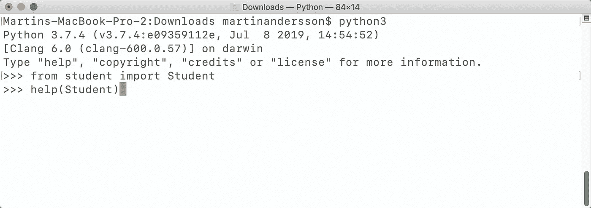
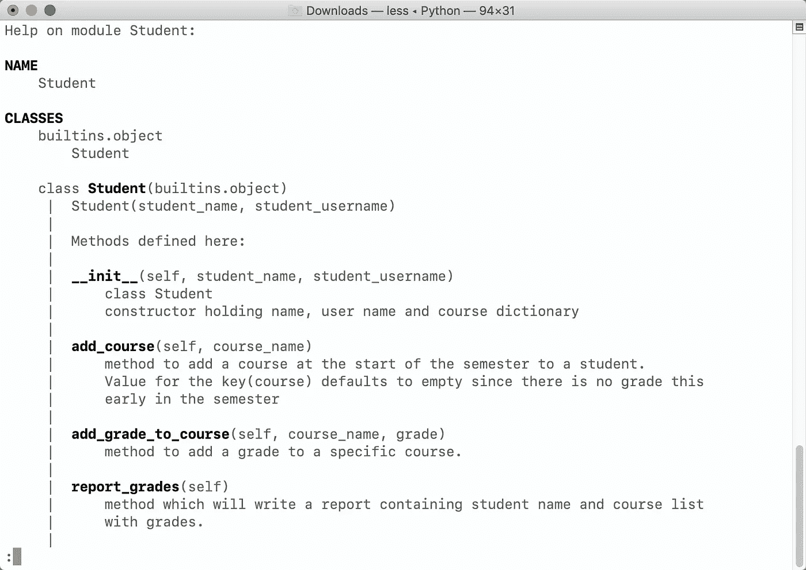
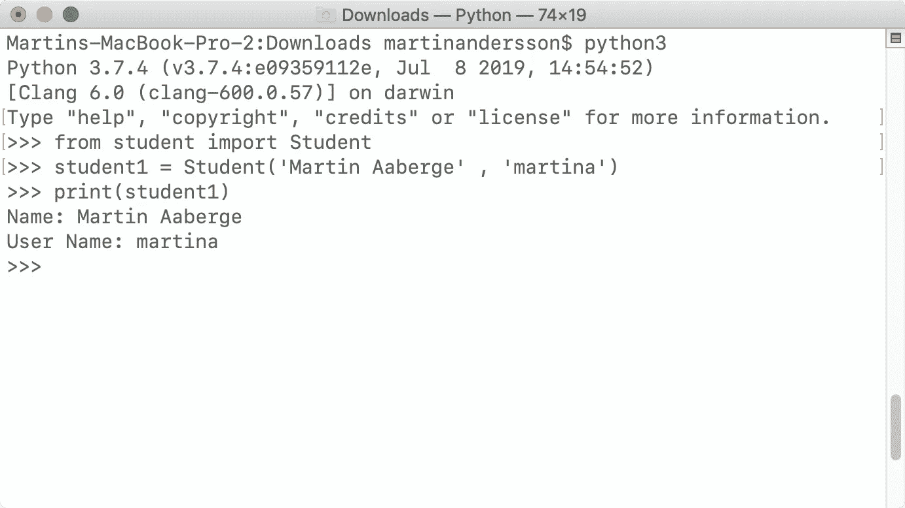

# 记录您的 Python 代码，无需编写文档

> 原文：<https://betterprogramming.pub/document-your-python-code-without-writing-documentation-2d8bf3a42e1a>

## 编写代码时要考虑的事情


照片由[🇸🇮·扬科·菲利- @specialdaddy](https://unsplash.com/@thepootphotographer?utm_source=medium&utm_medium=referral) 在 [Unsplash](https://unsplash.com?utm_source=medium&utm_medium=referral) 上拍摄

在职业生涯的某些阶段，一个程序员阅读的代码可能比他/她写的还要多，所以阅读糟糕的文档化代码一定会令人沮丧。

一个程序员在使用库或另一个程序员的代码时也会阅读大量的文档。

你总是有时间记录你的代码吗？当然不是，但是长时间地负债编码并不是一个好主意。

那你是做什么的？跳过它，祈祷没人读过你的代码？嗯，当你写代码的时候，有些事情你可以考虑。

首先，有几种方法可以正确地记录代码，但是让我们把重点放在没有这些资源时可以做的事情上

# 1.变量

没有理由使用像`s`和`l`这样的变量名，除非你全力以赴去破坏每个人的生活。保持简短和描述性的名字是至关重要的。当你回到你的代码或者另一个程序员正在阅读你的代码时，你希望限制认知负荷。

如果你不得不不断地重读你的代码来弄清楚发生了什么，这将是令人疲惫的。

所以给你的变量起个合适的名字，但是不要太多。上下文通常会帮助你。好的变量名本身就是文档。

让我们看一些例子:

糟糕的变量名


好吧…那么这是怎么回事？我们有一串看起来像是某种东西的代码？然后有一本字典叫`gl`(“好运？”)用更多的代码和随机字符串？有的是一个字母，还有什么是`pass`？`pass`以后会传承什么吗？

接下来我们打印`n`，然后是键和值？看起来是这样。很酷的代码，兄弟。

这可能是一个更好、更易读的代码:

更好的变量名

这个变化没费多大力气。写的时候多花了几秒钟的时间，当我们试图弄清楚代码在一个月内做了什么(或者对于用你的代码做其他事情的人来说)的时候，我们又多花了几秒钟。

# 2.本应是变量的数据

在某些情况下，您只需编写如下内容:

```
if kid1.get_height() >= 140:
    return True
```

这很好，但还可以更好。我们可以写一个关于`140`是什么的评论(见下文)。但是`140`是一个我们可以声明为变量的数字。因此，我们可以 a)清楚地说明为什么使用它，b)确保它易于更新。

```
# minimum height for the ride:
min_height = 140if kid1.get_height() >= min_height:
    return True
```


克里斯·斯鲁普斯基在 [Unsplash](https://unsplash.com?utm_source=medium&utm_medium=referral) 上的照片

你可能觉得这是不必要的，但是我们使用这个最小高度而没有声明它为变量的地方越多，它就越混乱，越难更新。阅读这段代码并理解它应该做什么也很容易。

# 3.注释和文档字符串

这是大多数程序员已经熟悉的。在 Python 中，你可以使用散列符号来单行注释(*块注释*)出代码，如下所示:

```
# this is a commment
```

在线评论:

```
last_square = board[-1]-10  # make sure last square is inside board
```

或者像这样的多行注释(*文档字符串*):

```
""" This is a multi line commment:
oh, forgot to 
add 
more
lines..."""
```

根据 Python 文档，使用注释时有一些特定的规则:

> 块注释通常适用于其后的部分(或全部)代码，并且缩进到与该代码相同的级别。块注释的每一行都以#和一个空格开始(除非它是注释内的缩进文本)。”

—

> "为所有公共模块、函数、类和方法编写 docstrings。对于非公共方法，Docstrings 不是必需的，但是应该有一个注释来描述该方法的作用。此注释应出现在 def 行之后。

—

> ["PEP 257](https://www.python.org/dev/peps/pep-0257) 描述了良好的 docstring 约定。请注意，最重要的是，结束多行 docstring 的""，应该单独在一行上。"


像老板一样阅读 Python 文档。照片由 [Craig Adderley](https://www.pexels.com/@thatguycraig000?utm_content=attributionCopyText&utm_medium=referral&utm_source=pexels) 从 [Pexels](https://www.pexels.com/photo/man-sitting-on-sofa-reading-book-1467564/?utm_content=attributionCopyText&utm_medium=referral&utm_source=pexels) 拍摄。

这些年来，我一直是“代码中不能有太多注释”的粉丝。我在 VFX 工作了这么长时间，被公共汽车撞的因素一直很强烈，所以我总是工作，就好像我会在回家的路上被公共汽车撞，有人会接管我的工作文件。

最近，我变得更加自由了。我现在的想法是，你应该在需要的时候发表评论，而不要夸大它。

在我们修正之后，上面的学生例子并不需要太多的注释，因为变量的名字。你可能会说我们需要一个注释来解释我们为什么这样做和那样做，也许像这样的格言:

```
""" student grades dictionary. New courses and grades will be added to this dict whenever new grades are in.
"""
```

可能有点太久了？

```
# dict holds current- and new grades for the student.
```

如果您还记得前面的引用，Python 文档希望我们总是为所有公共模块、函数、类和方法编写 docstrings。让我们用一些方法创建一个类(程序本身没那么神奇):

用公共方法的文档字符串初始化

这个类`Student`有一个保存一些数据的构造函数，它还有几个处理课程、成绩和报告的方法。

所有这些都有文档字符串来记录它们的功能。如果你曾经在一个类中使用过`help`,你应该已经很熟悉了。也许你没有考虑太多，但这就是它是如何做的。

让我们来看看:

在终端中，您可以转到该类所在的目录并键入:



太棒了。认识文档字符串吗？

# 4.使用 Dunder 方法 __str__ 打印该类的数据

这个并不是真正的文档，只是一个在打印类本身时能够打印预定义字符串的好方法。

通过像这样添加一个`__str__`方法，你可以打印对象，它会打印你决定的任何东西:

```
def __str__(self):
        return ('Name: ' + self._student_name +  '\nUser Name: ' + self._student_user)
```

尝试在终端中运行它:



当打印对象时，它会打印你放在 __str__ 中的内容

# 最后

所以下次我从你的 GitHub 上下载代码的时候。我假设变量名会很棒，函数和方法是 docstringed 的。或许我可以打印你的课程？

谢谢你坚持到最后。如果您有任何意见或反馈，请告诉我。我总是渴望了解更多！