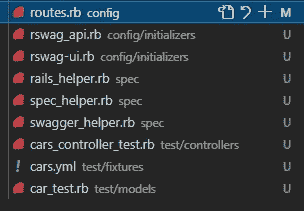
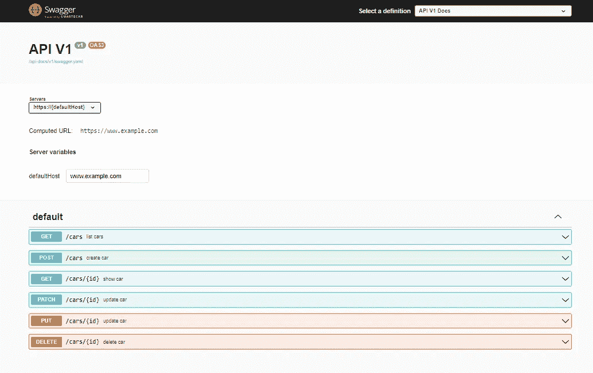
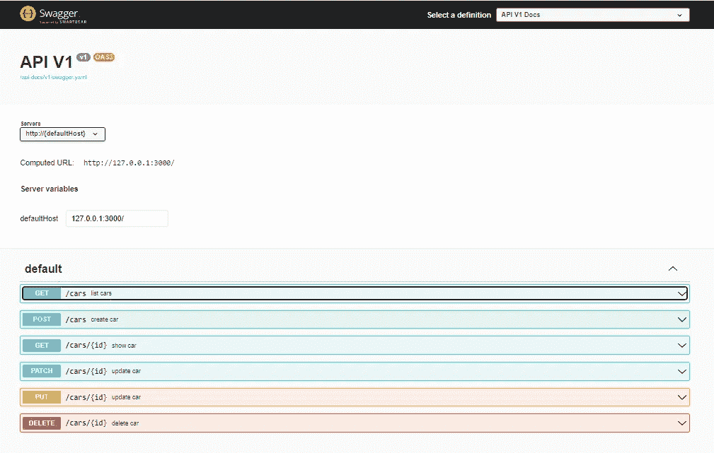
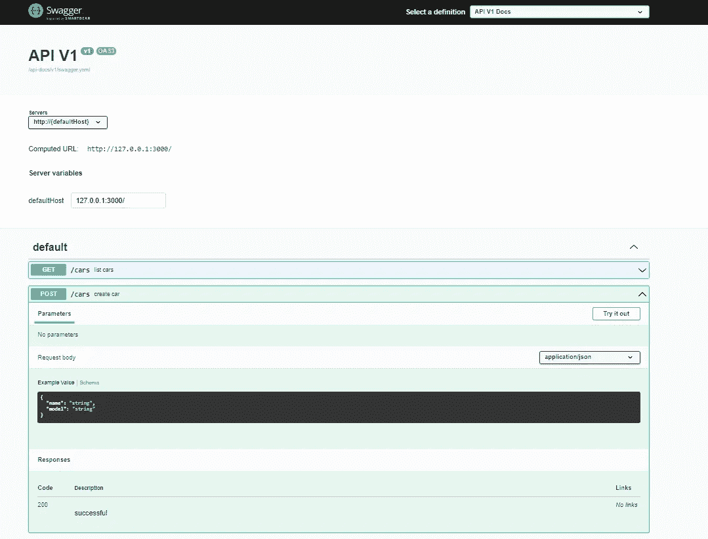
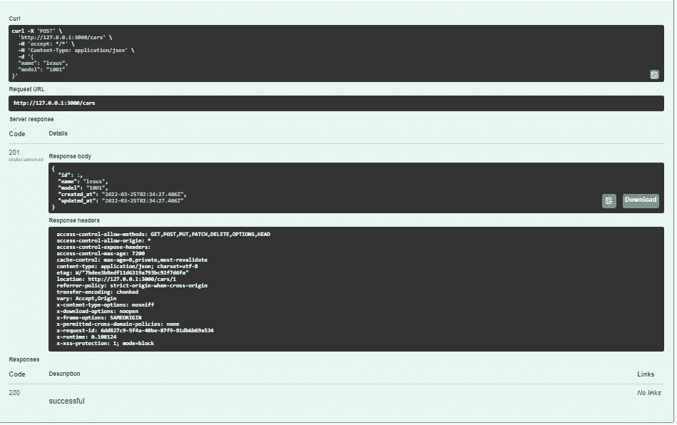

# 使用 rswag Gem 记录 Ruby on Rails APIs

> 原文：<https://betterprogramming.pub/documenting-ruby-on-rails-apis-using-rswag-gem-48c92e11ea30>

## 如何将 Swagger 用于 API 文档


文档是软件开发中最重要的部分之一。尽管计算机运行代码，我们发现我们也写代码给人们阅读。Swagger 是一个非常流行的 API 文档工具。在 Ruby on Rails 中，可以使用`rswag` gem 来添加它。

为了举例说明，我将使用一个 Rails API 应用程序。您可以使用以下命令创建一个:

```
rails new *project-name* --api --database=postgresql
```

我已经有了一个设置，我想要一个具有`name`和`model`属性的汽车模型，以及一个带有必要端点的控制器。这可以通过以下方式轻松实现:

```
rails g scaffold car name:string model:string
```

目前，我的`cars_controller`看起来是这样的…

```
class CarsController < ApplicationController before_action :set_car, only: [:show, :update, :destroy] # GET /cars def index
   @cars = Car.all
   render json: @cars
 end # GET /cars/1 def show
   render json: @car
 end # POST /cars def create
   @car = Car.new(car_params)
   if @car.save
     render json: @car, status: :created, location: @car
   else
     render json: @car.errors, status: :unprocessable_entity
   end
 end # PATCH/PUT /cars/1 def update
   if @car.update(car_params)
     render json: @car
   else
     render json: @car.errors, status: :unprocessable_entity
   end
 end # DELETE /cars/1 def destroy
   @car.destroy
 end private # Use callbacks to share common setup between actions. def set_car
   @car = Car.find(params[:id])
 end # Only allow a list of trusted parameters through. def car_params
   params.require(:car).permit(:name, :model)
 endend
```

> 请注意，上述设置对于 swagger docs 的工作并不是强制性的。基于控制器动作设置必要的文件是足够直观的

接下来，我们设置了 swagger docs。

首先，我们需要 gem，所以将以下内容添加到 gem 文件中:

```
gem 'rspec-rails' # ignore if already set up in project

gem 'rswag'
```

接下来，运行以下命令:

```
bundle install
rails g rspec:install # ignore if already set up in project
rails g rswag:install
```

您应该将以下文件添加到您的存储库中，并将新路线添加到`**routes.rb**`文件中。



现在我们为我们的控制器生成 swagger 测试文件，在我的例子中是`cars_controller`，所以我运行:

```
rails generate rspec:swagger cars
```

如果您的控制器中有子模块结构，您可以使用目录结构，以便 Swaager 基于正确的控制器生成文件。例如，如果汽车在嵌套在`API module`中的 `V1 module`中，我们将运行:

```
rails generate rspec:swagger API::V1::cars
```

`rails generate rspec:swagger cars`命令添加适当的`**spec**`文件`**cars_spec.rb**`，该文件嵌套在`**spec/requests**` 目录**中。文件看起来像这样…**

不要搞混了，我们对每条分组的路径都有各自的动作动词(get、POST、PUT 等)。

在我们继续之前，让我们生成将用于 swagger UI 的实际 swagger 文档。请记住创建所有必要的数据库，并运行您的待定迁移。

运行下面的命令:

```
rake rswag:specs:swaggerize
```

一旦成功，你应该有一个`**swagger.yaml**`文件，运行你的 rails 服务器`rails s`并转到 URL 并添加`/api-docs`,查看汽车控制器所有端点的 Swagger UI 文档。



现在我们开始定制，首先，我们编辑`servers`字段，现在它显示为`[https://{defaultHost}](/{defaultHost})`它不能从用户界面编辑，我们可以编辑`default host`字段并添加域名，在我的例子中是`localhost`

导航到 spec 文件夹中的`swagger_helper.rb`,编辑`servers`数组中的`URL`属性，使之适合您的情况，我在本地主机上运行，所以这是我需要的:

```
servers: [
   {
     url: 'http://{defaultHost}',
     variables: {
      defaultHost: {
       default: '127.0.0.1:3000/'
     }
    }
   }
]
```

运行 rake `rswag:specs:swaggerize`来查看你的新变化，然后刷新页面。



现在我们可以运行测试了，默认情况下 swagger 不会生成消耗`JSON`的文档，所以在对任何`ACTION VERB`的请求中没有主体。

例如，为了测试和正确记录创建汽车的端点，我们必须告诉 swagger 所需的对象类型和属性。导航到控制器的 spec 文件夹，添加如下内容:

```
consumes 'application/json'        
parameter name: :car, in: :body, schema: {          
 type: :object,          
 properties: {            
  name: { type: :string },            
  model: { type: :string }          
 },          
 required: %w[name model]  
}
```

我的`post` `section`最后长这样…

`Line 3`告诉 swagger 腾出空间来发送一个 body 作为请求的一部分，`Lines 4–11`定义了将与其`parameters`和`required`一起发送的对象。对于`put`和`patch`部分可以重复同样的操作。对于更多的数据类型，您可以查看这篇文章以获得合适的选择。

运行`rake rswag:specs:swaggerize`来查看您的新变化，然后刷新页面。当我们倒下时，我们看到我们的身体在等着我们。



点击`Try it out`输入适当的字段并点击发送。如您所见，它已成功创建。



您可以相应地测试其他端点，注意`GET and DELETE`、`DELETE PUT and PATCH need the ID`，最后是`POST PUT and PATCH need a body`。

这样，您就可以共享一个交互式环境，让您的客户和同事熟悉您的所有终端。

快乐编码。

```
**Want to Connect?**Feel free to run some more tests with different scenarios, if you get stuck feel free to reach out on [Twitter](https://twitter.com/4_see_why) or [LinkedIn](https://www.linkedin.com/in/cyril-iyadi/) and I'd be very happy to help out.
```