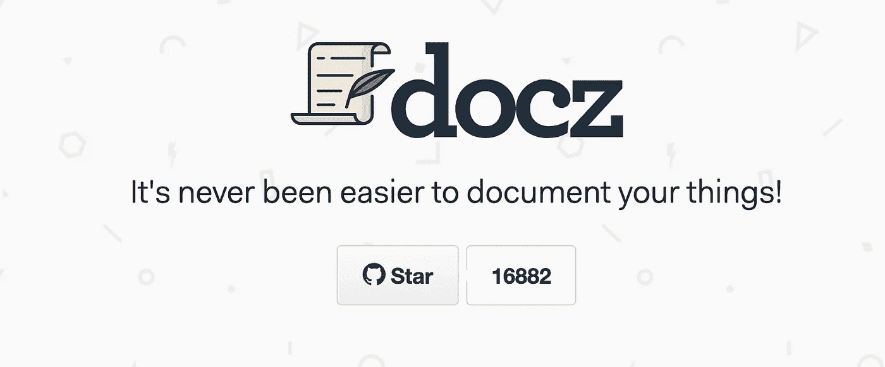
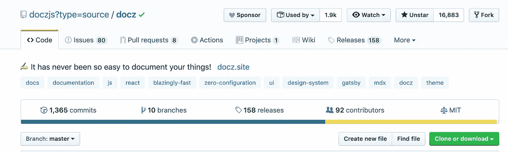
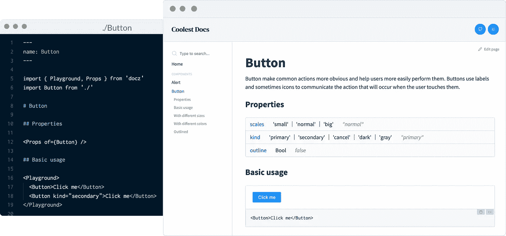

# Docz —记录您的项目从未如此简单

> 原文：<https://betterprogramming.pub/docz-its-never-been-easier-to-document-your-project-8026ed0a5097>

## Docz 使得为您的代码编写和发布漂亮的交互式文档变得容易



[Docz](https://www.docz.site/) 标志

当你创建新的东西时，记录代码是最重要的(也是最耗时的)过程之一。许多时间被浪费在不必要的尝试建立一个符合你想要的风格的文档站点上。



文档 Github 页面—[https://github.com/doczjs/docz](https://github.com/doczjs/docz)

使开发更容易的库每天都在出现。

风格指南和设计系统越来越受欢迎。

如今，能够让我们高效完成工作的工具是必不可少的。我们不应该在琐碎的任务上花费太多时间。这就是 Docz 被创建的原因。



Docz 演示

# 开始一个新项目

使用 [create-docz-app](https://www.npmjs.com/package/create-docz-app) 快速入门:

```
npx create-docz-app my-docz-app
# or
yarn create docz-app my-docz-app --example typescript
```

# 将 Docz 添加到现有项目中

首先添加`docz`作为依赖项:

```
$ yarn add --dev docz@next # react react-dom# or$ npm install --save-dev docz@next # react react-dom
```

**注意:** `react`和`react-dom`不会自动安装。你必须自己安装它们。

然后，将`.mdx`文件添加到项目中的任意位置:

```
---
name: Button
route: /
---import { Playground, Props } from 'docz'
import Button from './Button'**# Button**<Props of={Button} />**## Basic usage**<Playground>
  <Button type="submit">Click me</Button>
  <Button>No, click me</Button>
</Playground>
```

和一个带`Button.jsx`的按钮组件:

```
import React from '[react](https://github.com/facebook/react)'
import t from '[prop-types](https://github.com/facebook/prop-types)'const Button = ({ children, type }) => (
  <button type={type}>
    {children}
  </button>
)Button.propTypes = {
  /**
   * This is a pretty good description for this prop.
   * Button type.
   */
  type: t.oneOf(['button', 'submit', 'reset']),
}Button.defaultProps = {
  type: 'button',
}export default Button
```

最后，运行 Docz 开发服务器:

```
$ yarn docz dev
```

就是这样。现在，您有了一个展示和调试组件的交互式站点——还有一些很棒的文档作为额外奖励。

# Docz 功能

*   由盖茨比推动:捆绑销售和生态系统由盖茨比推动
*   零配置和简单:不用担心复杂的配置步骤
*   极快:热重装支持和开箱即用的自动代码分割
*   易于定制:创建和使用真正可定制的主题
*   [基于 MDX](https://github.com/mdx-js/mdx) 的:通过组件的强大功能增强写降价
*   可插拔:使用插件来操作和定制 Docz，以满足您的需求
*   TypeScript 支持:完全支持 TypeScript——无需额外设置即可编写您的类型定义

查看[文档](http://docz.site/)以了解更多关于 Docz 的信息。

# 项目示例

*   [基本](https://github.com/pedronauck/docz/tree/master/examples/basic) —准系统示例
*   [盖茨比](https://github.com/pedronauck/docz/tree/master/examples/gatsby) —在盖茨比项目中使用 Docz 的例子
*   [react-native](https://github.com/pedronauck/docz/tree/master/examples/react-native) —在 React Native 项目中使用 Docz
*   [样式组件](https://github.com/pedronauck/docz/tree/master/examples/styled-components)——使用 Docz 和`styled-components`
*   [带打字稿](https://github.com/pedronauck/docz/tree/master/examples/typescript) —使用 Docz 带打字稿
*   [带流](https://github.com/pedronauck/docz/tree/master/examples/flow) —使用 Docz 带流
*   [带图像](https://github.com/pedronauck/docz/tree/master/examples/images) —使用 Docz 带 mdx 和 jsx 中的图像
*   [带 sass](https://github.com/pedronauck/docz/tree/master/examples/sass) —使用 Docz 解析带 sass 的 CSS
*   [with less](https://github.com/pedronauck/docz/tree/master/examples/less) —使用 Docz 解析 CSS with LESS
*   [用手写笔](https://github.com/pedronauck/docz/tree/master/examples/css-stylus) —用手写笔使用 Docz 解析 CSS
*   使用 CSS 模块:与 gatsby 一起开箱即用

# 插件

*   gatsby-theme-docz —使用 docz 作为 gatsby 的主题
*   [netlify](https://github.com/nicholasess/docz-plugin-netlify) —将您的 Docz 站点部署到 [Netlify](http://netlify.com/)
*   [SVG 精灵加载器](https://github.com/trustedhousesitters/docz-plugin-svg-sprite-loader)—SVG 精灵加载器的 Docz 插件
*   [快照](https://github.com/JosephConradBlack/docz-plugin-snapshots)—Docz 的一个插件，为所有记录的组件使用创建 jest 快照

# 贡献的

如果你想为 Docz 贡献时间，那么这里有一个列表可以帮助你开始。非常欢迎和感谢各种贡献。

1.  启动项目。
2.  通过分享你的知识和经验来帮助有问题的人。
3.  发现并报告问题。
4.  提交 PRs 以帮助解决问题或添加功能。
5.  用特性请求影响 Docz 的未来。

感谢阅读。祝您编码愉快，不要忘记为您的项目编写文档。