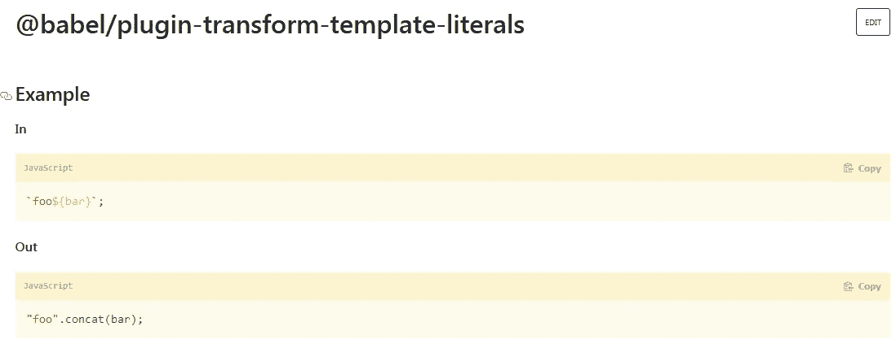
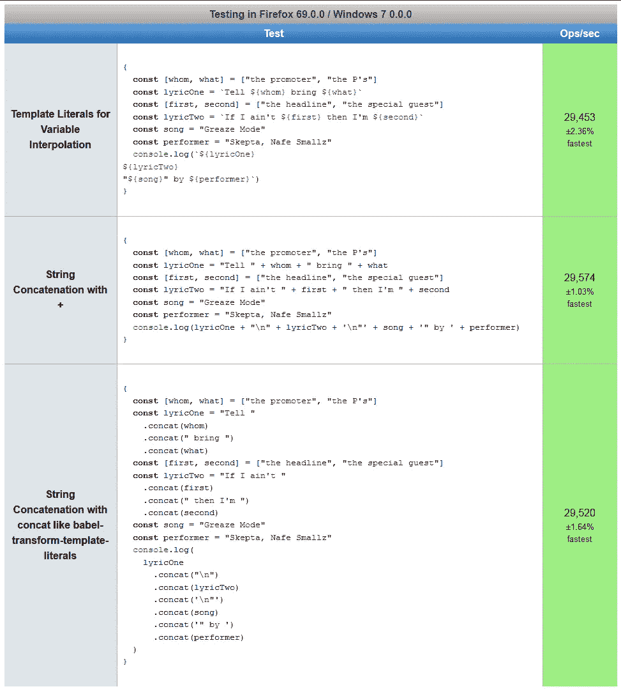
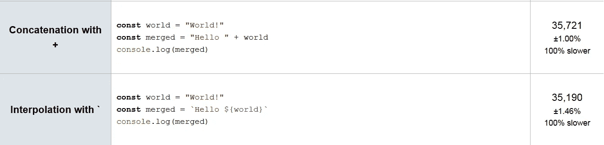

# Babel 会把反斜线(``)编译成引号吗？这会让 JavaScript 代码更快吗？

> 原文：<https://betterprogramming.pub/does-babel-compile-backticks-to-quotes-and-does-that-make-javascript-code-faster-6fd21b089672>

## Babel 将使用 transform-template-literals 插件编译 ES2015 特性反斜线文字

由 [Malvestida 杂志](https://unsplash.com/@malvestida?utm_source=medium&utm_medium=referral)在 [Unsplash](https://unsplash.com?utm_source=medium&utm_medium=referral) 上拍摄的照片

反斜线文字有助于通过变量插值来转换字符串，变量插值是字符串串联的一种替代方法:

但是，它们仅在 ES2015 (ES6)中添加，因此不支持任何版本的旧 Internet Explorer 浏览器。

支持 IE 或其他旧浏览器的开发者需要[浏览器。](https://medium.com/better-programming/compiling-vs-polyfilling-in-javascript-6bbc5707a253#Browser_compatibility)

这样做需要一个叫做[transform-template-literals](https://www.npmjs.com/package/@babel/plugin-transform-template-literals)的 Babel 插件:

# 巴别塔加速性能吗？

我最近对 Javascript 中的[反斜线文字的速度进行了测试，结果显示，在](https://medium.com/javascript-in-plain-english/are-backticks-slower-than-other-strings-in-javascript-ce4abf9b9fa) [jsPerf](https://jsperf.com/) 测试环境中，字符串串联比变量插值略快。

所以 Babel 听起来是一个完美的解决方案——只需使用`transform-template-literals`插件自动去掉反勾号。

这个简单的改变应该可以帮助我们获得一些性能。还是会？

丹尼尔·利维斯·佩鲁西在 [Unsplash](https://unsplash.com?utm_source=medium&utm_medium=referral) 上的照片

# 去掉反勾号有帮助吗？

现在是时候进行速度测试了，使用`jsPerf`来测量 JavaScript 性能并回答这个问题:

用 Babel 编译字符串文字会让我的代码更快吗？

在下一节中，我设置了三个测试，使用+运算符或[比较](https://developer.mozilla.org/en-US/docs/Web/JavaScript/Reference/Global_Objects/String/concat)[反斜线(``)文字量](https://developer.mozilla.org/en-US/docs/Web/JavaScript/Reference/Template_literals)和[字符串连接。concat()方法](https://developer.mozilla.org/en-US/docs/Web/JavaScript/Reference/Global_Objects/String#Long_literal_strings)。

当然，这不是一个完全科学的测试，因为实际支持 IE 需要 poly fill，而 poly fill 可能比没有 poly fill 的现代 JavaScript 慢，这取决于实现。

照片由[维里·伊万诺娃](https://unsplash.com/@veri_ivanova?utm_source=medium&utm_medium=referral)在 [Unsplash](https://unsplash.com?utm_source=medium&utm_medium=referral) 上拍摄

# 也支持 IE = Polyfills

支持使用编译和聚合填充的旧浏览器几乎肯定会导致代码变慢——或者至少加载时间变长。

这是因为[多填充](https://medium.com/better-programming/compiling-vs-polyfilling-in-javascript-6bbc5707a253)是新功能的重新实现，所以它们很可能比[编译](https://medium.com/better-programming/compiling-vs-polyfilling-in-javascript-6bbc5707a253)慢，后者就像是翻译。

这意味着，即使 Babel 有助于字符串连接的性能，其他聚合填充也可能会降低代码库的速度。

我甚至没有提到与现代 JavaScript 相比，10 多年前这些浏览器的 JavaScript 实现有多慢。

现在谈谈关于巴贝尔和`transform-template-literals`的结果。

由 [chuttersnap](https://unsplash.com/@chuttersnap?utm_source=medium&utm_medium=referral) 在 [Unsplash](https://unsplash.com?utm_source=medium&utm_medium=referral) 上拍摄

# 使用 jsPerf 进行测试

我设置了三个代码示例来比较使用反勾号或模板文字的变量插值与字符串连接的速度:

**代码片段 1** :使用反勾号(``)的变量插值——肯定是可读性最好的，但是它是否更慢？

代码片段 2 :理论上，使用+操作符和使用 concat()操作符是一样的

**代码片段 3** :使用 concat()操作符是 Babel 使用 transform-template-literals 插件编译代码的方式

由 [David Dibert](https://unsplash.com/@dibert?utm_source=medium&utm_medium=referral) 在 [Unsplash](https://unsplash.com?utm_source=medium&utm_medium=referral) 上拍摄的照片

# jsPerf 测试的结果

# 这对巴别塔意味着什么

需要注意的一点是，与我上次在 JavaScript backticks 上的速度测试不同， [jsPerf](https://jsperf.com/) 决定在 Firefox 而不是 Chrome 上运行这个测试。这是目前不可配置的设置，通过他们的 awesome 测试套件。

但是结果基本上是一样的:在 JavaScript 中，任何类型的字符串连接都以相同的速度运行，不管是否包含反斜线，也不管是否使用了`+`操作符或`concat()`方法。

因此，我不希望 Babel 将我的反勾号文字转换为引用字符串来提高性能，尽管使用 Babel 的全部理由当然是增加兼容性而不是提高性能。

# 测量误差统治着我周围的一切

反引号文字的酷之处在于，在现代 JavaScript 浏览器中，它们看起来真的和其他引用文字一样快。

事实上，重新运行我最近的简单测试，除了在 Firefox 而不是 Chrome 上，显示插值可能一点也不慢，至少不值得优化:

## Chrome 结果—Chrome 76 . 0 . 3809(Windows 7)—[jsPerf](https://jsperf.com/string-speed-comparison)

## 火狐结果——火狐 69 . 0 . 0(Windows 7)——[jsPerf](https://jsperf.com/string-speed-comparison)

1%的测量误差意味着拼接和插值在 Firefox 中具有相同的性能，可能在 Chrome 中也是如此。

由[胡安·拉莫斯](https://unsplash.com/@juanmramosjr?utm_source=medium&utm_medium=referral)在 [Unsplash](https://unsplash.com?utm_source=medium&utm_medium=referral) 上拍摄

# 结论

唷，在我最近的文章中[庆祝反斜线文字](https://medium.com/javascript-in-plain-english/are-backticks-slower-than-other-strings-in-javascript-ce4abf9b9fa)之后，我担心巴别塔会让我看起来很糟糕，有很大的优势！

实际上，传输反勾号可能对 JavaScript 代码的性能没有任何影响。少了一件需要担心的事。

对我来说，这只是加强了我们应该张开双臂接受新功能的想法，特别是因为我们有像 Babel 这样的工具来自动使我们的代码更兼容浏览器。

此外，我可能对反斜线文字有好感。但这是一件坏事吗？

米歇尔·特雷瑟默在 [Unsplash](https://unsplash.com?utm_source=medium&utm_medium=referral) 上拍摄的照片

# 进一步阅读

*   [Rajitha Abeyrathna](https://medium.com/u/ff6a9759693?source=post_page-----6fd21b089672--------------------------------) 在他的 [2018 年博客文章](https://medium.com/@rajithaeye/what-is-babel-8dcfdf84ea3e)中用一个很好的例子演示了如何使用 Babel 将他的 ES6 代码移植到 ES5 中。

 [## 巴别塔是什么？

### 大家好，今天我要谈谈“巴别塔”，这是前端开发领域最热门的话题之一…

medium.com](https://medium.com/@rajithaeye/what-is-babel-8dcfdf84ea3e) 

*   尼古拉斯·约翰逊在他的博客中解释了为什么网络开发者需要巴别塔[:](http://nicholasjohnson.com/blog/what-is-babel/)

 [## 什么是 Babel，它将如何帮助你编写 JavaScript？

### Babel 是一个 JavaScript transpiler，它将 edge JavaScript 转换成普通的 ES5 JavaScript，可以在任何…

nicholasjohnson.com](http://nicholasjohnson.com/blog/what-is-babel/) 

*   [Ryan Christiani](https://medium.com/u/4c59aa72fe94?source=post_page-----6fd21b089672--------------------------------) 写了关于 CSS-Tricks.com[的反斜线文字](https://css-tricks.com/template-literals/):

 [## 模板文字| CSS-技巧

### ES6 中引入的模板文字是一种创建字符串的新方法。随之而来的是新的功能，让我们可以…

css-tricks.com](https://css-tricks.com/template-literals/) 

*   我在[的比特理论](https://thebittheories.com/the-3-advantages-of-backtick-literals-in-javascript-f6beade4a9cf)中写过反斜线文字的三个优点:

 [## JavaScript 中反斜线文字(``)的 3 个优点

### 这些“奇特的字符串”插入变量，避免需要转义引号字符，并允许多行字符串…

thebittheories.com](https://thebittheories.com/the-3-advantages-of-backtick-literals-in-javascript-f6beade4a9cf) 

德里克·奥斯汀博士是《职业编程:如何在 6 个月内成为一名成功的 6 位数程序员》一书的作者，该书现已在亚马逊上出售。