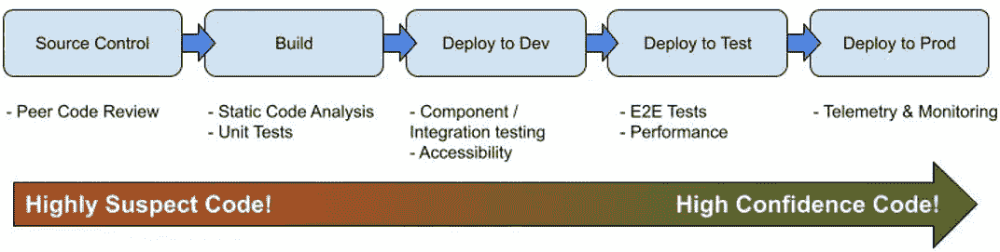

# 上帝用 CI/CD 吗？

> 原文：<https://betterprogramming.pub/does-god-use-ci-cd-f7d0d2d97bc9>

## 上帝的持续集成和部署管道是什么样子的，这告诉了我们什么？

照片由 [Cookie 在](https://unsplash.com/@cookiethepom?utm_source=unsplash&utm_medium=referral&utm_content=creditCopyText) [Unsplash](https://unsplash.com/s/photos/computer?utm_source=unsplash&utm_medium=referral&utm_content=creditCopyText) 上的 Pom 拍摄

让我们想象上帝开发软件。他们会写一些代码，并提交给一个完美的 GIT repo。上帝会使用什么样的 CI/CD 管道？

上帝是全知的，全能的，否则不会犯错。上帝不会犯错。或者以软件开发为例，上帝不写 bug。

上帝需要静态代码分析吗？不，上帝的代码是美丽的，格式良好的，并且完全符合所有的风格指南和最佳实践。

上帝需要单元测试吗？好吧，如果我们假设上帝是唯一修改这些代码的人，并且假设他们对他们写的东西有完美的记忆——那么我们可以忽略单元测试的文档价值，并且说不，上帝不需要单元测试。

在准备生产之前，上帝的代码还需要通过管道中的哪些步骤？安全检查？自动化集成测试？合规性验证？可用性测试？

没有。上帝的代码在最后一次击键点击上帝的键盘的那一刻就准备好投入生产了。上帝的代码以 100%的信心开始存在，没有必要在任何领域、维度或范围进行大量的验证。上帝的法典是*神圣的。*

因此，上帝不需要在 CI/CD 管道中进行验证。上帝提交他们的代码，构建代码所代表的任何工件，并可以直接和立即将该工件推向生产。上帝只使用某种简单的构建-部署管道，因为上帝的代码从构思的那一刻起就是生产就绪的。

我希望这个小小的亵渎有助于传达一个关于 CI/CD 管道的关键点:

多(大部分？)的存在是因为与 God 不同，*我们的代码是可疑的*。我们的代码需要验证，因此 CI/CD 管道的主体存在。

一些来自基础设施或 DevOps 的人可能会对这种说法嗤之以鼻。拉构建时配置呢？依赖管理？资产收集和神器分发？

是的，所有这些都是“管道”的一部分。构建和部署资产是非验证性的，但是如果我们能够假设完美的代码，我们的构建-部署管道将会非常简单；现代 CI/CD 管道的复杂性是由于对我们的代码缺乏信心。像上帝一样，构建和部署完美的代码实际上是一种非常简单的管道。

下面是一本关于 CI/CD 管道的名著。事实上，许多人认为它是圣经(哈！)的 CI/CD。这本书本质上是一本关于测试的书。它是关于如何创建和组织机器来获取可疑的、低可信度的代码，并尽可能高效地通过必要的步骤，直到它准备好部署到生产中。

这真的是一本关于测试的书！

使用[谷歌图片搜索](https://www.google.com/search?q=CI%2FCD+pipeline+step+diagram&tbm=isch&ved=2ahUKEwimw6jqmMv3AhW8FTQIHY2RAqAQ2-cCegQIABAA&oq=CI%2FCD+pipeline+step+diagram&gs_lcp=CgNpbWcQAzoHCCMQ7wMQJzoECAAQQzoICAAQsQMQgwE6BQgAEIAEOgcIABCxAxBDOgQIABAeOgYIABAFEB46BggAEAgQHjoECAAQGFDwK1jKbmDPb2gJcAB4AIABrgGIAaEXkgEEMzEuNpgBAKABAaoBC2d3cy13aXotaW1nwAEB&sclient=img&ei=Tz91YubfG7yr0PEPjaOKgAo&bih=762&biw=1538&rlz=1C1CHBF_enUS837US837)CI/CD 管道图，并尝试找到与质量或测试无关或不支持质量或测试的步骤。我找到的很少，我在结果页 7(一个我很少去的地方)。

这种将 CI/CD 管道视为支持和启用代码验证过程的系统的观点不是语义上的或无意义的思想实验——它强调必须构建管道来满足验证和执行验证的人的需求:开发人员、测试人员、操作人员等。这些是 CI/CD 管道的客户，如果没有持续的投资和对健康管道的维护，他们的工作将非常困难，甚至不可能。

事实上，我们可以将 CI/CD 管道简化为一系列步骤，逐步增加我们对代码的信心，直到我们为生产部署做好准备，如下图所示:

简化的 CI/CD 管道

虽然这是一个非常以质量为中心的观点，你可能会从质量工程总监那里得到一些东西，但我确实觉得它最好地描述了 CI/CD 的*存在的理由*: CI/CD 管道的存在是为了支持验证，所有其他的东西只是填充物。

虽然我们这些开发软件的人经常自视甚高，但是如果把我们和上帝放在一起，那么不可靠性就变得很明显，我们对测试和检查的需求也变得很明显:

上帝不会不小心在错误的行上混合制表符和空格或开括号，我们会，所以我们需要林挺和静态分析工具。

上帝的类和函数不会因为某些输入值而失败或者抛出意外的异常，我们的会，所以我们需要全面的单元测试。

当线性时间实现是可能的或者不会意外地查询非索引列上的无界表时，上帝不会编写指数算法。我们有时会这样做，因此我们需要压力、负载、浸泡、弹性和其他类型的性能测试，以及可用于执行这些测试的环境。

上帝对他的接受标准的解释不受人类语言的不精确和模糊的影响。我们的需要，所以我们需要组件、集成、用户接受度和各种其他测试来验证这一点，同样，也需要部署适当的环境来执行它们。

上帝不需要遥测数据来告诉他他的代码在生产中是否有效，因为它是完美的。我们的不是，所以我们需要在我们的系统和地方建立可观察性来测试这些数据路径和能力。

上帝在周五下午 5 点推出产品，没有运行任何测试，并且无忧无虑地离开，因为他的代码永远是完美的。

我们的代码是可疑的，应该被认为是错误的，直到它通过一个设计良好的 CI/CD 管道运行，并采取步骤验证每一种可能的、可以想象的失败方式。

上帝不使用 CI/CD 管道，我们绝对必须使用。