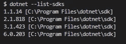
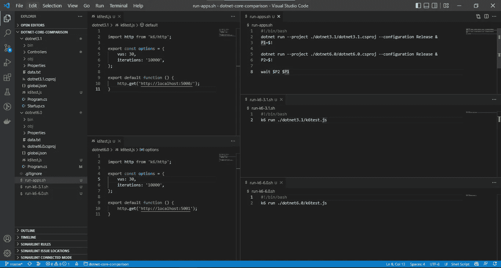
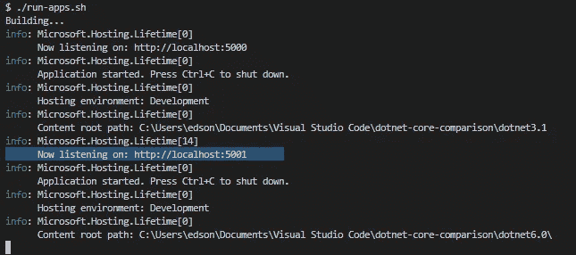
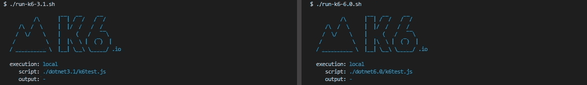
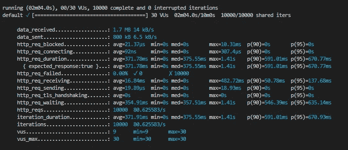
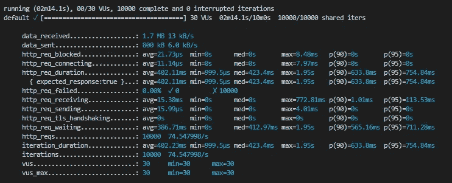
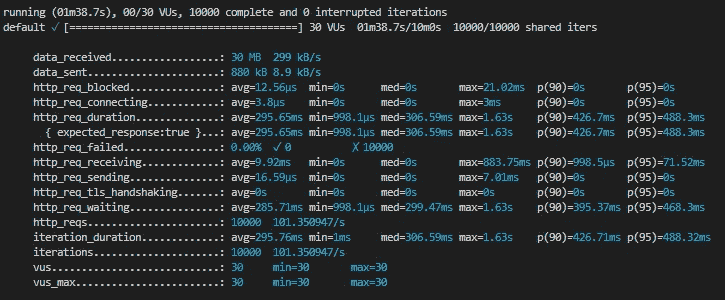
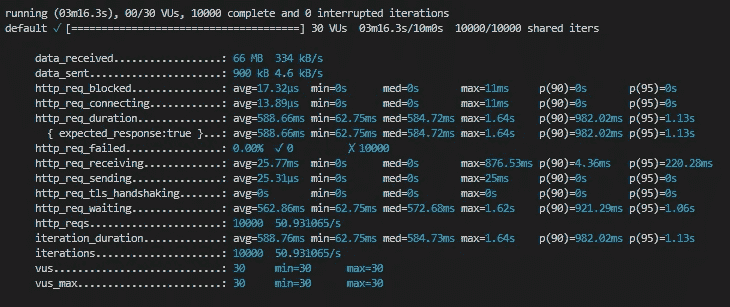
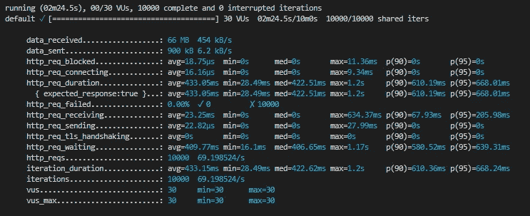

# 正在从升级。Net 3.1 到。Net 6.0 真的值得吗？

> 原文：<https://betterprogramming.pub/does-it-really-worth-upgrading-your-app-from-net-3-1-to-net-6-0-c27641be70ac>

## 让我们测试并找出答案


叶卡捷琳娜·博洛夫索娃在[佩克斯](https://www.pexels.com/)拍摄的照片

[The。Net Core 3.1](https://dotnet.microsoft.com/en-us/download/dotnet/3.1) 是一个很棒的框架，由于长期支持(LTS) [将于今年年底](https://docs.microsoft.com/en-us/lifecycle/products/microsoft-net-and-net-core)(2022 年 12 月)结束，现在可能是开始考虑升级现有应用的好时机。

但是，尽管 LTS 结束日期和新的语言特性，从性能的角度来看，值得努力吗？

我将尝试通过做一些测试来回答这个问题，并提供测试代码，这样您就可以以您认为更合适的方式重现或定制测试。

# 我以前的测试经验

前一段时间，我在我的(简陋的)机器上本地运行了[我的性能测试](/what-is-faster-net-or-node-js-449a3c315407)来比较。Net 和 Node.js，结果真的让我印象深刻。作为一个超级粉丝。Net，我决定运行一个类似的测试，但是这次在。Net 3.1 和。Net 6.0 使用相同的方法。

## 关于测试

我将遵循与上次测试非常相似的方法；我将定义这三个测试场景:

1.  Hello world:返回文本“Hello World”的简单端点。净”

2 .读取文件:读取 100 行文件并返回内容的端点。

3 .冒泡排序:一个端点，用降序的数字填充一个长数组，使用[冒泡排序算法](https://en.wikipedia.org/wiki/Bubble_sort)对数字进行排序，并返回排序后的列表

> **注意**:在我最近的性能测试中，我对两者都使用了同步读取文件的方法。Net 和 NodeJs 应用程序，我收到了一些指出这一点的评论，但即使在改为使用 async-await 后，性能差异也没有显著变化，无论如何，对于这些测试，我从一开始就开始使用 async-await。

## 测试工具

我将使用 K6 工具进行测试，并行运行 10，000 个请求，并使用 30 个虚拟用户请求，请求之间没有时间间隔。

要设置它，只需在每个项目的根目录下添加下面的`k6test.js`文件，并为每个测试运行更改端口和端点。

```
import http from 'k6/http';
export const options = {
   vus: 30,
   iterations: '10000',
};export default function () {
  http.get('http://localhost:5000/');
}
```

并行运行意味着我将在同一台计算机上同时开始这两个测试。

## 构建解决方案

您首先需要检查您是否有两个版本的。Net core SDK 安装在你的计算机上来检查这个终端上的运行`dotnet --list-sdks`。



点网列表 SDK 命令结果

在我的情况下，我的机器上有四个安装版本，我将只使用 3.1.423 和 6.0.203。

要在创建新项目之前指定一个版本，您只需要在根文件夹中有一个与此类似的`global.json`文件。

```
{
   "sdk": {
      "version": "3.1.422"
   }
}
```

现在，当运行`dotnet new webapi`时，一个新的项目将按照指定的版本创建。

这个解决方案中的示例代码非常简单。我们有带三个端点的类`PerformanceComparisonController`:`/`、`/readfile`和`/bubblesort`。

第二个应用程序将遵循相同的方法，这一次`global.json`将指定 6.0 版本。它看起来是这样的:

```
{
   "sdk": {
      "version": "6.0.203"
   }
}
```

对于第二个应用程序，代码实际上是相同的，但是我利用了。Net 6，所以我没有使用控制器，而是直接在`Program.cs`文件中映射所有的端点。

## 运行测试

在创建了包含两个项目和 K6 测试脚本的解决方案之后，我定义了一些 bash 文件来更快更容易地执行它们。



设置测试

在根文件夹中，运行命令`./run-apps.sh`将在发布模式下执行这两个应用程序，并将暴露。Net 3.1 和。Net 6.0 应用分别在`ports 5000 and 5001`。



两个应用程序都在发布模式下执行

正如我所说的，我在两个独立的终端中同时运行两个测试脚本(我更喜欢在 VSCode 终端窗口中分割一个终端)。



但实际上。我们的测试设置已经准备好了。

> **注**:本次测试使用的所有文件都在我的 [GitHub repo](https://github.com/edsondiasalves/dotnet-core-comparison) 中有，可以随意查看，随心所欲。

## 试验结果

> 第一项测试:Hello World



。Net 3.1


。Net 6.0

> 第二项测试:读取文件



。Net 3.1



。Net 6.0

> 第三个测试:冒泡排序



。Net 3.1



。Net 6.0

我创建了下表来整合测试并促进分析:

所有测试结果

正如您所看到的，结果非常令人印象深刻，但它们可能会因您的硬件、操作系统等条件而异。

无论如何，至少在这个简单的例子中。Net 6.0 比。Net 3.1，太神奇了。

# 最终考虑

哇，真令人印象深刻。

事实上，在。Net 3.1 和。Net 6.0。尽管性能是决定迁移现有应用的一个非常重要的原因，但还有其他事情需要考虑。例如，从的升级。Net 3.1 到。Net 6.0 也将受益于。Net 5.0 和微软支持到 2024 年 11 月。

谢谢你读到这里。请随意在我的 [GitHub repo](https://github.com/edsondiasalves/dotnet-core-comparison) 上获取本文中使用的解决方案。下次见。

*(是的，我相信升级是值得的。)*