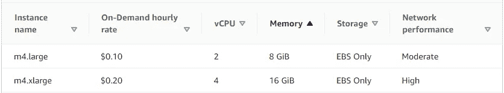
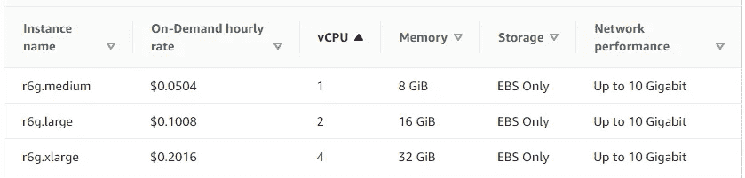

# 性能测试重要吗？是的，这里有一个案例研究

> 原文：<https://betterprogramming.pub/does-performance-testing-matter-yes-and-heres-a-case-study-99eeb09e1d46>

## 性能测试不仅仅是测试你的应用。这也是关于测试你的基础设施

托马斯·凯利在 [Unsplash](https://unsplash.com/?utm_source=unsplash&utm_medium=referral&utm_content=creditCopyText) 上的照片

# 为什么性能测试很重要？

像单元测试和集成测试一样，性能测试检查应用程序性能和用户体验的某个基线。然而，性能测试提供了单元测试和集成测试所不具备的对应用程序各个方面的洞察力。特别是对基础设施的了解。

这种对基础设施的理解使得性能测试变得如此强大和重要。将性能测试与基础设施监控工具(如 AWS Cloudwatch)结合使用，我们可以查明应用程序的具体瓶颈。是内存、CPU、I/O 还是网络受限？通过回答这些问题，我们可以优化应用代码和基础设施。

# 性能测试案例研究

让我们通过下面的案例研究来了解性能测试是如何帮助优化成本和可伸缩性的。

一个应用程序当前正在 AWS m4.large EC2 实例上部署，遇到了一些性能问题。这些问题需要在即将到来的假期前解决。

这个应用程序有两个缩放选项:水平和垂直缩放。

对于我们的案例研究，我们尝试水平扩展并增加 m4.large 实例的数量。这稍微提高了性能，但是我们的应用程序仍然不能满足假日季节的性能需求。垂直缩放怎么样？

对于垂直伸缩，我们的应用程序的实例增加到 m4.xlarge 实例，这缓解了性能问题。但是，从下表中我们可以看到，从 m4.large 增加到 m4.xlarge，我们的成本会翻倍，从每小时 0.10 美元增加到每小时 0.20 美元。

AWS m4 EC2 实例规格

在对应用程序进行性能测试后，我们意识到它遇到了内存瓶颈。这解释了为什么 m4.xlarge 实例缓解了这个问题，因为与 m4.large 实例的 8 GiB 相比，它的内存增加了一倍，达到 16 GiB。

这也阐明了为什么水平扩展不能完全解决我们的性能问题。由于 m4.large 实例不足，简单地增加它们并不能缓解我们的性能问题。既然我们知道内存是个问题，我们可以选择一个内存优化的实例来节省成本。

通过使用内存优化的 r6g EC2 实例，我们可以在不大幅增加成本的情况下增加内存。查看下表，通过使用 r6g.large 实例，我们可以将内存增加一倍，以匹配 m4.xlarge 实例的 16 GiB，但仍然具有与当前 m4.large 实例几乎相同的成本 0.1008 美元。

AWS r6g EC2 实例规格

总的来说，我们可以在不增加成本的情况下将内存翻倍并提高性能。这突出了性能测试对于成本优化和可伸缩性的强大作用。

感谢阅读。