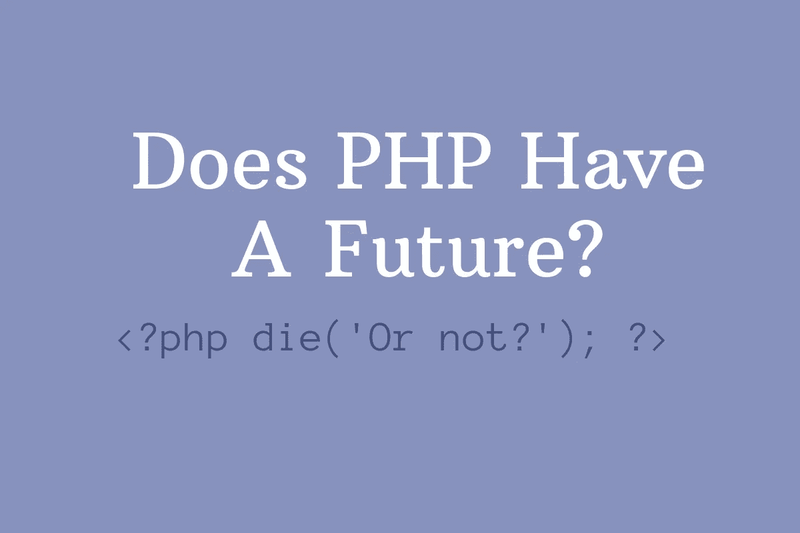
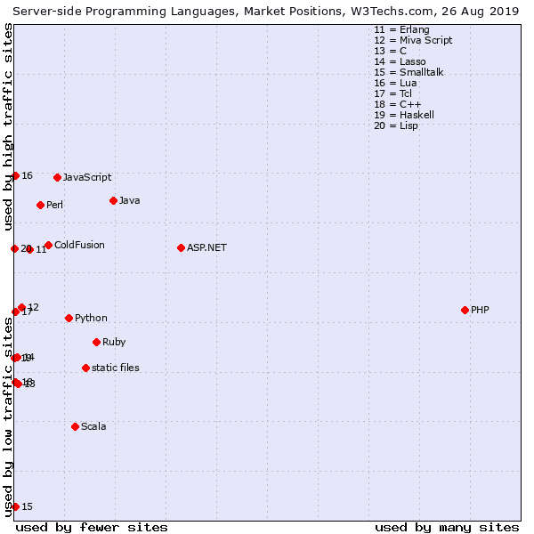

# PHP 的未来

> 原文：<https://betterprogramming.pub/does-php-have-a-future-6756f166ba8>

## 是一门死的编程语言吗？

毫无疑问，PHP 曾经有过更好的日子。但它真的死了吗？

在 Stack Overflow 这样的论坛上，人们认为 PHP 已经死了。他们有一个有效的观点吗，或者他们只是不喜欢 PHP？

我们先来看看 PHP，看看这种编程语言有没有前途。

# PHP 仍然主宰着网络

如果你简单看一下数字，PHP 肯定没有死。PHP 是目前使用最多的服务器端编程语言。大约 75%的网页是由 PHP 驱动的。看看下面的图表，看看 PHP 在使用频率方面领先竞争对手多远。根据这个统计数据，可以得出 PHP 并没有消亡的结论，因为对于一门已经消亡的语言来说，75%这个数字实在是太高了！

[资料来源:w3techs.com](https://w3techs.com/technologies/market/programming_language/20)

这么多网站使用 PHP 的原因之一是因为 WordPress 使用 PHP。WordPress 的市场份额大约是所有网站的 34%。有 7500 万个网站在使用 WordPress。

此外，还有一些其他的 CMS，如 Drupal (3%)和 Joomla(2%)也占有相当大的市场份额。还有一些受欢迎的商店管理系统，像 Magento，大约占总市场份额的 1%。

许多大型内容和商店管理系统都在使用 PHP，这使得 PHP 变得重要和相关。

# 从头开始建立网站

我可以看到关于从头开始建立网站的争论，因为很多人，例如使用 WordPress 的人，不知道如何编码。在 WordPress 中制作一个网站并不需要你知道如何编码。很多拥有 WordPress 网站的人可能甚至不知道它是由 PHP 驱动的。那么 PHP 现在还被从零开始建网站的人用吗？

PHP 过去是，现在仍然是非常流行的语言。其中一个原因是，这是一种非常容易学习的编程语言。这使得它成为网站新手的绝佳语言。PHP 可以在没有任何先验知识的情况下学习。我认为公平地说，大多数已经存在一段时间的 web 开发人员可能是从 PHP 开始的，或者至少在某个时候使用过 PHP。

# 编程；编排

自从 PHP 在 1994 年出现以来，随着时间的推移，这种语言变得有些混乱。有很多方法可以构建相同的功能，其中很多方法都很粗糙。这使得用 PHP 编写糟糕的代码变得更加容易。显然，用任何语言都有可能写出糟糕的代码，但是 PHP 让它变得简单了一点，因为它已经成长起来了。

PHP 已经存在了很长时间，它也有很多老东西。这使得开始使用 PHP 变得容易，但是如果你坚持旧的解决方案，你最终会得到不符合最佳实践的次优代码。这是你应该尽量避免的事情。当你对 PHP 没有经验时，不遵循最佳实践是会发生的事情，因为并不总是清楚什么是最佳解决方案。这是因为有很多方法可以解决同一个问题。这也是 PHP 被一些开发者讨厌的原因之一。

另一方面，你可能会说大多数 web 开发人员不写原始的 PHP。大多数情况下，你会使用某种框架来为你做很多事情。一个流行的非常干净的 PHP 框架是 Laravel。使用框架的好处是很多脏活都是在幕后完成的。框架迫使你编写更简洁的代码。

# PHP 7

自从 PHP 7 发布以来，引入了许多新的特性和改进。两个最重要的改进是提高速度和更好的内存使用。这意味着使用 PHP 7 的网站比使用旧版本 PHP 的网站加载速度更快，并且可以同时处理更多的用户。

在代码方面，引入了类型声明和新的运算符。错误处理也得到了改进。

# 乔布斯

由于 75%的网络是由 PHP 驱动的，显然会有很多工作涉及到某种 PHP 编码。所有这些网站都需要维护，这需要 PHP 开发人员。PHP 的巨大市场份额不会在一夜之间消失，所以涉及 PHP 的工作在未来将会存在。

如果你看一下[这个链接](https://stackoverflow.com/jobs?tl=php)到 Stack Overflow 的 jobs 部分，你会发现很多工作需要 PHP。

# 结论

尽管有很多关于 PHP 未来的讨论*，但是很明显 PHP *确实有未来。到目前为止，它是网站上使用最多的编程语言。**

PHP 已经存在了一段时间，这在代码中有所反映。有很多旧东西意味着最佳解决方案并不总是清晰的。在代码方面，你可以使用一个框架为你做很多脏活，并迫使你写更干净的代码。然而，自从引入 PHP 7 以来，很多事情都得到了改善。

如果你想开始一个 PHP 开发人员的职业生涯，在找工作的时候你不会没有选择。有很多工作涉及 PHP 技能，这在不久的将来会保持不变。

那么你觉得 PHP 怎么样？你认为这种编程语言有前途吗？还是死了？

感谢阅读！