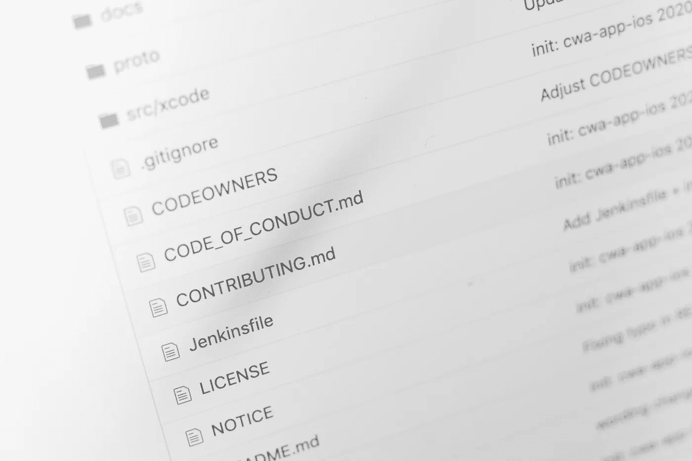
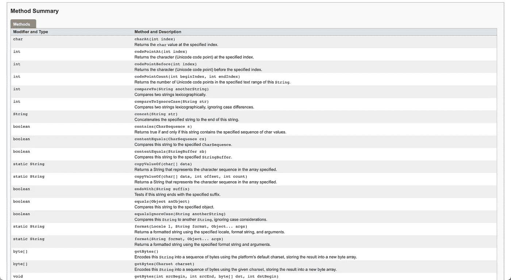
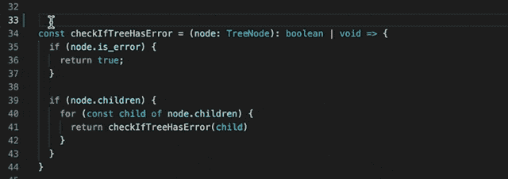
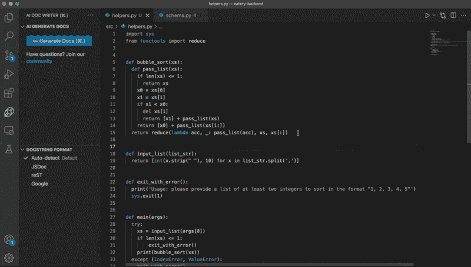

# 自文档化代码真的存在吗？

> 原文：<https://betterprogramming.pub/does-self-documenting-code-actually-exist-8824b22e9a0f>

## 满足 VS 代码 Docstring 框架生成器和 AI 文档编写器扩展，以简化您的文档处理过程



由[马库斯·温克勒](https://unsplash.com/@markuswinkler)在 [Unsplash](https://unsplash.com/?utm_source=medium&utm_medium=referral) 上拍摄

当谈到代码库中的文档时，似乎有两种思想流派:你要么相信代码应该被文档化，要么讨厌文档并拒绝编写 docstring。

现在，许多教授要求他们的学生为每个函数写文档——如果一个学生忘记把他们的代码和文档放在一起，就要扣分。

另一方面，许多人反对内联文档，因为它很快就会过时，人们认为代码应该是自文档化的。

根据维基百科的说法，自文档化代码“遵循命名惯例，使得在没有特定知识的情况下使用系统”。众所周知，任何优秀的程序员都应该给他们的变量起一个有意义的名字，这样他们就能描述变量的实际功能。

然而，你应该期望你团队的其他成员有多少先验知识呢？阅读你的代码的人应该能流利地使用你的语言吗？你是如何平衡可读性和简洁性的？

# 平衡可读性和简洁性

在 JavaScript 中，函数中的 return 语句有三种不同的编写方式:

1.

```
...
if (fruit != null) {
  return fruit;
} else {
  return “apple”;
}
```

2.

```
...
  return fruit != null ? fruit : "apple";
```

3.

```
...
  return fruit ?? “apple”;
```

第一条语句在技术上最具可读性——尤其是对于第一次学习 JavaScript 的初级开发人员。但是，您可以看到认为第一个代码片段是检查变量`fruit`是否为空并在为空时返回`"apple"`的最佳方式是多么的愚蠢。一段代码是否被认为是可读的/自文档化的是如此主观，没有正确的答案。

此外，随着代码变得越来越复杂，对于没有任何代码库知识的人来说，第一眼就能理解发生了什么的门槛也越来越高。事实上，程序员可以非常有思想，使用最佳实践，并有意命名他们的变量，但对许多人来说，这仍然不被认为是“自文档化”的。

例如，您可以将实现 knn 算法的函数公开命名为 knn，而以前从未听说过该算法的人仍然不知道该函数在做什么。

当编写代码时，有许多因素需要考虑，包括可读性、简洁性、模块性等等。您应该采用所有相关的最佳实践来生成自文档化的代码，但是仅仅因为术语的主观性质，将代码库明确地标记为“自文档化”是非常困难的。

但是文档是如何发挥作用的呢？

反对文档的一个主要理由是它很快就会过时。如果有人修改了代码而没有想到要修改 docstring，编译器仍然会编译出不正确的文档。许多人还认为，文档应该只解释*为什么*，而不是*什么*。

然而，支持文档化的理由是，不管你有什么样的先验知识，它都降低了快速、轻松理解代码的门槛。如果你的所有函数都有文档记录，那么阅读所有函数的简单英语描述客观上比阅读代码和试图理解语法中的逻辑更容易。

此外，几乎所有的编程语言都为函数、类和变量文档定义了格式。例如，当我学习 Java 时，我会经常参考 Oracle Javadoc，它展示了 Java standard 的字符串和数组类的文档。



关于字符串类的 [Oracle 的 Javadoc](https://docs.oracle.com/javase/7/docs/api/java/lang/String.html) 截图

在这种情况下，文档是有用的，因为如果它不存在，我首先就不知道哪些函数存在。除了文档风格之外，编程语言通常还有一个收集所有文档并生成易于搜索的页面的软件。如果您提供 API 即服务，并且您的客户想知道如何使用您的软件，这是很有帮助的。在这些情况下，文档是有帮助的，因为没有它，其他人不会知道某些功能的存在，并且它最终促进了可发现性。

除了将文档编译成页面的软件之外，还有帮助编写代码的工具。例如，VS 代码有一个自动填充参数并为标准文档格式创建结构的特性。



VS 代码文档框架生成

更进一步来说，[用于 Python、JavaScript、TypeScript、C、C++、PHP、Java 和 C#](https://marketplace.visualstudio.com/items?itemName=mintlify.document) 扩展的 AI 文档编写器完整地写出了整个文档字符串，包括函数和参数描述。



[AI 文档编写器的演示](https://marketplace.visualstudio.com/items?itemName=mintlify.document)

有了像 VS Code Docstring Skeleton Generator 和 AI Doc Writer Extension 这样的新工具，编写代码文档所需的激活能量现在低得多——不用花 30 秒编写代码文档，你可以花 5 秒生成文档。

关于代码文档的讨论是多方面的。除了文档之外，还有许多因素影响代码质量。随着新技术的出现，编写代码变得更加容易，让文档保持最新变得困难的观点也逐渐消失。

最终，对于自文档化代码是否真的存在，我没有答案，但是我主张所有程序员都应该牢记最佳实践，并且要让其他人容易理解。