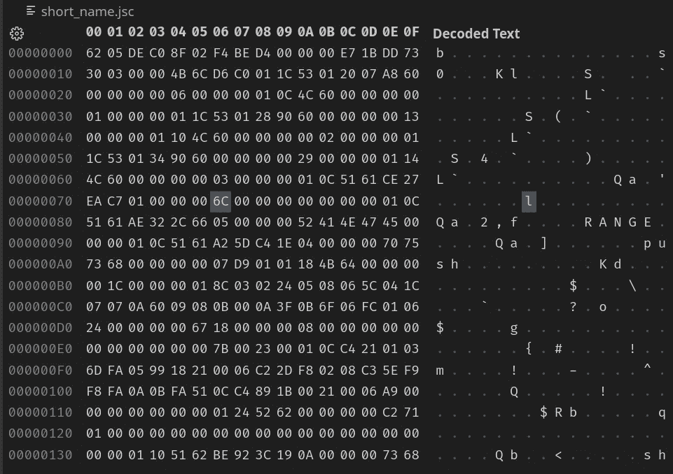
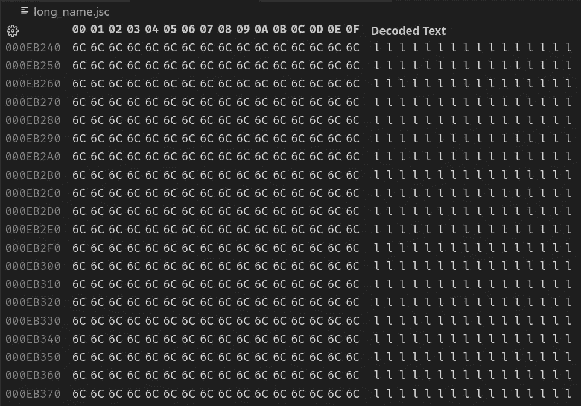

# 变量名长度影响 JavaScript 代码速度吗？

> 原文：<https://betterprogramming.pub/does-variable-name-length-affect-javascript-code-speed-bedc3cf592a8>

## 程序大小很重要。有点儿


[迪昂布莱克](https://unsplash.com/@deonblack?utm_source=medium&utm_medium=referral)在 [Unsplash](https://unsplash.com?utm_source=medium&utm_medium=referral) 上的照片

如果您已经编程一段时间了，那么您可能会遇到以下问题:变量名的长度是否会以任何方式影响代码的运行时性能？

起初，这似乎是一个愚蠢的问题。毕竟，除了老派的 C 开发人员，世界上有谁会选择模糊的三个字母的变量名而不是更具描述性和可读性的标识符呢？然而，这是一个合理的问题，它开启了学习一些有趣概念的可能性，您可能会发现这些概念在您的软件开发之旅中很有用。

当编程语言源代码被编译成机器代码时，变量的概念就失去了意义。剩下的所有对象、类、函数和所有这些高级概念只是内存地址、跳转指令和简单的操作。特别是，变量被转换成内存地址和偏移量。

然而，JavaScript 通常不直接编译成机器代码，而是由一个 JavaScript 引擎解释，比如谷歌的 [V8](https://v8.dev/) 。JavaScript 代码的执行管道相当复杂:引擎必须创建适当的执行上下文和范围链，解析源代码并将其编译成可执行的字节码，以便虚拟机运行。freeCodeCamp 在他们的文章“ [JavaScript 执行上下文——JS 如何在幕后工作](https://www.freecodecamp.org/news/execution-context-how-javascript-works-behind-the-scenes)”中很好地解释了这个过程，作者是 [Victor Ikechukwu](https://www.freecodecamp.org/news/author/victor-ikechukwu/) 。

本文将探讨变量名的长度如何影响程序的性能。

# 速度基准

首先，让我们做一个性能基准测试，看看是否有任何明显的差异。对于这个测试，我编写了一个简单的 JavaScript 脚本，比较两个函数的执行速度:`short_name`和`long_name`。前者使用简短的单字母变量名，而后者使用 16k 字节长的名称。如果有任何速度差异，这个大差距应该会很明显。

对于基准测试，我使用了`benchmark`库的高分辨率计时器和具有统计意义的结果。请注意，这里我用较短的名称替换了 16kb 的名称，这样您就不必下载无用的大文件。

以下是基准测试结果:

```
Short name x 523 ops/sec ±0.95% (89 runs sampled)
Long name x 521 ops/sec ±1.00% (88 runs sampled)
The fastest option is Short name,Long name
```

正如你所看到的，这两个函数在速度上似乎没有什么区别。然而，还不要停止阅读:有趣的部分现在就来了。让我们更深入地研究 JavaScript 如何处理变量。

# 分析字节码

正如我之前提到的，JavaScript 在执行之前被编译成字节码。为了比较这两个函数的字节码，我将它们分成两个独立的文件。此外，长变量名每个都是一兆字节，以进一步强调任何差异。

为了生成 V8 字节码，我使用了`[bytenode](https://github.com/bytenode/bytenode)`，这是一个用 JavaScript 编写的 Node.js 的极简字节码编译器。要编译 JavaScript 源代码，请键入以下命令:

```
npx bytenode -c short_name.js
npx bytenode -c long_name.js
```

这会生成两个字节码文件:`long_name.jsc`和`short_name.jsc`。现在，让我们用`du`打印文件大小，看看是否有什么不同。毕竟，变量名应该还在。

```
du short_name.jsc long_name.jsc -h --apparent-size840 short_name.jsc
978K long_name.jsc
```

正如你所看到的，大小有很大的差异:后者大约大 1000 倍。如果我们用十六进制编辑器(我用的是 VSCode 内置编辑器)检查字节码，我们应该可以找到变量。



简称. jsc



long_name.jsc

事实上，变量名仍然存在。然而，符号名(变量、函数……)在字节码中只存储一次，然后使用偏移量和地址而不是它们的 ASCII 名来引用。因此，`long_name.jsc`大约有一兆字节大:long `l`变量的长度。同样，for 循环中使用的`i`也消失了。老实说，我对 JavaScript 了解不多，无法解释为什么字节码中没有`i`。我想这是一种优化。

# 运行时基准测试

现在您知道了两个生成的字节码文件之间有很大的差异，您可能想知道它们的运行时性能是如何相同的。在之前的基准测试中，只有在整个程序被加载到内存中并被 JavaScript 引擎读取后，计时器才会启动。

如果我们调用`short_name.js`和`long_name.js`末尾的函数，并使用`time`实用程序执行速度测试，我们应该会看到不同之处:

```
time node long_name.jsreal 0m0,132s
user 0m0,111s
sys 0m0,021stime node short_name.jsreal 0m0,058s
user 0m0,048s
sys 0m0,011s
```

事实上，这是有区别的。测量程序从启动到退出需要多长时间。这还包括从磁盘读取文件以及 JavaScript 引擎通过每个字节执行代码所花费的时间。当然，字节越多，处理它们的时间就越长。

至于之前的基准测试，正如我提到的，没有性能差异，因为一旦加载，这些符号就像数组元素一样通过偏移量和地址来访问，所以没有对它们名称的引用。

# 结论

最后，我们已经看到了程序大小如何影响代码的运行时性能。然而，本文中的例子是你在职业生涯中可能不会遇到的极端情况。此外，一旦程序被加载，由于字节码中处理符号的方式，不会有任何性能差异。

此外，你不应该为了更小的文件而牺牲源代码的可读性。一个恰当的描述性变量名总是比一个三个辅音的单词好，就像老派的 C 开发人员在使用电传打字机和纸张时所做的那样(现在仍有一些人这样做)。

如果你特别热衷于保持文件尽可能小，例如，为了在互联网上更快地传输，你总是可以利用[缩小](https://en.wikipedia.org/wiki/Minification_(programming))，这是在不改变其功能的情况下从源代码中删除所有不必要的字符的过程，从而降低带宽使用率并减少网站的加载时间。

那么，变量名长度影响 JavaScript 执行速度吗？是的，至少理论上是这样。实际上，这并没有什么明显的区别。

我希望你喜欢这篇文章。如果你有什么要补充的，请在评论中分享你的想法。感谢阅读！

如果您对增强您的 JavaScript 代码库感兴趣，请看看下面这个故事:

[](/why-i-migrated-from-javascript-to-typescript-again-69819a55daab) [## 为什么我再次从 JavaScript 迁移到 TypeScript

### TypeScript 的好处以及何时应该迁移到它

better 编程. pub](/why-i-migrated-from-javascript-to-typescript-again-69819a55daab)