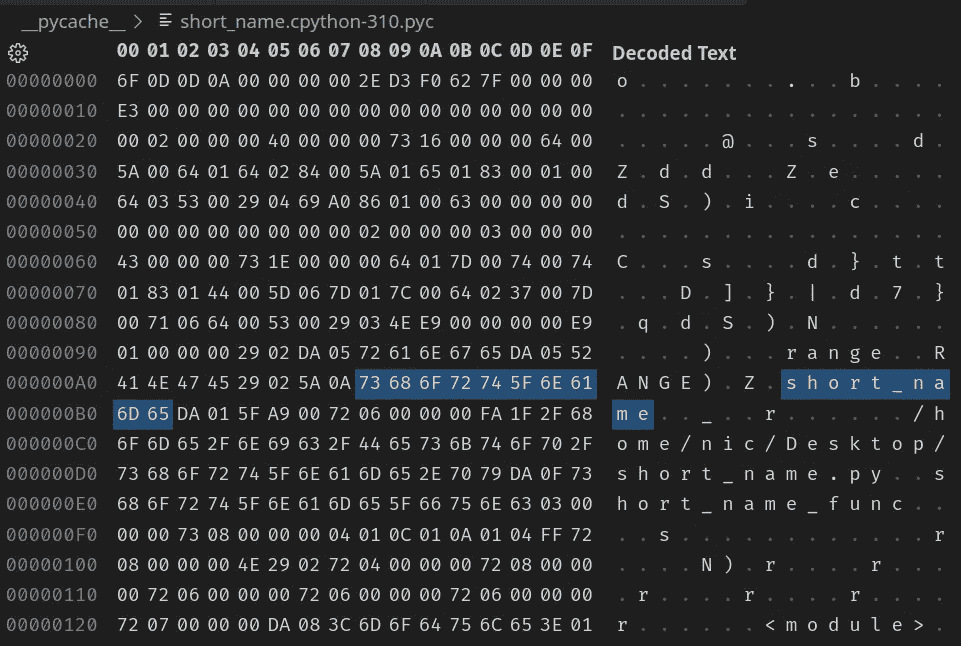

# 变量名长度影响 Python 代码速度吗？

> 原文：<https://betterprogramming.pub/does-variable-name-length-affect-python-code-speed-6b0b115007a6>

## 深入探究 Python 内部，了解大小的重要性


由 [charlesdeluvio](https://unsplash.com/@charlesdeluvio?utm_source=medium&utm_medium=referral) 在 [Unsplash](https://unsplash.com?utm_source=medium&utm_medium=referral) 拍摄的照片

如果您已经从事代码优化工作有一段时间了，您可能会遇到以下问题:变量名的长度是否会以任何方式影响代码运行时性能？

起初，您可能认为使用三个字符的变量名在执行速度方面与更具描述性的名称不会有太大区别。此外，没有人会为了损失几毫秒而让他们的代码无法阅读。

但是接下来你会想得更多，并开始问自己:“但是说真的，变量名长度会影响代码性能吗？”。这是一个合理且非常有趣的问题。

当编程语言源代码被编译成机器代码时，变量的概念就失去了意义。剩下的所有对象、类、函数和所有这些高级概念只是内存地址、跳转指令和简单的操作。特别是，变量被转换成内存地址和偏移量。

然而，Python 源代码通常不直接编译成机器代码，而是由默认的 Python 解释器 [CPython](https://en.wikipedia.org/wiki/CPython) 解释。更准确地说，CPython 在执行之前将源代码编译成字节码。然而，在编译过程中，它仍然保留对变量名的引用。否则，Python 就不能打印出像这样的漂亮而有价值的错误信息:

```
Traceback (most recent call last):
  File "/home/nic/Desktop/er.py", line 7, in <module>
    foo()
  File "/home/nic/Desktop/er.py", line 4, in foo
    a
NameError: name 'a' is not defined
```

# 性能基准

弄清楚变量名是否影响代码性能的第一步是编写代码并收集一些数据。对于这个测试示例，我决定创建两个简单的函数:一个使用单字符变量，而另一个函数使用 4014196 个字符(4MB)的超长名称。

使用内置的`timeit`模块执行基准测试。在下面的代码片段中，我用一个更短的描述性名称替换了 4MB 长的名称，所以您不必下载整个 8MB 的要点。

事实证明，基准测试结果非常不一致。有时候一个功能更快；有时另一个，如下图所示:

```
Short time: 0.08893431029973727
Long time:  0.07757537399993453

Short time: 0.08859034220022295
Long time:  0.07780963819968748

Short time: 0.08343082869996579
Long time:  0.10756722440019076

Short time: 0.08072503170042182
Long time:  0.07815180819961824

Short time: 0.07780468439996184
Long time:  0.07831483780028066

Short time: 0.10425543720011773
Long time:  0.09920399159964291
```

因此，如果有任何运行时性能差异，像这样的极端测试用例应该会指出来。然而，还不要停止阅读:有趣的部分现在就来了。长变量名还在，所以它一定有所不同。

## 分析字节码

为了更深入地探讨这个主题，让我们将这两个函数分成不同的文件:

并将它们编译成字节码，方法是用

`python3 -m <file_name>`

这将在当前目录中生成一个包含编译后的 Python 代码的`__pycache__`文件夹。如果我们用十六进制编辑器检查生成的文件，我们可以看到变量名在编译后仍然存在，并且出现在字节代码中。

但是，变量名在字节码中只出现一次，如下所示:



为“`short_name.py"`文件生成的字节码

这意味着 CPython 仍然保留变量名，但像编译语言一样使用另一种方法来引用它。这意味着我们必须深入了解引擎盖下发生了什么。

## 分解字节码

现在，我们可以对字节码进行逆向工程以发现变量是如何被引用的，或者我们可以使用[编译器资源管理器](https://godbolt.org/)通过简单地复制粘贴 Python 源代码来轻松地反汇编它。

不懂汇编语言也不用担心。我会对每一行进行彻底的评论，这样任何人都可以理解发生了什么。

如果这是你第一次阅读汇编语言，你可能需要花更多的时间来阅读注释，以彻底理解每条指令的作用。

从图中可以看到，Python 在程序中多次加载了`short_name`变量。那么，如何才能在字节码中只看到一次呢？如果你仔细注意引用`short_name`时右边的数字，你会发现它们总是`0`。这个数字是局部范围内的对象地址，并引用它而不是它的变量名。

```
2 STORE_FAST                0 (short_name)
16 LOAD_FAST                0 (short_name)
22 STORE_FAST               0 (short_name)
```

请注意，括号中的变量名仅由编译器资源管理器添加，以提高可读性，它不是字节代码的一部分。

我们可以通过在局部作用域中添加其他变量来进一步证明最右边的数字是对象地址，看看这个数字是如何相应变化的。我将在下面的代码片段中只显示相关的装配线:

我们知道 Python 只使用一次变量名，并使用它的作用域地址来引用它。但是，变量名长度是如何影响代码执行速度的呢？

## 加载和解析

在之前的`timeit`基准测试中，我们已经证明了变量名的长度与运行速度无关。然而，那是因为源代码已经被编译成字节码了。

长变量名的速度劣势在于代码执行前的加载和解析步骤。为了检查这一点，我测试了我之前展示的两个单独的 Python 文件的执行速度，`short_name.py`和`long_name.py`，使用 Unix 命令`time`来测量一个命令执行的时间。

```
$ time python3 short_name.pyreal 0m0,032s
user 0m0,028s
sys 0m0,004s$ time python3 long_name.pyreal 0m0,173s
user 0m0,148s
sys 0m0,024s
```

然后，我多次重复测试，以确保数据中没有噪声。

如您所见，`short_name.py`比`long_name.py`花费的时间少得多。这是因为 Python 需要首先将文件加载到内存中。其次，它得把源代码编译成字节码，然后才能执行程序。这意味着文件越大，处理它的时间就越长。

基准测试结果的差异仅仅是由于文件大小的巨大差异，正如您在这里看到的:

```
$ ls -lh-rw-r--r--  1 nic nic 7,7M  8 ago 11.05 long_name.py
-rw-r--r--  1 nic nic  127  8 ago 11.11 short_name.py
```

`long_name.py`占用近 8MB 内存，而`short_name.py`只有 127 字节，难怪后者运行速度明显更快。然而，这是一个极端的情况，你不需要使用太长的变量名来改变加载和编译的速度。

# 结论

总而言之，变量名长度会影响 Python 程序的速度，因为较大的文件需要较长的处理时间，如 Unix `time`基准测试所示。然而，一旦编译了源代码，性能差异就小于由其他不相关因素(如同时运行的其他进程)引起的随机噪声，如`timeit`基准所示，因此完全可以忽略不计。

你不应该为了最初几毫秒的速度优势而牺牲代码的可读性。如果您担心由于程序太大而导致的内存(磁盘和 RAM)利用率，您可能希望研究一下[缩小](https://en.wikipedia.org/wiki/Minification_(programming))，即在不改变其功能的情况下从源代码中删除所有不必要的字符的过程(就像您在 web 开发中看到的那些`.min.js`文件)。

我希望你喜欢这篇文章。如果你有什么要补充的，请在评论中分享你的想法。感谢阅读！

如果你想了解更多关于编译器资源管理器，我用来反汇编 Python 源代码的工具，看看下面这个故事:

[](/compiler-explorer-a-must-have-tool-for-software-developers-98e7f4d6e94c) [## 编译器资源管理器:软件开发人员的必备工具

### 从一个舒适的浏览器选项卡中轻松分析、比较和优化源代码

better 编程. pub](/compiler-explorer-a-must-have-tool-for-software-developers-98e7f4d6e94c)