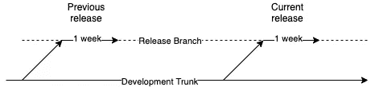
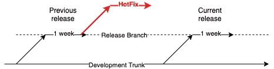

# 你的软件过程还有意义吗？

> 原文：<https://betterprogramming.pub/does-your-software-process-still-make-sense-7e669b97d3c5>

## 软件世界

## 不要只是做。一直质疑。

[玛丽·莱扎瓦](https://unsplash.com/@marilezhava?utm_source=medium&utm_medium=referral)在 [Unsplash](https://unsplash.com?utm_source=medium&utm_medium=referral) 上拍摄的照片

为了确保成功的软件设计、开发和部署，我们需要有一套合适的过程。它有助于确保一致性，这有助于确保质量。

然而，有时我们可能会养成这样做的习惯，而不知道它是否还能提供预期的价值。在不知道目的的情况下做一些不合常规的事情有时会适得其反，尤其是对于以快速变化著称的软件开发。即使我们知道意图，这仍然是最好的方法吗？

以下是一些注意事项。这可能不是全新的，但值得不时重温和思考。

# 还相关吗？

所有的过程都是有目的的。但是随着时间的推移，可能不再需要它了。下面是一个案例分享。

## 修补程序流程

过去，我们每月发布一次软件。每次计划发布时，都需要一周的准备时间才能发布。为了方便起见，我们将创建一个如下所示的分支系统，其中我们将有一个持续一周的发布分支。

在这种情况下，如果我们有先前版本需要的紧急修复，而当前版本分支已经存在，我们将必须创建另一个分支，称为修补分支，它是从先前版本分支分支的(因为修复是在先前版本软件上)

这种情况并不总是发生，但在一个月的时间里，它确实会不时发生。因此，生成修补程序的过程也被记录下来。

## 缩短发布周期

快进到今天，我们已经采用了一个更快的发布周期时间，由于其巨大的好处。这里有一篇关于早点发布软件的文章:

 [## 软件越早发布越好

### 频繁发布软件如何让每个人受益

better 编程. pub](/software-release-early-release-often-is-really-good-b4acb017e79) 

我们不再每月发布，而是每周发布。发布过程现在变得更加高效，发布可以在一天内完成。

考虑到更频繁的发布，需要即时热修复补丁的可能性已经大大降低。当在过去的版本中发现一个 bug 时，也许我们只需要在最新的版本中修复它，而不是修补以前的版本。

因此，不再需要热修复分支过程。但这在我们第一次缩短发布周期的时候并不明显。因此，过程文档就在那里，使得整个发布过程文档比它应该需要的要长。

因此，我们应该从文档中删除这个过程，简化事情。

# 是否多余？

当一个过程第一次被引入时，很可能它还没有到位。但是，随着时间的推移，由于我们有一些其他的东西，有时我们可能不知道它使一些现有的过程变得多余。

下面我分享一些例子:

## 软件质量服务水平目标

当我们开发软件时，在开发人员应该关注什么，即致力于产品功能，还是修复一些引入的 bug 问题之间存在这种争论。

显然，答案取决于即将到来的错误有多严重。为了达成一致，SLO(服务水平目标)是基于软件的无崩溃率创建的，例如，如果无崩溃率低于 99%，开发人员应该开始专注于修复错误。

那时，我们用来监控无故障率的工具只有报告的图形用户界面。因此，我们只是定期手动提取它，例如，每月提取到一个表中，然后我们可以从那里绘制一个图表，看看我们如何随着时间的推移而发展。不错！

## 整合基础设施

几年后，组织的基础设施团队决定购买一个工具，整合所有的软件跟踪，包括性能、崩溃率等。

这个新工具的好处是它还有一个警报系统，当崩溃高于我们的预期时，我们可以向我们的团队发出警报。

因此，每个人都对新工具感到兴奋，并实施了警报系统。这可能是由不同于监控无事故率的团队完成的。

因此，人工监控无故障率的活动仍在继续。过了一段时间，我们开始思考，为什么我们还需要这样做？已经有一个工具可以帮助我们完成这项工作。我们不知不觉地做了多余的工作。很高兴立即停止。

# 是否矫枉过正？

有时，一些流程作为备份存在，作为风险缓解。虽然降低风险很重要，但有时问题是:

*   该问题发生的可能性有多大？
*   当它发生时，影响会有多大？

下面是一个案例的一个视图作为说明。

## 将工件存储为 GitHub 发布资产

当构建我们的软件以供发布时，我们可以将构建的工件存储在 GitHub 中，例如，用于内部和生产的源代码和编译后的可执行文件。

存储这些工件背后的原因是一个很好的实践，如果我们将来再次需要它们，我们可以很容易地检索它们。

从历史上看，这样一个过程非常重要，因为使用我们软件的每个客户都是一个依赖于我们软件某个版本的大组织。万一他们丢失了软件，我们总能得到他们需要的特定版本。

## 现代应用发布

今天，当我们构建移动应用程序时，我们也执行这样的实践，即使我们有各种备份机制作为安全网，例如:

*   我们有一个 CI 系统，可以在相当长的一段时间内存储 X 个(有限的)版本的编译应用程序
*   在 AppStore (TestFlight)和 PlayStore 上，如果需要，我们可以检索它们

有些人可能仍然认为，我们的 CI 系统只存储 X(有限)版本，我们无法获得更旧的版本，AppStore 和 Playstore 不在我们的控制之下，也不能保证所有旧的 IPA 和 apk (aab)将始终可用。

虽然这些都是有根据的论点，但是我们有多大可能会面临这样一种情况:我们需要一个在以上两个方面都不可用的版本？

如今，发生这种情况的风险相当低。况且也没有多少用户会用旧版的 app。那么，我们强迫一个进程无限地存储旧应用程序是不是有些矫枉过正呢？

嗯，答案是，储存它有多容易，成本有多高？如果它是便宜的和自动化的，没有害处。但是像任何事情一样，我们应该总是评估收益和成本。

# 是不是太死板？

流程应该是清晰而精确的。避免歧义。

由于这种性质，许多人陷入了盲目地逐字遵循过程而不知道价值的陷阱。

下面是一个说明的例子。

## 技术资料

作为一个良好的实践，在任何开发开始之前，我们创建以下内容:

1.  写下明确的要求
2.  撰写清晰的技术文档

这是一个很好的实践，因为它提供了清晰的可追溯性，说明需求来自哪里，以及背后的技术细节来自哪里。

在技术文档中，必须有清晰的类图和序列图等。它是基于非常结构化的模板文档编写的，每个部分都需要清楚地填写。

## 合法地缩短流程

为了确保一致性和不遗漏任何东西，编写文档的要求也适用于简单的特性、补丁和小的错误修复。

由于这种工作的一些性质与其他类似，许多这种文件不是重写技术文件，而是简单修改后从其他文件中复制粘贴。

结果，实际上没有人阅读文档，因为它变成了一个无聊的工件，除了在做的时候发牢骚的作者之外，可能没有人会看。

这就是瀑布过程。

## 只有在有意义的时候才做

技术写作不应该有一个严格的过程，而应该只有在有足够的复杂性需要涵盖并传达给一组受众的情况下才可以进行。

不要因为某件事是过程的一部分就去做，除非它带来价值。

# 可以自动化吗？

这是显而易见的。能做到的自动化才是王道。但是有时我们会错过一些简单明显的步骤，这些步骤本来是可以自动化的。

下面是一个例子。

## 受保护的开发主干和发布分支

作为一名开发人员，要将我们的变更合并到主开发主干中，变更代码的变更需要通过所有测试的评审(或 PRed)。

这也适用于需要进入发布分支的任何变更(例如，在发布之前对发现的错误的修复)。

这两个分支受到保护，因此没有人可以合并到它们中，除非发生以下过程:

1.  提出审查请求
2.  接受审查
3.  请求已合并

## 发布流程

类似地，当我们需要开始一个发布过程时，我们必须将最新的开发主干代码合并到发布分支中。

为此，我们遵循以下流程:

1.  提出审查请求
2.  接受审查
3.  合并审核

由于这是由多人完成的，并且在这之间，在一个人可以合并之前，需要运行并通过一些测试，所以整个过程会花费相当多的时间。

这似乎是合理的，因为它是一个分支保护版本。

## 哎，发布流程要优先！

当将开发主干合并到发布分支中时，评审过程根本就不是评审。它只是得到批准并被合并，因为只要开发分支稳定，就没有人会审查长长的代码列表。

因此，手动“检查”和“合并”它完全是浪费时间。

为什么不仅仅是自动化分支的整个过程，并通过一个脚本运行将开发主干合并到发布分支中呢？这会节省很多时间和麻烦。

# 我们有工具吗？

当然，如果有工具，就使用它(如果获得它的成本是合理的)。我们可以想到 CI 操作、林挺、测试覆盖率度量等。，那些我们不能有效地手工做的事情，工具肯定是有益的。

然而，有些事情看似简单，但有一些工具可以节省一些时间。下面是一个例子。

## 更新依赖项版本

如今，大多数软件应用程序都依赖于外部库。为了确保我们的软件是最新的，我们必须不断更新外部库到最新版本。

自动化合并这样的库似乎是我不依赖使用工具的事情，因为可能会有突破性的变化，需要我们手动验证和更新。

因此，我们有一个例行程序来检查最新的主要版本更新或库，并更新它。

## 哦，有工具！

令我惊讶的是，有工具可以做到这一点；我们可以将它们整合到 GitHub 中。而且这些工具都是免费的！它们如下:

1.  [依赖机器人](https://dependabot.com/)
2.  [RenovateBot](https://github.com/renovatebot)

他们所做的是扫描我们在应用程序中定义的版本，并检查可用的最新版本。如果有新的版本，这些机器人将自动提出一个最新版本更新的变更请求，以合并到主开发主干中。

在我们的 CI 流程中，我们在代码合并时运行测试。如果我们的测试足够充分，那么测试运行的结果可以让我们确信新库对我们的应用程序的兼容性。

我们需要做的是合并变更请求，就这样！我们不再需要定期手动检查最新的更新，而是自己去做。省去了那个费时的过程！

这是我下面提到的项目之一…节省这么多时间！

 [## 作为 Android 开发人员，我已经停止手动做的 3 件事

### 自动化接管了我平凡的 Android 开发工作

medium.com](https://medium.com/mobile-app-development-publication/3-things-ive-stop-doing-manually-as-an-android-developer-c783c726181f) 

# TL；速度三角形定位法(dead reckoning)

就像代码一样，软件过程需要定期审查、质疑和改进。如果我们只是继续做而不知道它的价值，很快它就会掌握我们，而不是我们掌握它。

有时，除了回顾它，我们还需要实际，了解过程的意图，并最大限度地利用它。我们需要时刻牢记“过程是为了帮助，而不是命令。”

让我们掌握它！

> 附:上面分享的例子相对来说只针对某些软件开发领域和组织。它们不应该从字面上理解为适用于所有的软件开发领域。每个组织都需要相应地评估其流程。