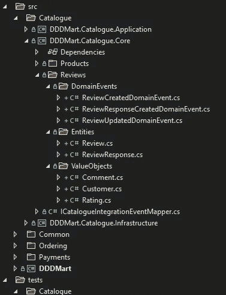

# 领域驱动设计:构建聚合的演练

> 原文：<https://betterprogramming.pub/domain-driven-design-a-walkthrough-of-building-an-aggregate-c84113aa9975>

## 通过构建聚合的过程和一些提示和技巧来引导您走上正轨

[Jackman Chiu](https://unsplash.com/@jackmanchiu?utm_source=medium&utm_medium=referral) 在 [Unsplash](https://unsplash.com?utm_source=medium&utm_medium=referral) 上的照片

在我拿起我比喻的旅游经营者的帽子，开始我们穿越 DDD 土地上漫长而多风的道路的危险探险之前，有几句警告的话:

*   这将是一个挑战
*   你会犯错误，而且会犯很多错误！
*   你永远不会以同样的方式看待一个看似简单的软件问题

这趟旅程值得冒险吗？绝对的！

不幸的是，我不是你可能猜到的 DDD 的官方导游。结构化集合及其边界可能是你在软件开发中面临的最困难的问题之一，坏消息是…没有导游！

我仍在与 DDD 一起踏上自己的旅程，并一直试图了解更多，但在这里，我提供了我在设计和测试聚合时的思维地图。

本文的目标读者是对 DDD 和聚合有一定了解的人。如果这些概念对你来说是新的，那么你可以在 Jimmy Bogard 的[这里](https://secure-web.cisco.com/1Iuj8r62fsEdcx0SrWi-mbY70dptkMXLJH5ICAyBi4596tTFj4Eog30cTALeu2u71GNMpcINW5NoUioN0anQH5HtlhkzR7m0tO1hbI7hy9pNu0czgxbV-9ZWorjWuAPGWR0m2rhwdnUy552-wlNYhJ3r7ixY_05tW0YMtI9qUdZ5TfCmoNpfqbXhPQ__df5ognY44mLj7Lke6qSgd7eQ4lGm-aaDPfCiSONK_mQ7e1937TkNyPVvQcQKfraKAFUPdIZS-e6rZyoem7blEM2JUX_v579F8D8w65_q74UouX9P-tGfYllCLdwyGly-aBKVc/https%3A%2F%2Flostechies.com%2Fjimmybogard%2F2008%2F05%2F21%2Fentities-value-objects-aggregates-and-roots%2F)找到一个比我收集的更好的总结。这些示例使用 C#。然而，如果你熟悉任何一种 OOO 语言，你就能听懂。

# 问题域

首先，我们需要探索一个问题域。在之前的一篇关于领域和整合事件的文章中，我为一家假公司 DDDMart 创建了一个小型电子商务应用。让我们在此基础上添加产品评论的概念。

## 业务需求

*   评论必须有关联的`Order`和`Customer`。
*   评论的评分必须在 1-5 之间。
*   必须留下评论。它应该少于 200 个字符。
*   不到六个月的客户可以回复评论。

## 子域

该域由三个子域组成，这三个子域被构造为独立的微服务:

*   目录(核心)—产品目录
*   排序(核心)——用于创建不同`Products`的`Basket`和`Order`
*   支付(支持)—用于生成和跟踪发票以及存储客户支付方式

# 战略设计

第一步是使用战略设计来分析问题域。事件风暴是梳理出任何额外需求并帮助设计我们的有界上下文的好方法。这个过程已经在我的[上一篇文章](/domain-driven-design-domain-events-and-integration-events-in-net-5a2a58884aaa)中执行过了。

新的`Reviews`概念将驻留在它自己的`Bounded Context`中。`Catalogue`子域似乎是最符合逻辑的地方，但是如果复杂性随着时间的推移而增长，我们可能希望将其转移到自己的域和/或微服务中。

因为战略设计不是这里的目标，所以让我们直接跳到战术设计阶段，在那里我们将开始构建我们的集合。

# 战术设计

现在我们已经准备好开始了，有几个原则可以帮助指导我们完成这个过程。在做决定时，我们应该始终考虑这些原则。

## 关键原则

*   支持“总是有效的域”方法——在我们的聚合中有不同的方法来实施不变量(业务规则)。尽量让你的聚合保持在一个有效的状态，而不是尽可能使用延迟验证方法。保持简单。
*   让聚合尽可能小—膨胀的聚合最终会变得更加复杂，并且通常会产生性能问题。
*   聚合应该能够验证它的所有不变量——最后两个是帮助您决定聚合大小的最重要的概念。您希望它们尽可能小，同时仍然能够满足/执行它们的业务规则，例如，`Car`必须有四个轮子。如果试图将其建模为一个集合，那么轮子必须是`Car`集合中的一个`Entity`才能实施这个不变量。
*   偏爱有价值的对象——当人们开始使用 DDD 时，通常不愿意使用`Value Objects`,因为它们看起来不如`Entities`熟悉。`Value Objects`非常强大，您应该将它们用作默认构建模块，只有在`Value Objects`无法使用时才切换到`Entities`，而不是相反，这是人们通常开始的地方。
*   以高测试覆盖率为目标——记住你的领域是你的应用程序的核心。确保它有一套广泛的单元测试，覆盖你所有的不变量。
*   对变化持开放态度——建模集合很难。真的很难！没有人第一次就做对了，所以请记住这一点，并随时准备改变。

## 初始设计

这可能是我们创建集合的第一次尝试。我们知道我们的聚合应该尽可能小，所以让我们将`Review`和`Response`拆分成单独的聚合。我们也有一些基本的验证，所以我们可以写一些有用的测试。代码如下:

第一次尝试检查聚合

第一次尝试查看响应聚合

审查聚合单元测试的第一次尝试

由于在实例化聚合时通常会传入相当多的参数，所以当我们的聚合发生变化时，`Builder`模式对于隔离只在一个地方进行这些变化非常有用。最后一个关键原则表明，它很可能会改变！

用于单元测试的检查生成器

## 包装

第一次尝试有一些问题，但让我们从最大的问题开始——DDD 就是使用封装将我们的聚合保持在一致的状态。`Review`必须在有效状态下通过构造函数创建，但是没有什么可以阻止某人在创建后将属性修改为无效值，比如将`Rating`设置为`6`。我们可以通过将所有的 setters 改为 private 来解决这个问题。

## 护卫队

我们有一些很好的验证逻辑，但是很难重用，我们需要大量的测试来覆盖它。让我们通过添加一些`Guard`类来改进这一点。在链接中可以找到[类的代码。](https://github.com/matt-bentley/DDDMart/tree/main/src/Common/DDDMart.SharedKernel/Guards)

封装骨料和添加防护物

## 工厂

现在看起来好多了。下一个问题:通常，我们使用实体框架或 NHibernate 这样的 ORM 来持久化我们的聚合。这些函数通常被设计成将我们的属性名与构造函数参数相匹配，当从数据库中重新构造数据时，它们通过构造函数传递数据。这意味着所有这些好的验证逻辑都在重复，这会损害性能并导致兼容性错误。

一个`Factory`可以帮助我们移动验证逻辑。通常，我在聚合上使用一个静态的`Factory`方法，并将构造函数改为私有的，以保持封装性。可以创建一个单独的`Factory`类，但我发现这通常只对多态的`Entities`或`Value Objects`有用，在那里验证逻辑可以被重用。

添加静态工厂方法

根据您使用的 ORM，您可能会发现还需要添加一个无参数的私有构造函数。

这个阶层现在正在获得回报。我们只需要在一个地方改变我们的测试程序集就可以编译了。

## 价值对象

让我们回到我们的原则:在可能的情况下，我们应该支持`Value Objects`。这里有一些我们可以重构到`Value Objects`中来封装我们的一些验证逻辑。

在这里,`Rating`是重构最明显的例子。让我们看看如何将它重构为一个`Value Object`。

评级值对象

`Value Objects`帮助我们提供更丰富的领域，并允许我们重用我们的验证逻辑。我们的`Review`集合现在干净多了，而且我们还设法移除了`Update`方法中的重复代码。

创建值对象后检查聚集

因为我们已经为所有的不变量编写了测试，所以我们可以运行它们来确保我们在重构`Value Objects`时没有引入任何错误。我们的`Review Builder`继续确保我们的测试项目需要最小的改变。

# 重新分析我们的设计

让我们回到我们的原则。我们有两个很好的小集合(原则#2)，但是我们不能验证我们所有的业务规则(原则#3)，它说如果评审超过六个月就不能留下响应。这表明我们的界限是错误的，必须将`Response`纳入`Review`总量。

我们现在要做一个有趣的决定:`Response`应该是`Entity`还是`Value Object`？在这种情况下，我们可能需要求助于我们的业务专家，并询问一些问题来帮助理解这一点。这里要问的一个重要问题是一个`Response`发布后是否可以编辑。我们(假想的)商业专家告诉我们，如果人们犯了错误或改变主意，他们很可能会修改他们的回答，所以我倾向于使用`Entity`。实体是可变的，而`Value Objects`不是。

很多这类决策都没有正确的答案。我发现从业务专家那里获得尽可能多的洞察力——以及从其他开发人员那里获得平衡的观点——将为您的团队提供做出最佳决策的最佳机会。

## 添加子实体

让我们看看如何将一个集合`ReviewResponse` `Entities`添加到我们的`Review`聚合中。下面是`ReviewResponse` `Entity`的样子:

查看响应实体

现在这里的东西看起来应该很熟悉了。我们甚至能够重用我们之前创建的`Value Objects`。

您会注意到`Factory`和`Update`方法是内部的，而不是公共的。请记住，在 DDD，对汇总的所有更改都必须经过`Aggregate Root`。通过使这些方法成为内部方法，我们确保了`Domain`项目之外的消费者不能改变`Review`的状态或创建`ReviewResponse`。

这是我们最终的`Review`聚合结果。将`Responses`添加为`IReadOnlyCollection`，由私有`List`支持。这是在 DDD 公开集合同时保持封装的常见模式，因为`Entities`只能从集合内部添加/删除/更新。

最终评审汇总

现在，我们可以满足所有的不变量，并在单元测试中测试我们的业务规则。

## 使用日期

您会注意到，在使用`Responses`时会传入`Response Date`，这样就可以验证不变量。如果在聚合中使用了类似于`DateTime.UtcNow`的东西来获取响应日期，那么当评审超过六个月的时候，我们将无法测试响应。计算当前的`DateTime`是业务逻辑，它不属于我们的聚合。

如果您的应用程序有很多的`DateTime`验证，那么另一个选择可能是有一个`DateTime Service`，它被传递到方法中。这在测试时可能会被嘲笑。

## 域事件

当前的设计为我们将来添加新功能提供了一个很好的基础。如果我们想要建立一个审查/批准流程，那么现在添加它会非常容易。

我要补充的最后一件事是域事件。即使您不打算将任何东西与这些事件挂钩，这也意味着人们将来可以使用它们，而无需对您的聚合进行任何代码更改。下面是我们可能从这个集合中使用域事件的种类:

*   发布评论时，向评论团队或自动化流程发送电子邮件，以检查攻击性内容。
*   添加评论时向客户发送提醒。
*   更新产品的平均评级快照。

# 最终解决方案

这是在应用了我们讨论过的概念和原则之后，我们最终的`Review Bounded Context`的样子。

最终审查有界上下文

我确信我们可以使用许多额外的概念来增强这里的`Review`聚合。另外要研究的是使用一个[结果单子类](https://enterprisecraftsmanship.com/posts/advanced-error-handling-techniques/)来返回错误，而不是抛出异常。我让你自己去调查。

你可以在我的 GitHub 上找到最终解决方案[的代码。](https://github.com/matt-bentley/DDDMart/tree/main/src/Catalogue/DDDMart.Catalogue.Core/Reviews)

不幸的是，我们的旅程就此结束。谢谢你今天和我在一起。我希望这里讨论的概念和原则能够在将来设计聚合时对您有所帮助！

如果你想看看这个已经被应用的[代码](https://github.com/matt-bentley/DDDMart/tree/main/src/Catalogue/DDDMart.Catalogue.Core/Reviews)和[项目](https://github.com/matt-bentley/DDDMart)，那么你可以在这里查看我的 GitHub [。](https://github.com/matt-bentley/DDDMart)