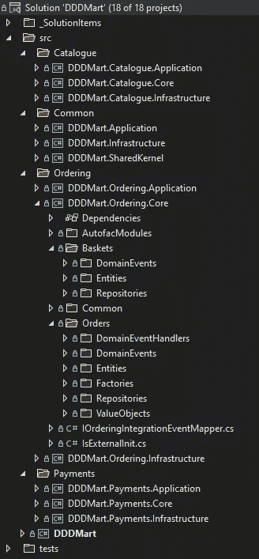
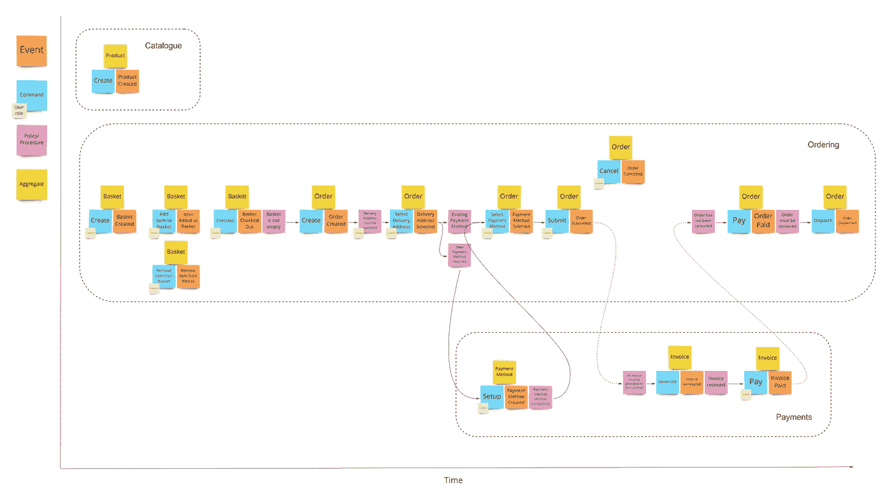

# 领域驱动的设计:领域事件和集成事件。网

> 原文：<https://betterprogramming.pub/domain-driven-design-domain-events-and-integration-events-in-net-5a2a58884aaa>

## 使用 DDD 和. NET 时处理域事件和集成事件的指南

领域事件是 DDD 的一个基本构建模块，但是它们确实有点像雷区。

> [领域事件捕捉影响领域的有趣事物的记忆——马丁·福勒](https://www.martinfowler.com/eaaDev/DomainEvent.html)

域事件用于允许聚合对另一个聚合中的变化做出反应，而不耦合它们。像 Eric Evans 和 Vaughn Vernon 这样的先驱 DDD 书籍提倡使用异步机制来处理域事件。然而，由于事件处理程序的激增，这极大地增加了应用程序的复杂性和必须托管的组件数量。

为了解决这种复杂性，我发现在大多数情况下，在发布域事件的同一个流程和事务范围内处理域事件是可以接受的，而且容易得多。对于处理不同子域或微服务中需要异步行为和聚合的流程，可以使用消息代理/事件总线发布集成事件。

在事务成功完成后发布集成事件是很重要的，并且要有适当的机制来确保集成事件总是成功发布——稍后会有更多的介绍！

在本文中，我将使用一个示例应用程序来演示如何处理域事件和集成事件。

# 示例应用程序

我已经写了一个样本。一家名为 DDDMart 的假冒电子商务公司的. NET 应用程序。

该应用程序专注于核心域层，因此没有任何 API。通过 API 托管领域模型有许多不同的方式，我特别想关注领域建模以及如何处理领域和集成事件。

DDDMart 控制台应用程序托管许多后台服务，这些服务用于模拟如何使用不同的有界上下文生成订单并进行支付。

## 子域

该域由三个子域组成:

*   目录(核心)—产品目录
*   订购(核心)—用于创建购物篮和不同产品的订单
*   支付(支持)—用于生成和跟踪发票以及存储客户支付方式

每个子域由一个或多个有界上下文组成。该应用已经分层，允许每个子域作为单独的微服务托管。

## 体系结构

干净的架构已经被用于应用的分层，并且以领域为中心的架构已经被用于领域层，以通过有界上下文来组织代码。

解决方案布局

*   数据库—通过实体框架使用 SQL Lite。在 EF 中，不同的数据库提供商很容易被替换掉。
*   事件总线—创建了一个内存中的事件总线来异步处理集成事件。在实际应用中，会使用第三方工具，比如 Rabbit MQ
*   mediator——mediator 已经用于发布和处理领域事件
*   IoC——Autofac 已经用于依赖注入，因此可以创建可重用的模块

## 方案

该示例模拟了以下场景:

*   创建了一个篮子
*   产品被添加到购物篮中
*   当购物篮被签出时，订单被创建
*   送货地址将添加到订单中
*   为订单选择付款方式
*   提交订单时，会生成发票
*   当发票被支付时，订单被发送

我非常喜欢在我的团队中使用事件风暴，尤其是在使用 DDD 为一个领域建模的时候。下面是一个如何使用事件风暴分解问题域并帮助提取子域、集合、有界上下文和事件的示例:

场景的事件风暴练习

# 域事件实现

应该从聚合中引发域事件。静态方法可以用来处理域事件，只要它们被引发，但是有更好的方法来做这件事。如果处理可以延迟到对集合的命令/操作完成之后，以防出现错误或任何其他行为，那就更好了。领域事件对过去发生的事情进行建模，所以理想情况下，我们的代码也应该反映这一点。

## 引发域事件

因为域事件应该从一个集合中产生，所以将它们保存在基类`AggregateRoot`中是有意义的。

在聚合根上存储域事件

下面的片段来自于**订单**有界上下文中的一个聚合，展示了如何在特定的动作上引发域事件。

## 调度域事件

如果您正在使用实体框架，那么您可以利用变更跟踪器来提取在保存数据库变更之前直接创建的任何域事件。

在示例项目中，MediatR 用于发布域事件，以便任何注册的域事件处理程序都可以使用它们。如果需要，MediatR 还允许为每个事件注册多个处理程序。我发现 mediator 模式是将域事件处理程序与正在引发和发布的域事件分开的完美方式。

## 消费域事件

下面的域事件处理程序显示了当购物篮被签出时，订单是如何生成的。当`mediator.Publish(domainEvent)`被`BasketCheckedOutDomainEvent`调用时，处理程序被执行。

前面的例子能够通过 MediatR 库工作，因为基类`DomainEvent`继承自`INotification`，基类 DomainEventHandler 继承自`INotificationHandler<T> where T : DomainEvent`。

## 域事件注意事项

在设计您的域事件及其相关处理程序时，有几个重要的注意事项需要记住:

*1。处理程序是在发出它们的同一个工作单元中处理的。*

在 EF 将更改保存到数据库之前，处理程序直接在一个工作单元中处理。因此，不应该从一个处理程序启动另一个工作或事务单元，因为已经有一个工作或事务单元正在运行。如果在一个处理程序中启动了一个新的工作单元，那么可能会出现这样的情况:该事务成功，但父事务失败。您也不应该提交来自处理程序的工作单元，因为它已经在提交操作中被处理了。

*2。提交时，父工作单元可能会失败。*

即使前面发布事件的代码成功运行，事务在提交到数据库时仍可能失败。例如，外键冲突、数据库不可用。显然，在 DDD，你前面的代码应该检查这些场景的大部分，但我们都是人！

这意味着您不应该在处理程序中做任何不能单独提交或撤销的事情。通常，这意味着调用我们无法控制的外部服务。以下是一些需要注意的例子:

*   向用户发送电子邮件
*   将数据写入另一个 API
*   发布消息或集成事件

幸运的是，这种类型的场景可以使用集成事件异步处理！

# 集成事件实施

集成事件应该发布到消息代理，并异步处理。如果下游系统出现任何问题，这将允许重试逻辑，并将导致最终的一致性。

## 双刃剑

因此，如果我们不应该从我们的域事件处理程序中发布集成事件，那么我们应该在哪里发布它们呢？当然是在数据库更改成功保存之后？！不幸的是，如果我们这样做，则发布活动可能会失败，您的活动将永远丢失:'(。

我们都知道构建软件都是关于权衡的，所以如果您的应用程序可以接受错过一些集成事件或者即使数据库事务失败也发送集成事件，那么就继续做吧！你的代码会简单得多。

如果这两种情况都不可接受，那么幸运的是我们还有另一个选择，发件箱模式。

## 发件箱模式

使用发件箱模式，我们将集成事件视为数据库中的实体，并在提交生成它们的父事务时持久化它们(1)。通过这种方式，我们可以确保如果事务成功，集成事件总是被持久化，如果事务失败，集成事件就不会被持久化。

创建一个单独的服务来从数据库(2)读取排队的集成事件，并通过消息代理(3)发布它们。当集成事件成功发布时，它将从数据库中删除。如果消息代理关闭，那么服务将继续尝试发布事件，直到它重新联机。

事务发件箱模式

## 将集成事件存储到发件箱

在示例应用程序中，集成事件被序列化为 JSON，并与事件名一起存储在数据库中。

在 EF `DbContext`中为每个子域创建一个`OutboxIntegrationEvents`表，用于存储集成事件。集成事件映射器被注入以将域事件映射到集成事件。

每个子域必须实现自己的`IntegrationEventMapper`类，它知道如何映射它的事件。并非所有域事件都会导致集成事件，默认映射将返回 null。下面显示了如何为排序子域配置映射。

在域事件被处理后，集成事件被映射和持久化。

## 从发件箱发布集成事件

每个子域都需要单独的集成事件发布器服务。该服务定期从发件箱表中读取事件，序列化它们，并将其发布到事件总线。通常，在实际的应用程序中，每个发布者将被托管在一个单独的进程中。

# 最后的想法

领域事件和集成事件是非常强大的工具，帮助我们更准确地建模我们的领域，如果使用得当，还可以帮助我们构建一个强大而灵活的系统。这里描述的一些技术在简单的应用程序中可能不需要；做对你的团队和用例有用的事情是很重要的。

我希望这篇文章对你自己的领域驱动设计之旅有所帮助！示例应用程序的所有代码都可以在这里找到[。](https://github.com/matt-bentley/DDDMart)