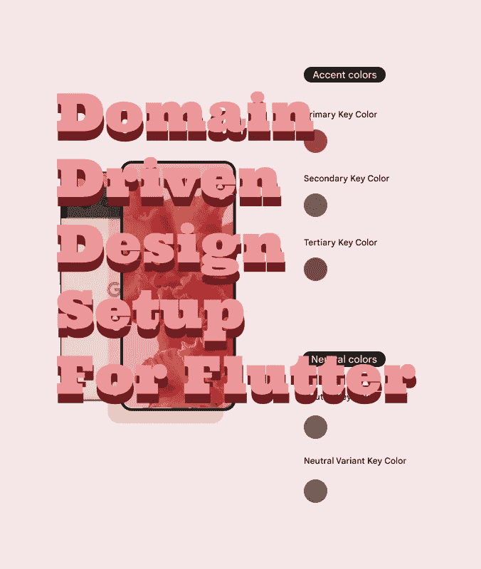

# 颤振的领域驱动设计设置

> 原文：<https://betterprogramming.pub/domain-driven-design-setup-for-flutter-2d621f24f8b4>

## 在你的 Flutter 代码库中开始域驱动设计



这是颤振领域驱动设计的示例设置。我使用 Flutter skeleton 应用程序来简化事情。我们开始吧。

# **核心或域驱动设计**

领域驱动设计的核心概念是使用值对象作为与组件和层通信的原子单位。这一次，我们将创建一个非常简单的值对象:

你会注意到我们把它标记为不可变的，并且它使用了一个等价的 mixin。所以当我们用它作为基类时，它也倾向于成为一个值对象:

首先，让我们实现它:

现在让我们把它扩展成一个`Model`:

然后是`SampleItemModel`实现:

现在让我们看看如何测试它:

我使用 mocktail 进行模拟，但是`mockito`也有相同的基本 API，下面是模拟:

而`Model`嘲弄道:

然后测试将会是:

现在，记住，它是一个骨架应用程序，只有一个 listview 模型，没有用户输入。

此外，没有访问任何非本地 API 的逻辑。因此，剩下要添加的是一个数据源、一个单一用例以及列表视图模型。所以我们来补充一下。

# **完成示例**

让我们从实现列表视图模型开始:

单元测试应该是这样的:

现在我们需要一个列表视图模型的数据源:

对于数据源、存储库和用例的接口，我们使用了`Dartz`包:

现在，让我花点时间谈谈错误和异常。现在让我问一下，为什么我没有在这里使用异常？两个关键原因。

第一，任何时候抛出一个错误，它都会给出堆栈跟踪。

第二，显然我们正在规划我们的领域层，这样我们就不会抛出应用程序停止异常。因此，我需要使用一个`Error`类，而不是一个异常类:

因此，对数据源的单元测试是:

嘲弄:

和单元测试:

最后我们有一个用例:

界面:

以及具体实现:

单元测试是:

# **前进**

现在，我不再讨论如何连接视图模型，但是如果您遵循带有服务组件和控制器的设置视图的模式，那么添加它就有些容易了。但是缺少了什么呢？

我保持简单，没有添加 DDD 的其他部分，即其余的值对象机制和事件调度。

另一个值对象机制与将实体更改为`ValueObject(Types)`以及设置验证器和其他集成有关。然后将其扩展到事件状态值对象，并为用例、数据源、repo 和视图模型创建事件调度程序。

简而言之，状态管理布线。相比之下，在 Flutter 中的 Clean Arch 中，通常只需使用 BLoC 或 Redux 连接视图模型进行状态管理。

# **结论**

这是领域驱动设计的一些核心。接下来是创建更复杂的值对象和事件调度。示例代码可在以下报告中找到:

[](https://github.com/fredgrott/equatable_ddd_modeling) [## GitHub-Fred grott/equatable _ ddd _ modeling:使用 equatable 和 DDD 的颤振演示项目

### 一个 Flutter 演示项目，展示了如何使用等价值对象作为接口和实现之间的粘合剂…

github.com](https://github.com/fredgrott/equatable_ddd_modeling) 

我贡献的一些 Flutter 社区插件有:

*   [Flutter _ platform _ widgets | Flutter 包](https://pub.dev/packages/flutter_platform_widgets)
*   [捕手|扑包](https://pub.dev/packages/catcher)

```
**Want to Connect?**Follow me on [Twitter](https://twitter.com/fredgrott). You can also stay updated with my latest Flutter sprints available in this [GitHub Repository](https://github.com/fredgrott/fredgrott_in_depth_flutter).
```

# 资源

一些有用的资源(图书链接指向 archive org 免费 pdf 和图书借阅):

*   [材料设计 3(材料你)规格](https://m3.material.io/)
*   [尼尔森诺曼集团](https://www.nngroup.com/)是 UI 设计领域最顶尖的研究小组之一。一些信息是付费的，但是仍然有一个很好的免费的基础来查看和使用。
*   [唐纳德·诺曼的日常事物](https://archive.org/details/pdfy-9Bb1XUCNFvb5HrMP)
*   [雅各布·尼尔森的可用性工程](https://archive.org/details/usabilityenginee00jak_pv3)
*   罗伯特·马丁的《洁净的拱门》的概要见此处的[要点。](https://gist.github.com/ygrenzinger/14812a56b9221c9feca0b3621518635b)
*   [InfoQ 领域驱动设计快速总结(PDF)](https://matfrs2.github.io/RS2/predavanja/literatura/Avram%20A,%20Marinescu%20F.%20-%20Domain%20Driven%20Design%20Quickly.pdf)
*   贝蒂·爱德华兹教授的掌握调色艺术的课程
*   [斯科特的飞镖设计图案 GitHub repo](https://github.com/scottt2/design-patterns-in-dart)
*   [约瑟夫·穆勒的平面设计网格系统](https://archive.org/details/GridSystemsInGraphicDesignJosefMullerBrockmann)
*   [字体存档](https://oa.letterformarchive.org/)
*   斯蒂芬·科尔解剖六个字母的字体(是的，这是斯蒂芬·科尔的网站，那里还有其他宝石)
*   [类型细节](https://typedetail.com/)
*   [标志设计大卫·艾雷的爱情](https://archive.org/details/logodesignlogodesignlove)
*   [AIGA 设计档案馆](https://designarchives.aiga.org/#/home)
*   [戴夫·特洛特的掠夺性思维概述:超越竞争的大师级人物](https://wisewords.blog/book-summaries/predatory-thinking-book-summary/)
*   [Bartosz Milewski 的 PDF 格式程序员范畴理论(即函数式编程和 OOP 类型理论)](https://github.com/hmemcpy/milewski-ctfp-pdf/releases/download/v1.3.0/category-theory-for-programmers.pdf)
*   [分类讲义和书籍资源](https://www.logicmatters.net/categories/)