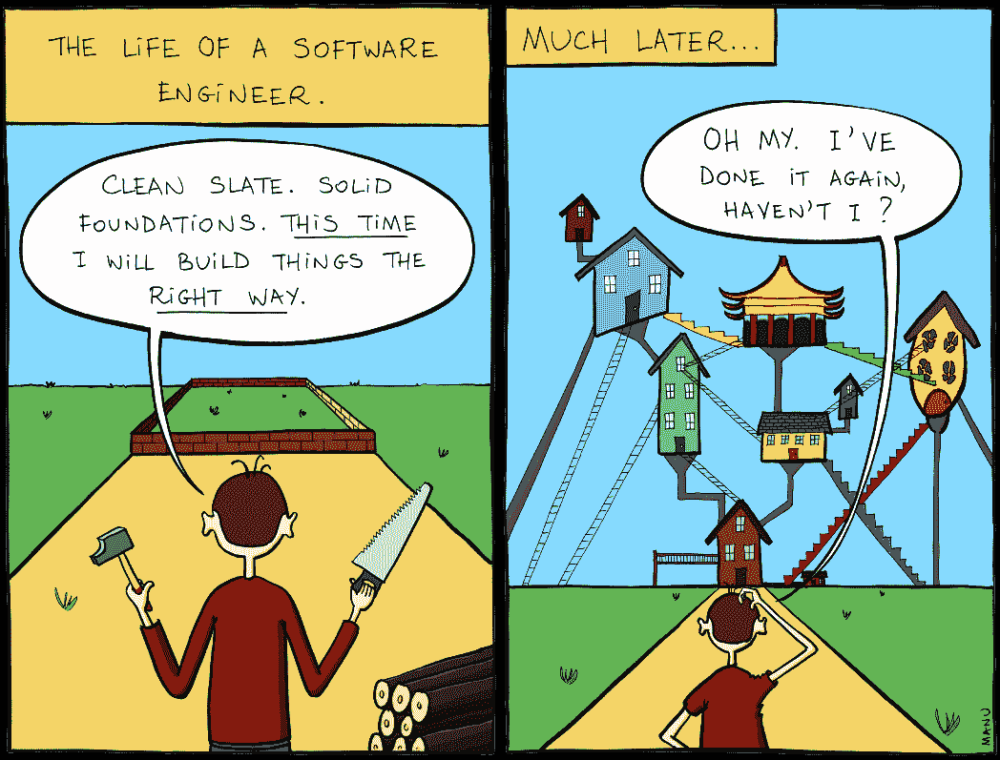
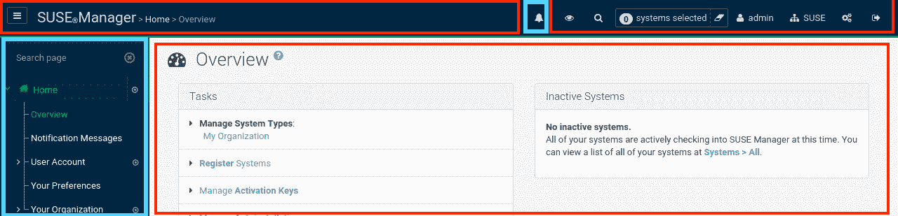
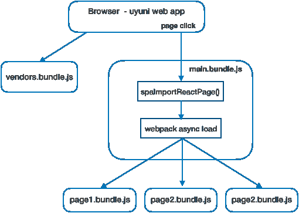
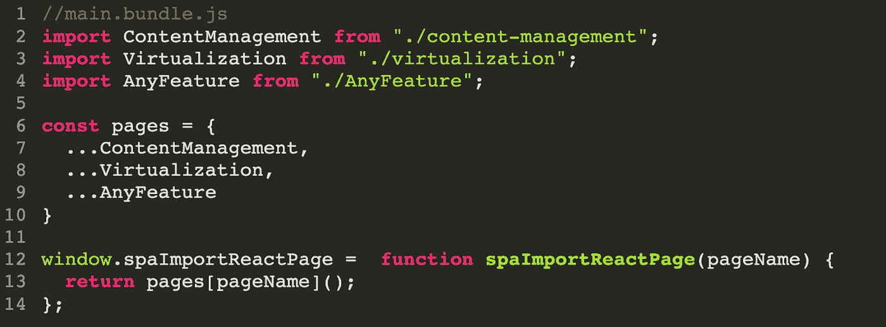
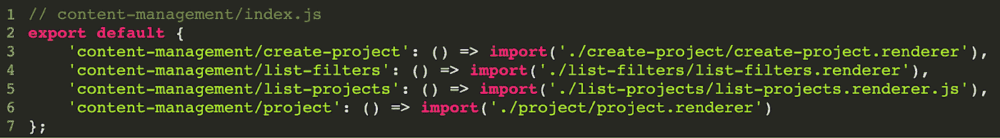
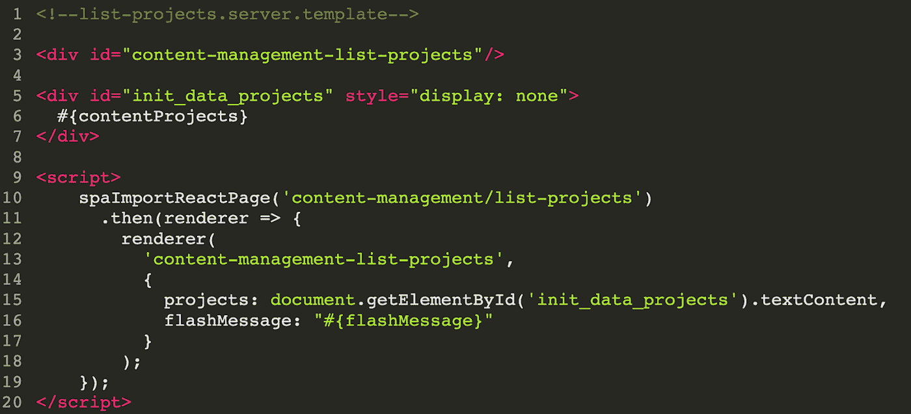
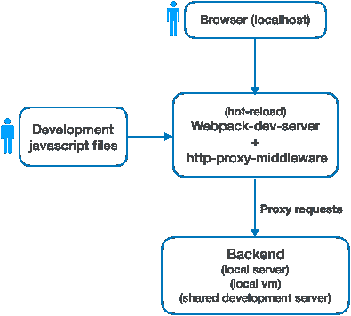
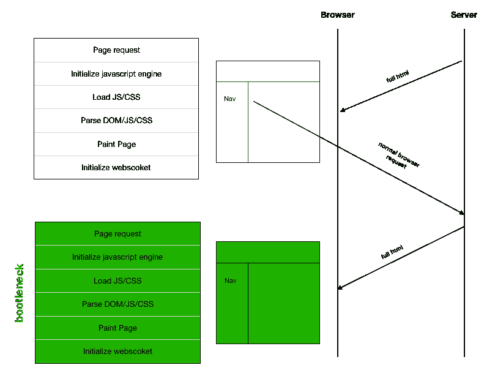
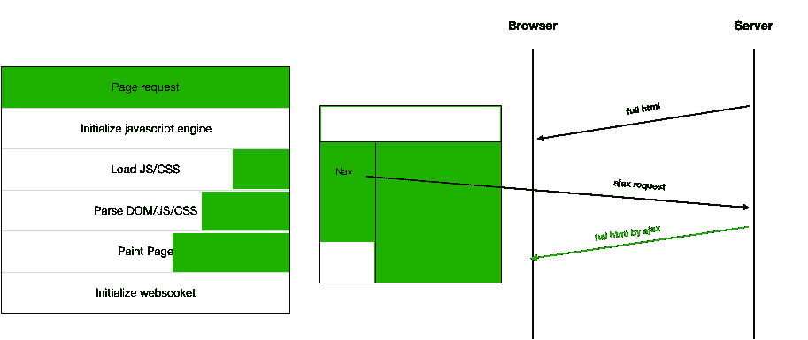
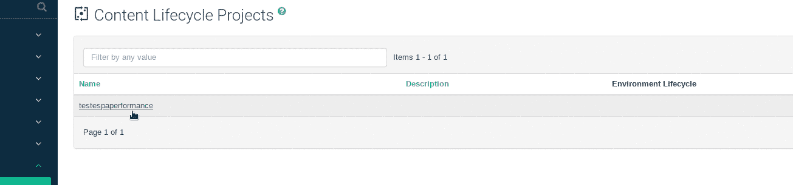

# 如何在旧应用中逐步引入 React.js 并迁移到 SPA

> 原文：<https://betterprogramming.pub/dont-be-afraid-of-legacy-how-to-gradually-introduce-react-js-in-a-really-old-application-79876c0dfa42>

## 不要害怕遗产

[来源](https://me.me/i/much-later-the-life-of-a-software-engineer-clean-slate-8712be55ea2c41f2bf6fd85feb386dab)

大多数开发人员的梦想之一是从零开始一个项目，在这个项目中，legacy 不在字典中，一切看起来都很美好。

仅仅因为这是一个愿望和最好的情况，并不意味着它是所有情况下的最佳选择。我无法告诉你我见过多少重构比最初的更糟糕。遗留应用程序可能有许多历史细节，如果没有正确的项目经验、时间和资源带宽，这些细节可能会被简单的视图所忽略。

在这篇文章中，我将介绍我们如何将 [Uyuni](https://github.com/uyuni-project/uyuni) 与 React.js 集成，并将其从缓慢的多页面应用程序转换为快速的单页面应用程序(SPA)的用例。

# 用例

Uyuni 是一个已有 15 年历史的应用程序，是广泛使用的 SUSE 管理器的上游社区项目。可以想象，一个存在时间如此之长的应用程序，有着大量的遗留技术和庞大的代码库。在某一点上，我们必须决定哪些策略是最合适的，以便不落后，并根据新的趋势和用户需求不断发展产品。

如果你想在引入新技术的同时不断推出新功能，你应该迭代地去做；否则，你会很难过。

说到前端技术，一般来说，有一些规则我相信可以帮助你不被锁定在某个特定的技术上。例如，**永远三思**当:

*   添加新库。仅仅因为这会为你节省几天时间，并不意味着从长远来看它是值得的。
*   将您的业务逻辑耦合到特定的框架。如果你的所有逻辑都是完全独立的，并且只依赖于语言的原生特性，那么你使用哪个框架都没有关系，不管是 React.js、Vue.js 还是 Angular:代码应该是可重用的。

在 Uyuni 中，为了使我们的 UI 和技术栈现代化，我们决定选择 react . js。react . js 团队在使其易于集成到现有应用程序方面做得很好。查看官方的[文档](https://reactjs.org/docs/add-react-to-a-website.html)，我们可以看到在页面中间添加 React.js 非常简单，只需定义一个新的 HTML 元素 id 作为我们新应用程序的容器/根，并简单地调用方法`ReactDOM.render` ( `<App />`，`htmlContainer`)。这种方法有一个很多人都不知道的巨大好处，那就是您可以在同一个页面上根据需要多次执行它，这非常方便。

我们遵循的策略是利用这种方法的灵活性开始引入独立的 React.js 树。通过这种方式，我们可以逐步实现新的功能，并重构 UI 的旧部分。在下图中，蓝色框现在使用 React.js，红色框仍然使用传统的服务器端呈现的 JSP 堆栈。

有了这个结构，我们可以根据需要逐步将 React.js 添加到更多的页面中。

好了，一切看起来简单明了！但是我们有丰富的用户界面。如果这些独立的部分需要互相通信会怎么样？我们如何捆绑所有这些小应用并从服务器注入数据？

在我们的例子中，这种通信和共享状态仍然是通过服务器完成的。即使使用客户端呈现引擎，每次页面点击仍然会返回一个完整的服务器页面。这也有助于更快地呈现第一页，因为所有需要的信息都可以在一个请求中获得——尽管有时我们也依赖 JSON API 来获得更动态的页面。

为了注册这些新应用并从服务器端模板技术向它们注入数据，我们利用了新的 ES6 特性动态导入及其在 webpack 中对代码分割的支持。

使用这种策略，webpack 将为每个 React.js 应用程序自动创建一个新的包文件，只有在加载应用程序时才会获取这个包文件。Uyuni 只需要知道`main.bundle.js`文件，该文件将导出一个能够加载任何注册应用程序的全局函数。

*main.bundle.js —通过全局函数 spaImportReactPage* 引导任何应用程序所需的基础代码

*为其 JS 捆绑包注册新应用和入口点*

这样，从任何服务器端模板技术通过名称异步加载任何已注册的 React.js 应用程序将变得简单。方法`spaImportReactPage`将返回一个带有渲染器函数的承诺，该函数可用于在任何地方渲染我们的应用程序，并向其中注入一些初始状态。

*html 模板中函数 SpaImportReactPage 的用法示例*

注意:请记住，这段代码是在 HTML 中内联执行的，没有任何代码转换。因此，如果您需要支持像 Internet Explorer 这样的旧浏览器，您可能需要为 promises 添加一个 polyfill！

# **开发周期更快**

我们面临的另一个问题是，即使有了更新的堆栈，我们也无法使用绿色 React.js 应用程序可以拥有的快速开发，例如即时重新编译或热重新加载。由于页面不是完全独立的，仍然依赖于 web 服务器来注入数据和呈现遗留部分，我们仍然必须在服务器运行的任何地方部署这些新的部分。

令人高兴的是，这看起来比实际情况更复杂。使用 [webpack-dev-server](https://github.com/webpack/webpack-dev-server) 和 [http-proxy-middleware](https://github.com/chimurai/http-proxy-middleware) ，我们可以拥有一个本地 webpack 服务器来完成重新编译我们的 JavaScript 更改和热更新的所有魔法。通过这种方式，我们可以从本地环境中提供所有更新的文件，但仍然可以代理所有与前端无关并依赖于后端服务器的内容。它可以是本地开发服务器，也可以是远程共享测试服务器。因此，如果您只需要在前端工作，就没有必要像以前一样安装整个后端，并且仍然可以享受所有令人敬畏的 webpack/hot-reload 特性。

请随意查看我们的 webpack 代理配置:[https://github . com/uyuni-project/uyuni/tree/master/web/html/src/build](https://github.com/uyuni-project/uyuni/tree/master/web/html/src/build)

# **单页应用**

尽管有了更新的堆栈和快速的开发周期，我们仍然对最终的结果不太满意。因为我们仍然有一个旧的多页面架构风格，每次用户点击一个新的页面，就会发生一次完整的刷新。尽管这种架构可以用于更简单、动态性更低的 web 应用程序，但在我们的例子中，它影响了使用 UI 的整体体验。

很明显，改进这种行为的正确方向应该是从多页面转向 SPA 架构。当从头开始一个新的应用程序时，这可以通过开发一个独立的前端应用程序来实现，该应用程序通过 [react-router](https://github.com/ReactTraining/react-router) 使用客户端路由控制所有页面，并从 JSON/graphql API 获取所有需要的数据。然而，如果没有巨大的重构，将现有的遗留应用程序迁移到这种风格是不可行的。

绿色区域代表新页面上的成本

经过一些研究和考虑，我们决定使用一种更实用的方法，遵循多页面和 SPA 之间的混合架构风格。基本上，我们的想法是，我们的路线是由链接本身定义的，服务器一直以同样的方式呈现所有的完整页面。但是我们并没有完全刷新页面，而是通过 Ajax 调用获取相同的链接 URL，只替换页面上需要的部分。这可以在初始化新的 JavaScript 引擎、获取和解析公共资源以及绘制未更改的部分时节省大量时间。这也有助于避免在每个页面上重新连接 WebSocket 连接。

在尝试了我们自己的解决方案和一些现有的开源库之后，我们决定将我们的解决方案基于库 [Senna.js](https://sennajs.com) 之上。其他被考虑的库是 turbolinks 和 pjax，但是它们不能满足所有的需求。

我们面临的主要挑战是:

1.  修改表现不佳的代码，这在每次页面转换时都会造成内存泄漏
2.  确保 React.js old trees DOM 结构完全卸载

无论如何，与架构重构相比，所需的工作量是最小的。

绿色区域代表新页面上的成本

随意看看我们与 Senna.js/SPA:[的主要配置 https://github . com/uyuni-project/uyuni/tree/master/web/html/src/core/spa](https://twitter.com/luis_neves12)

# 让过渡变得更好

所有这些工作为未来许多可能的改进打开了大门。因为我们有一个 SPA，不需要每次点击都刷新页面，所以我们现在可以很容易地改善页面之间的过渡，无论是速度还是流畅度。

在添加了这个新的 SPA 引擎之后，我们开始注意到一些过渡看起来有点笨拙。尽管两个旧页面之间的转换看起来流畅而快速，但是在两个反应页面之间，可以注意到一个白色闪烁的页面。

因为 React 渲染是在客户端完成的，所以这种行为是意料之中的。Senna.js 无法猜测新页面何时可以过渡到。基本上，当旧页面被删除并且新页面已经安装在屏幕上时，就会出现白屏，但 React.js 仍处于完成第一次初始渲染的过程中。这在旧页面中不会发生，因为当新页面到达浏览器时，它已经在服务器中呈现了。

好的一面是 Senna.js 的转换行为很容易扩展。因此，我们不必使用同步默认转换。

**白屏图像:**旧页面- >删除旧页面- >过渡- >添加新页面- >白屏- >完成渲染

相反，我们可以将其扩展为异步的，只在渲染完成时显示新页面，将旧页面作为占位符。基本上，它会在屏幕上呈现两个页面，只有当一切准备就绪时，才会显示新页面。

**异步转场图像:**旧页面- >添加新页面- >完成渲染- >移除旧页面- >完成转场

当读取碰巧利用了所有页面都是通过 Ajax 读取的这一事实时，可以在时间上做额外的工作。默认情况下，当用户单击一个链接时，就会进行获取。

但是，这是可以优化的。例如，我们可以在用户鼠标悬停在某个链接上几秒钟时显示出点击该链接的意图时开始获取页面，或者(甚至更极端)在鼠标按下时开始获取页面。click 事件仅在鼠标抬起事件之后发生，因此由于硬件限制，我们可以在鼠标按下和鼠标抬起事件之间节省几毫秒的时间。在用这个策略做了一些测试之后，我们注意到每次转换都有大约 100 毫秒的改进。

# 结论

总而言之，即使我们还有很大的改进空间，我们对迄今为止的努力还是很满意的。与之前相比，我们离拥有一个看起来像本地桌面应用的 web 应用越来越近了。即使有了所有这些改进，我们也没有大的架构重构。这可能是有价值的，特别是在大多数开发人员都关注后端的产品中，因此减少了前端新贡献的摩擦。

如果你想进一步讨论什么，请随意发表评论。