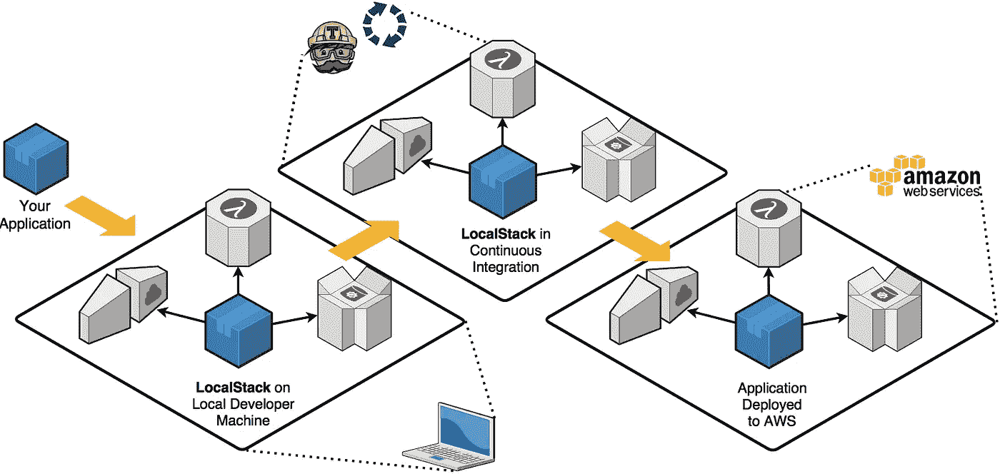

# 不要害怕——学习如何使用 LocalStack 在本地机器上运行 AWS

> 原文：<https://betterprogramming.pub/dont-be-intimidated-learn-how-to-run-aws-on-your-local-machine-with-localstack-2f3448462254>

## 节俭的程序员指南，利用 AWS APIs 而不打破你的银行账户


奥米德·阿明在 [Unsplash](https://unsplash.com?utm_source=medium&utm_medium=referral) 上的照片

AWS 云几乎已经成为一种规范，全球超过[100 万家企业](https://techcrunch.com/2015/10/07/amazons-aws-is-now-a-7-3b-business-as-it-passes-1m-active-enterprise-customers/)在其上构建应用。在你的职业生涯中，在某个时候，你必须或将要在这个生态系统中部署一些东西:这是不可避免的，这表明 AWS 的覆盖范围有多远。

尝试在云中构建的最大挑战之一是可供您使用的服务数量和移动部件的数量。通过 UI 构建应用程序很简单的日子已经一去不复返了:一些业务逻辑、一个数据库和一个域，然后就万事大吉了。现在，我们拥有承诺永久可伸缩性的服务，几乎可以满足您的任何需求。

让我们以 AWS 无服务器架构为例。它承诺易于使用，但配备了 N 个移动部件来工作。如果你构建一个简单的 lambda 函数，你最终不得不使用混合服务，比如 CloudWatch、S3、IAM、Kinesis、Step 函数等等。

当使用 AWS 时，使您的开发环境看起来像生产环境是很困难的，特别是当您受到组织约束的时候——这些约束通常是与安全相关的或者是与成本相关的。因为大多数服务都是黑盒，所以必须部署以进行测试是很麻烦的；当事情不顺利时，这确实让生活变得有点挑战性。

# LocalStack 到底是什么？

[LocalStack](https://github.com/localstack/localstack) 是 Atlassian 的一个开源项目，它提供了一种直接从本地主机开发 AWS 云应用程序的简单方法。它在您的本地机器上构建了一个测试环境，该环境提供了与真实的 AWS 云环境几乎相同的奇偶校验功能和 API，只是缺少了可伸缩性、健壮性和一大堆魔力。



来源[https://localstack.cloud/](https://localstack.cloud/)

这是通过嘲讽/测试工具的组合来完成的，主要是[kine salite](https://github.com/mhart/kinesalite)/[dyna lite](https://github.com/mhart/dynalite)和 [moto](https://github.com/spulec/moto) 。虽然 LocalStack 是用 Python 编写的，但是它是语言无关的，因为所有服务都是通过 HTTP 服务公开的，所以您几乎可以使用任何语言来与它交互，就像您使用 AWS 一样。

最初，我对 LocalStack 的担心是它不具备与 AWS 同等的功能。我意识到你当地的环境不一定是一对一的；它必须足以确保你覆盖所有的用例。

它有助于您专注于完成工作中最重要的事情，而不是解决基础架构的问题，以及与把关人员争夺 AWS 访问权限。我相信如果一个工具可以帮助你在降低成本的同时减少复杂的分布式系统中的错误数量，那么作为你的核心本地开发工具的一部分是非常值得投资的。

# 对 AWS 看门人又爱又恨

根据您的环境的性质，有时 AWS 服务可以被排他地限制，并保留给几个看门人。不要误解我——守门人是确保开发人员不会搬起石头砸自己的脚所必需的。毕竟他们有成本能见度。虽然它有时可能是好的，但当有太多限制时，这意味着一个人探索 AWS 产品的能力有限。

我在 AWS 工作的一个项目是核心堆栈，SQS 是我们应用程序的唯一入口。在早期，我们求助于为不同的开发者创建 SQS 管道。这导致了队列的指数级增长，因为每个开发人员必须被授予 x 数量的队列以防止消息传递冲突。

在杰夫·贝索斯的世界里，每个字节都有一个美元值。使用 AWS 进行本地开发会很快变得昂贵，特别是如果这些服务总是处于空闲状态，而这通常是大部分时间。我们可能不想承认这一点，但这些只是事实。问自己一个问题:为了在开发环境或 QA 环境中运行您的应用程序，您实际上需要访问 EC2 实例多少次？

其中一些环境不需要服务一直运行。无服务器在这方面有所帮助，但也使测试变得困难。因此，按需提供这些服务是有意义的。如果您打算在特定的日子或者特性发布的时候运行测试，那么在最需要的时候提供服务是有意义的。

我的团队的 LocalStack 解决了其中的一些问题，因为人们可以端到端地构建 AWS 本机应用程序，而不必直接集成到一个实际的 AWS 帐户中。

在这篇文章中，我将向你展示一些我是如何做到这一点的例子。

# 先决条件

1.  安装 Docker，如果你还没有的话。
2.  安装[无服务器](https://serverless.com/)框架。
3.  安装 [AWS CLI](https://aws.amazon.com/cli/) 。尽管我们不打算使用真正的 AWS，但这是与 LocalStack 交互所必需的。
4.  [awscli-local](https://github.com/localstack/awscli-local) ，命令行接口周围的一个薄薄的包装器，与 [LocalStack](https://github.com/localstack/localstack) 一起使用，是可选的。

# 设置

LocalStack 有两种安装方式:直接安装，比如下面的例子，或者使用 Docker。如果您正在使用 direct `pip install`，请确保您正在新的虚拟环境或 conda 环境中运行 pip。

```
$ pip install localstack
```

要用 Python 启动 LocalStack，可以执行下面的命令。

```
$ localstack start
```

我们将采用 Docker 方法，因为这可以让每个参加这个练习的人拥有相同的一致的工作环境，而不用考虑操作系统。

本文假设您对 Docker 有初步的了解，并且您的机器上已经安装了一个副本。如果你不知道，在继续之前最好先温习一下。

# 一切开始的地方:合成文件

创建一个新的`docker-compose.yml`文件，或者将以下内容添加到现有的`compose-file`中。

docker-compose.yml

在与您的合成文件相同的根级别中创建一个名为`data`的目录。我们将使用这个`data`文件夹挂载到我们的`tmp/localstack`目录。目录将被栈用于持久数据，用于诸如 Kinesis、DynamoDB、Elasticsearch、S3、Secrets Manager、SSM、SQS 和 SNS 等服务。

启用此目录可以确保在重新启动或堆栈失败的情况下，您的持久化数据不会丢失。

```
./bin:/docker-entrypoint-initaws.d
```

在与您的`docker-compose.yml`文件相同的级别创建一个 bin 文件夹和 bash 文件:`/bin/localstack-entrypoint.sh` **。**因为如果你不为企业版支付一些钱，LocalStack 就不能提供有意义的 UI，所以`localstack-entrypoint.sh` bash 脚本文件将用于在我们的 LocalStack 中创建服务和资源，比如 S3 文件、数据库表等。，在本地堆栈启动时。

如果您对编写 bash 脚本没有信心，您也可以直接从`localstack-entrypoint.sh`中执行 Python 脚本，只要这些脚本放在同一个文件夹中或者直接利用 [AWS CLI](https://aws.amazon.com/cli/) 。如果您希望针对您的 LocalStack 环境运行特殊命令，我们将在下面的脚本中看到如何实现这一点。

localstack-entrypoint.sh

LocalStack 要求设置凭证，但是在开发的这个阶段，框架没有使用 IAM 身份验证机制进行任何真正的身份验证。无论您提供哪个凭据，LocalStack 都将接受它们，而不需要进行验证。始终确保遵守安全最佳实践，并且不要将真正的 AWS 密钥强加到版本控制中。

## `LocalStack ports '4563-4599:4563-4599'`和`'8080'`

当您的 Docker 容器启动时，LocalStack 将打开上面的`docker-compose.yml`文件中定义的端口，其中左边的数字将您主机上的端口与右边的容器端口绑定在一起。在大多数情况下，这两个数字可以相同，例如`8080:8080`。如果您在右边的端口上运行了其他东西，那么您可能需要将默认值更改为`8086:8080`。例如，打开你的浏览器`http://localhost:8086`会路由到你的容器`8080`。

行`'4566-4599:4566-4599'`做同样的事情，但是绑定了整个范围的端口。这些端口号是 LocalStack 用作各种 API(如 S3、RDS、API 网关等)的端点。

需要注意的是，如果你不在网络防火墙后，上述端口可能会暴露给外界。您始终可以选择仅绑定到主机`127.0.0.1:8080:8080`。

# LocalStack 环境变量

LocalStack 有相当多的环境变量在启动时提供给 LocalStack 容器。

*   `SERVICES=s3`:您可以定义一个逗号分隔的 AWS 服务列表来模拟。每个服务可以启动另一个 docker 容器来服务这样的请求。
*   `DATA_DIR=/tmp/localstack/data`:这是 LocalStack 内部保存数据的目录。在接下来的章节中会有更多的介绍。

## `Volumes`

`'./data:/tmp/localstack'`

Docker 容器不存储状态，唯一的方法是通过卷，它访问硬盘的一部分。`./data`是相对于你的`docker-compose.yml`文件。你可以自由定义任何你想要的其他路径。

上面的 compose 配置足以让您入门。为了启动，您的 LocalStack 环境通过 Docker compose 在与您的`docker-compose.yml`文件相同的位置执行下面的命令。您可以在末尾添加`-d`参数，将 LocalStack 作为后台守护进程运行。

```
$ docker-compose up
```

当 docker-compose up 运行时，请查看您的控制台。您将能够看到 LocalStack 已经创建了一个文件:

```
../data/data/recorded_api_calls.json
```

前面我们谈到了存储文件的 LocalStack `tmp`目录。这种持久性是通过自动创建`recorded_api_calls.json` 文件来实现的，该文件便于回放先前运行的 AWS 服务调用**。**

当容器重新启动时，它将重新应用这些调用。这就是我们能够在重启之间保存数据的方式。一旦我们开始上传，我们将不会在此目录中看到新文件。相反，我们的上传将作为字节原始数据记录在这个文件中。如果您想与他人共享容器的状态，您可以将该文件包含在您的 repo 中——但是根据您上传的量，该文件可能会很快变得非常大。

如果您希望以后能够恢复您的存储桶，您可以备份该文件。当您准备好恢复时，只需删除更新的文件，用您的备份替换它，并重新启动您的容器。

# 在 Docker 外部访问您的 LocalStack

如果你花了一点时间在 AWS 上，你会意识到当你有超过一个 AWS 帐户的访问权或者当你有超过一个访问权和密钥时，为了安全和管理你的密钥，需要使用[命名概要文件](https://docs.aws.amazon.com/cli/latest/userguide/cli-configure-profiles.html)。

让我们定义一个名为 *localstack* 的新的命名概要文件，这样我们就可以对 localstack 环境执行 AWS CLI 命令，其中~引用了`$HOME`目录。

**~/。AWS/凭证**

```
[localstack]
aws_access_key_id = foo
aws_secret_access_key = bar
```

**~/。aws/config**

```
[profile localstack]
region = us-east-1
output = json
```

如果您的 LocalStack 正在运行，那么您的每个 AWS CLI 命令现在都可以由`endpoint-url`参数组成，这可以确保您的命令与我们为伪造身份验证而创建的命名配置文件一起针对您的 LocalStack 执行。

```
$ aws --endpoint-url=http://localhost:4572 s3 ls "s3://nyc-tlc/trip data/" --profile localstack
```

# 将 LocalStack 与 SQS 一起使用

下面的例子说明了如何使用 boto3 SQS 连接到本地堆栈。如果您使用其他编程语言，同样的原则也适用。

具有本地堆栈的 SQS

Node.js 等效项:

```
var AWS = require(‘aws-sdk’);
*// Create an SQS service object using localstack endpoint*
var config = {
  endpoint: new AWS.Endpoint('http://localhost:4576'),
  accessKeyId: 'foo',
  secretAccessKey: 'bar',
  region: 'us-east-1'
}
var sqs = new AWS.SQS(config);
```

使用 Java，我们可以实现类似的东西:

```
import software.amazon.awssdk.regions.Region;
import software.amazon.awssdk.services.sqs.SqsClient;
import software.amazon.awssdk.services.sqs.model.*;

import java.net.URI;

public class Sqs {

    private SqsClient client;

    public Sqs(URI endpoint) {
        client = SqsClient.builder()
                .region(Region.US_EAST_1)
                .endpointOverride(endpoint)
                .build();
    }
}
```

# 将 LocalStack 与 Dask 一起使用

[Dask](https://dask.org/) 是您工具箱中的必备工具，如果您打算在数据科学解决方案中进行相对中等规模到大规模的数据处理。本质上，您只需编写一次代码，Dask 就会处理如何将您的工作分配给多个处理器或节点，同时管理超过内存的计算。在 LocalStack 上测试 Dask 是很简单的，只要您确切地了解需要在哪里进行更改，如下例所示。

具有 Dask 配置的本地堆栈

您需要确保显式定义了`storage_options`和`endpoint-url`，这样 boto3 就知道您的 LocalStack 位于哪里。

```
os.environ['LOCALSTACK_S3_ENDPOINT_URL'] = 'http://localstack:4572'
```

注意`LOCALSTACK_S3_ENDPOINT_URL`是如何指向 LocalStack 的，这是给 LocalStack Docker 实例的默认 DNS。Dask 对本地文件存储做了大量的持久化工作，因此 Dask 代码与 docker 容器在同一个网络中运行是很重要的。为了更好地说明所有部分是如何连接的，您可以参考本文末尾的 GitHub 链接。

# 如何以最简单的方式在本地堆栈中创建 Lambda 函数

如果你不喜欢编写 CloudFormation YAML 文件，serverless 是一个替代选项，它可以让你轻松部署你的 lambda 函数。

在不详细介绍无服务器如何工作的情况下，下面的`serverless.yml`配置文件应该让您了解部署具有 HTTP 功能的 API 网关需要什么。custom - > localstack 部分定义了将本地 lambda 函数部署到 localstack 所需的所有配置。

无服务器. yml

lambda 函数演示了一个简单的函数，它返回带有当前时间戳的“Hello World”。

```
def endpoint(event, context):
    current_time = datetime.datetime.now().time()
    body = {
        "message": "Hello, world",
        "eventTime": str(current_time)
    }
    response = {
        "statusCode": 200,
        "body": json.dumps(body)
    }
    return response
```

上面的`serverless.yml`文件将为我们完成所有繁重的工作，比如创建 lambda 包，将它上传到我们的 LocalStack，提供任何需要的额外资源，比如 API-gateway。它不会自动为我们做的一件事是 S3 桶创建。因此，使用 bucket creation 命令更新您的`localstack-entrypoint.sh` 或者在堆栈运行时手动执行一次是很重要的。

```
*#* Create lambda deploy bucket for our simple http endpoint example$ aws --endpoint-url=$LOCALSTACK_S3_URL s3api create-bucket --bucket simple-http-endpoint-local-deploy
```

在我们的`serverless.yml`文件中，我们使用`${self:service}-${opt:stage}-deploy`来代替硬编码的桶名。无服务器变量允许用户动态替换`serverless.yml`配置中的配置值。当为您的无服务器服务提供秘密时，或者当我们希望通过 stage 参数部署到多个环境(例如 CI、dev、QA 和生产)时，它们特别有用。

如果您的 LocalStack 在后台运行，您唯一需要做的就是执行下面的命令，该命令将调用 LocalStack 上的部署，因为您的 stage 参数指向您的本地。

```
$ serverless deploy --stage local  --profile localstack
```

要通过 LocalStack 上的无服务器执行 lambda 函数，可以执行以下命令:

```
$ serverless invoke --function currentTime --log --profile localstack --stage local
```

这会产生下面的输出。

无服务器部署预期输出

要通过 API Gateway 提供的浏览器调用 lambda 函数，我们可以执行下面的 URL，其中 API Gateway LocalStack 执行的 URL 模式如下:

```
http://localhost:4566/restapis/<apiId>/<stage>/_user_request_/<methodPath>
```

例如，如果我们省略了 profile 参数，并将 stage 更改为 dev profile，假设我们的默认 AWS 命名概要文件指向一个活动的 AWS 帐户，正常的活动部署序列将在该帐户上启动。

# 验证本地堆栈健康

一旦运行了本地堆栈，就可以通过点击以下 URL 来访问运行状况检查端点:

```
[http://localhost:4566/health](http://localhost:4566/health){
  "services": {
    "cloudformation": "running",
    "cloudwatch": "running",
    "iam": "running",
    "sts": "running",
    "lambda": "running",
    "logs": "running",
    "s3": "running",
    "sqs": "running",
    "events": "running",
    "apigateway": "running"
  }
}
```

请注意，rest API 调用的初始运行可能需要一些时间。端点将列出正在运行的服务的总数及其相应的状态。服务运行的位置取决于您在 LocalStack 环境变量中声明的位置。

```
SERVICES=s3,sqs,lambda,cloudformation,sts,iam,cloudwatch,apigateway,events
```

# 使用 awscli-local 实用程序更加本地化

到目前为止，我们一直使用默认的 AWS CLI。如果您不想在运行 CLI 命令时一直指定端点 URL，您可以选择使用 [awscli-local](https://github.com/localstack/awscli-local) 包。这是围绕 AWS CLI 的一个简洁的小包装器，它确保您运行的所有东西在默认情况下都在本地堆栈上运行。

## 如何创建 S3 存储桶

您可以使用以下命令创建一个名为“my-test-bucket”的 S3 bucket。如果您想列出您的 bucket 内容，授予 ACL 公共读取权限是很重要的。

```
$ awslocal s3 mb s3://my-test-bucket
```

您应该会在您的终端中看到“make _ bucket:my-test-bucket”*。验证存储桶是否已成功创建。*

```
*$ awslocal s3 ls*
```

# *本地堆栈陷阱*

*   *不能很好地协同工作的 LocalStack 参数，将存储桶持久化到挂载点，并试图通过将 lambda 压缩并复制到 LocalStack 存储桶来部署 lambda，将会抛出下面的错误。*

```
*2020-07-22T12:12:51:DEBUG:localstack.services.cloudformation.cloudformation_listener: Error response for CloudFormation action "CreateStack" (400) POST /: b'Unknown error: Please note that Lambda mounts (bucket name "__local__") cannot be used with LAMBDA_REMOTE_DOCKER=1 Traceback (most recent call last):\n  File "/opt/code/localstack/localstack/services/awslambda/lambda_api.py", line 954, in create_function\n    result = set_function_code(func_details.code, lambda_name)\n  File "/opt/code/localstack/localstack/services/awslambda/lambda_api.py", line 721, in set_function_code\n    lambda_cwd = lambda_cwd or set_archive_code(code_passed, lambda_name)\n  File "/opt/code/localstack/localstack/services/awslambda/lambda_api.py", line 676, in set_archive_code\n    raise Exception(msg % BUCKET_MARKER_LOCAL)\nException: Please note that Lambda mounts (bucket name "__local__") cannot be used with LAMBDA_REMOTE_DOCKER=1\n'
localstac*
```

*   *如果您对 LocalStack docker-compose 环境设置做了一些更改，最好删除您的`/data/data/recorded_api_calls.json`文件。我注意到在回放已执行的 API 调用时，它有时会崩溃。*
*   *在您的`docker-compose.yml`中，指定您想要使用的确切的 [LocalStack 镜像版本](https://hub.docker.com/r/localstack/localstack/tags)可能是一个好主意，而不是获取最新的版本。最新的标签使得很难跟踪哪个版本的映像正在运行，有时新的特性可能包含中断更改。*
*   *杰夫·贝索斯的动作很快，所以不要指望 LocalStack 能够跟上 AWS 的步伐——但它是免费的。*
*   *乍一看，您可能认为 LocalStack 本身是免费的，但有一些高级功能可能需要您支付一些费用。但是从我到目前为止所看到的来看，基础知识应该涵盖了你的大部分用例——开发人员也要吃饭。*

*`image: localstack/localstack:<TAG-VERSION-NUMBER>`*

*要了解更多您应该知道的问题，请参阅本地堆栈[故障排除](https://github.com/localstack/localstack#troubleshooting)提示的自述文件。意识到一些问题将会为您和您的团队节省大量调试时间。*

# *LocalStack 的替代方案是什么？*

*如果您觉得 LocalStack 不能满足您的某些需求，您总是可以选择使用模拟 SDK，这是常规的做法。如果您在设计类时考虑到了扩展，这种方法效果最好。*

*作为 S3 存储桶的替代选择，有一个 MinIO 可以直接替代 S3 云原生对象存储服务。*

*如果你正在为其他云服务构建，比如谷歌，你有其他选择，比如谷歌云[模拟器](https://cloud.google.com/sdk/gcloud/reference/beta/emulators)和谷歌的开源 FaaS ( [功能即服务](https://cloud.google.com/functions/docs/functions-framework))框架，用于编写可在本地机器上运行的可移植 Node.js 函数。如果你想要一种云原生的做事方式，混合搭配的方法可能会满足你的需求。*

# *最后的想法*

*在 AWS 上构建应用程序时，您需要控制架构的经济模型。如果你不小心的话，很容易陷入昂贵账单的永恒陷阱。*

*模仿在一定程度上是可行的，但是一旦你点击了部署按钮，它并不能真实地描述真实的现实。*

*LocalStack 是一个很好的起点，它为开发人员提供了一个实验和测试新代码的平台，而无需竭尽全力说服您的老板为什么他们需要每月支付数百美元来验证概念。在我看来，使用 LocalStack 方法是一种实用的方法，可以计算出将在 AWS 上运行的代码。*

*您可以尝试的一个小项目是用您最常用的 AWS 服务构建一个 boto3 或 AWS SDK 包装器，并通过环境变量或属性文件启用 LocalStack 切换功能。可以在 YAML 文件中配置 LocalStack 端点，如下所示。*

```
*endpoints:S3: [http://localhost:4572](http://localhost:4572)
  DynamoDB: [http://localhost:4569](http://localhost:4569)
  CloudFormation: [http://localhost:4581](http://localhost:4581)
  Elasticsearch: [http://localhost:4571](http://localhost:4571)
  ES: [http://localhost:4578](http://localhost:4578)
  SNS: [http://localhost:4575](http://localhost:4575)
  SQS: [http://localhost:4576](http://localhost:4576)
  Lambda: [http://localhost:4574](http://localhost:4574)
  Kinesis: [http://localhost:4568](http://localhost:4568)*
```

*请随意复制以下存储库，其中有更多示例供您参考:*

*[timothymugayi/local stack _ python _ examples](https://github.com/timothymugayi/localstack_python_examples)*

*使用 LocalStack 还可以做很多事情，这超出了本文的范围。我建议您花一些时间阅读 LocalStack GitHub 问题部分，以便熟悉一些高级设置和配置。*

*希望你喜欢这本书。请在下面的评论区分享你的想法。如果你觉得这篇文章会对下一个开发者有所帮助，那就继续吧。*