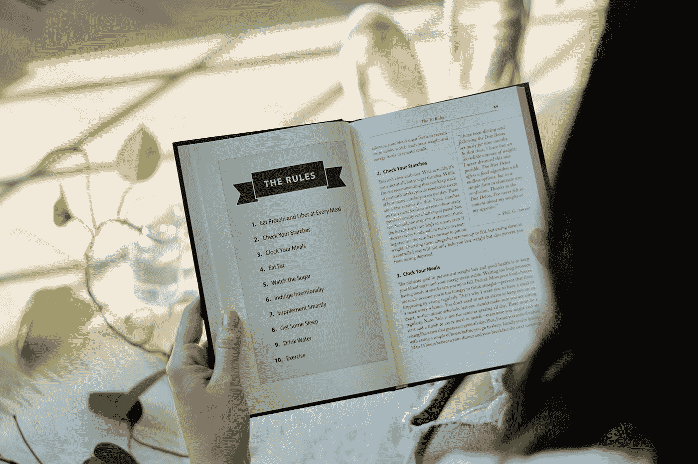

# 不要相信编程很难的荒谬想法

> 原文：<https://betterprogramming.pub/dont-buy-into-the-lunatic-idea-that-programming-is-hard-eef404de6164>

## 学习一门编程语言比你想象的要容易！

在 [Unsplash](https://unsplash.com?utm_source=medium&utm_medium=referral) 上由 [Helloquence](https://unsplash.com/@helloquence?utm_source=medium&utm_medium=referral) 拍摄的照片

学习编程语言可能是一项艰巨的任务。我是来告诉你事情没有你想的那么糟。从小到大，我一直认为将 Java、Python 和 C 视为“语言”是愚蠢的。但是现在我长大了，我意识到学习编程语言和真正的语言有很多相似之处。如果你在学习语言上有困难，那么现在这听起来可能更令人畏缩。然而，你仍然有希望，因为学习一门新的编程语言比学习一门新的口语容易 100 倍！

如果你不相信我，看看我的证件。首先，在过去的五年里，我已经学习了大约七种编程语言。我的口语经验一点也不令人印象深刻。在我整个 23 年的生活中，我已经学会了英语，初级水平的西班牙语，并且有一段时间我知道如何用意大利语说“嗨”。学习一门新的编程语言可能类似于学习一门口语，但令人震惊的是，这要容易得多。

照片由[本·怀特](https://unsplash.com/@benwhitephotography?utm_source=medium&utm_medium=referral)在 [Unsplash](https://unsplash.com?utm_source=medium&utm_medium=referral) 上拍摄

# 编程和说话的相似之处

每当我遇到会说三种语言的人时，他们总是告诉我，在学习了第二种语言之后，学习一种新的语言会更容易。他们告诉我，要学习一门新语言，你首先需要学会如何学习。这在编程中是完全一样的。

每种编程语言都由两部分组成:语法和句法。语法是这里最重要的部分，因为它跨越了多种语言。如果你学习西班牙语，更容易掌握其他浪漫的语言，因为它们都有相似的语法。你所要学习的就是特定的词汇来匹配特定的语法规则。这在代码中是完全一样的。

由[杰西卡·托托奥](https://unsplash.com/@jessicatootoo?utm_source=medium&utm_medium=referral)在 [Unsplash](https://unsplash.com?utm_source=medium&utm_medium=referral) 上拍摄的照片

如果你学习如何用 Python 编程，那么你将需要学习一些基本的编程语法原则。你将学习函数、变量、分支、类和同步/异步。一旦你学会了这些，用 Java 或 c 翻译这些相同的概念就非常容易了。你需要做的就是查找具体的语法。我今天还是这么做的！

我已经用 Java、C 和 Python 编程很多年了，但还是会忘记 Python 中函数的具体语法。我知道什么是函数以及它是如何工作的，但是我可能会忘记要使用的关键字。

> 那么，为什么学习一门编程语言会如此容易呢？

在 [Unsplash](https://unsplash.com?utm_source=medium&utm_medium=referral) 上由 [Kasya Shahovskaya](https://unsplash.com/@kasya?utm_source=medium&utm_medium=referral) 拍照

**编程语言比口语更容易学习有三个主要原因。**

1.  当你忘记语法时，你可以随时在现场查找。如果你在编程，那你就是在电脑上。如果你在电脑上，你很可能有互联网接入。因此，您可以随时查找语法。
2.  语法和句法规则比口语少。有些编程语言可能有 50 个你需要知道的关键词。没有人会认为仅仅学了 50 个单词就能流利地使用一门语言。
3.  **编程语言不说。对我来说，学习西班牙语最难的部分是说。我可以读和写，但是听和交流是另一回事。幸运的是，对于编码，我们不处理这个问题。代码总是要写的。**

如果你害怕学习编程语言，不要害怕。**编码实际上非常容易学习，有很多资源可以学习。学习这种东西不需要大学文凭。从我自己的亲身经历来看，大学只是给了我动力上的帮助。**

> 如果你有任何自我激励，那么你可以很容易地学会如何编码。

如果你想学习如何编程，但不知道从哪里开始，不要担心。我上大学前也是这样，因为我的恐惧，我什么也没学到。

编程的乐趣在于，一旦你学会了一门语言的基础知识，你就可以很容易地学会其他语言！

彼得·康伦在 [Unsplash](https://unsplash.com?utm_source=medium&utm_medium=referral) 上的照片

不过，有更简单的语言可以帮助你更快地学习这些技能。Python 只有 33 个关键字，而 Java 有 50 个。Python 很容易上手，并能让事情立刻发生。它也是几乎可以用于任何事情的最通用的语言之一。**但是……你完全可以把 Java 作为你的第一语言来学习，也可以学习同样的技能。**

编程真的没有看起来那么令人畏惧或者困难。这也很有趣！尤其是如果你喜欢解谜的话。我真的不知道为什么这个行业给我们这么高的工资！