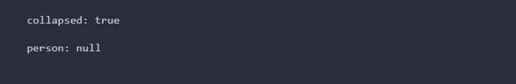
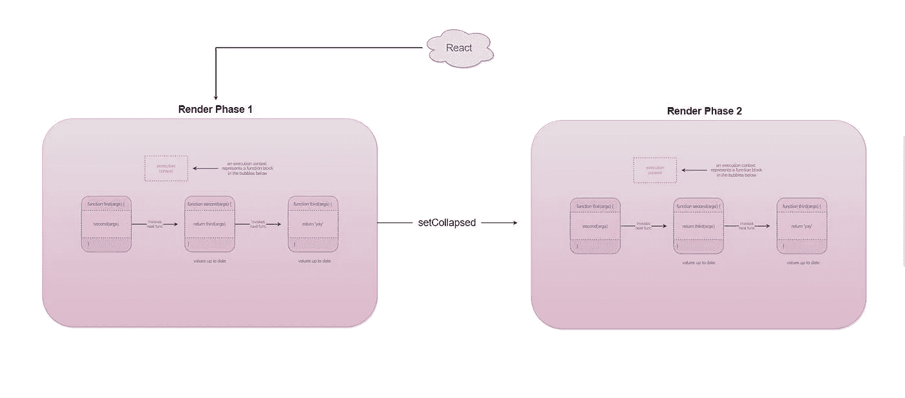
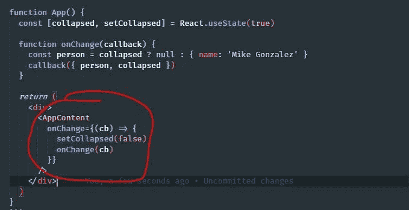
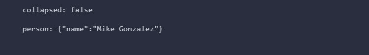

# 在 React 中不依赖于回调处理程序的状态

> 原文：<https://betterprogramming.pub/dont-depend-on-state-from-callback-handlers-in-react-167241a876ff>

## 把渲染阶段想象成小而孤立的世界

照片由[émile Perron](https://unsplash.com/@emilep?utm_source=unsplash&utm_medium=referral&utm_content=creditCopyText)在 [Unsplash](https://unsplash.com/s/photos/web?utm_source=unsplash&utm_medium=referral&utm_content=creditCopyText) 上拍摄

如果你是一名 React 开发人员，你可能会同意我的观点，使用 state 很容易成为你一天中最大的痛苦。

所以这里有一个技巧可以帮助你避免引入无声但灾难性的错误:*避免闭包引用回调处理程序的状态值*。

如果做得好，在回调处理程序中处理状态应该没有问题。但是，如果你在某一点上犯了错误，引入了难以调试的无声错误，那么后果就开始吞噬你一天中你希望可以收回的时间。

也就是说，我们要看看代码中的一个问题，它将向我们展示当我们使用状态时一个常见的有问题的场景。前面的代码示例将显示一个组件`App`。它将声明一个`collapsed`状态(默认为`true`)并呈现一个`AppContent`组件，该组件呈现输入元素:

当用户输入一些东西时，它会从 props 中调用它的`onChange`处理程序，该程序被定向到`App`。它接收`callback`参数，并将其`collapsed`状态设置为`false`，这样其子节点就可以展开来显示它们的内容。然后执行在`handleOnChange`(T10)中结束，传入`collapsed`和一个随机的`person`变量(是的，我知道是随机的),只有当 `collapsed`为`false`时，这个变量才会填充数据*。*

代码实际上运行良好，没有意外的控制台错误，生活是美好的。

实际上，在这段代码中有一个主要的问题。事实上，我们被抛出没有控制台错误，我们的代码没有被打破，使它成为一个危险的错误！

让我们在`handleOnChange`中添加一些`console.log`，看看我们会得到什么:

等等，为什么`person` `null`和`collapsed` `true`？我们已经将`collapsed`的状态值设置为`false`，我们知道这是有效的 JavaScript 代码，因为运行时能够顺利运行:

如果你理解 JavaScript 中的执行上下文，这是没有意义的，因为封装对`setCollapsed`的调用的函数在向其本地`onChange`函数发送调用之前已经完成了*！*

嗯，实际上还是对的。JavaScript 现在没有做错什么。这实际上是 R *eact* 在做它的事情。

关于渲染过程的完整解释，你可以去看看他们的[文档](https://reactjs.org/docs)。

但简而言之，每当 react 进入一个新的*渲染*阶段时，它会对该渲染阶段所呈现的*所有内容拍摄一个*。在这个阶段，react 本质上创建了一个 React 元素树，它表示在那个时间点*的树*。**

*根据定义，对`setCollapsed` *的调用会导致*重新渲染，但是这个渲染阶段是在未来的某个时间点！这就是为什么`collapsed`仍然是`true`而`person`是`null`的原因，因为那个时间点的执行*是特定于那个渲染*的，有点像拥有他们自己生活的小世界。*

*这就是 JavaScript 的执行上下文的概念:*

**

*在我们的例子中，这是 react 的渲染阶段(你可以认为 React 有自己的执行上下文):*

**

*说完这些，我们再来看看我们对`setCollapsed`的调用:*

****

*这都发生在同一个渲染阶段，所以这就是为什么*折叠的*仍然是`true`并且`person`被作为`null`传递。当整个组件重新呈现时，下一个呈现阶段的值将代表上一个阶段的值:*

**

# *结论*

*这篇文章到此结束！我希望你觉得这很有价值。以后多找找。*