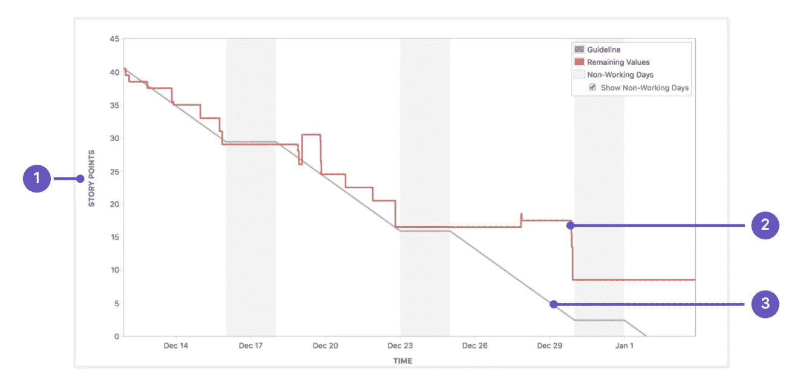
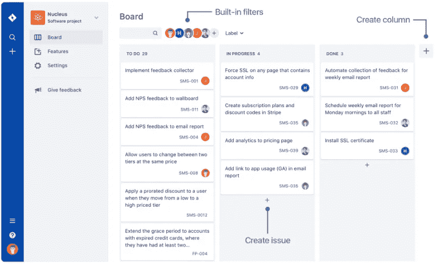

# 不要做敏捷，要敏捷

> 原文：<https://betterprogramming.pub/dont-do-agile-be-agile-5c8832c43181>

## 为什么 Scrum 不是银弹

Daria Nepriakhina 在 [Unsplash](https://unsplash.com?utm_source=medium&utm_medium=referral) 上拍摄的照片。

如果你的组织在 20 世纪 90 年代没有自我封闭，那么你很有可能会追随敏捷。对于大多数人来说，敏捷意味着 [Scrum](https://www.scrum.org/resources/what-is-scrum) 。在许多与潜在候选人的面试中，我总是听到，“我们遵循 Scrum，因此我们是敏捷的。”这并不总是对的。

敏捷是一种行为特征，而不是人们遵循的方法。是的，像 Scrum 这样的敏捷方法确实有助于团队更加敏捷，但是做 Scrum 并不意味着你是敏捷的。敏捷性来自一个简单的事实:您可以多快地适应不断变化的业务需求和要求。Scrum 并不是实现这种敏捷的唯一方式，只要你以某种方式遵循敏捷宣言——你能快速适应变化并快速交付更小的块——你就是敏捷的。迷茫？让我来解释一下。

# 敏捷宣言

[敏捷宣言](https://agilemanifesto.org/)陈述如下:

> “我们通过自己动手和帮助他人来发现开发
> 软件的更好方法。
> 通过这项工作，我们认识到:
> 
> 流程和工具方面的个人和交互
> 工作软件方面的综合文档
> 合同谈判方面的客户协作
> 响应变更方面的计划
> 
> 也就是说，虽然右边的项目有价值，但我们更重视左边的项目。"

这个想法很简单:不需要制定一个全面的计划，提前架构整个系统，并把软件的每个方面都写在一个合同中。相反，团队应该专注于交付工作软件，并以迭代和增量的方式响应变更。

变化是世界上唯一不变的，敏捷意识到了这一点。鉴于技术在世界上的变化方式，今天相关的内容在六个月后将不再相关。你不可能事先计划好一切，但很快你就会得到比现在更好的东西，市场的动态也会改变。

# Scrum 是什么？

Scrum 是一个框架，它允许敏捷团队在周期中增量地交付软件，并且它也有自己的过程:

*   您已经定义了一些角色，比如产品负责人，他负责区分产品待办事项的优先级并拥有产品。
*   Scrum 大师确保团队符合敏捷的期望，并遵循一致同意的流程。
*   团队成员负责遵循 Scrum 过程来交付工作软件。Scrum 将项目经理的角色分成了这三个角色。
*   Scrum 以冲刺的方式运行，冲刺是一个不超过两周的周期，在这个周期中，团队决定他们将要交付什么，根据难度和复杂性给他们分配分数，并在冲刺中完成。
*   有 Scrum 仪式，比如 Sprint Planning，团队与产品负责人讨论他们可以将什么带入 Sprint。
*   然后，他们召开每日站立会议，团队成员在会上讨论他们昨天做了什么，今天将做什么，以及他们是否有任何障碍。
*   在 Sprint 结束时有 Sprint 回顾，团队在回顾中展示他们所取得的成绩，在回顾中他们讨论哪些进展顺利，哪些可以改进。

衡量 Scrum 团队成功的标准是冲刺目标。这是主要的高级业务目标，或者说是 Sprint 应该达到的里程碑。燃尽图显示了冲刺阶段完成的工作量(完成了多少分)以及燃尽是否均匀分布。一个产品负责人会期望一个在 Sprint-1 中已经取得 50 分的团队在 Sprint-2 中根据他们从 Sprint-1 中学到的知识产生 60 分，等等。

下图显示了吉拉软件的典型燃尽图:

图片来自[亚特兰蒂斯](https://www.atlassian.com/agile/tutorials/burndown-charts)。

1.  故事点—故事点的数量。
2.  剩余值—给定点剩余的故事点数。
3.  指导方针——故事应该遵循的理想路线。

# Scrum 的替代品

虽然 Scrum 听起来是实现敏捷的好方法，但它并不适合每个团队，他们可能想看看其他的选择。对此有多种选择，比如精益和看板。

看板是精益的具体实施。丰田设计了精益，并称之为“[丰田方式](https://en.wikipedia.org/wiki/The_Toyota_Way)精益专注于减少浪费。这个想法是让你所有的团队成员都忙碌起来，更加关注生产率的提高，而不要让你的团队中的一些成员超负荷工作。保持透明度是最重要的，因为这会带来流程缺陷，需要改进。你不应该让员工负担过重，并确保每个成员都能达到适当的生产力。

# 什么是看板？

[Kanban](https://en.wikipedia.org/wiki/Kanban) 是一个日语单词，翻译过来就是“广告牌”，因此，它涉及到建立一个有多个状态栏的板，以“待办事项”开始，以“完成”结束介于两者之间的典型状态有“进行中”、“审阅中”和“已阻止”这个想法是，你在“待办事项”栏中得到任务，当团队成员完成任务时，所有的任务状态都变为“完成”。

图片来自[大西洋](https://www.atlassian.com/blog/jira-software/preview-new-agility-boards-jira-software)。

特定团队成员和整个团队一次可以承担的任务数量也有限制。这提高了团队的生产力，这样团队成员可以一次专注于一项任务，而不是做多项工作却一事无成。

看板成功的衡量标准是周期时间。根据任务的复杂程度，你能多快地将一项工作从“要做”变成“完成”，这将决定你是一个多么高效的团队。看板团队的目标是在特定的时间框架内完成尽可能多的工作。

# 为什么 Scrum 不是银弹？

你可能认为 Scrum 很酷。由于 Scrum 团队是自我驱动的，并且交付工作软件，没有理由说为什么 Scrum 不能在任何地方工作。然而，我曾和一些以 Scrum 起家的组织一起工作过，后来意识到 Scrum 并不适合他们。这里的问题是什么？

嗯，我同意 Scrum 很酷，但是这取决于你想要达到什么目的。Scrum 是目前使用的最流行的敏捷方法之一，它也很有成效。但是，它并不适合每一种球队。Scrum 的主要问题是，因为它在 Sprint 中运行，并且有一个定义的范围，所以 Sprint 中的变化是不可能的。因此，这使得它成为一个非常严格的过程，有时违背了对变化做出反应的敏捷原则，即使它是短暂的。在为期两周的冲刺阶段，情况可能会发生变化，您最初计划的事情可能不再需要，但是 Scrum 不允许您在冲刺阶段改变范围。

Scrum 适合于开发团队，他们在 backlog 中有一个明确定义的范围，并且正在努力实现一个特定的目标，比如一个产品。如果你正在交付一个产品，想要批量提供，等待，并决定响应，Scrum 适合你。

看板适用于工作范围没有很好定义的团队或者从事常规任务的团队。典型的例子是支持其他人的团队，例如系统管理员、操作团队和开发运维专业人员。他们不知道他们可能会得到什么样的工作，他们的工作范围每隔几天就会发生变化。它也适用于以“工厂模型”运行的团队这些专家不是为某一特定产品工作，而是作为一个卓越的中心工作。他们与多个团队合作，并向他们提供专业知识。典型的例子是系统集成商、中间件专家和数据库管理员。

如果你不是在做一个产品，你应该从看板开始。

# 进一步阅读

感谢阅读。如果你想更好地理解敏捷，查看一下[敏捷宣言](https://agilemanifesto.org)和[敏捷原则](https://agilemanifesto.org/principles.html)。敏捷中没有正确的方法，也没有组织虔诚地遵循任何方法——他们也不应该这样。组织尝试并学会理解什么最适合他们。

敏捷软件开发最重要的不是做敏捷而是敏捷。