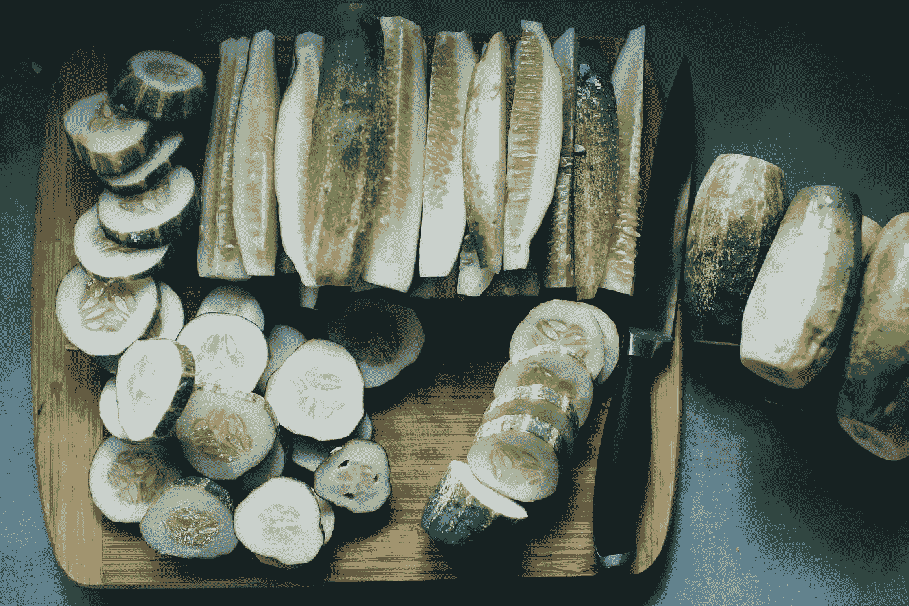
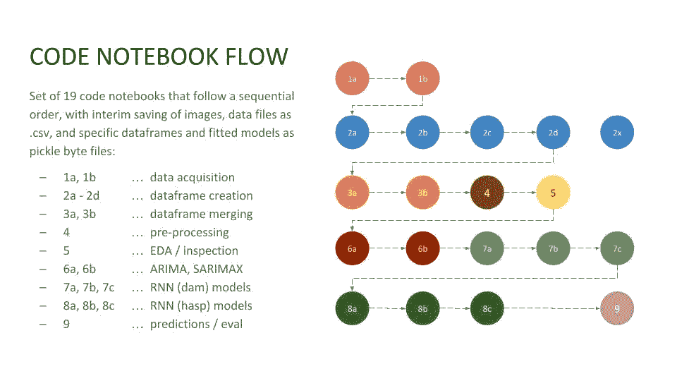
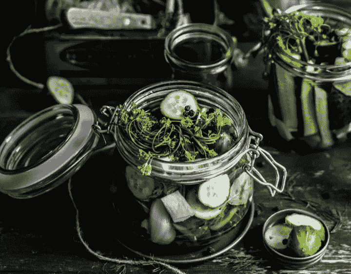

# 不要害怕 Pickle:使用 pickle.dump 和 pickle.load

> 原文：<https://betterprogramming.pub/dont-fear-the-pickle-using-pickle-dump-and-pickle-load-5212f23dbbce>

## 通过在多个 Jupyter 笔记本之间共享的*腌* Python 对象，改进您的数据科学工作流程



图片由来自 Unsplash.com 的娜塔莉·瑞亚·里格斯提供

# 什么是腌制？

在我接受数据科学教育的最初几个月，我开始听说一种技术，它有一个有趣的名字，“酸洗”。这听起来像是保存文件的一种不必要的复杂方式。究竟什么是“字节序列化”？它的语法对我来说没有太大的直观意义。不太像 pythonic。我决定忽略它，只使用标准的 pandas 命令:

`df = pd.read_csv(‘pathname/filename.csv’)`

把我的数据帧读入内存。相反，我只是用了它的补语:

`df.to_csv(‘pathname/filename.csv’)`

将数据帧安全导出到。csv 文件格式。简单吧？唉，随着我的数据科学需求变得更加复杂，我开始遇到限制。

幸运的是，我的一个助教(Ritchie Kwan)救了我们，带着我们的班级经历了“酸洗”,我再也没有回头。这个术语对我来说似乎异想天开，但我很快意识到它的恰当性。Python 中的腌制过程就像基于醋的腌制对黄瓜和其他食物所做的一样，它保存一些东西以备后用。Python-picking 对 Python 对象做同样的事情。它创建一个按字节序列化的。精确地保存 Python 对象的 pkl 文件。

# 为什么要用？腌制的好处

随着我的数据科学项目从简单的学术练习转向开放式的现实世界应用，我开始将问题的不同阶段和大块分成多个文件和代码簿。对于团队项目的协作(通常在工作场所)，任何数据科学团队都需要划分任务，创建单独的沙箱，然后聚在一起进行数据科学工作流的下一步。

简单的逗号分隔文件不再适合我们。当我进行一个包含时区转换的时间序列预测时，我遇到了。csv 文件方法。将数据帧保存到之间的时区转换正在撤消。csv 然后从那里加载。csv 文件复制到不同的 Jupyter 笔记本和 dataframe 对象中。更一般地说，人们很容易忘记在正确的时间传递一个`ignore_index = True`选项，导致标题出现`Unnamed0`标题。像拟合模型那样保存对象，用. csv 方法根本做不到(据我所知)。

我需要一种更简单、更有弹性的方法来保存和重用任何 python 对象。在最近的一个项目中，这种需求变得非常迫切，在这个项目中，我使用了 19 个不同的 Jupyter 笔记本来逐步完成完整的数据科学工作流程。请参见下图:



项目中的 19 台 Jupyter 笔记本电脑

除了进行数据清理、连接多个数据框、删除空值行、偶尔输入缺失数据、缩放、预处理和进行训练-测试-分割之外，我自己的理智要求我能够始终保护对象。我希望能够在这个过程中微调我的所有决定，并且如果我拐错了弯，总是可以选择回到以前的“状态”。我希望你一直在想，把一个数据帧保存为一个对象/变量，然后以后再去取它是多么好的一件事。

也许你重启了你的内核。也许您想将工作流程中的下一步分成一个多分支实验，尝试一些不同的竞争方法(想想 NLP 中的词干化与词汇化，或者迁移学习工作流程中的 K-means 聚类与 DBScan 算法)。拟合需要大量时间和计算能力的模型怎么办？能够保存适合的模型用于比较评估是绝对必要的。没有时间重新安装像 ADA 增强或梯度增强模型这样的模型，这些模型可能需要几个小时才能收敛。我使用的解决方案。腌制它！

# 如何酸洗和拆洗

在 imports 部分，确保在执行 pickling 或 unpickling 代码之前执行`import pickle`。将任何 Python 对象保存为 pickle(。pkl)文件，请使用以下语法:

```
with open(‘../pathname/source_object_name.pkl’, ‘wb’) as f:
    pickle.dump(object_name, f)
```

让我们解析这个片段来理解它。如您所见，`pickle.dump`方法在`with…open…as`语句中被调用，该语句使用了*上下文管理器*对象。关于 *with* 命令的更多细节，请参见 Dan Bader 的优秀教程([https://docs . python . org/3/reference/compound _ stmts . html # the-with-statement](https://dbader.org/blog/python-context-managers-and-with-statement))。

可以说，`with...open...as`为我们处理了由`open`命令打开的文件的健壮和自动关闭，这反过来使酸洗过程变得干净和容易。“wb”参数代表“写入二进制”，而“f”是一个临时变量。`object_name`表示您希望保存的对象。例如，它可以是:一个数据帧(df)、一个矩阵或数组(`X_train_sc`)、一个拟合模型(`rand_forest_1`)，或者任何你想保存的东西。你会看到。pkl 文件保存在`pathname`中指定的位置。

要装任何泡菜(。pkl)文件转换为 python 对象，只需执行相反的操作，如下所示:

```
with open(‘../pathname/source_object_name.pkl’, ‘rb’) as f:
    dest_object_name = pickle.load(f)
```

作为对上面的`pickle.dump`片段的补充，`pickle.load`片段*解开了*的。在`pathname`中指定的 pkl 文件，并把它赋给`dest_object_name`，可以是你喜欢的任何东西。你可能会猜到,“rb”参数代表“读取二进制”。就这样，现在在你的代码中使用对象！

# 因安全隐患*未*酸洗时

一个重要的警告。在对 Python 对象进行 pickled 或 unpickled 操作时，不会对其进行任何处理或解释。这是一个极其精简和高效的过程，这也是它的一个风险所在。如果您解压缩来源未知或不可信的文件，您的计算机可能会遭受意想不到的后果，或者成为恶意代码的受害者。因此，虽然这是一个很好的建议，但是我强烈建议一个简单的关于 pickle 文件的实践… **除了你自己的代码，不要使用它！这条简单的规则会让你远离麻烦。前进吧，盐水！**

# 最后一点:JSON 和 cPickle 的替代品

当纯粹在 Python 中工作时，Pickle 仍然是我的首选技术，我希望有一种简单的方法来保存和稍后重用任何对象。然而，如果没有提到用于对象序列化的 *cPickle* 或 *JSON* 选择，这篇教程将是不完整的。

与`pickle`语句在功能和文件格式上完全相同，`cPickle`是用 C 编程语言编写的，比 *pickle* 快 1000 倍左右。对于大多数对象，您不会注意到这种性能差异，但是在较大的文件中这是有意义的。要使用，只需在代码的任何地方用`cPickle`替换`Pickle`，包括在`import`部分。与`pickle`相比，`cPickle`的唯一缺点是 C 语言在 cPickle 中的使用排除了使用`pickle`命令进行定制的可能性。这可能与序列化的大多数日常使用无关。

JSON(JavaScript Object Notation)是一种与编程语言无关的序列化文件格式，因此如果您可能跨语言平台使用序列化对象，建议使用它。它比 pickle 更快，并且还具有一些安全优势，所以如果您需要跨平台和用户之间的序列化，这可能是一种方法。

但是对于您自己(和您的团队)使用的快速、无痛的 python 对象序列化，我认为没有什么比泡菜更合适的了。

# 资源

*   我的`pickle_template` gist 网址…[https://gist . github . com/manukalia/3 f 422 FD 8966 c 42 e 35 b 145 f 62 dbb 1005 b](https://gist.github.com/manukalia/3f422fd8966c42e35b145f62dbb1005b)
*   官方 python *泡菜*文档…
    https://docs.python.org/3/library/pickle.html
*   丹·巴德关于 *with* 语句的教程… [https://dbader . org/blog/python-context-managers-and-with-statement](https://dbader.org/blog/python-context-managers-and-with-statement)
*   关于 *with* 语句的 Python 文档… [https://docs . python . org/3/reference/compound _ stmts . html # the-with-statement](https://dbader.org/blog/python-context-managers-and-with-statement)



Monika Grabkowska 关于 Unsplash.com 的图片