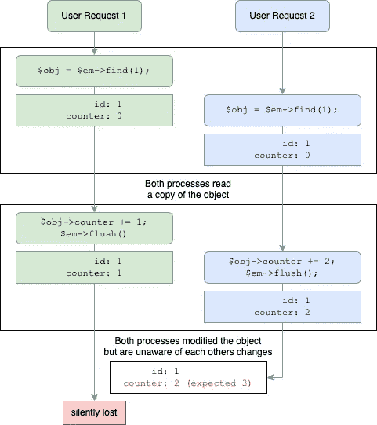
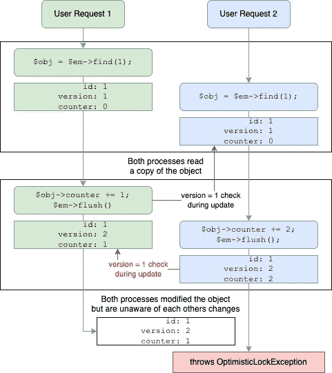
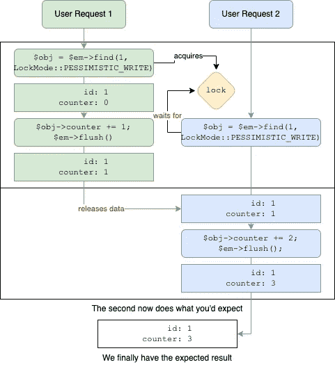
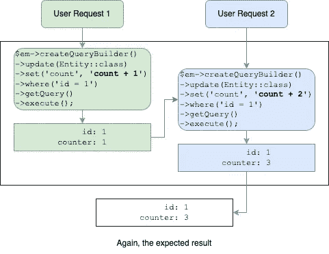

# 不要忘记在你的 Orm 实体上设置数据库锁

> 原文：<https://betterprogramming.pub/dont-forget-setting-database-locks-on-your-orm-entities-9cf4c074706>

## 关系数据库的一个巨大优势是事务和锁定。不要因为不使用它而浪费它



作者图片

这到底是什么问题？

如您所见，我们有两个单独的请求，它们都修改同一个数据库字段。但是，由于第二个进程在第一个进程写入其更改之前已经读取了实体，所以它们具有相同的起始信息。

这意味着我们丢失了数据，甚至没有任何迹象表明发生了这种情况。

那么这个怎么解决呢？

# 实体锁定

实体锁定是指实现任何一种允许检测并发问题的机制。

基于数据库的能力和应用程序的需求，有许多方法可以实现这些功能。

我是从 PHP 的[教条 ORM](https://www.doctrine-project.org/projects/orm.html) 的角度来写这篇文章的，因为我对它最熟悉。但是在其他 ORM 中会非常相似，比如 Java 的 [Hibernate](https://hibernate.org/) 。大多数策略也可以在 ORM 之外手工实现。

## 乐观锁定

这种策略包括向数据库记录添加一个`version`字段，该字段捕获其中的事务数量。这是一个形象化的例子:



如您所见，这种变体并没有解决冲突。
但它会防止静默数据丢失。所以这种方法是完美的，如果:

*   你不期望高并发性
*   您的逻辑或您的用户可以很容易地重试一个动作
*   你需要“锁定”一个实体更长的时间，例如用户交互。
*   您的数据库不支持本机锁定
*   在阅读之前，您不知道是否要修改实体

仅使用基本的错误处理，您就可以通知您的用户出现了错误，他们应该再试一次。

您甚至可以在表单中包含该版本，以便可以检测用户交互和请求之间的变化。

要实现它，您必须添加版本字段并将其标记为版本字段。理论上看起来会是这样的:

```
#[*ORM*\Column(type: "integer")]
#[*ORM*\Version]
public int $version = 0;
```

然后锁定本身就完全为您处理好了。您只需要确保通过表单传递版本，就可以从请求间锁定中获益。

## 悲观锁定

顾名思义，用这种方法我们预期事情会出错。充其量，我们的数据库应该支持本地锁定。但是这并不是严格要求的，尽管我不知道有什么数据库抽象可以帮助您模拟它。

让我们来看看悲观锁定的预期行为:



悲观锁实际上会告诉数据库应该锁定文档。接下来发生的是数据库授予您锁，或者将阻塞您的请求，直到锁被释放。

这意味着您可以确保当前没有其他进程可以修改您的记录。SQL 数据库强制执行这一点，即使其他进程不使用锁。

所以这个方法很棒，如果:

*   您期望高并发性
*   写入失败是不可接受的
*   您知道您将在请求中修改您的实体
*   您不能更改数据库模式

我们可以把它分解为:如果你正在修改你的实体，你应该在请求它的时候锁定它。在教义中，它会是这样的:

```
$em->wrapInTransaction(function () use ($em) {
  $obj = $em->find(Entity::class, 1, LockMode::PESSIMISTIC_WRITE);
  $obj->counter = $obj->counter + 1;
});
```

如您所见，您还需要一个显式的数据库事务。教条有一个很好的实用方法`wrapInTransaction`，它为你做所有的请求，甚至最后的`flush()`。如果这个函数有问题，它将回滚事务。

# 奖励:原子写入

这不是一种锁定方法，但它可以实现相同的最终目标。当使用对象模型工作时，很容易忽略简单的解决方案。有些事情直接在数据库里做更容易。

大多数数据库默认使用原子更新操作，甚至像 [MongoDB](mongodb.com/docs/manual/reference/operator/update/inc/) 和 [AWS DynamoDB](https://docs.aws.amazon.com/amazondynamodb/latest/developerguide/Expressions.UpdateExpressions.html#Expressions.UpdateExpressions.SET.IncrementAndDecrement) 这样厌恶事务的 NoSQL 数据库也是这样工作的。这意味着，如果一行正在被更新，它不能同时被另一个会话更新。因此，这个模型非常类似于悲观锁。



正如您所看到的，我们从来没有真正地读取行，只是直接更新它。

这种方法相当有限，所以只有在以下情况下才应该使用它:

*   您通常期望高并发性或许多更新
*   您只需要更新单个记录的几个字段
*   您不需要事先读取该值

# 最终外卖

如果您的项目有可能被多人使用，那么您至少应该考虑实现乐观锁定。否则，你可能会试图复制意想不到的行为。

如果乐观锁表明您有并发问题，悲观锁就很有用。如果您编写命令或导入程序，那么他们可以先发制人地使用它们，但这通常是不必要的，只要您有乐观锁作为故障保险。

别忘了考虑技术上不太复杂的替代方案。

我错过了什么或者告诉了你一些新的东西吗？