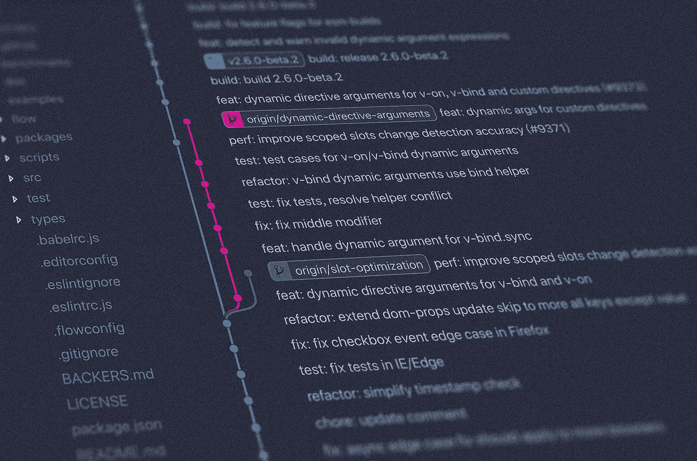
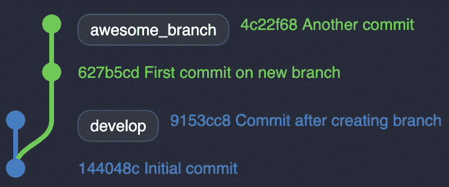
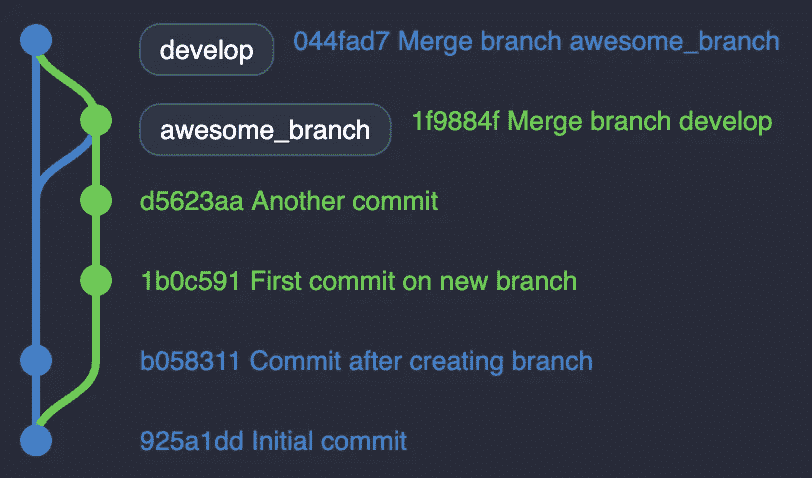
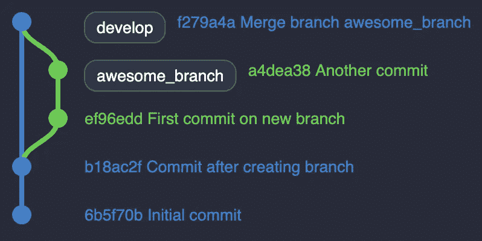

# 不要为 Git Rebase 烦恼

> 原文：<https://betterprogramming.pub/dont-fret-with-git-rebase-75fe3ed5ca8f>

## 无论你的队友会告诉你什么，重新构建 Git 分支都是一件轻而易举的事情



[Yancy Min](https://unsplash.com/@yancymin?utm_source=unsplash&utm_medium=referral&utm_content=creditCopyText) 在 [Unsplash](https://unsplash.com/?utm_source=unsplash&utm_medium=referral&utm_content=creditCopyText) 上拍照。

如果你熟悉 Git，你可能听说过 [Git rebase](https://git-scm.com/docs/git-rebase) 。这个强大的命令允许您将 Git 分支附加到 Git 树上的任何位置。

但是，我经常听说开发人员对这个命令不屑一顾。相反，他们更喜欢 Git merge——一种更安全但有限的处理分支历史的方法。

让我们首先用一个简单的例子来说明它们之间的区别。

# 合并与重设基础

假设你有一个基础分支叫做`develop`。想象你从`develop` 创建一个分支叫做`awesome_branch`。与此同时，有人提交了`develop`。



当您想要将`awesome_branch`合并到`develop`时，您会发现您的分支落后于一个提交。您可以:

*   将`develop`合并成`awesome_branch`。
*   在`develop`上重设`awesome_branch`的基础。

合并将融合两个分支的内容，让您一次处理所有冲突，并产生一个合并提交(下图顶部的`1f9884f`提交散列)。

另一方面，Rebasing 将拔出所有的提交，将它们一个接一个地应用到目标分支中(从底部图的`b18ac2f`提交散列中)。如果 Git 在特定的提交上检测到冲突，rebase 将暂停，直到您解决它。



合并



重定…的基准

最终，merge 和 rebase 都能完美地工作，并产生一个稍微不同的树。

# 有什么大惊小怪的？

作为一名开发人员，您会有因为一个错误的 Git 策略而不得不挽救局面的时候。我不得不挣扎几次才明白发生了什么，哪里出了问题。即使当我在一个相对较小的团队中工作时——大约有 7 名开发人员——我也可能有几十个并行的分支。有些可能与其他的交织在一起，使得阅读更加困难。

通过使用 Git rebase，您可能已经注意到我们保存了一个桥和一个合并提交。即使是一个简单的例子，正确的树也因其最佳显示而脱颖而出。如上所述，同时拥有多个分支会使你的工作更加困难。它强调了拥有一棵紧凑的树是多么重要。

保持线性树简化了版本控制。

如果你对如何进一步清理你的 Git 树感兴趣，我鼓励你阅读“[用 Git Rebase](https://medium.com/better-programming/from-messy-to-beauty-with-git-rebase-2d2e9ec6070f) 从凌乱到美丽”。

# 成为 Rebase 向导

首先你要明白 Git rebase 是一个破坏性的操作。Git 根据您之前对目标分支的提交生成新的提交。因此，你以前的承诺将被销毁。基本上，你重写你的 Git 历史！

只需遵循以下步骤:

1.  检查出你的分行，你想重新基地。
2.  更新您的本地存储库。
3.  将您的分支重置到所需的分支上。
4.  修复潜在的冲突。
5.  确保您的树是正确的。
6.  推动您当地的分公司

让我们抽出魔杖，把东西打碎吧！

## 1.看看你的分行

您可以选择跳过这一步，因为您可以从任何地方重新确定任何分支的基础。为了清楚起见，我们还是这么做吧:

```
$ git checkout feature/awesome_branch
```

## 2.更新您的本地存储库

可能是最受关注的一步。假设有人在`develop`、*和*提交了新的提交，忘记这一步将导致对一个过时的分支重新定基。更糟糕的是，重定基数本身看起来会运行良好。您将忽略来自目标分支的最新提交。

人们通常无法重定他们的分支，因为他们没有同步他们的本地库。

事不宜迟，只需获取您的所有分支:

```
$ git fetch --all
```

## 3.重定你的分行

一个经验法则:总是根据你的远程分支机构调整基准。因为您已经获取了所有的分支，所以您已经确保了所有的远程分支都是最新的。

```
$ git rebase origin/develop
```

## 4.解决你们的冲突

不可避免地，你会有冲突。当发生这种情况时，rebase 将在每次与目标分支冲突的提交时停止。您可以:

```
$ git rebase --continue // proceed the execution
$ git rebase --skip     // ignore this conflict
$ git rebase --abort    // cancel the operation
```

## 5.检查你的 Git 树

这是我们在犯潜在错误前的最后一道防线。花几秒钟来确保你的圣诞树看起来不错。它可以避免您丢失宝贵的提交！

## 6.推动您当地的分公司

我们终于准备好推动我们的本地分支机构:

```
$ git push --force
```

因为你重写了你的 Git 历史，Git 强迫你使用`— force` 选项。在使用这个命令之前，确保检查您的 Git 树！

# 包扎

我们来总结一下如何重基。如果你很懒(像我一样)，用 [ohmyzsh](https://github.com/ohmyzsh/ohmyzsh/wiki/Cheatsheet) 利用 Git 别名:

```
$ gco awesome_branch  // checkout your branch
$ gfa                 // fetch all your branches
$ grb origin/develop  // start rebase your branch onto develop
$ gp -f               // push force your local branch
```

就这些了，伙计们！我希望您使用这个命令会更有信心。

如果您想进一步了解 Git rebase，请随意阅读我的其他文章。

[](https://medium.com/better-programming/git-rebase-for-nested-branches-7a6bbb4a6688) [## Git Rebase 如何让我失望

### 如果重置基础变得乏味，你可能做错了

medium.com](https://medium.com/better-programming/git-rebase-for-nested-branches-7a6bbb4a6688) [](https://medium.com/better-programming/from-messy-to-beauty-with-git-rebase-2d2e9ec6070f) [## 用 Git Rebase 从凌乱到美丽

### 用交互式基础绘制整齐的树

medium.com](https://medium.com/better-programming/from-messy-to-beauty-with-git-rebase-2d2e9ec6070f)