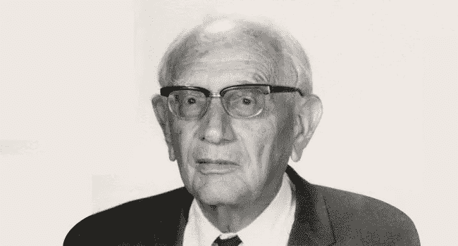

# 不要只写代码，要解决问题

> 原文：<https://betterprogramming.pub/dont-just-write-code-solve-problems-b5c4ed3f9d0d>

## 专注于解决问题，以提高您的代码技能

照片由[弗莱彻·普莱德](https://unsplash.com/@fletcher_pride?utm_source=medium&utm_medium=referral)在 [Unsplash](https://unsplash.com?utm_source=medium&utm_medium=referral) 拍摄。

你在编码的时候被卡住了很多次。我们都有。一些棘手的问题。很多条件。也许这可以分解成更小的问题。也许一些动态编程会有所帮助。这背后一定有什么著名的算法。

“我知道写这段代码并不难。要是我知道该写什么代码就好了。”

经历几次之后，你开始注意到一些模式。小策略。总有一些类似的问题。素描总是有帮助的。所有这些看起来不重要但最终帮助很大的小事。

事实证明，很久以前就有人发现并分享了这些“小策略”中的大部分。更准确地说，是在 1954 年。这个人名叫乔治·波利亚，他是一位了不起的数学家。他将职业生涯的相当一部分投入到解决问题、发现和发明的系统方法中。

来源: [Alchetron](https://alchetron.com/George-P%C3%B3lya#george-plya-3444d963-5689-46f2-8523-cd6b0fdef4f-resize-750.jpeg)

我不确定 Polya 是否期望 21 世纪的软件开发人员阅读他的作品，但它确实帮助了我。我相信在未来的几十年里，它会一直保持价值。

以下是他要说的话。

# 解决问题不是一种天赋

> “解决问题是一种实用技能，比如说，就像游泳一样。我们通过模仿和实践获得任何实用技能。试着去游泳，你模仿其他人用手和脚做的事情来保持头部露出水面，最后，你通过练习游泳来学习游泳。试图解决问题时，你必须观察和模仿其他人在解决问题时所做的事情，最后，你通过做这些事情来学习解决问题。”—乔治·波利亚，怎么解决

波利亚在他的书中很早就陈述了这一点，而且理由充分。如果你认为这只是给一些有天赋的，特殊的人，你就不能开始学习。

# 解决问题不是纯粹的“智力问题”

> “解决问题的教学是意志的教育。解决对他来说不太容易的问题，学生学会在不成功中坚持，欣赏微小的进步，等待重要的想法，当它出现时尽全力集中注意力。”—乔治·波利亚，怎么解决

决心和情感在解决棘手问题时发挥着重要作用，每个软件开发人员最终都会这样。

据波利亚先生说，一个好的问题解决者是有决心的，因为有时这个人甚至不知道如何开始解决问题。取得小的胜利也很重要——也就是说，能够解决较小的或相关的问题，以及同一问题的不同部分。

# 程序

每当你在解决问题的过程中，记住这四个步骤:

*   理解问题。
*   设计一个计划。
*   执行计划。
*   回望和回顾。

# 1.理解问题

> “回答你不理解的问题是愚蠢的。为一个你不希望的目标工作是可悲的。”—乔治·波利亚，怎么解决

在试图直接找到解决方案之前，把问题的所有要素都摆出来是很重要的。这将有助于你更好地理解。

## 你能用一句话陈述你的问题吗？

> “说话和思考是紧密相连的，语言的使用有助于思维。某些哲学家和语言学家走得更远，他们断言，文字的使用对于理性的使用是不可或缺的。”—乔治·波利亚，怎么解决

这个小练习对两件事很有帮助:说服你自己你理解你的目标，当你专注于解决它时，不要在这种理解上花费太多精力。

向别人解释这个问题也是有帮助的。正如务实的程序员在*中所写的，“橡皮鸭”调试只是强迫自己对问题有足够清晰的理解，这样你就可以把它教给别人。这使你有一个想法，并向前迈进。*

## 是否有需要满足的约束条件？

> “因此，让我们首先从整体上理解这个问题。理解了这个问题，我们就能更好地判断哪些要点可能是最重要的。研究了一两个要点之后，我们将能够更好地判断哪些进一步的细节可能值得更仔细的研究。让我们深入细节，逐步分解问题，但不要超出我们的需要。”—乔治·波利亚，怎么解决

你的问题的边界是什么？把它们写在某个地方。

它可以是你写的函数第一行上面的注释。它可以是你的设计文档上面的一系列要点。在尝试提出解决方案时，关注这些问题非常重要。

从你的大脑中卸下多重约束也是一种从我们试图想出一个好主意时所做的“精神杂耍”中去掉一些球的方法。

此外，如果有太多的约束，也要小心。波利亚认为，如果一下子考虑太多细节，可能会迷失自我。它们可能会分散你对主要观点的足够关注，甚至根本看不到主要观点。"想想那些只见树木不见森林的人."

## 你能画一个图形吗？引入合适的符号

> “解决问题的重要一步是选择符号。这件事应该仔细做。我们现在花在选择符号上的时间可以通过避免犹豫和困惑来节省时间，从而得到很好的回报。”—乔治·波利亚，怎么解决

这个对我来说总是赢家，尤其是当我很难理解一些与代码相关的问题时。我们都知道有时我们必须做一些严肃的“精神杂耍”，当这种情况发生时，有草图总是有帮助的。

这是因为你的画会帮助你将一些想法转移到纸上(物理的或不物理的)，让你的大脑有更多的空间专注于棘手的部分。从流程图到框图，任何一种符号都会帮助你更好地理解事物。

当与其他人一起做这件事时，或者如果这种理解需要在以后分享时，Miro 是我的选择。

我的可信赖的未删除笔记本也从不离开我的桌子，因为它非常适合快速、丑陋的草图。

由[凯莉·西克玛](https://unsplash.com/@kellysikkema?utm_source=medium&utm_medium=referral)在 [Unsplash](https://unsplash.com?utm_source=medium&utm_medium=referral) 上拍摄的照片。

# 2.设计一个计划

> “当我们知道或至少大致知道为了获得未知，我们必须进行哪些计算、运算或构造时，我们就有了计划。从认识问题到构思方案的道路可能是漫长而曲折的。事实上，解决一个问题的主要成就是构思一个计划的想法。”—乔治·波利亚，怎么解决

尽管一旦你理解了特定的问题，你甚至很难想象需要哪些步骤来解决它，但 Polya 提出了一些你可以做的事情来帮助你开始。

我在这里要补充的一点是:最初不要介意代码。先把问题解决在纸上。在我们的头脑中，编写代码似乎总是更容易，一旦你试图运行它，就会变得更加棘手。不要同时做两件事。首先，解决问题。在你的笔记本或伪代码上“运行”一个例子。然后，为机器实现。

## **你知道一个相关的问题吗？**

> “好的想法是基于过去的经验和以前获得的知识。仅仅记住对于一个好主意来说是不够的，但是我们不能在没有回忆起一些相关事实的情况下有一个好主意。”—乔治·波利亚，怎么解决

波利亚在这里建议的是，你至少需要知道你正在处理什么样的问题或一系列问题。对于软件人员来说，这通常意味着回答以下问题:

*   这是一个架构问题吗？
*   这个场景中有常用的架构模式吗？
*   这个问题更多的是在一个算法的层面上吗？
*   有没有经过实战检验的算法可以解决这类问题？

一旦你能够找到一个与你的问题相关并且以前已经解决过的问题，你就会知道你在那里。那你一定要问自己，“我能用吗？”许多问题可能有一些共同点，但是那些共享最基本的需求或前提的问题可能是最有帮助的。

## 你能重申一下这个问题吗？

你能从不同的角度看这个问题吗？这样做有多种方式。你能放弃一部分条件或一些要求吗？你能在一个更具体的场景下陈述这个问题吗？

如果您正在编写测试，考虑仅仅由问题的特定条件创建的简单示例对于在您的最终、更通用的解决方案上取得进展是非常重要的。这将我们引向…

## 如果你不能解决提议的问题，试着先解决一些相关的问题

或者一个相关的也更简单的问题。就像编写好的软件一样，练习解决问题可以被认为是一个渐进的过程。不要试图同时做所有的事情。构建你的最终代码，甚至系统设计图表和想法是一个过程，它将从为更小的问题做同样的事情中受益匪浅。

即使你的最终工件，比如 Git commit 或 design doc，不是上一个的进化，你用来创建它的想法肯定是。

# 3.执行计划

> “设计一个计划，构思解决方案的想法并不容易。成功需要这么多；先前获得的知识，良好的精神习惯，专注于目标，还有一点:好运。执行这个计划要容易得多；需要的主要是耐心。”—乔治·波利亚，怎么解决

21 世纪的开发者版本是“先思考，后编码”一旦你理解了你的算法或系统设计的步骤，以后实现它就会容易得多。

波利亚指出，优秀的问题解决者能够在解决方案完成后检查每一步，并从头到尾提出质疑。从纯分析的、数学的思路来看，一步走错就毁了一切。这在软件中可能看起来不那么直接危险，但它可能是致命的，因为更糟糕的错误将在最糟糕的时刻表现出来——而且可能是在非常特殊的情况下。

对我们来说，这意味着拥有良好的测试覆盖率。如果你没有测试它，你就没有质疑它。这意味着你武断地认为你的解决方案是完美的，我们知道这是不正确的。有了这个“它会碎吗？”不断尝试想出你的解决方案的所有不同的失败模式的心态总是有帮助的，并且如果你愿意写的话，将会方便地用测试来记录。

总结一下，说服自己你的解决方案是正确的。不要让那种信服太容易了。

# 4.回首

> “即使是相当好的学生，当他们获得了问题的解决方案，并整洁地写下了论点，合上书，寻找其他东西。这样做，他们错过了工作的一个重要和有益的阶段。通过回顾已完成的解决方案，通过重新考虑和重新检查结果以及通向结果的路径，他们可以巩固自己的知识并发展解决问题的能力。”—乔治·波利亚，怎么解决

当事情做得太匆忙时，不回顾和欣赏你的解决方案的权衡是经常发生的事情。

如果是算法，能说出它的时空复杂度吗？代码读起来好吗？

如果你做的决定会对整个系统产生影响，请在广告牌上写下这些权衡。花一个小时重新审视你的工作成果将会为你以后节省更多。如果有必要的话，休息一下，稍后再回来。深陷在你正在解决的问题中，很可能会导致你视野狭隘，忘记相关细节。

同样，你对那个特殊问题*的解决方案*也可能被推广到多种场景中。想想吧。结合良好的品味和仔细的思考，创造新的抽象是为其他遇到这个问题的人解决问题的一种方式。

# 包扎

波利亚的*如何解决*是我整个职业生涯都会放在办公桌旁的一本书。软件工程是一个真正思想密集、解决问题的领域，Polya 永恒的建议可能会在你需要的时候帮助你。

这本书不仅包含解决问题的四步框架，还包含许多非常适合 21 世纪创造性职业的其他宝贵建议。