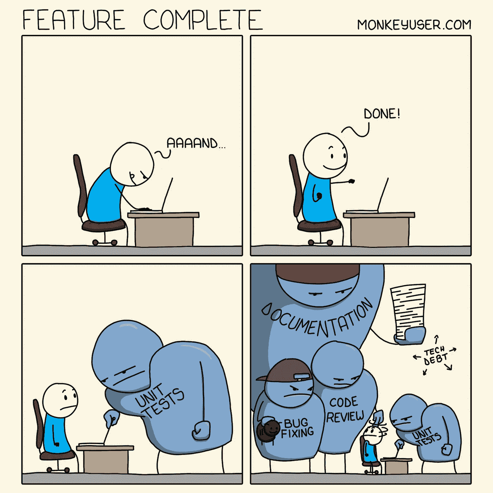
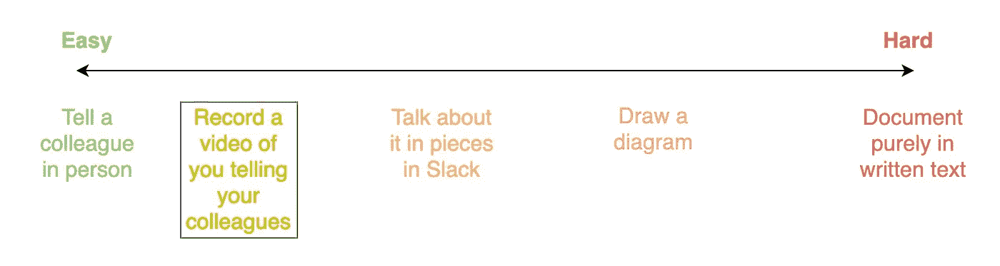
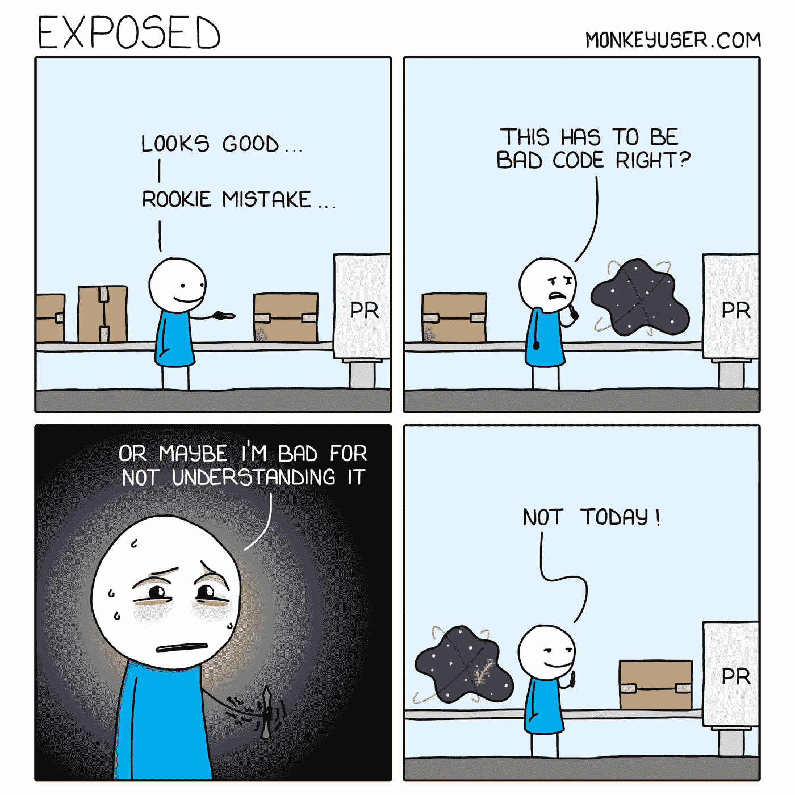

# 不喜欢写文档？那就不要，要学会更有效

> 原文：<https://betterprogramming.pub/dont-like-writing-documentation-then-don-t-and-learn-to-be-more-effective-d545928caf77>

## 利用直觉和人性中已有的东西

如果我向 10，000 名软件工程师广播一份调查，问他们中有多少人喜欢写技术文档，我希望最多有几百人给我一个肯定的答案。然而，我们中的许多人会认为这种努力对于任何大规模的商业软件应用程序都是必不可少的。

因此，这种观念回避了这些问题:

*   有没有办法让这么重要的东西不那么臭？
*   对生产者和消费者来说，它能更清楚、更有效吗？

我亲眼目睹了这些问题的答案是响亮的是。然而，首先，在我开始新的旅程之前，我不得不几乎停止创建所有的书面文档。

从[MonkeyUser.com](https://go.oliverspryn.com/feature-complete)的相关瞬间

# 需要是发明之母

诚然，我是那些喜欢写代码而不是文档的工程师之一。因此，当涉及到文档的质量和数量时，我们的大型 Android 应用程序受到了影响，因为我们都有关于正在发生的事情的必要的“部落知识”。

这个想法一直有效，直到该项目的 Android 工程师人数预计增长约 600%。作为项目中最资深的开发人员之一，我经常会多次解释相同的概念，或者用相同的仪式让新同事参与进来。

我知道这是因为我们缺少文档。然而，我想知道，你如何记录整个工程过程？我怎样才能把一个 90 分钟的消防软管介绍压缩成一个任何人都想读的文档？然后，它像一吨砖头一样击中了我，这是我一直在微软团队和 Slack 上做的事情。

# 将您的文档录制成视频

为什么我没有早点这么做？我花了几个小时向单个工程师，有时是整个开发团队介绍相同的概念。然而，我们的大脑是有限的，那些没有立即投入使用的想法往往会被遗忘。我一直为此感到内疚。

我已经掌握了收集我的想法，在屏幕上分享它们，并向一个或多个人的观众彻底解释概念的艺术。为什么不找点业余时间，一劳永逸的录一次呢？不管它发生在你每天站起来之前的早上 8 点，还是在你一天工作结束之后的下午 5 点。

老实说，我唯一需要做的就是写讨论要点的提纲。剩下的就是在摄像机前的对话，或者是屏幕录制的画外音。

# 你已经要解释你的工作了

除非你是个人项目的独立工程师，否则你需要解释你的代码、设计决策和惯例。任何工程师都知道，这只是典型开发过程的一部分。也许解释某件事如何运作的最简单的方法是用交谈的方式告诉那个人；在您的办公桌前，或通过微软团队。最严格和最具挑战性的方法可能是通过书面文档。然后是中间的一切。我认为我们应该将难度表尽可能地向容易一面倾斜。

我的高度不科学的、主观的、不完整的信息交流困难度

或许，视频是软件工程交流的圣杯。它体现了我们作为人类想要做的事情(说话),并提供了视觉和连接感。

老实说，每当您订购一些组装所需的物品，如一件家具、一件工具或您孩子的一件精致玩具时，您觉得这些产品与您收到的说明书有多大关联？你们中有多少人会去 YouTube 上看一个视频，告诉你如何做手册告诉你的事情？

我看到到处都有人举起象征性的手。为什么？这是人之常情。

# 这就是我们大脑的工作方式

有没有想过为什么亚马逊在图书区搜索“快速阅读”会有超过 10，000 个结果？阅读并不是人的天性。写作也不是。根据备受推崇的《T2 快速阅读:学会在 1 小时内阅读 200 多页的书》一书的作者卡姆·奈特的说法，他认为阅读(或写作，推而广之)不是人类结构的自然组成部分，因为“阅读不是起源于或存在于自然界的东西。”

同样，《用右脑快速阅读:学会阅读想法而不仅仅是单词》的作者大卫·巴特勒认为，有效的阅读需要利用左脑解码单词和右脑进行高效和有效的理解。

为什么我们要违背人类的本性来编写和使用文档呢？让我们跳过约束自己和违背自然人类智力的困难。相反，让我们利用人类已经擅长并且几乎自出生以来就一直在做的事情:说话、指点、展示和使用视觉效果。

# 你已经具备了所需的一切

每当我说“相机”或“麦克风”这个词时，我都很清楚有些人的血液会瞬间凝固。然而，除非你是在服务行业，并且从未使用过微软团队，或者 Slack，或者 Zoom，那么你至少从 COVID 开始就一直在这么做。

我说的是你的内心。你不需要用相机；您可以决定只显示屏幕上的内容。对麦克风的恐惧正在减少，因为我们几乎每天都在使用它们。为了解释一些事情，当你选择一个话题进行探讨时，假装你的同事就坐在你旁边。(不要指着你的屏幕，因为没人能看到。)没有大观众可想；只有你，你的屏幕，以及一次只有一个人会看你的视频。

缺乏文档导致缺乏理解，来自[MonkeyUser.com](https://go.oliverspryn.com/exposed)

# 装备

就硬件而言，大部分都是免费的。或者像你已经买的一样免费。

*   **摄像头和麦克风，0 美元:**大多数笔记本电脑已经内置了这些。除非自 2020 年 3 月以来，你在公司的所有电话会议上都没有被看到，也没有被听到，否则你知道你拥有它们。
*   **屏幕/摄像头录制软件，选项 1，$0:** 一个选项是使用 [OBS Studio](https://go.oliverspryn.com/obs) 。这是一个免费的开源应用程序，用于广播和录制麦克风、摄像机和屏幕。这需要一点时间来适应，但它肯定是一个可靠的选择。
*   **屏幕/相机录制软件，选项 2，TechSmith Camtasia，$ 250:**[Camtasia Studio](https://go.oliverspryn.com/techsmith-camtasia)几乎是业内最佳选择。它有一个完整的编辑套件来帮助您纠正错误，调整音频，并使生产者/消费者的体验尽可能简单。太贵了？请你的公司给你一张营业执照。他们可能会很快赚回这笔钱，因为他们不再付钱让你在堆积如山的书面文档下工作了。

# 主办；主持

一旦你有了视频，这里有几个地方可以放它们:

*   [**微软流:**](https://go.oliverspryn.com/microsoft-stream) 把它想象成你公司的 YouTube。如果你以前曾上传或在 YouTube 上观看过视频(即地球上的每个人)，那么这种感觉会非常相似。它还包括 iOS 和 Android 的应用程序。
*   [**亚特兰蒂斯总汇:**](https://go.oliverspryn.com/confluence) 这个产品还需要介绍吗？即使它擅长处理书面文件，它也能出色地处理你的视频。然后，你可以使用侧边栏来组织你的收藏。
*   [**TechSmith Screencast.com:**](https://go.oliverspryn.com/techsmith-screencast)它和 Camtasia Studio 就像花生酱和果冻一样搭配。
*   **文件共享，** [**微软 OneDrive**](https://go.oliverspryn.com/onedrive) **，**[**Google Drive**](https://go.oliverspryn.com/google-drive)**:**没有人需要一个花哨的应用程序来查看你的文档。如果它内容丰富，无论在哪里举办，你的同事都会阅读它。

# 书面文件有一个小地方

工程图、信息表和 REST 契约是我认为仍然需要写下来的项目。如果我可以挥动魔杖让所有的垃圾文件消失，我会的。

事实上，它仍有一席之地。然而，那个地方比我们通常感知的要小得多，我们可以解释掉它的大部分。字面上。视频格式的。在这样做的时候，当我们向我们的听众解释那些更简单的概念时，我们会更自然地依赖大脑的一部分。更有效地利用所有这些努力，你就可以重新编写你的软件了。你的团队会感谢你的。你的公司可能也会。

# 喜欢你读的东西吗？

媒体上还有成千上万篇类似的文章。我是这个网站的付费会员，我完全认为这项投资是值得的。 [**点击这里加入**](https://go.oliverspryn.com/medium-membership) ，你将以你的一部分会员身份支持我的工作。

这篇文章最初发表在 https://oliverspryn.com/。加入我的邮件列表。