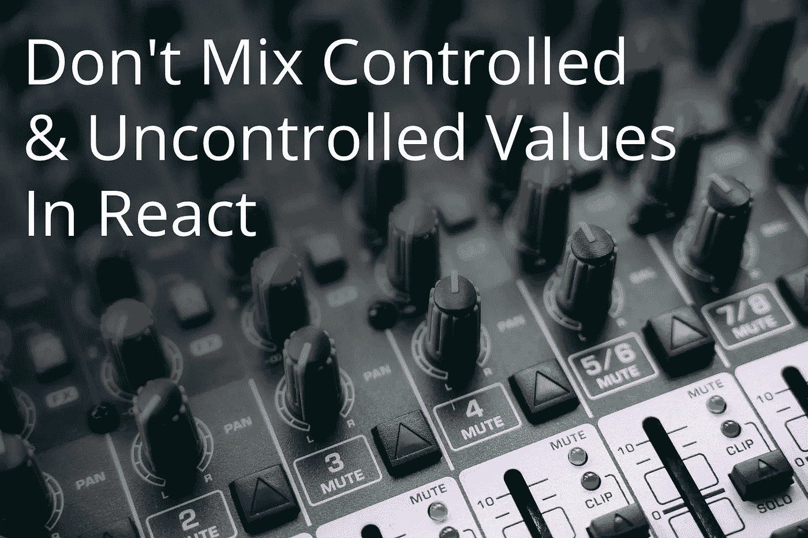
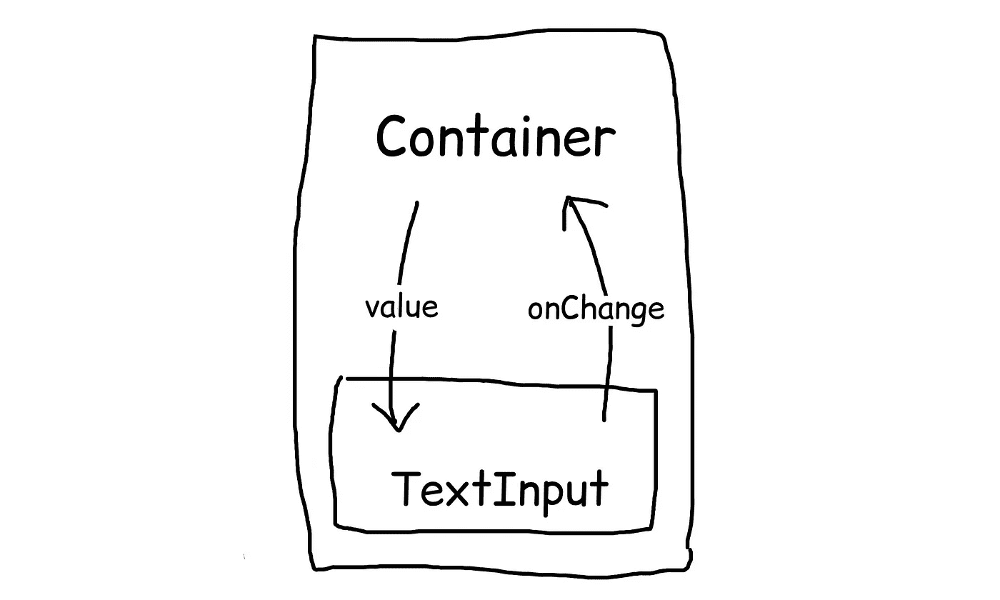

# 不要在 React 中混合受控和非受控值

> 原文：<https://betterprogramming.pub/dont-mix-controlled-uncontrolled-values-in-react-e7ab191d8dc4>

## 组件架构中最基本的规则之一

图片来源:作者

在本文中，我将讨论组件架构中最基本的规则之一。这个基本规则经常被违反，导致很难(如果不是不可能的话)解决的问题。

尽管我将提供一些例子并用 React 术语进行说明，但它也适用于其他 UI 库/框架，并且可能适用于任何基于组件的程序，其中组件可以进行双向通信。

让我们从定义术语*受控*和*不受控*开始。在 React 的一篇[官方博客文章](https://reactjs.org/blog/2018/06/07/you-probably-dont-need-derived-state.html#common-bugs-when-using-derived-state)中，他们这样定义它:

> 作为道具传入的数据可以认为是由**控制的**(因为父组件*控制*该数据)。只存在于内部状态的数据可以认为是**不受控**(因为父不能直接改变)。

这里需要注意的是，称一个组件*受控*或*不受控*是不正确的，因为组件两者都不是。相反，我们将*数据*称为*受控* / *非受控*。事实上，我们很快就会看到，在不违反任何规则的情况下，单个组件可能同时受*控制*和*控制*，只要它不是针对相同的*值*完成的。

混合这两个概念，创建一个数据值既受*控制*又不受*控制*的组件，常常会违反这一规则。使用这样的组件可能会导致违反*单一真实来源原则*。此外，正如我稍后将演示的，这样的组件将无法处理某些场景。

## 一个例子

最常见的例子是输入组件。这种组件可以接受用户输入，但也可以接收来自应用程序本身的输入(例如，在设置初始值时)。这种双向数据通信使得这种类型的组件容易出现*受控* / *不受控*的混合问题。

这是此类组件的一个基本示例:

如您所见，组件接收其初始值作为道具，以及一个`onChange`处理程序。此时，`value`道具既受*控制*又不受*控制*，因为该值通过`value`和`onChange`道具与组件的包含层来回通信，但同时该值保持在内部状态。

父子双向数据流。

第一个也是最明显的问题是违反了*单一真相来源*原则。这是因为你现在可能在两个不同的内存位置有相同的值。如果这些位置不同步，您的应用程序将开始做奇怪的事情。

这里不太明显的问题是，当您试图利用该组件打算支持的双向通信时将会面临的问题。

假设您希望在应用程序中的某个地方有一个重置按钮，单击该按钮将重置输入组件的值。为了让它工作，我们将不得不对我们的组件进行一些调整，以监听`value`道具的变化。我们可以使用`useEffect`挂钩来实现:

这已经使事情变得更复杂，可读性更差，这是一个干净的版本。当我们在一个类组件中使用所有那些好的`getDerivedStateFromProps`东西时，情况会变得更糟。但至少它在工作，对吗？

假设单击 reset 按钮将一个空字符串`‘’`作为值传递给我们的组件。现在，假设我们希望初始值也是一个空字符串`‘’`。如果用户键入一些内容，然后单击重置按钮，会发生什么情况？没什么！

什么都不会发生，因为`value`属性没有改变，它仍然是一个空字符串，所以组件不会被重新渲染。即使我们能找到某种方法来强制它重新渲染，因为`value`是一样的，所以`useEffect`永远不会被调用。

当然，我们可以添加另一个名为`initialValue`的道具，但这只是针对特定的情况。仍然有可能出现不同的场景，我们需要将内部值设置为`value`已经存在的值。我们不能每个案子都加一个道具吧？

# 提升国家地位

这个问题的解决方案非常简单——在包含层(即任何祖先，而不仅仅是直接父代)维护状态，而不是内部状态。这使您可以在不违反任何原则的情况下保持干净的双向数据流。它还使您的组件变得不那么复杂和费解。

我们糟糕的输入组件的一个更好的版本应该是这样的:

那不是看起来好多了吗？这个组件不仅仅是好看，它还有很棒的个性——它不违反任何原则。为了完成我们的示例，一个带有重置按钮的基本应用程序应该是这样的:

唯一的缺点是，现在无论何时使用这个组件，我们都必须有一个状态。但这是一个很小的代价，大多数应用程序可能都有一些中央状态。

# 合法混合受控和非受控

前面提到过，*受控* / *不受控*的概念是指一个组件的道具而非组件本身。这意味着在一个组件中有一个内部状态是完全可以的，只要这个状态不影响这些属性，也不受这些属性的影响。

考虑到这一点，让我们在文章开头引用的初始定义中添加:

> 组件数据集中的单个值(属性和状态)可以是受控的或不受控的，但不能同时是两者。但是，单个组件可能混合了受控值和非受控值。

为了说明这一点，让我们向我们的`TextInput`添加一个内部状态，当组件获得焦点时，它会添加一个`.focused`类:

该组件现在合法地混合了*受控* / *非受控*概念。`value`支柱为*受控*，而`focused`状态为*非受控*。这很好，因为我们仍然有一个单一的真相来源，我们不会面对之前讨论的问题。

# 在受控和非受控之间快速切换

有时，为了同样的目的，我们需要我们的组件在某些情况下被控制，但在其他情况下不受控制。这给我们带来了整个概念的另一个关键点:

> 组件数据集中的单个值(属性和状态)既可以是受控的，也可以是不受控的，只要它们不在同一时间。

为了说明这一点，让我们扩展一下之前的焦点示例。比方说，我们希望能够从外部控制输入的焦点状态，但只是在某些情况下。当我们不需要从外部控制它时，我们希望它有一个内部状态。这允许我们避免在不需要控制的时候在容器级别添加`useState`样板文件。

这可以通过引入 3 个新道具来实现:`focused`、`onFocus`和`onBlur`。为了简单起见，我去掉了`value` / `onChange`道具:

在上面的例子中，让`focused`属性为空将会把它变成一个*不受控制的*值，并且组件将为它使用一个内部状态。然而，向该属性传递一个布尔值将使其受*控制*，内部状态将被忽略。

这使得我们可以通过将一个特殊值传递给`focused`(在本例中，该特殊值为`undefined`)来在受控/不受控之间进行动态切换。

这里的关键概念是不能同时使用内部状态和道具。如果我们使用道具，内部状态将被忽略，反之亦然。因此，该值不能同时由*控制*和*不受*控制，这样我们就可以避免与此相关的所有问题。

# 结论

我希望这能澄清这些概念，并强调不要混淆它们的重要性。根据我的经验，不恰当地将*受控的* / *非受控的*概念混合为一个值会导致非常令人不快的缺陷，保持它们的适当分离会使组件更干净、更可读、更健壮。