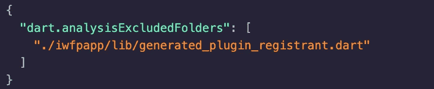

# 当 Flutter 为您生成一个坏文件时，不要惊慌

> 原文：<https://betterprogramming.pub/dont-panic-when-flutter-generates-a-bad-file-for-you-e5e314c2b01>

## 如何忽略你的 Flutter 项目中的某些文件


来自[佩克斯](https://www.pexels.com/photo/photo-of-a-woman-thinking-941555/?utm_content=attributionCopyText&utm_medium=referral&utm_source=pexels)的[布鲁斯·马尔斯](https://www.pexels.com/@olly?utm_content=attributionCopyText&utm_medium=referral&utm_source=pexels)的照片

[Flutter](https://flutter.dev/) 是一个相对较新的跨平台框架，简单且高性能。

然而，由于它仍在发展中，有许多突破性的变化会使你的项目部分崩溃。

在这篇文章中，我将介绍如何处理部分中断的颤振设置，并减少由中断颤振变化引起的混淆错误。

*注*:虽然我使用了最近一个广泛传播的问题作为例子，这篇文章将帮助你处理一个部分中断的颤振设置。

最近，那些密切关注 Flutter 的开发人员可能会遇到一个大麻烦，Flutter 会生成一个文件:

`generated_plugin_registrant.dart`

同时，旋舞本身也在抱怨它:

```
info • Unused import: 'dart:ui' • lib/generated_plugin_registrant.dart:4:8 • unused_import
```

更糟糕的是， [VS Code Flutter 插件](https://flutter.dev/docs/development/tools/vs-code)也在对这个文件里的一切大喊大叫:

*   找不到包:(
*   未使用的导入:(
*   未定义的变量:(

# 此文件存在是因为您请求了 Web 支持

这个文件`generated_plugin_registrant.dart`的存在只是为了支持 web。

如果 Flutter 是[支持 web 的](https://flutter.dev/web)，并且至少有一个包请求它，那么它就存在。

# 该错误是由出血边缘的不一致性引起的

Flutter 在版本 [1.12.13](https://flutter.dev/docs/development/tools/sdk/release-notes/release-notes-1.12.13) 中引入了一个可用的 web 插件包，一些第三方包开始利用它(例如 [Firebase_core](https://pub.dev/packages/firebase_core) 、 [Firebase_auth](https://pub.dev/packages/firebase_auth) )。

但是[颤振静态分析器](https://flutter.dev/docs/testing/debugging)和 [VS 代码插件](https://flutter.dev/docs/development/tools/vs-code)还没跟上。尽管您的代码可能运行得非常好，但是工具仍然会发出错误。

# 步骤 1:告诉 Analyzer 忽略某个文件

要让 analyzer 忽略，我们需要在 Flutter 应用程序的根目录下创建一个配置文件，`analysis_options.yaml`。

将以下代码(将被`flutter analyze`忽略的文件列表)放入配置文件中:


# 步骤 2:告诉 VS 代码插件忽略某个文件

将下面的代码放到`.vscode/settings.json`中，这里的值是代码需要忽略的文件列表:



# 步骤 3:享受无 Bug 的编码体验

一如既往，快乐编码；)

*注意*:观点是我自己的，不是我雇主的观点。