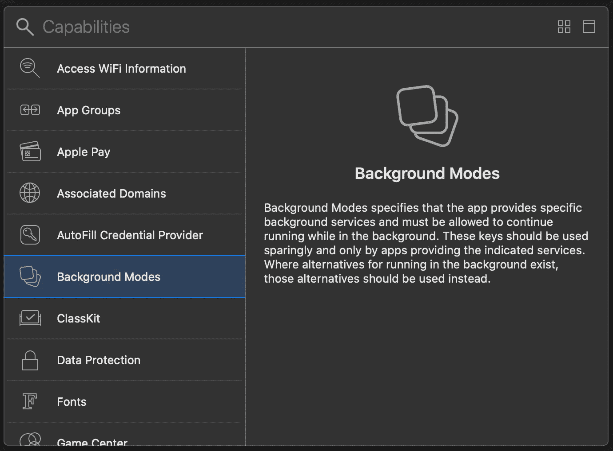
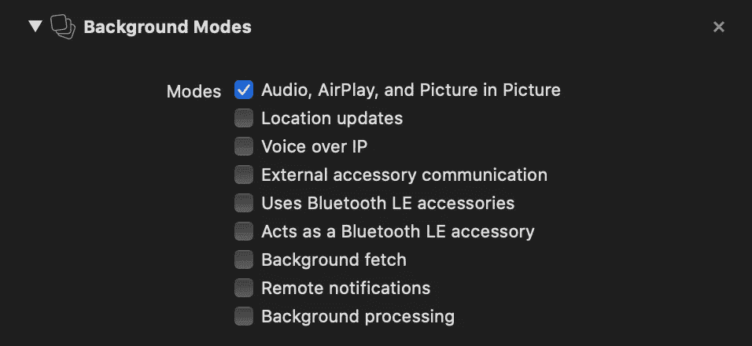

# 不要停止 iOS 应用程序中的音乐

> 原文：<https://betterprogramming.pub/dont-stop-the-music-in-an-ios-app-bc4780f6cf61>

## 进入后台时保持您的音频会话活动


图片来自 [pixabay](https://pixabay.com) 的 [sweetlouise](https://pixabay.com/users/sweetlouise-3967705/)

在 iOS 应用中播放音频文件有很多种方式，从`SpriteKit`的`SKAction`在游戏中发出音频到使用`AudioToolbox` 框架。在这个例子中，我们将使用框架`AVKit`中的`AVAudioPlayer`，因为它是最常见、最容易设置和使用的。

然而，如果没有额外的准备，一旦应用程序进入后台或设备被锁定，音乐将停止播放。在本教程中，我们将看看如何让它继续播放。

# 项目设置

第一步是在后台模式下启用音频。这可以通过在标签*签名&功能*下的项目设置中添加功能*后台模式*来实现。



将*背景模式*功能添加到我们的应用程序中。

添加功能后，我们需要检查框*音频、AirPlay 和画中画*。



允许音频在后台播放。

现在一切都设置好了，我们可以开始写代码了！

# 播放音频

我们可以创建一个新的`AVAudioPlayer`，为它提供一个我们想要播放的文件的 URL。另外，我们可以设置一些属性，例如`numberOfLoops`。通过将该值设置为负数，播放器将无限循环地重复播放其音频。

```
let url = Bundle.main.url(forResource: "sound", withExtension: "mp3")!
try player = AVAudioPlayer.init(contentsOf: url)
player.numberOfLoops = -1
```

我们可以通过调用播放器的`play()`方法来开始使用播放器，但是一旦应用程序关闭，播放器就会停止运行。*注意:你需要在一个真实的设备上测试这个，模拟器会一直播放你的声音。*

为了改变这种情况，我们需要做两件事:

1.  配置系统范围的`AVAudioSession`。
2.  激活我们应用的音频会话。

先说第一点！正如你在下面的代码片段中看到的，我们在`AVAudioSession`的共享实例上调用`setCategory(_:mode:options:)`。这个方法需要三个参数，第一个是我们想要使用的类别。我们可以在各种值之间进行选择，比如默认的音频会话类别`.soloAmbient`、`.record`用于录制音频，或者`.playback`，这是我们在本例中需要的类别。正如你可以在[的文档](https://developer.apple.com/documentation/avfoundation/avaudiosession/category/1616509-playback)中读到的，它允许我们在后台播放音乐，即使 iPhone 被设置为静音。

接下来，我们需要指定一个音频会话模式。同样，有多个选项可供我们选择(例如`.voiceChat`、`.videoChat`或`.gameChat`)，但我们只需要默认的选项`.default`。

最后，我们添加一些选项。有两种选项，第一种定义如何对其他音频会话做出反应。在这里，我们可以选择是否要将我们的声音与其他声音混合，暂停当前的语音音频内容以支持我们的声音，或者降低其他会话的音频音量。其他选项决定我们音频的输出目的地:我们可以允许蓝牙设备，流式传输到 AirPlay 设备或只使用内置扬声器。在本例中，我们使用选项`.duckOthers`，它会降低其他音频会话的音量。

```
try AVAudioSession.sharedInstance().setCategory(
    AVAudioSession.Category.playback,
    mode: AVAudioSession.Mode.default,
    options: [
        AVAudioSession.CategoryOptions.duckOthers
    ]
)
```

既然会话已经配置好了，我们需要告诉系统我们的应用程序现在将使用全局会话。在这个代码示例中，我们可以看到如何做到这一点:

在播放和暂停时激活和取消激活会话。

这里有一些事情要提一下:

*   我们需要在停用会话之前暂停播放器，否则会抛出一个`NSOSStatusError`。
*   当当前活动的音频会话比我们想要启动的音频会话优先级高并且不允许混合时，`setActive(_:options:)`可能会抛出`AVAudioSession.ErrorCode.isBusy`错误。

正如你在本教程中看到的，配置一个`AVAudioSession`就像使用一个`AVAudioPlayer`一样简单，然而采取这些简单的额外步骤将会提高你的应用程序的质量。