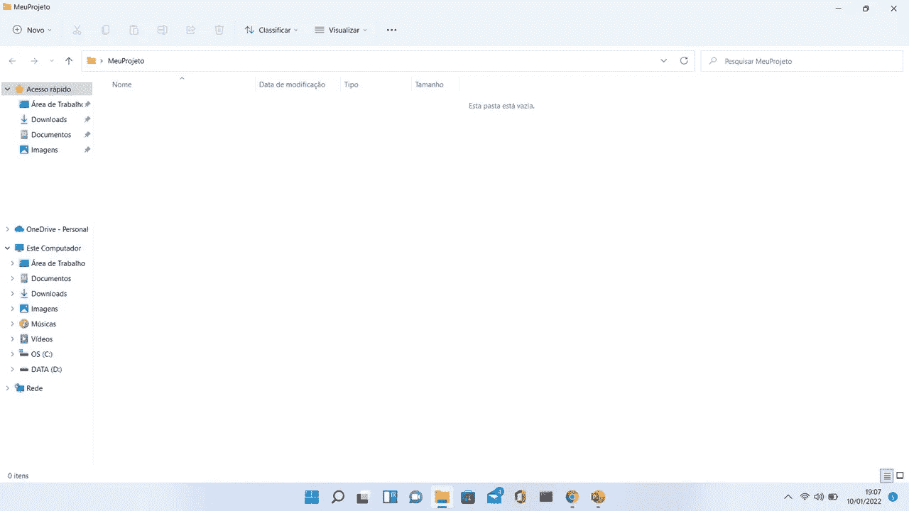
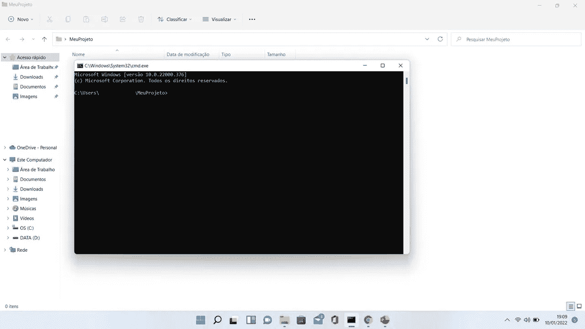
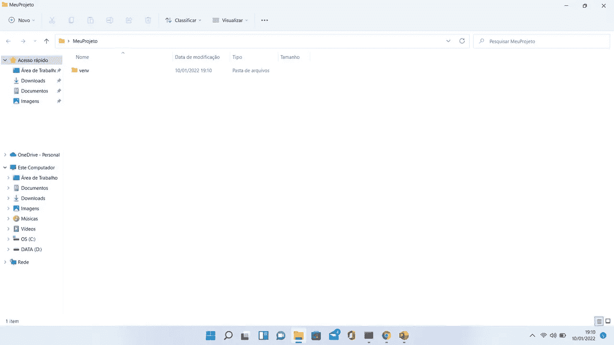
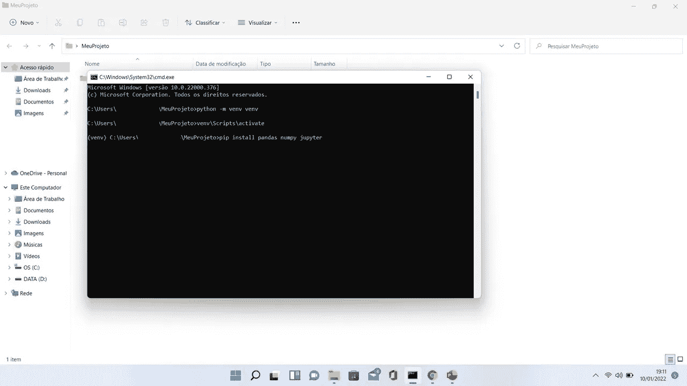
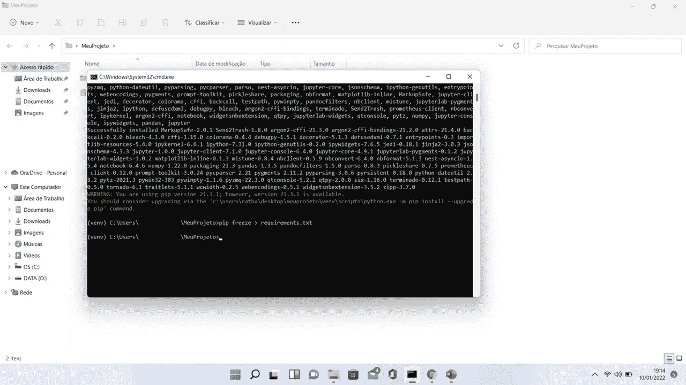
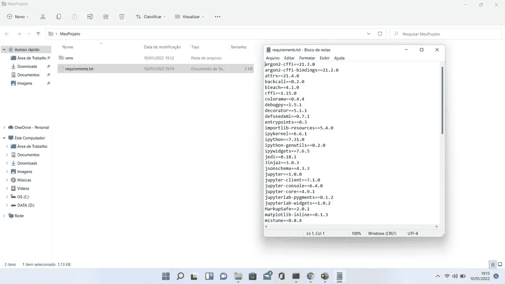

# 蟒蛇占了很多空间吗？创建您自己的虚拟环境

> 原文：<https://betterprogramming.pub/dont-use-anaconda-create-your-own-virtual-environment-7ceb8251f869>

## 通过创建自己的轻量级环境来节省磁盘空间


由[阿诺·弗朗西斯卡](https://unsplash.com/@clark_fransa?utm_source=unsplash&utm_medium=referral&utm_content=creditCopyText)在 [Unsplash](https://unsplash.com/s/photos/coding?utm_source=unsplash&utm_medium=referral&utm_content=creditCopyText) 上拍摄的照片

是的，我知道你一定在想什么？你说没有蟒蛇的生活是什么意思！

是的，但是我有几个原因。

蟒蛇好看吗？是的，它是。它被用于许多在线课程，但它的优势是它最大的弱点。

使用 Anaconda 很好，因为它包含了您的数据科学项目所需要的一切，这也是问题所在。

当我们进入数据项目的最后一步时，基本上是部署，我们希望它尽可能地轻量级。蟒蛇一点也不轻盈。最低 2GB 的内存使用量。

我甚至不需要告诉你这对你个人电脑的影响，对吗？！

为了保持您的开发环境简洁，您需要只使用您在该项目中使用的内容，跟踪每个特定项目中使用的库版本也是一个很好的实践。

我们如何做到这一点？

创造我们自己的虚拟环境，我将在下面向你们展示。

首先，创建一个文件夹:



文件夹 MeuProjeto

在此文件夹中打开 cmd 提示符:



然后，通过键入以下命令创建您的虚拟环境:

```
python -m venv <environment name>
```

您会注意到一个名为`venv`的文件夹出现在您的项目文件夹中:



之后，您不需要再次创建这个虚拟环境，您只需要使用以下命令激活它:

```
<environment name>\Scripts\activate
```

您会注意到一个(`venv`)出现在文件夹路径的前面，这表明您的虚拟环境是活动的。

最后，我们将安装一些库，在这里，我将安装:Pandas，Numpy 和 Jupyter:

```
pip install pandas numpy jupyter
```



好吧，但是我怎么知道我的项目的依赖关系呢？

简单，类型:

```
pip freeze > requirements.txt
```



这将创建一个 requirements.txt 文件，您可以与您的同事共享，并确保每个人都遵循您的环境的相同版本。



仅此而已。我知道，这比使用 Anaconda 要麻烦得多，但是所有的努力都是值得的。