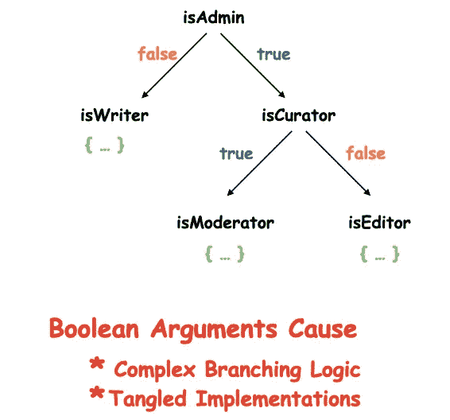

# 不要使用布尔参数，使用枚举

> 原文：<https://betterprogramming.pub/dont-use-boolean-arguments-use-enums-c7cd7ab1876a>

## 在代码中避免标志参数的情况


由 [Farzad Mohsenvand](https://unsplash.com/@farzadme?utm_source=medium&utm_medium=referral) 在 [Unsplash](https://unsplash.com?utm_source=medium&utm_medium=referral) 上拍摄的照片。

布尔是任何程序员学习的第一种数据类型。为什么不呢？它们是最简单的，只有两种状态:一个`true`和一个`false`。

虽然在代码库中使用布尔标志值来管理状态机很有吸引力，但随着代码的发展，这很容易导致代码的复杂性、可读性和可伸缩性问题。

一般来说，标志参数划分了函数的逻辑，迫使它根据值做不止一件事。这可能导致业务逻辑中复杂的实现。您的代码库很容易以下面的树形结构结束:



# 背景

让我通过一个故事来突出状态机和函数参数中布尔参数的弱点。

一组软件开发人员曾经构建了一个管理用户状态的模块。其中一个坚持使用布尔值，因为需求只有两种状态:`ONLINE`和`OFFLINE`。尽管大多数人不完全同意这个提议，他们还是继续进行下去，因为它看起来又快又简单。

最终，像下面这样的函数开始出现在它们的代码库中:

```
func setUserState(isUserOnline : Bool)
```

很快，一个新的开发人员加入了这个团队，他想知道下面这句话到底是什么意思:

```
setUserState(true) //The new guy just kept staring at this.
```

虽然其他人提出了一个更好的函数名(`setUserOnline`)，而且一开始看起来很好，但是一旦出现新的业务需求，要求包含另一个用户状态:`BLOCKED`，事情就变成了一场噩梦。他们有几种可能的方法将新状态包含到代码库中。让我们探索它们，看看它们如何影响代码，以及如何最终克服这个问题。

# 三态布尔问题

布尔通常表示两种状态。但是在一些语言中(比如 Java，通过使用`Boolean`对象)，我们可以使用`null`来分配第三种状态。所以在我们的上下文中，`BLOCKED`将被设置为`null`。虽然这似乎适应了新的用户状态而不需要额外的布尔值，但我们可以很容易地以`NullPointerExceptions`结束。

此外，在不同的场景中，区分`false`和`null`可能会变得棘手。例如，当`true`清楚地表明游戏处于播放模式时，布尔属性`game.isPlaying`。但是当它是`false`或者`null`的时候会发生什么呢？`false`是否表示游戏暂停或停止？

正如你所看到的，`false`没有足够的信息让我们容易地识别和回忆它所绑定的状态。三态布尔值只会使我们的逻辑变得复杂。

此外，当我们被要求包含另一个叫做`EXPIRED`的状态时会发生什么？显然，我们不能采用这种方法，因为我们现在有四个国家。所以让我们看看开发人员应用的另一种方法。

# 多个布尔带来隐藏的依赖

开发人员最终通过为新状态添加两个布尔参数扩展了先前函数的签名:

```
func setUserState( 
isUserOnline : Bool, 
isUserBlocked : Bool,
isUserExpired : Bool)
```

看起来像是满足业务需求的简单扩展，却不情愿地在代码库中引入了隐藏的依赖和许多新的组合。

创建的两个隐藏依赖项是`isUserOnline` — `isUserExpired`和`isUserOnline` — `isUserBlocked`。这迫使我们明确地管理额外的条件以避免冲突状态。例如，被阻止/过期的用户不能在线。以下是您需要处理的两种冲突状态的示例:

```
#Condition 1: isUserOnline: false and isUserExpired: true
#Condition 2: isUserOnline: false and isUserBlocked: true
```

随着您添加更多的状态，函数很容易变成一长串参数。事情变得不可持续，因为你会以大量的`&&`、`||`和其他复杂的分支逻辑来处理互斥和依赖的布尔。

# 布尔有类型安全和可读性问题

通过使用多个布尔值，也很有可能将它们混淆。您可能会传递一个错误的值(可能来自不同的对象),编译器甚至不会抱怨。在重构和进行代码审查时，这可能是一场噩梦，因为您需要编写大量的单元测试来捕捉这些问题。

此外，很容易忘记`false`或`true`值实际上对布尔变量意味着什么。理解充满布尔值的函数调用(如下所示)只会变得困难:

```
setUserState(true, false, false)
```

有人可能会说，今天许多编程语言都支持命名参数，这提高了函数的可读性。但是话又说回来，您可能会意外地传递一个相反的或不正确的布尔值，而函数签名仍然会匹配。

如果故事中的软件开发人员使用枚举而不是布尔，他们就可以避免这些麻烦。

# 偏好枚举，避免布尔

枚举数是一种数据类型，由一组命名值组成，可以以类型安全的方式使用。虽然它可能看起来不像 boolean 那么简单，但是使用 enum 或其他用户定义的类型可以帮助我们避免设置具有多个分支的复杂 if 语句。

```
enum UserStates{case active
case inactive
case blocked
case expired}
```

让我们看看在管理有限状态和函数签名时 enum 给表带来的好处。

## 1.枚举是清晰的和描述性的

枚举迫使您命名所有的状态，这使得理解它们的意思变得容易——从而创建一个自文档化的代码。此外，枚举清楚地表明这些值是互斥的，从而消除了冲突状态的疑虑。在函数中将枚举作为参数传递更加清晰，有助于我们避免神秘的布尔值。只需比较下面两行:

```
setUserState(true, false, false)//The version below is more concise and clearer.setUserState(UserStates.active)
```

## 2.枚举使缩放和重构更容易

扩展枚举器中的值集更容易，因为与布尔值不同，可能的状态组合的数量不会随着每个新的情况而加倍。此外，许多编译器足够聪明，能够指出您需要进行哪些更改来适应新的 enum 情况。例如，Swift 会引发一个错误。同时，在其他语言中，很容易查找 enum 中出现的所有情况。

用一个额外的新 case 扩展一个已经存在的 enum 只需要很少的工作，因为数据类型保持不变。这使得重构变得更加容易。

## 3.枚举是类型安全的

使用枚举，除了指定的值之外，不能分配任何值，因为它们是类型安全的。这使得意外交换值或传递无效状态变得不可能，因为编译器会发现它。

并非所有语言都支持本机枚举，在这种情况下，您可以创建自定义类型。例如，在 JavaScript 中，我们可以通过“冻结”对象中的常量来解决这个问题:

# 结束语

记住，布尔并不坏。如果你确定状态是二元且互斥的，或者当方法名已经描述了它时，在函数参数中使用它们是完全可以的(就像用`setEnabled(true)`)。但是通常情况下，需求会发生变化，并且会添加新的状态。

两个元素的枚举值得努力，并且比布尔标志更安全。枚举有助于使您的代码经得起未来考验，并消除跟踪布尔字段的需要。

布尔是最简单的，但是它们很容易被误用——或者说被滥用。

这一次到此为止。感谢阅读。