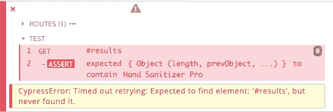

# 不要在你的 Cypress 测试中使用等待

> 原文：<https://betterprogramming.pub/dont-use-wait-in-your-cypress-tests-cbe14746da71>

## 固定柏树薄片

由[达瓦尔·帕尔马](https://unsplash.com/@dhaval?utm_source=unsplash&utm_medium=referral&utm_content=creditCopyText)在 [Unsplash](https://unsplash.com/s/photos/tech?utm_source=unsplash&utm_medium=referral&utm_content=creditCopyText) 上拍摄的照片

我最近做了一个非常奇怪的柏树测试。有时会通过，有时会失败。

有一天，由于这个测试，在三个部署管道失败后，我决定彻底改进它。

我得到的 Cypress 错误并没有告诉我太多。没有找到 DOM 元素，但这可能是由多种原因造成的。

Cypress 错误消息

当我打开测试时，它看起来像这样:

*免责声明:这是一个简化的例子*

你能发现问题吗？

剧透——问题在第四行:`cy.wait(1000)`。

搜索栏对服务器执行 API 调用。然而，在我们的 CI 环境中，这个 API 调用非常慢。这将导致 Cypress 在 API 仍在加载时搜索“Hand Sanitizer Pro”产品。

# 改进测试

解决这个问题的更好的方法是让 Cypress 等待 API 调用完成。

您可以通过以下方式实现这一点:

这里我们将`/search`路线标记为`search`。

接下来，通过调用`cy.wait("@search")`，Cypress 将在继续之前等待 API 调用完成。

此外，如果 API 调用由于某种原因失败，那么我们得到的 Cypress 错误会有用得多:

例如，这告诉我们 API 调用从来没有执行过。

# 潜得更深

通过使用`cy.wait("@search")`，您可以访问`XHR`对象。

这意味着您可以断言来自 Cypress 的 API 调用的某些事情。例如:

在这里，我们断言用带有值`Hand Sanitizer`的查询参数`q`调用`/search`端点。

您可以断言关于`XHR`对象的许多其他事情，查看 Cypress 文档以获得更多信息。

# 结论

我建议在等待 API 调用时总是使用这个——并且尽可能远离`cy.wait(seconds)`！