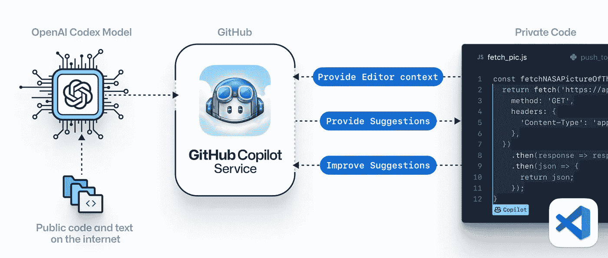
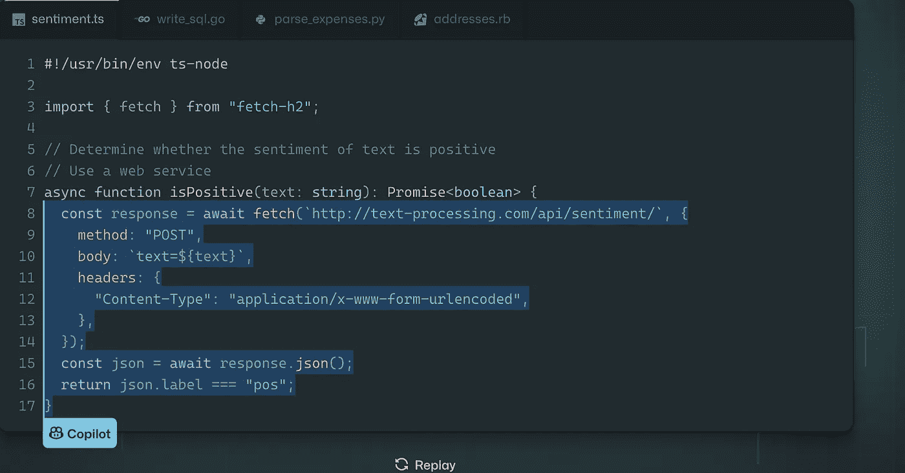
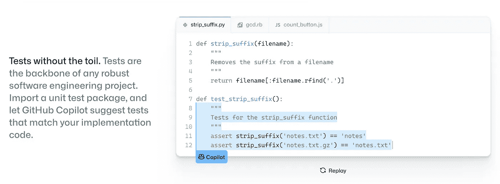
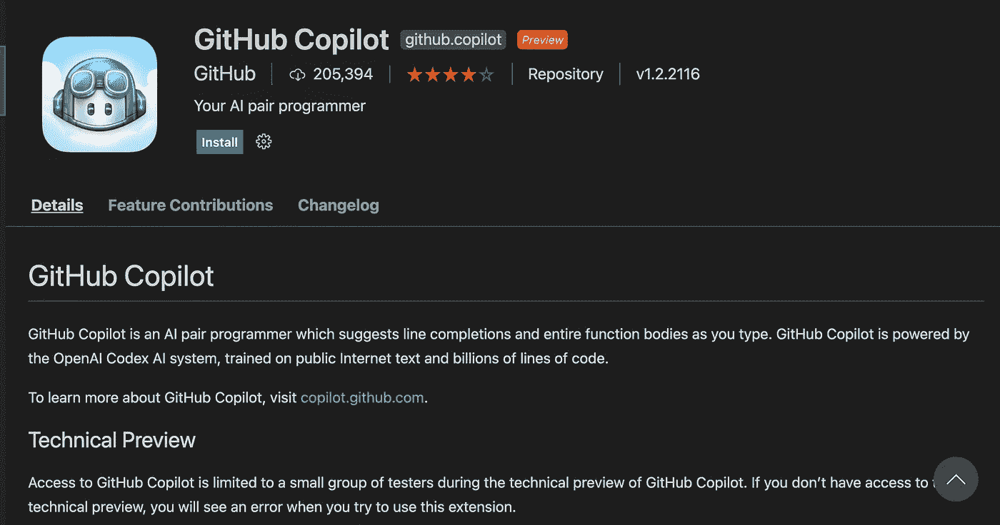
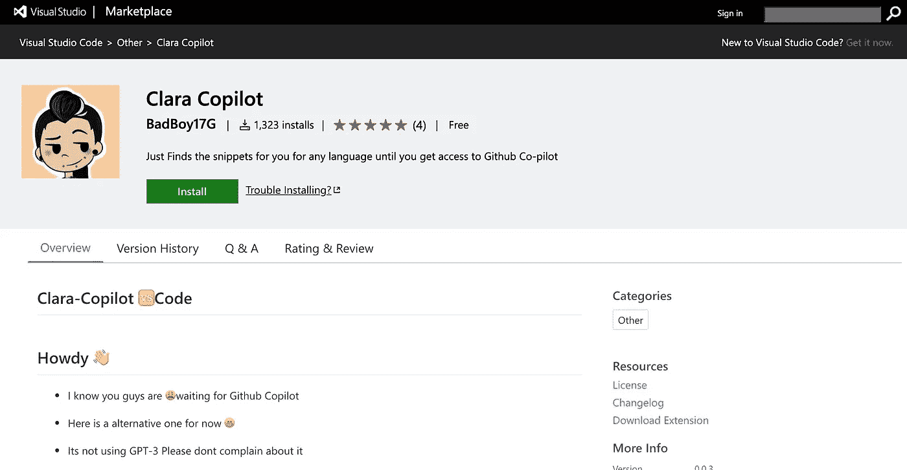
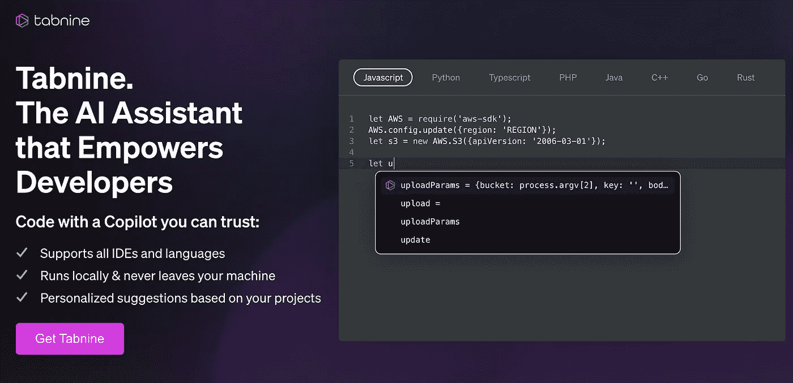
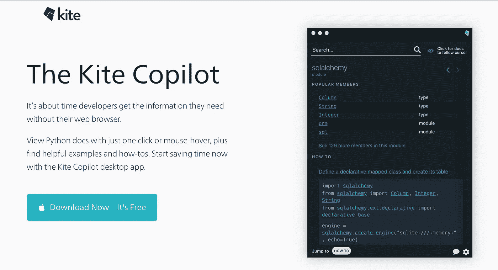

# 别担心，GitHub Copilot 不会让你的工作自动运行

> 原文：<https://betterprogramming.pub/dont-worry-github-copilot-won-t-put-your-job-on-autopilot-738a936a41bf>

## 开发者真的应该担心 GitHub Copilot 吗？也许不是


由 [Unsplash](https://unsplash.com?utm_source=medium&utm_medium=referral) 上的[西风航空服务](https://unsplash.com/@westwindairservice?utm_source=medium&utm_medium=referral)拍摄的照片

在软件开发领域有一个新工具，每个软件开发人员都对它很好奇。因为他们中的许多人甚至担心这是否会成为抢夺我们发展工作的恶魔。奇怪的是，这个工具是由几个开发人员开发的，它负责在其余开发人员的头脑中产生自我怀疑。听起来很惊人！

顾名思义，Github 副驾驶被认为是你的副驾驶。这个工具将帮助我们平稳地驾驶我们的船。首先，让我们讨论本文的目录，然后讨论 GitHub copilot。

```
Table of contents· [About: Github Copilot](#5789)
· [Benefits](#aa17)
  ∘ [1\. Companion](#3b6d)
  ∘ [2\. Learning](#b1cf)
  ∘ [3\. Testing](#e9a9)
  ∘ [4\. Language Support](#1810)
  ∘ [5\. VS Code Extension](#b8fe)
· [Possible Harms](#8d9c)
· [Alternatives of Github Copilot.](#3ab3)
  ∘ [1\. Clara Copilot (Got this from https://reddit.com)](#562b)
  ∘ [2\. Tab Nine](#c3f5)
  ∘ [3\. Kite Copilot for Python](#76f7)
· [Final Thoughts](#c2d3)
· [About The Author](#87e3)
```

# 关于:Github Copilot

所以 GitHub copilot 背后的议程是让开发人员的生活变得简单，让开发过程变得非常高效。根据官方网站，即 [Github 副驾驶](https://copilot.github.com/)，Github 团队报价

> Github 团队:你的人工智能与 GitHub Copilot 配对程序员，在你的编辑器中获得整行或整个功能的建议。

根据团队分享的视频，它看起来正确地完成了工作。该工具目前正在努力提高其性能，因为可能有许多行代码甚至无法编译，因为它将是基于用户注释、函数名等推断的代码。

如果我们谈论 Github Copilot 给出的一个典型建议的生命周期，我们可以说它试图理解你的编辑器的上下文，通过函数名或输入的注释，它将该上下文发送给 Github pilot 服务。反过来，它从 Github Copilot 服务中获得建议，这些建议可以在代码中使用。

改进是一个持续的过程，基于用户在给定建议中选择可用选项的选择，服务将改进其模型。该模型是由名为 OpenAI 的组织开发的 Codex 模型。

OpenAI Codex 模型将在互联网上给定的公共代码和文本上进行训练，基本上，由无数开发者完成的开源贡献。尽管有人声称给出的建议不会是互联网上任何代码的精确拷贝。

Open AI 发布了一篇研究论文引用了。

> 我们引入了 Codex，这是一个 GPT 语言模型，在 GitHub 的公开代码上进行了微调。Codex 的独特生产版本为 GitHub Copilot 提供动力。

法典模型是一个微调的 GPT 模型。使用 docstring 数据集评估 Codex 模型的结果如下。如果你想深入阅读这篇研究论文，你可以在这里找到。[点击到达](https://arxiv.org/pdf/2107.03374.pdf)

*   法典解决了大约 28.8%的问题。
*   GPT-3 解决了 0%的问题
*   GPT J 解决了 11.4%的问题。
*   从模型中反复采样后，上升到每个问题 100 个样本解决我们 70.2%的问题。



https://copilot.github.com/[的形象](https://copilot.github.com/)

到目前为止，关于 Github Copilot 的介绍可能已经足够了，您一定已经了解了该工具的基本内部工作原理。目前，该工具是基于意愿列表发布的。你可以通过访问[这个](https://github.com/features/copilot/signup)特定链接来注册同样的服务。

# Github Copilot 的优势

每当一个新的工具或软件进入市场，我们总是好奇它能为我们做什么，这个问题是百分之百合理的。

让我们讨论一下 Github Copilot 的总体优势，对于大多数软件开发人员来说，我把弄清楚它能为你做什么的任务留给了你自己。唷，大任务。
顾名思义，Github Copilot 将有助于我们的编码之旅

## 1.同伴

Github Copilot 将扮演一个副驾驶的角色，帮助我们提供建议，这些建议在搜索引擎的大量遍历之后需要更早地进行搜索。现在只需要一个合适的注释或函数名，你就可以找到相关的建议，它可能是你为特定问题考虑的解决方案的替代方案



Github Copilot 伴侣的图像

现在，您将有空间在几个不同的代码中进行检查，这将帮助您找出最节省空间和时间的正确解决方案。我们都同意软件开发就是为任何问题提供有效的解决方案。

## 2.学问

我们大多数人可能都没有想过，一旦我们有了建议，我们会学到什么，谁会阻止我们去做一个好的搜索。请记住，书籍也是在一个地方收集的信息。

一旦你读了一本书，你会对正在研究的主题有更多的了解，类似地，Github Copilot 做了所有建议解决方案的繁重工作，现在对于任何不同于以前的问题，我们有 5 种不同的解决方案。

我们自己知道至少一个或两个解决方案，现在我们可以将我们的解决方案与其他建议的解决方案进行比较。我们变得越来越博学，因为现在我们有更多的工作要做。我个人觉得这种心态不错。

## 3.测试

软件开发人员总是想要编写测试用例，但是只有软件开发人员知道正确编写测试用例的重要性。有了正确编写的测试用例，回归导致错误的机会变得非常小。但是，哦，上帝，我们都知道当我们写测试用例时，需要花费那些无聊的时间。

Github Copilot 是一个救星，现在我们只需要导入我们计划使用的测试框架，这个工具会给我们一些测试用例，对我们有帮助。



Github Copilot 测试案例图片。

## 4.语言支持

Github Copilot 会说很多语言 JavaScript、TypeScript、Ruby、Python 和 Go，但它懂几十种语言。因此，正如承诺的那样，它可以帮助我们学习几乎任何其他编程语言。所以，对于所有的软件开发者来说，这似乎是一个好消息。

## 5.VS 代码扩展

另一个好消息是，它是 Visual studio 代码的扩展。无论我们在本地机器还是代码空间运行 visual studio 代码，我们都可以安装扩展并开始享受 GitHub Copilot 的建议。

目前，该扩展处于预览阶段，已经有 2，05394 名开发者安装了该扩展，并获得了 5 颗星的奖励。所以我们可以推断开发者已经喜欢上它了。



https://copilot.github.com/的形象

# 可能的伤害

浅谈 Github Copilot be 可能造成的危害

> 对它不会自动驾驶的担心从副驾驶变成了自动驾驶仪。

大多数开发人员担心这可能会抢走他们的工作，失业的可能性非常小，因为如果你至少参与过一个大项目，你必须意识到这样一个事实，即在开发软件项目时，逻辑构建的复杂性是人工智能目前无法处理的。

因为该项目是在个人层面上开发的各种组件的组合。这种结合是无法借助人工智能丰富的工具来完成的。截至目前，我还想不出这种转变会在不久的将来发生，但科学总是在发展的。

# Github Copilot 的替代品。

## 1.克拉拉副驾驶

[克拉拉](https://marketplace.visualstudio.com/items?itemName=BadBoy17G.clara-copilot)根据开发商的说法，副驾驶有点接近 Github 副驾驶，这基本上是一个很好的选择。Clara copilot 使用了 Grepper API，使用它我们可以从 google 搜索结果中获得代码示例。它支持 40 多种语言，所以你可以得到你所知道的任何语言的代码片段。

但它不是人工智能或 GPT 3 号。它基于 [Grepper API](https://www.codegrepper.com/)



[源代码](https://github.com/badboysm890/clara-copilot)

## 2.标签九

[Tab nine](https://www.tabnine.com/copilot-vs-tabnine) 是另一个提供功能自动完成工具的扩展，我们无法将其与端到端的 copilot 进行比较。但是它已经被软件开发社区广泛使用。

正如他们官方网站上声称的那样，Tab Nine 已经被大约 100 万开发者在所有编程语言中使用。



选项卡九的屏幕截图

## 3.Python 的 Kite 副驾驶

[Kite](https://www.kite.com/copilot/) copilot 将帮助我们在文档上点击鼠标或点击许多待办事项。所以你不需要去特定的文档来阅读这个主题。



风筝副驾驶的截屏。

# 最后的想法

因此，我们或许不应该担心 Github Copilot 会抢走我们的工作，而是应该将它视为另一种提升技能的工具，通过避免编写冗余代码，这将有助于节省大量时间。

我们已经掌握的代码应该留给 AI 来为我们编写，我们现在应该专注于首先将已经掌握的代码与 Github Copilot 或另一个类似的工具进行比较，其次进行只有我们才能执行的新的创新任务，如改进整体代码结构，使用哪种技术等。

我已经注册了 Github Copilot 预览版，目前在等待名单上，所以我强烈推荐你们所有人至少试用这个工具几天。如果你觉得这对你更好，考虑使用它，否则，这个世界充满了更多这样的机会，如果不是创造一个。下面是注册的[链接](https://copilot.github.com/)。


Github Copilot 等候名单图片

希望现在你已经对 Github Copilot 的工作原理有所了解，这也是这篇文章的主题，请在 Github Copilot 的评论中分享你的想法，我很乐意听到。

Apoorv Tomar 是软件开发者，也是[mind bake](https://mindroast.com/)的创始人。你可以在推特上和他联系。