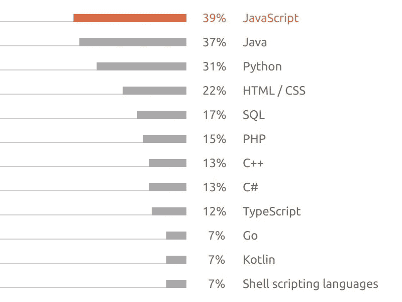
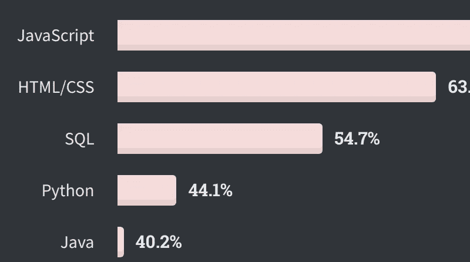
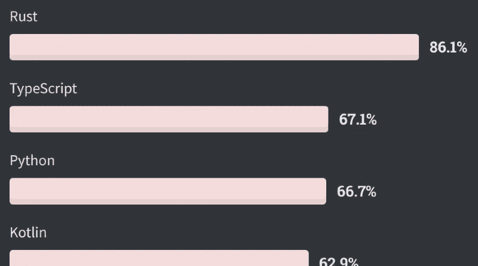
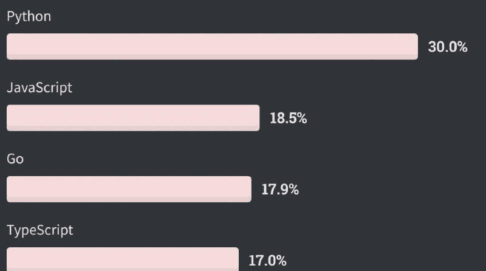

# 别担心，Python 不会消失

> 原文：<https://betterprogramming.pub/dont-worry-python-isn-t-going-away-1237d6c46f01>

## 至少短期内不会

托尼·卢奇在 [Unsplash](https://unsplash.com?utm_source=medium&utm_medium=referral) 上拍摄的照片。

在过去的几个月里，很多人开始谈论 Python 将如何被其他更新的编程语言所取代，比如 Julia、Rust、Go 等等。然而，我想讨论一下数据实际显示了什么，我会让你们得出自己的结论。

让我们从反对 Python 的一些论点开始。

# Python 怎么了

有许多反对 Python 的论点，以及其他语言如何填补这一空白或解决一些问题。让我们来看看反对 Python 的一些观点。

## 速度

Python 是*慢*。众所周知，Python 无法与 C++、Go 或 Rust(以及其他)这样的编程语言并肩作战，但有时速度并不代表一切。Python 可能不是最快的编程语言，但是通过正确的设置、库和编码，它可以支持海量数据并处理海量数据。不要迷恋原始速度。大多数时候，你不需要它。此外，Python 的简单性和开发人员的可用性可以很好地弥补速度的不足。

## 类型

尽管 Python 支持使用[Python 3.6-typing](https://docs.python.org/3/library/typing.html)的类型，但是当您可以在 IDE 上使用类型注释变量以获得更好的代码完成时，Python 仍然会使用动态类型处理该变量，而不执行任何验证。如果你想进行类型验证，你需要自己去做——或者更好，使用 Python 库，比如 [Pydantic](https://pydantic-docs.helpmanual.io/) 。

有一些使用 Python 类型的好框架，比如 FastAPI，我们在上一篇文章的[中提到过。](https://medium.com/better-programming/quickly-develop-highly-performant-apis-with-fastapi-and-python-4ac1f252c935)

## 它是旧的

我不敢相信这是一场真正的争论，但看起来确实如此。是的，Python 是 90 年代的产物，比它的一些竞争对手多用了几年时间，但它仍然相当稳固。随着时间的推移，它不仅变成了一种伟大的编程语言，而且还构建了一个伟大的社区、一个巨大的库存储库等等。有些问题可以追溯到当时被认为是最佳实践的时候，但是它们已经不再是重要的问题了。年纪大本身并不是一个缺点。

# 拯救数据

为了理解为什么我认为 Python 不会很快消失，我们将关注数据——公正的(也许)简单的老式数据。

## 2020 年开发者生态系统的状态

我们将从回顾 Jetbrains 最近的一份报告开始，在报告中，他们“结合了第四次年度开发者生态系统调查的结果和他们在 2020 年初调查的 19，696 名开发者的反馈，以确定围绕工具、技术、编程语言和开发世界许多其他令人兴奋的方面的最新趋势。”

调查中的第一个相关问题是“你的主要编程语言是什么？”Python 位于第三位，仅次于 JavaScript 和 Java。但如果我们看下一个问题(“你是否计划在未来 12 个月内采用或迁移到其他语言？如果有，给哪些？”)，我们可以看到很多 Java 开发者打算学习或者迁移到 Python。所以 Python 的采用率实际上是在增长而不是萎缩。

JetBrains 年调查—主要编程语言。

该调查还有其他非常有趣的部分，超出了本文的范围，所以我建议您完整阅读。或者你可以阅读 [Python 部分](https://www.jetbrains.com/lp/devecosystem-2020/python/)，那里他们谈论了 ide、Python 的用途以及其他有趣的东西。

## StackOverflow 2020 开发者调查

这可能是最大和最重要的[发展调查](https://insights.stackoverflow.com/survey/2020)。它有很多有见地的问题，但是让我们看看开发人员对编程语言，特别是 Python 有什么看法。

在报告中，其中一个指标是技术的普及程度，结果如下:

StackOverflow 年开发者调查—最流行的编程语言。

Python 排在 JavaScript、HTML/CSS 和 SQL 之后，位列第四。如果我们只关注编程语言，它将在 Java 之上排名第二，这与之前的调查不同。然而，我们仍然可以看到人们跳过 Java 转向 Python 的趋势。

现在事情变得有趣了。调查中最受欢迎的部分是“最喜爱、最害怕和最想要的语言”让我们看看 Python 在这些类别中的表现:

2020 年 StackOverflow 开发者调查—最受欢迎的编程语言。

2020 年 StackOverflow 开发者调查—最受欢迎的编程语言。

再次强调，Python 是仅次于 Rust 和 TypeScript 的第三受欢迎的编程语言，也是最受欢迎的编程语言。

这份调查非常棒，如果你还没有看过的话，值得一读。

# 结论

Python 有它的缺点:速度，有点老，老概念。尽管如此，它仍然是一个主要的参与者，显然是一个顶级的竞争者，并且广泛应用于从 web 开发到物联网和数据科学的各种项目中。

看到这些数字后，我明白 Python 不会很快消失。也许有一天会有所不同，但是 Python 仍然是一门值得学习、探索和掌握的语言。

感谢阅读！