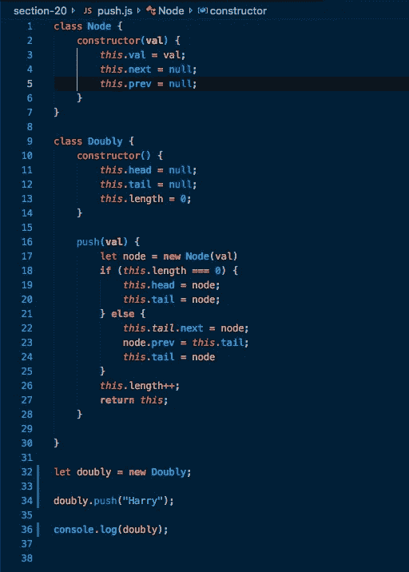
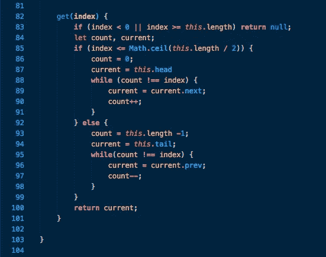
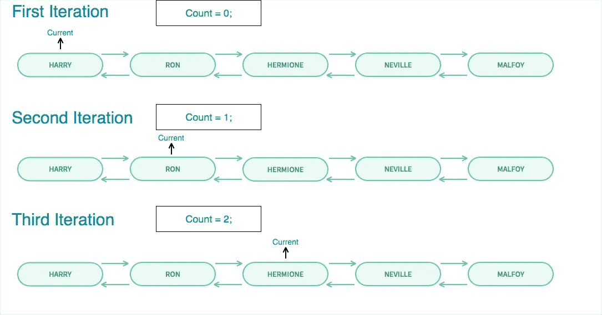
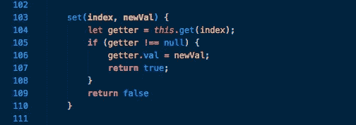
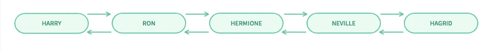
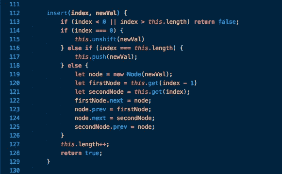
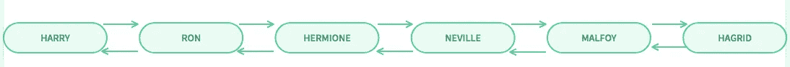

# 加倍使用链表，第二部分

> 原文：<https://betterprogramming.pub/doubling-down-on-linked-list-pt-2-94fea6557e31>

## 关于双向链表的更多信息—查看节点

欢迎来到第二部分*加倍链表*。如果你想读第一部分，你可以在这里做:[加倍链表 pt。1](https://medium.com/@joeephus/doubling-down-on-linked-list-pt-1-5608f4f15022) 。在这一部分中，我们将学习更多的双向链表的方法，比如获取一个特定的节点，设置一个节点值，以及插入一个新的节点。这些方法比第一部分中的方法稍微复杂和冗长一些，但是不用担心，它们都只是数据，而您是数据的主人！

二进制流下屏幕。由 [xponentialdesign](https://giphy.com/xponentialdesign/) 制作的 Gif

我们要研究的第一个方法是`get`方法，它将建立一些其他的方法，比如`set`和`insert`。为此，我将展示我们在第一部分中创建的双向链表，并去掉除 push 方法之外的所有方法，这样我们就可以添加节点，然后用`get`遍历它们并找到它们。所以双向链表现在看起来像这样:



采用推方法的双向链表

所以，重述上一段:这里我们有两个双向链表需要的类。我把这个列表命名为`Doubly`，它比`Doubly Linked List`要短得多，或者你可以把这个类命名为`DLL`，真的随你喜欢。

`Node`类将被插入到双向链表中——它将有一个值和两个指针。一个指向下一个节点，一个指向上一个节点。到目前为止，还没有办法遍历这个列表——这是本文将介绍的第一个新方法。如果你仍然想知道这里发生了什么，请回到[的第一部分，在链表](https://medium.com/better-programming/doubling-down-on-linked-list-pt-1-5608f4f15022)上加倍并阅读它。



双向链表获取方法

将被添加到`Doubly`(我们的双向链表)中的一个较长的方法是`get`方法。对于这个方法，我们传入一个索引，即我们试图检索的索引，并返回带有该索引的节点。

首先，让我们检查以确保传递的索引确实是一个有效的数字，并且可以在我们的双向链表中找到。可能数字超过了长度，也可能小于 0——这两种情况都意味着无法返回节点，因为它不在列表中。

让我们现在通过快速检查来防范这种情况。假设我们的列表中有四个节点，如果传递给 get 方法的数目不在 1 到 4 的范围内，它看起来会像这样:

```
doubly.get(6) // should return null, undefined or -1
doubly.get(-2) // should also return null, undefined, or -1
```

如果列表包含四个节点，这意味着长度是四——六和负二都在这个范围之外。我们没有继续，而是立即中断这个函数，以确保我们不会在以后陷入麻烦。当涉及到链表时，总是最好呆在自己的领域内！

既然已经解决了这个问题，让我们来看看有效的索引。如果列表中有四个节点，每个节点都有一个字符串值，第一个节点，也就是我们的列表头，有一个值“哈利”，第二个“罗恩”，第三个“赫敏”，第四个“纳威·隆巴顿”，第五个也是最后一个节点，也就是我们的尾巴，有一个值“德拉科马尔福”。加倍现在看起来像这样:


具有哈利波特字符串值的双向链表中的节点

现在我们有一个五节点长的列表。让我们看看如何为双向链表实现一部分`get`方法。

```
let count, current; 
if (index <= Math.ceiling(this.length / 2 )) {
  count = 0; 
  current = this.head;
// if the index is less than half of the list 
// start from the beginning of the list and move towards the back
} else { 
  count = this.length - 1; 
  current = this.tail;
// if the index searched for is more than half the length
// start at the back of the list and work towards the front
}
```

在这个方法中，我们首先定义两个变量，分别用名称`count`和`current`声明，目前没有给它们赋值。

使用`if`语句的原因是为了根据索引将遍历列表的时间减少一半。如果索引小于列表长度的一半，则应该从头开始，否则应该从末尾开始。这是一个小的优化，但是如果有一百万个节点要遍历，那么最好用一个简单的 if 语句将它减少到 500，000 个！这并不是这个方法的一部分，但肯定不会造成伤害。

接下来，因为我们要寻找的索引是 2，我们会遇到`if`语句中的代码，count 将被赋予 0 值，current 将被设置为`this.head`。现在已经清楚我们是从开头还是结尾开始了，接下来需要做的是实际遍历列表。所以代码看起来会像这样:

```
let count, current; 
if (index <= Math.ceiling(this.length / 2 )) {
  count = 0; 
  current = this.head;
  while (count !== index) {
    current = current.next;
    count++;  
  } 
} else { 
  count = this.length - 1; 
  current = this.tail;
  while (count !== index) {
    current = current.prev;
    count--;  
  } 
}
return current;
```

这些`while`循环只是陈述:当计数不是索引时，继续运行直到它成为索引，当它成为索引时，中断循环。我们遍历的方式是，在循环的每一次迭代中，当前变量会跟踪我们在哪个节点上。因为我们寻找的索引是 2，我们将从头部开始向前遍历。这是我们列表的每次迭代的样子:



创建的双向链表中节点的表示

所以第一次迭代，count 为零，index 为二，所以当前变成了`current.next`，也就是`ron`，现在 count++之后 count 为 1。然后它再次检查是 1！== 2，为真所以再次运行。现在电流变成了带`Hermione`的节点，计数为 2。最后一次检查，是 2！== 2，并且它实际上是相等的——这导致 false，并且循环被中断。现在电流等于赫敏节点，我们就返回电流。

现在 doubly 上的`get`方法已经完成，为特定节点实现我们的 set 方法变得非常容易。假设你想把尾巴的值从马尔福改成海格，但不做其他任何事情。Aquick set 方法非常适合这种情况:



现在我们有了一个 get 方法，我们可以将该方法用于 set 方法，省去了每次查找节点的麻烦:

```
doubly.set(4, "Hagrid")
// getter will be set to this.get(4) which as of right now is Malfoy. 
// If getter is not null, meaning in this case the numbers 0-4 were used 
// The value of the 4th node is now the second argument (newVal) 
// Next return true or the new list whichever is your preference. 
// If the node doesn't exist, it will automatically return false. 
```

将节点设置为海格后，我们的新列表将如下所示:



使用 set 方法后的新列表

与`get`方法相比，这很简单。当你写的代码可以在其他地方使用时，这是一件美好的事情——而且应该更平常。我们的 helper 函数并没有在列表中搜索`get`方法的索引，而是将所有的工作从遍历特定的节点中移走。

最后，让我们插入一个新节点。假设我们对替换马尔福感到很难过，想让他回到我们的哈利波特阵容中。我们会把他放在纳威和海格中间。插入的代码将如下所示:



双向链表的插入方法

首先，我知道这比 set 方法的代码多得多，但是我们插入了一个新的节点，这带来了一点链接负担。对于 set，我们只是替换值，节点保持不变。使用 insert，我们创建了一个新的节点，然后我们需要确保指针(。接下来。prev)连接到周围的节点。好消息是我们可以使用已经定义好的函数。所以，让我们一行一行地分解它:

```
insert(index, newVal) {
  if(index < 0 || index > this.length) return false 
  // We cannot insert a new node properly if it 
  // does not fall within the range of the list. 
}
```

既然已经为不工作的情况设置了案例，那么让我们弄清楚它应该如何工作的功能:

```
insert(4, "Draco Malfoy" ) {
  if(index < 0 || index > this.length) return false   if (index === 0) {
    this.unshift(newVal) 
      // If it is the first element, use the
      //unshift method defined in Doubling Down on Linked List pt. 1 } else if (index === this.length) {
    this.push(newVal)     
      // If it is the last element use the push method earlier defined } else {
    let node = new Node(newVal)
      // Create a new node with a value of newVal 
    let firstNode = this.get(index - 1 )
    let secondNode = this.get(index) 
      // Committing the variables to memory for later reference. 
    firstNode.next = node
      // set the next pointer of what is in the 4th index to
      //reference our new node
    node.prev = firstNode 
      // Make sure the pointer points back 
      // creating a bidirectional relationship
    node.next = secondNode 
      // the new node should point to the node that was after 
      //the firstNode since it's taking it's place in the index
    secondNode.prev = node 
      // It needs a pointer, pointing backwards referencing 
      // the new node
  }
  length++ // increase the length because we've added a node
  return true // can return true or whatever you'd prefer
}
```

虽然这看起来像很多代码，但它如此冗长的唯一原因是因为我们需要设置新节点和以前连接的节点之间的关系。我们的新节点有指向正确节点的`previous`和`next`指针，其他节点指向它。在纳威和海格之间插入马尔福后的列表应该是这样的:



在我们用插入物把马尔福放回石膏后列出

这就是——一个非常交互式的双向链表。

在这和第一部分中的[加倍链表之间，我们添加了许多方法，包括 push、pop、shift、unshift、get、set 和 insert。](https://medium.com/better-programming/doubling-down-on-linked-list-pt-1-5608f4f15022)

一如既往，这些文章的灵感来自柯尔特·斯蒂尔和他在 Udemy 上的大师班，你可以在这里找到——[柯尔特·斯蒂尔的 Javascript 大师班](https://www.udemy.com/js-algorithms-and-data-structures-masterclass/)。我怎么推荐那个课程都不为过。

我真的希望这些视觉效果和注释能有所帮助，当然，如果你有什么想让我补充或让我知道的，请随时留下评论或直接给我写信。非常感谢你的阅读！