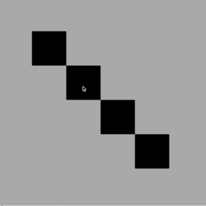
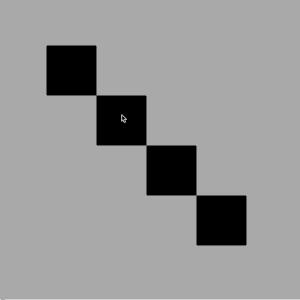

# JavaScript 中的线性插值拖放

> 原文：<https://betterprogramming.pub/drag-and-drop-with-linear-interpolation-in-javascript-9e5dc779bc23>

## 使用普通 JavaScript 利用线性插值实现平滑和高性能的拖放 UX


在 [Unsplash](https://unsplash.com?utm_source=medium&utm_medium=referral) 上[艾哈迈德扎·萨贾迪](https://unsplash.com/@ahmadreza_sajadi?utm_source=medium&utm_medium=referral)拍摄的照片。

最近，我写了一篇关于使用普通 JavaScript 实现拖放功能的文章。这一次，我想对拖动逻辑应用线性插值，以便可拖动对象平滑地“赶上”用户的光标/触摸点，而不是紧随其后:



没有线性插值。



使用线性插值。

# 基础知识

[线性插值](https://en.wikipedia.org/wiki/Linear_interpolation)是一种在已知状态之间投影数据的方法。在拖放功能的情况下，它可以用来创建可拖动元素的当前和未来位置之间的坐标，以便我们可以创建这两种状态之间的平滑过渡。我们将要使用的基本功能是:

```
function lerp(start, end, amt) {
  return (1-amt)*start+amt*end
};
```

*   `start` —代表起始状态(数字)
*   `end` —结束状态(数字)
*   `amt` —介于两者之间的插值量(0.0 到 1.0)

因此，如果我们的起始坐标是 100，结束状态坐标是 200，并且我们要为每个重绘循环(~frame)插值的量是 0.1，则:

```
Frame 1 = (1-0.1)*100 + 0.1*200 = 110;
Frame 2 = (1-0.1)*110 + 0.1*200 = 119;
Frame 2 = (1-0.1)*119 + 0.1*200 = 127.1;
...
Frame N = (1-0.1)*199 + 0.1*200 = 199.1;
```

现在，如果我们考虑一个拖放用例，上面的函数会创建一系列坐标，被拖动的元素需要通过这些坐标进行转换。

# 初始设置

下面是附加基本拖放功能所需的侦听器的初始代码:

初始 HTML

初始 CSS

上面的代码呈现了一个容器，这个容器将有事件监听器附加到它上面，还有一些框将在以后变得可拖动。现在，我们将添加 JavaScript，它可以在不移动任何东西的情况下进行拖放操作:

JS 的基本设置

## 几个音符

*   我们正在使用[指针事件](https://developer.mozilla.org/en-US/docs/Web/API/Pointer_events)，它提供了触摸和鼠标输入的混合，以支持现代设备和交叉输入。
*   我们附加了被动侦听器，并且动态地这样做以防止事件污染，所以每次只有必需的侦听器是主动的。
*   我们的 CSS 使用了`touch-action`和`user-select`规则来确保我们不会触发任何默认的浏览器行为(滚动、本地拖放等)。
*   我们还使用`[pointercancel](https://developer.mozilla.org/en-US/docs/Web/API/Element/touchcancel_event)`监听器处理中断的触摸事件，并像对待`pointerup`一样对待它。

# 添加线性插值

考虑到用户体验，我们需要假设插值应该在用户按下指针后变为“活动”，然后在用户释放指针后变为“非活动”。所以需要在`pointerdown`和`pointerup/pointercancel`事件之间不断调用我们的 LERP(=线性插值)函数。

当然，我们可以利用`[setInterval](https://developer.mozilla.org/en-US/docs/Web/API/WindowOrWorkerGlobalScope/setInterval)`，但是更好的选择是[RequestAnimationFrame API](https://developer.mozilla.org/en-US/docs/Web/API/window/requestAnimationFrame)，因为它为我们提供了精确的 60fps (1000ms/60=~16.7ms)渲染帧计时器。

让我们实现这一部分:

现在，我们所有的方法都被正确调用，我们可以实现允许我们使用插值坐标重新绘制盒子的逻辑:

*   首先，我们需要确保在`pointerdown` 和`pointermove` 事件上，我们开始获取输入坐标(`inputX`，`inputY`)，这些坐标将由我们的 LERP 函数在每个动画帧中使用。
*   接下来，我们需要确保我们还捕获了一个[客户端边界矩形](https://developer.mozilla.org/en-US/docs/Web/API/Element/getBoundingClientRect)，我们将使用它来计算我们的可拖动框的中心点，确保框的中心“赶上”用户的指针，而不仅仅是左上角。

完整的实现如下:

# 结论

我们刚刚利用基本的线性插值在纯普通 JavaScript 中实现了一种不同的拖放体验:

*   我们使用了现代指针事件 API。
*   代替`setInterval`，我们利用了 RequestAnimationFrame API。

线性插值是为用户创建平滑拖动体验的好方法，尤其是在需要确保用户的光标/触摸输入点不总是被可拖动元素阻挡的情况下。

完整演示可通过 codepen.io 获得:

感谢您的阅读！