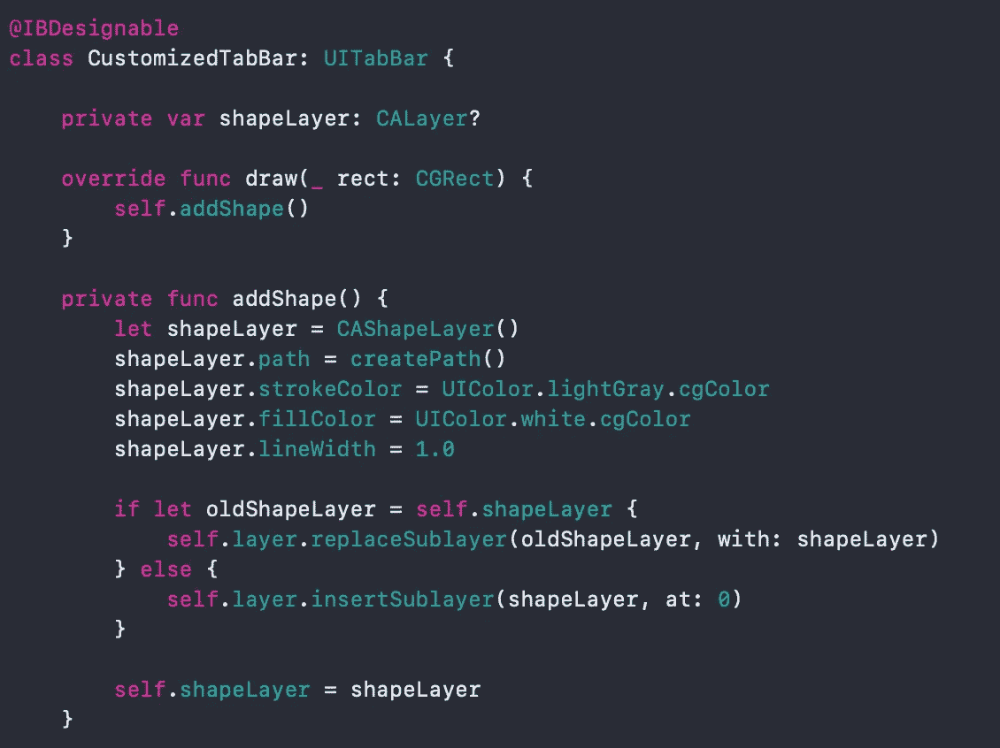
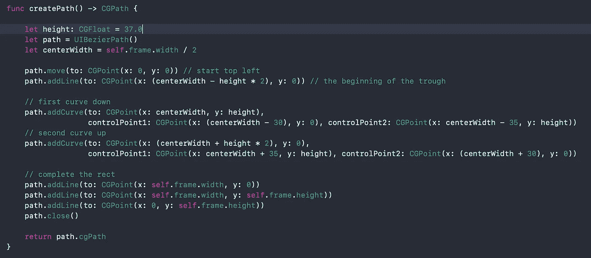
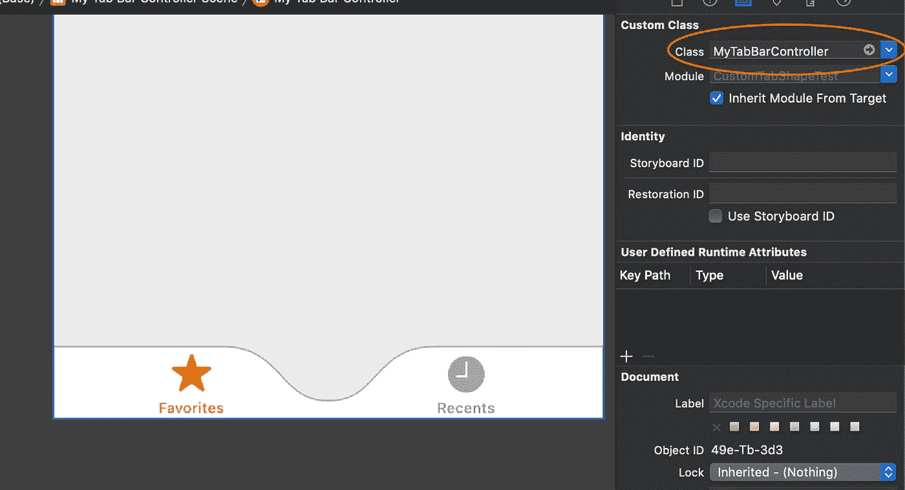
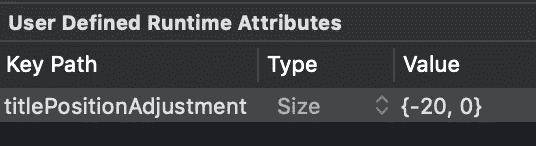
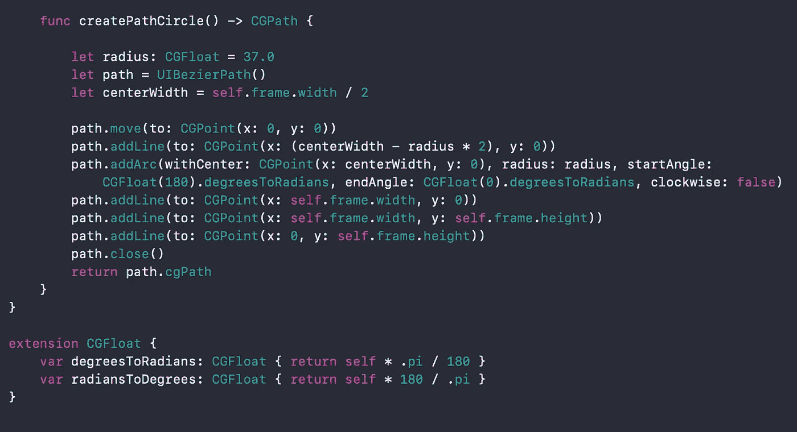

# 如何在 iOS 中绘制自定义 TabBar 形状

> 原文：<https://betterprogramming.pub/draw-a-custom-ios-tabbar-shape-27d298a7f4fa>

## 让你的 TabBar 更有趣一点

图片来源:作者

在阅读了一篇关于如何创建一个自定义的 Android 底部条形状的文章后，我问自己如何在 iOS 上存档相同的形状。以上是我想建立的布局图像。

首先，我们需要创建一个自定义的`IBDesignable` `UITabBar`类，并覆盖 draw 方法。这里我们需要在视图层中插入一个子层。在创建的图层中，我们定义内部颜色、描边颜色和我们想要绘制的路径。此外，我创建了一个开关来替换已经存在的层。这样，布局也支持方向更改。

由于绘制路径需要更多的代码，我将其提取到一个单独的方法中。

自定义`TabBar` 的实际绘制在`createPath` 方法中实现。在`[UIBezierPath](https://developer.apple.com/documentation/uikit/uibezierpath)`的帮助下，我们从左上角到缩进的开始处画一条线。这里变得有点棘手(至少对我来说)。我通过反复试验得到了正确的[贝塞尔曲线](https://en.wikipedia.org/wiki/B%C3%A9zier_curve)和[这个漂亮的工具](https://www.desmos.com/calculator/cahqdxeshd)。

完成曲线后，我们只需要连接`UIBezierPath`的缺角。

当我们在界面构建器中将`TabBar` 的类设置为自定义`TabBar`时，我们已经可以看到新布局的预览。

为了向缩进添加一个按钮，我简单地在两个`ViewController`中创建了一个大小为 70 x 70 的按钮。对于布局，我使用了约束，在视图中将按钮水平居中，并将其垂直中心添加到`TabBar`的底部。为了给按钮加圆角，我使用了`layer.cornerRadius`键路径，并将其设置为 25。另外，不要忘记启用“剪裁到边界”

你可能会注意到图标相对于缩进并没有真正居中。我发现没有比给`UITabBarItem`设置`titlePositionAdjustment`的关键路径更好的解决方案了。左边的项目移动-20，右边的项目移动 20。

通过执行这个项目，您将得到一个看起来与所请求的布局一模一样的 UI，但是缺少一样东西:按钮的点击区域。
为了避免`TabBar`通过点击下方区域的按钮接收触摸事件，我们需要覆盖`TabBar` 的 point-inside 方法，并在按钮被点击时返回`false`。

就是这样！

如果你不喜欢贝塞尔曲线，你也可以选择圆形:

你可以在 GitHub 上找到一个例子项目:【https://github.com/Monntay/CustomTabBarShape[。](https://github.com/Monntay/CustomTabBarShape)