# 在 Android 中绘制自定义视图

> 原文：<https://betterprogramming.pub/draw-custom-views-in-android-a321fa157d60>

## 获得对视图的控制，同时优化性能


照片由 [JJ 英](https://unsplash.com/@jjying?utm_source=unsplash&utm_medium=referral&utm_content=creditCopyText)在 [Unsplash](https://unsplash.com/?utm_source=unsplash&utm_medium=referral&utm_content=creditCopyText)

# 介绍

作为开发人员，我们每天都在使用 XML 设计不同种类的 UI，但是学习定制视图是一件非常容易的事情。利用定制视图的好处，避免样板代码的重复。

Android 提供了一组很好的预建小部件或布局来构建 UI，但这些东西无法满足我们在应用程序中的每一个要求。这就是自定义视图发挥作用的地方。我们需要创建一个视图的子类。创建自己的视图子类可以让您精确控制屏幕元素的外观和功能。

在开始定制视图之前，最好了解一下[视图生命周期](https://medium.com/@pavan.careers5208/the-life-cycle-of-a-view-in-android-6a2c4665b95e)。

## 为什么要自定义视图？

由于大多数自定义视图比常规视图更耗时，因此只有在没有其他更简单的方法来实现某个功能，或者您有以下任何问题可以通过使用自定义视图来消除时，才应该使用自定义视图:

1.  性能:如果您的布局中有许多视图，并且您希望通过绘制一个单独的自定义视图来优化它们，使其更明亮
2.  难以操作和支持的复杂视图层次结构
3.  需要手动绘制的完整自定义视图

# 基本概述

要开始创建定制视图组件，我们需要遵循下面的基本步骤:

1.  创建一个类并扩展基本视图类或子类。
2.  提供构造函数来使用 XML 中的属性。
3.  重写超类中的一些方法。如 onDraw()、onMeasure()等方法。
4.  一旦完成，您的新扩展类就可以用来代替它所基于的视图。

# 例子

在我的一个项目中，我需要创建一个循环的 TextView 来显示通知的数量。这里我们需要创建一个 TextView 的子类。

步骤 1:创建一个名为 CircularTextView 的类。

第二步:扩展TextView 小工具类。现在，IDE 在 TextView 上弹出一个错误，说这个类型有一个构造函数，必须在这里初始化。

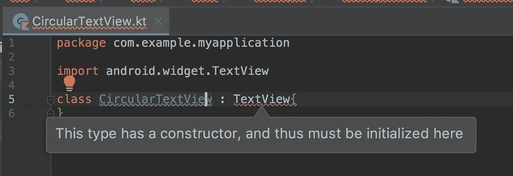

步骤 3:向类中添加构造函数。

这可以通过两种方式实现

一种方法是向类中添加构造函数，如下所示。

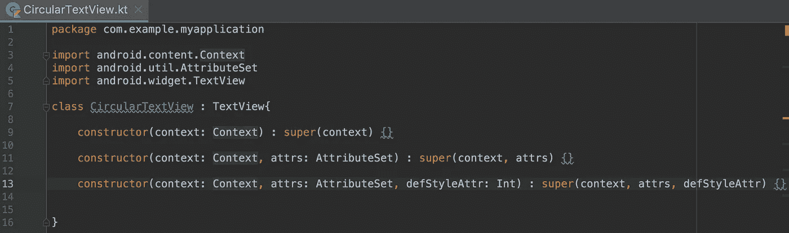

另一种方法是将@JvmOverloads 添加到构造函数调用中，如下所示。

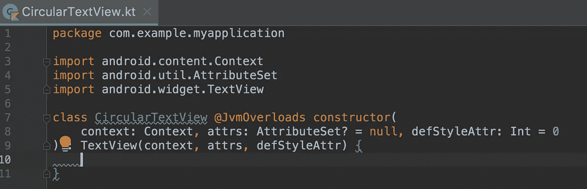

通常，我们会对为什么一个视图有不同类型的构造函数感到困惑。

## 视图(上下文上下文)

从代码动态创建视图时使用的简单构造函数。这里的参数 context 是视图运行的上下文，通过它可以访问当前的主题、资源等。

## 视图(上下文 Context，@Nullable AttributeSet attrs)

从 XML 展开视图时调用的构造函数。当从 XML 文件构造视图时调用这个函数，提供 XML 文件中指定的属性。这个版本使用默认样式 0，所以只应用上下文主题和给定属性集中的属性值。

步骤 4:绘制自定义视图最重要的一步是覆盖 onDraw()和其中的逻辑实现。

OnDraw(画布:画布？)有一个参数 Canvas，视图组件可以通过它来绘制自己。要在画布上绘图，需要创建一个 Paint 对象。

主要绘图分为两个区域

*   画什么，由画布处理
*   怎么画，由颜料处理。

Canvas 提供了绘制线条的方法，而 Paint 提供了定义线条颜色的方法。在我们的例子中，CircularTextView Canvas 提供了一个在 Paint 对象填充颜色时绘制圆形的方法。简单地说，Canvas 定义了可以在屏幕上绘制的形状，而 Paint 定义了颜色、样式、字体等属性。你画的每一个形状。

让我们开始编码吧。我们创建一个 Paint 对象并为其分配一些属性，然后使用该 Paint 对象在画布上绘制形状。onDraw()将简单地如下所示

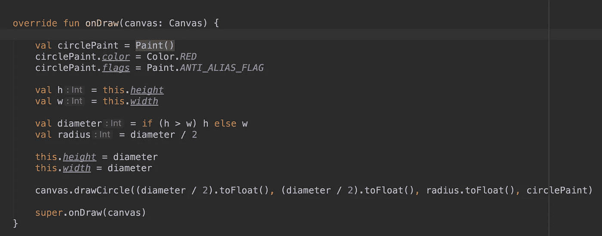

IDE 显示一条警告，以避免在绘制/布局操作期间进行对象分配。因为在渲染视图时会多次调用 onDraw()方法，每次都会创建不必要的对象。所以为了避免这种不必要的对象创建，我们需要将这部分从 onDraw()中移出，如下所示。

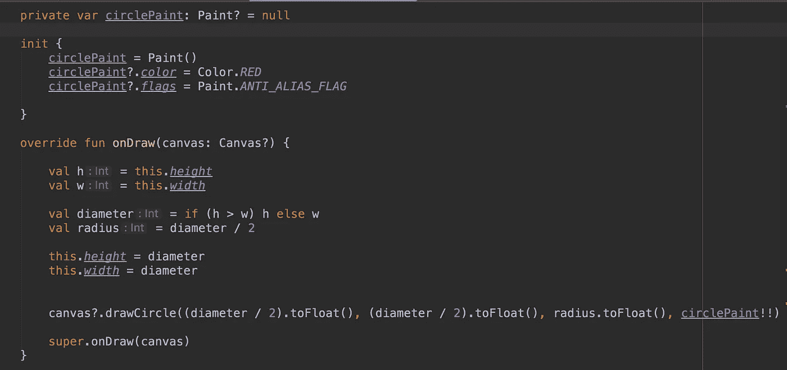

在执行绘图时，请始终记住重用对象，而不是创建新对象。不要依赖您的 IDE 来突出潜在的问题，而是自己去做，因为如果您在从 onDraw()调用的方法中创建对象，IDE 就看不到它。

第 5 步:现在我们完成了绘图，让我们用 XML 膨胀这个视图类。

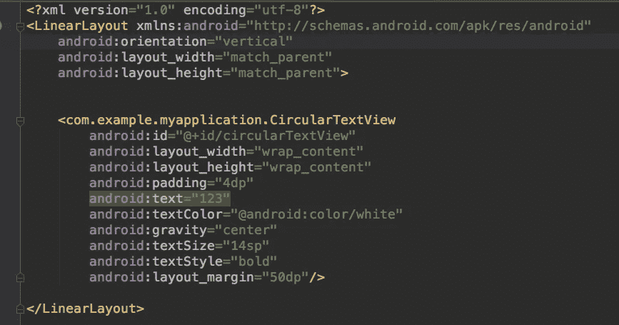

将这个 XML 布局添加到您的活动中，并运行应用程序。以下是输出。

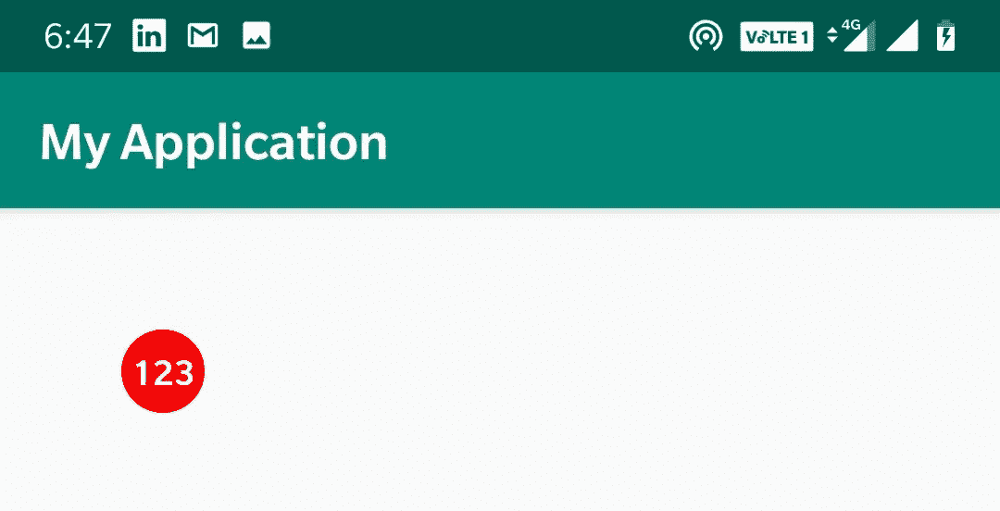

太棒了，对吧？现在让我们将这个 circlePaint 颜色动态属性从 activity 连同一些 stroke 一起分配。为此，我们需要在 CircularTextView 类中创建一些 setter 方法，以便我们可以调用这些方法并动态设置属性。

首先，让我们配置一种油漆颜色。为此，我们创建一个 setter 方法如下。

```
fun setSolidColor(color: String) {
    solidColor = Color.parseColor(color)
    circlePaint?.*color* = solidColor
}
```

现在，从 Activity 中，我们可以通过调用这个方法来动态设置颜色。

```
circularTextView.setSolidColor("#FF0000")
```

很酷，对吧？现在让我们添加一些中风的圆圈。对于笔画，需要两个输入:笔画宽度和笔画颜色。对于笔画颜色，我们需要创建一个绘画对象，就像我们对上面的圆形所做的一样。对于笔画宽度，我们创建一个变量并为其设置该值，然后在 onDraw()中使用该值。完整的代码将简单如下。

并从 activity 中动态设置属性来定制它。

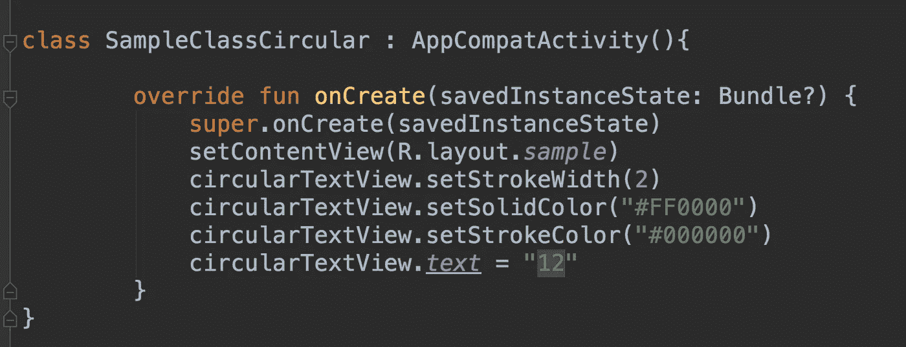

现在让我们运行设置不同颜色的应用程序。

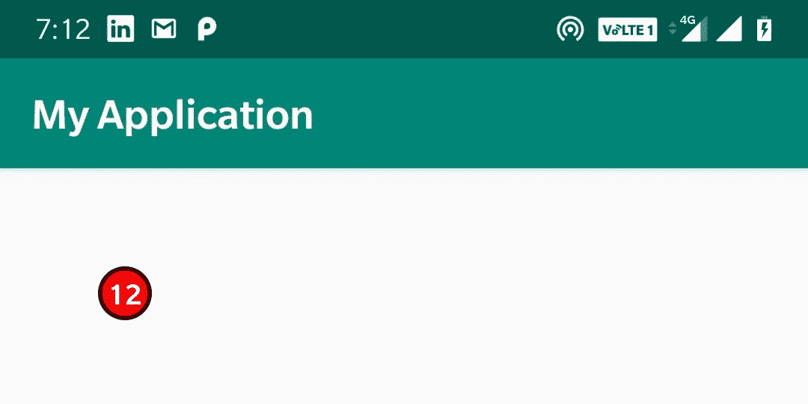

现在我们已经了解了如何从活动中动态设置属性，但是还有一个问题是如何从 XML 中设置属性。让我们继续进一步探讨。

为此，我们首先在 values 文件夹中创建一个名为 attrs.xml 的新文件。在下面的例子中，我们有一个名为 CircularTextView 的视图，其属性名为 ct_circle_fill_color，接受颜色输入。同样，我们也可以添加其他属性。

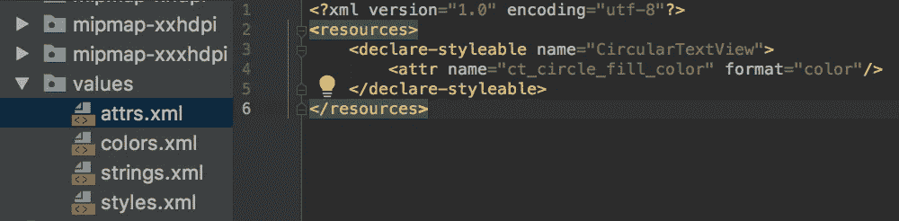

其次，我们需要在自定义视图类中读取这些属性。从 init 块中，我们读取如下所示的属性集

```
val typedArray = getContext().obtainStyledAttributes(attrs, R.styleable.*CircularTextView*)
circlePaint?.*color* = typedArray.getColor(R.styleable.*CircularTextView_ct_circle_fill_color*,Color.*BLUE*)
typedArray.recycle()
```

现在，只需转到 XML，将属性值设置为您想要的颜色，然后运行应用程序。您将看到所需的输出。

```
app:ct_circle_fill_color="@color/green"
```

在我的例子中，输出是。

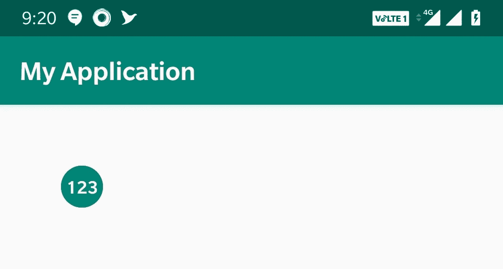

注意:不要在绘图时硬编码你的视图大小，因为其他开发人员可能有相同的视图，但大小不同。所以根据它的大小来画你的视图。

# 查看更新

如果有属性更改或者您想要更新自定义视图，我们现在就完成了视图的设置。主要有两种方法

## 无效()

invalidate()是一种方法，它坚持对我们希望显示变化的特定视图进行强制重绘。简单地说，当视图的外观发生变化时，需要调用 invalidate()。

## 请求布局()

在某一点上，视图中有一个状态变化，那么 requestLayout()就是给视图系统的信号，它需要重新计算视图的度量和布局阶段(度量→布局→绘制)。简单地说，我们可以说当视图边界发生变化时，需要调用 requestLayout()。

好了，我想您已经对如何创建自定义视图有了基本的了解。您需要知道上面提到的所有方法来创建最佳性能的定制视图。

感谢您的阅读。