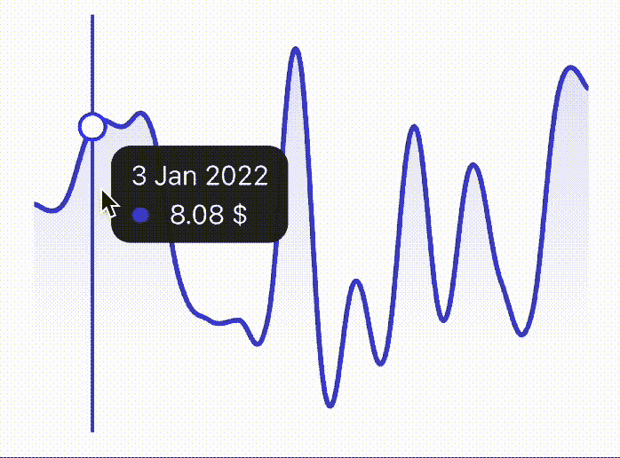
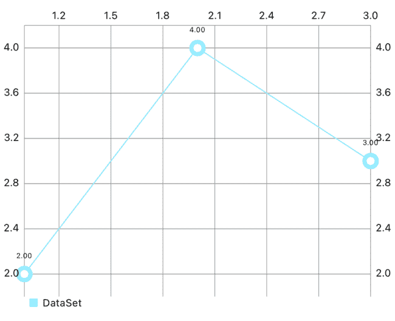
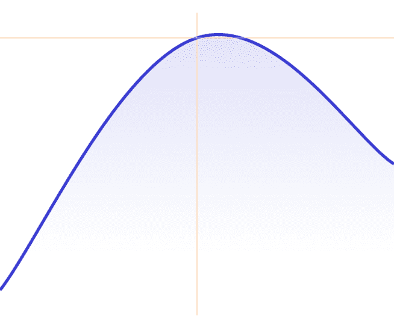
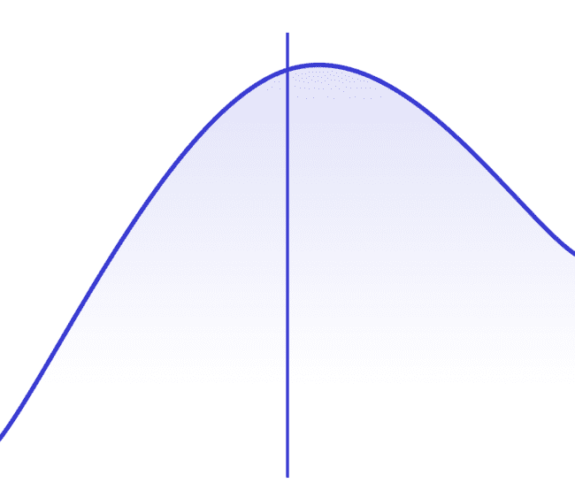
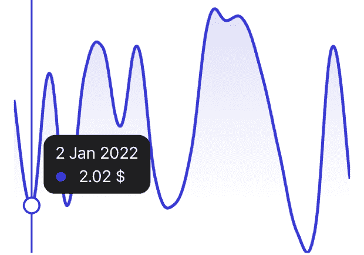

# SwiftUI 之前在 iOS 中绘制图表

> 原文：<https://betterprogramming.pub/drawing-charts-in-ios-before-swiftui-9f95b8612607>

## 用 UIKit 实现折线图


用 craiyon.com 生成的图像

在本文中，我们将了解在 SwiftUI Charts 于 2022 年推出之前，交互式线性图表是如何在 iOS 中实现的。

让我们想象一个相当真实的场景，产品所有者要求您的团队创建一个极简线性图表，该图表将:

*   显示带有渐变的平滑曲线；
*   响应用户的手势在图形上交互显示数据；
*   当前值应标有垂直线，并显示在附加信息旁边的气泡中；
*   如果能在一个区域支持多个图表就好了；
*   iOS 和 Android 最终外观必须有最小的差别。

这是一个相当冗长的解释，但试图形象化它，你会注意到你已经在不同版本的应用程序中多次看到它，如苹果的股票、银行或健身跟踪应用程序。

# 我们走吧

每个产品开发都是从研究开始的，很容易发现没有必要重新发明轮子——已经有一个库可以满足我们的需求。它最初是为安卓系统编写的( [MPAndroidChart](https://github.com/PhilJay/MPAndroidChart) 作者[菲利普·贾霍达](https://github.com/PhilJay))，它的 iOS 版本叫做[图表](https://github.com/danielgindi/Charts)(作者[丹尼尔·科恩·金迪](https://github.com/danielgindi))

在它的好处中，我想指出以下几点:

*   支持多种图表类型；
*   许多定制选项可用；
*   对应其安卓版长相；
*   与 CocoaPods，Carthage，SPM 一起安装。

为了可视化最终的产品需求，我们需要以下面的小部件结束:



在单独的项目中尝试 UI 组件和第三方库是最舒服的。让我们创建一个空项目，并用您最喜欢的依赖项管理器安装图表。我更喜欢 SPM，所有可用的选项都列在 Github 页面的[图表上](https://github.com/danielgindi/Charts)。

我不会描述创建项目的初始过程。如果您想获得项目的最终版本并与教程一起工作，可以在[我的 GitHub 页面](https://github.com/stepanovgena/LinearChartDemo)上找到。

首先，让我们创建一个非常基本的线性图表。它将帮助我们理解图表库的整体逻辑，最重要的是，为了达到预期的结果，需要改变什么。

将以下代码添加到我们的视图控制器的`viewDidLoad()`中(不要忘记文件头中的`import Charts`)

```
override func viewDidLoad() {
    super.viewDidLoad()
    let lineChartEntries = [
        ChartDataEntry(x: 1, y: 2),
        ChartDataEntry(x: 2, y: 4),
        ChartDataEntry(x: 3, y: 3),
    ]
    let dataSet = LineChartDataSet(entries: lineChartEntries)
    let data = LineChartData(dataSet: dataSet)
    let chart = LineChartView()
    chart.data = data

    view.addSubview(chart)
    chart.snp.makeConstraints {
        $0.centerY.width.equalToSuperview()
        $0.height.equalTo(300)
    }
}
```

为了掌握图表的逻辑，我建议从这段代码的底部开始反向操作。

我们可以看到图表区本身是一个`UIView`的后代，我们必须将数据设置到其中。图表类型完全是线性图表，对于条形图和其他变体，还有其他专用的视图类型。

此外，图表数据类型必须对应于视图类型`LineChartData`。这种数据类型有一个接受一些数据集的构造函数(在这个阶段，我们可能会注意到还有一个接受数据集数组的构造函数，这是在一个区域实现多个图表的关键，因为我们记得产品所有者要求尝试并支持这个特性)。

数据集类型必须对应于线性图表类型`LineChartDataSet`，它是数据条目数组的抽象(最终是图表区域中的点)。每个条目都有 X 和 Y 坐标，相当简单。

让我们构建并运行我们的项目，看看屏幕上画的是什么:



哦，不，这看起来绝对不像是企业希望我们实现的。那么让我们制定一个改变计划:

*   更改图形线条颜色
*   从图表中移除点及其注释
*   给我们的曲线添加平滑
*   在曲线下方添加渐变
*   移除轴注释
*   移除图例
*   移除网格。

# 定制它

这些设置中有些是指图表区，有些是指数据集(这是因为一个区域可以显示多个图表，每个图表都有自己的设置)

图表区设置:

```
// disable grid
chart.xAxis.drawGridLinesEnabled = false
chart.leftAxis.drawGridLinesEnabled = false
chart.rightAxis.drawGridLinesEnabled = false
chart.drawGridBackgroundEnabled = false
// disable axis annotations
chart.xAxis.drawLabelsEnabled = false
chart.leftAxis.drawLabelsEnabled = false
chart.rightAxis.drawLabelsEnabled = false
// disable legend
chart.legend.enabled = false
// disable zoom
chart.pinchZoomEnabled = false
chart.doubleTapToZoomEnabled = false
// remove artifacts around chart area
chart.xAxis.enabled = false
chart.leftAxis.enabled = false
chart.rightAxis.enabled = false
chart.drawBordersEnabled = false
chart.minOffset = 0
// setting up delegate needed for touches handling
chart.delegate = self
```

对于数据集处理，让我们更进一步，创建一个数据集工厂来支持多个图表案例。

```
/// Factory preparing dataset for a single chart
struct ChartDatasetFactory {
    func makeChartDataset(
        colorAsset: DataColor,
        entries: [ChartDataEntry]
    ) -> LineChartDataSet {
        var dataSet = LineChartDataSet(entries: entries, label: "")

        // chart main settings
        dataSet.setColor(colorAsset.color)
        dataSet.lineWidth = 3
        dataSet.mode = .cubicBezier // curve smoothing
        dataSet.drawValuesEnabled = false // disble values
        dataSet.drawCirclesEnabled = false // disable circles
        dataSet.drawFilledEnabled = true // gradient setting

        // settings for picking values on graph
        dataSet.drawHorizontalHighlightIndicatorEnabled = false // leave only vertical line
        dataSet.highlightLineWidth = 2 // vertical line width
        dataSet.highlightColor = colorAsset.color // vertical line color

        addGradient(to: &dataSet, colorAsset: colorAsset)

        return dataSet
    }
}

private extension ChartDatasetFactory {
    func addGradient(
        to dataSet: inout LineChartDataSet,
        colorAsset: DataColor
    ) {
        let mainColor = colorAsset.color.withAlphaComponent(0.5)
        let secondaryColor = colorAsset.color.withAlphaComponent(0)
        let colors = [
            mainColor.cgColor,
            secondaryColor.cgColor,
            secondaryColor.cgColor
        ] as CFArray
        let locations: [CGFloat] = [0, 0.79, 1]
        if let gradient = CGGradient(
            colorsSpace: CGColorSpaceCreateDeviceRGB(),
            colors: colors,
            locations: locations
        ) {
            dataSet.fill = LinearGradientFill(gradient: gradient, angle: 270)
        }
    }
}
```

`DataColor`是`UIColor`之上的抽象，因为我们计划从视图模型中获取图表数据，并且不希望`UIKit`泄漏到视图模型层。

```
/// Abstraction above UIColor
enum DataColor {
    case first
    case second
    case third

    var color: UIColor {
        switch self {
        case .first: return UIColor(red: 56/255, green: 58/255, blue: 209/255, alpha: 1)
        case .second: return UIColor(red: 235/255, green: 113/255, blue: 52/255, alpha: 1)
        case .third: return UIColor(red: 52/255, green: 235/255, blue: 143/255, alpha: 1)
        }
    }
}
```

让我们构建并运行一下，看看经过这些调整后我们得到了什么:



太好了，除了触摸我们都处理好了。现在，图表会在最近的值处绘制一个橙色十字准线。现在让我们来看看哪些事情可以不费吹灰之力地改变，哪些事情必须由我们来实施。

# 触摸处理

让我们回到`dataset`工厂，添加这些设置:

```
// selected value display settings
dataSet.drawHorizontalHighlightIndicatorEnabled = false // leave only vertical line
dataSet.highlightLineWidth = 2 // vertical line width
dataSet.highlightColor = colorAsset.color // vertical line color
```

现在我们的图表应该对这样的接触做出反应:



剩下的就靠我们去实现了:

*   选定值圆
*   带有附加信息属性(日期、值、颜色图例)的气泡。

这里我们有图表区的两个特性来帮助我们。首先，它有一个委托，其次，它可以显示标记。因此，我们的下一步将是创建一个从`MarkerView`基类继承的自定义标记:

```
/// Marker for highlighting selected value on graph
final class CircleMarker: MarkerView {
    override func draw(context: CGContext, point: CGPoint) {
        super.draw(context: context, point: point)
        context.setFillColor(UIColor.white.cgColor)
        context.setStrokeColor(UIColor.blue.cgColor)
        context.setLineWidth(2)

        let radius: CGFloat = 8
        let rectangle = CGRect(
            x: point.x - radius,
            y: point.y - radius,
            width: radius * 2,
            height: radius * 2
        )
        context.addEllipse(in: rectangle)
        context.drawPath(using: .fillStroke)
    }
}
```

至于 info bubble，让我们简单地创建一个自定义视图，它的实现对于图表逻辑来说并不重要，您可以在最终项目(`ChartInfoBubbleView`)中找到一个实现示例。我们从设计模型中注意到，它必须包含日期、颜色图例和 Y 值。

**然后，让我们在图表区域周围创建一个包装器，用于存储区域本身、标记和信息气泡。**

```
/// Chart view
final class ChartView: UIView {
    private let chart = LineChartView()
    private let circleMarker = CircleMarker()
    private let infoBubble = ChartInfoBubbleView()

    var viewModel: ChartViewModelProtocol? {
        didSet {
            updateChartDatasets()
        }
    }

    override init(frame: CGRect) {
        super.init(frame: frame)
        commonInit()
    }

    required init?(coder: NSCoder) {
        super.init(coder: coder)
        commonInit()
    }
}
```

**现在，在委托中，我们将添加对`ChartViewDelegate`协议的一致性。我们对两种方法特别感兴趣:**

*   **`func chartValueSelected(_ chartView: ChartViewBase, entry: ChartDataEntry, highlight: Highlight)` —这里我们获得数据集条目，它的数据将用于信息气泡，它的 highlight 属性将提供图形上的点坐标。一个重要的细节是使用突出显示的属性`.xPx`和`.yPx`，而不是`.x`和`.y`，这可能听起来有点混乱，但这就是它的工作方式；**
*   **我们应该把标记藏在这里。**

**回到图表区设置，我们将添加标记支持。**

```
// markers
chart.drawMarkers = true
circleMarker.chartView = chart
chart.marker = circleMarker
```

**当我们这样做时，下面的逻辑工作:用户的触摸由委托方法处理，我们显示一个圆形标记和一个信息气泡。在线外但在图表区域内轻按时，标记和气泡会被隐藏。**

**为了避免气泡滑出图表区域，我们可以添加一个非常简单的逻辑来检查气泡视图是否适合图表区域，或者是否必须进行水平或垂直调整。这个逻辑的例子可以在期末专题中找到。**

**干得好，现在我们已经根据产品要求准备好了功能:**

****

**眼尖的读者可能已经注意到，我们从 XY 坐标的点开始，其中 X 只是数据集中的元素号，Y 是值，那么数据是从哪里来的呢？很简单，`ChartDataEntry`有几个初始化器，其中之一是`@objc public convenience init(x: Double, y: Double, data: Any?)`，其中数据是我们想要包含的任何附加属性，所以我们在那里添加了日历日期，并在委托的触摸处理回调中将其取回。**

# **最后的想法**

**图表库有广泛的定制选项，保持 iOS 和 Android 平台之间的一致性，这是产品所有者经常需要的。我们已经通过一个简单的例子证明了这一点，从默认的可视化一直到或多或少真实世界的定制实现。**

**从这里去哪里？试着考虑在一个图表区域中实现两行、三行和 N 行，以及在这方面可能出现的挑战。**