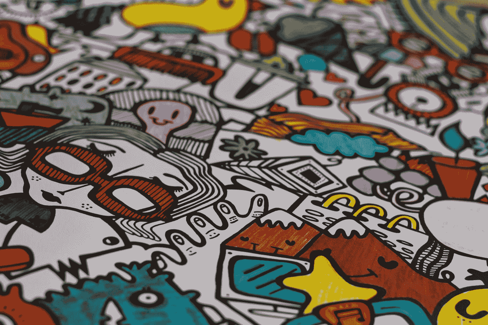
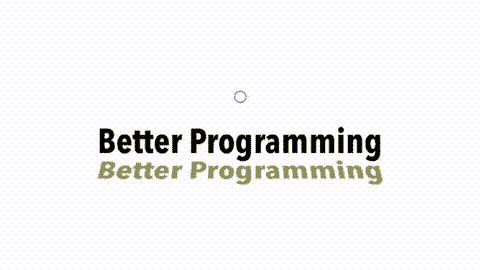
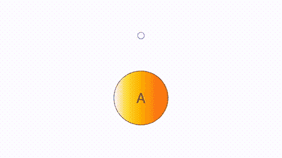
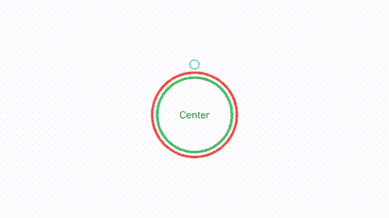
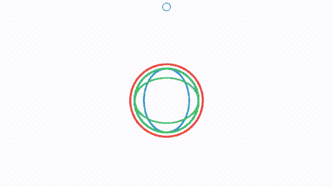

# 使用 SwiftUI 在 3D 中绘图

> 原文：<https://betterprogramming.pub/drawing-in-3d-using-swiftui-ed211d7c2c91>

## 使用 SwiftUI 探索 3D 绘图的第 2 部分

照片由 [Teo Zac](https://unsplash.com/@teo?utm_source=medium&utm_medium=referral) 在 [Unsplash](https://unsplash.com?utm_source=medium&utm_medium=referral) 上拍摄。

几周前，我[写了一篇文章](https://medium.com/better-programming/how-to-draw-in-3d-with-swiftui-7989cfcd35fc)，其中我探索了 SwiftUI 中旋转对象的高级 3D 视图修改器。它很受欢迎，我想我会做一个简短的跟进，以探索这个主题多一点。

在我做之前先做个纳米回顾吧。在那篇文章的结尾，我把下面的 3D 物体放在了一起:

基本上是四个正方形，我们慢慢地平行弯曲 90 度。我们添加了更多的视觉线索来欺骗我们的大脑，使其认为这是一个 3D 对象——即当立方体扭曲并改变不透明度时，数字会翻转过来。

让我们做更多的探索。在前一篇文章中，我提到了两个参数，但并没有真正深入研究:透视和`anchorZ`。

现在，3D 物体有一个 2D 物体通常没有的东西是阴影，SwiftUI 中有一个视图修改器。它被称为`shadow`——这并不奇怪。遗憾的是，它名不副实，我担心它实际上应该叫做`smudge`。使用`rotate`命令中的透视可以得到更好的阴影。除此之外，你可以设置你的影子的动画。

用 rotate3D 创建的阴影

这种微妙效果背后的代码如下:

我几乎没有提到的另一个属性是`anchorZ`。让我们停留在文本的主题上，使用`anchorZ`来旋转地球仪上的文本。我们将添加一些彩色阴影来帮助图像欺骗:

使用文本和 anchorZ 值的 SwiftUI globe

我肯定你同意它看起来很棒。我们有一个旋转的地球仪，看起来有点像 3D。但是等等，让我们继续地球主题，看看我们如何创建一个线框地球。

正如你所料，这比我们的立方体要难做得多。为了让它工作，我们可以使用 SwiftUI 中一个不太为人所知的形状，椭圆。这看起来像是“少即是多”的经典案例仅仅使用我在 x 轴和 y 轴上旋转的四个椭圆，我们就可以得到一个迷人的视图。中间的文字再次帮了大忙。它看起来像是悬浮在我们地球内部的一个扁平圆盘上，当光线向四面八方延伸时，它为我们的眼睛提供了一个焦点。

SwiftUI 使用椭圆生成的 globe

下面是上面视图背后的代码:

但我认为我们可以做得更好。为此，我们需要深入研究 SwiftUI 中的定制绘图原语，特别是`addArc`。使用它，我们可以通过使用半圆来创建一个 3D 地球，我将绘制半圆，然后在 x 轴和 y 轴上制作动画。`addArc`的基本代码如下所示:

然后我用显示的代码画出弧线，得到南北走向的圆环，然后旋转 90 度得到东西走向的圆环。

混合使用角度和角度的圆弧

在所示的动画中，我们从四个呈 90 度角的圆环开始。然后我们以 45 度角进入六个环。然后我们移动到 30 度的 12 个环，15 度的 24 个环，最后是 10 度的 36 个环。

你可以自己决定哪个效果最好。下面是上面的代码，除了它已经被调整为使用四种颜色在六度角上做不少于 60 个环，而不仅仅是两种颜色:

就像这样。您可以花几个小时来改变颜色、不透明度、弧线数量、线条粗细和动画时间。请在评论中告诉我，你是否遇到了一个效果很好或让你惊讶的组合。

两个方向都有 60 度弧的球体

这就把我带到了文章的结尾。我希望你喜欢读这篇文章，就像我喜欢写它一样。保持冷静，继续编码。