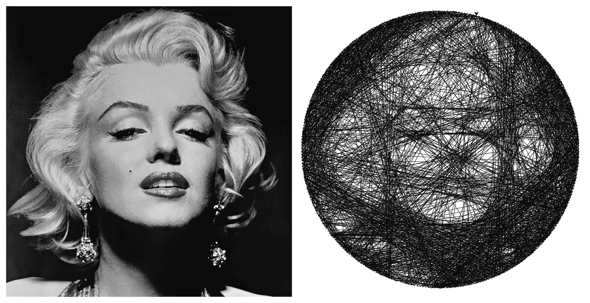
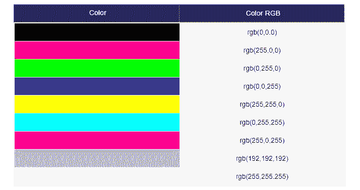
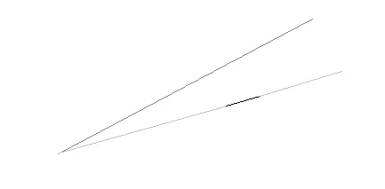
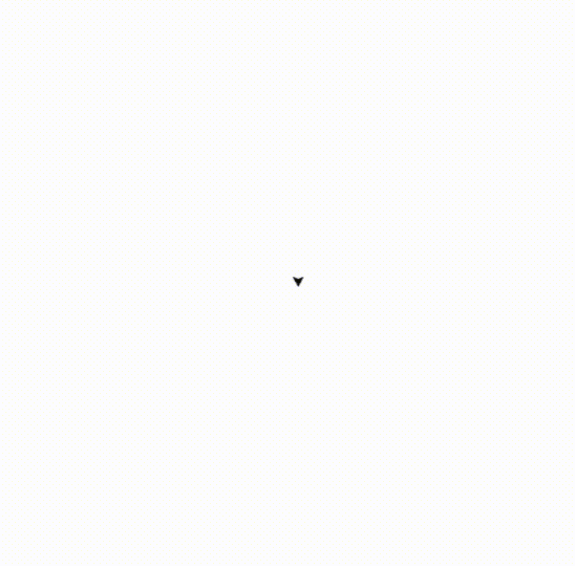
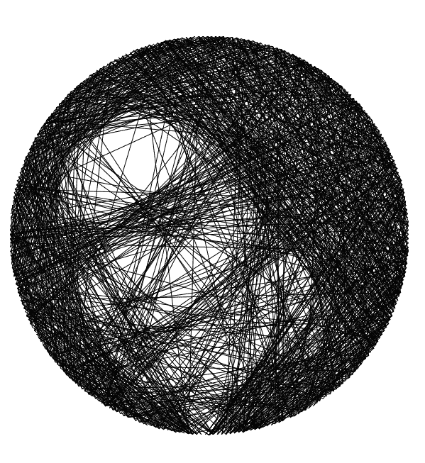
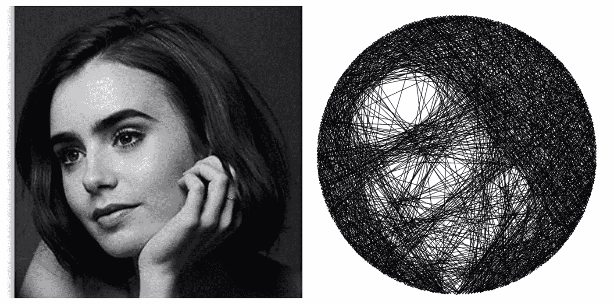
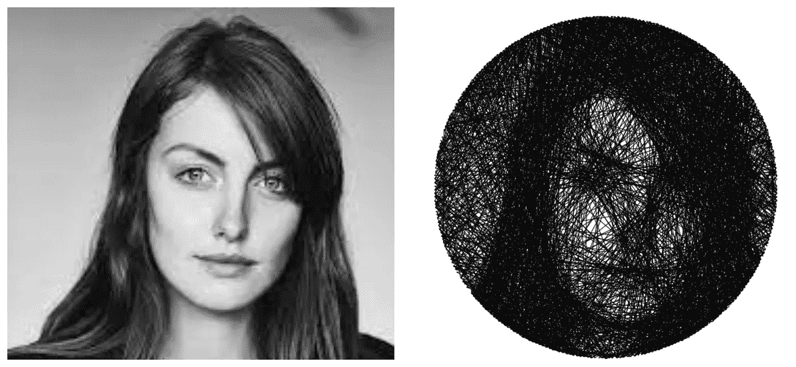
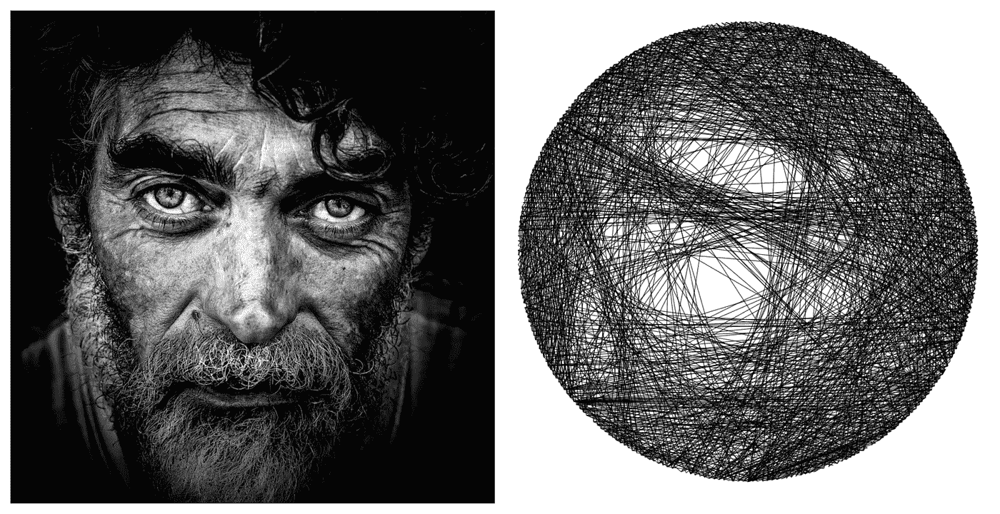

# Python 中的图像处理——仅使用指甲和一根线绘制美学肖像

> 原文：<https://betterprogramming.pub/drawing-portraits-using-only-nails-and-a-thread-with-python-1cfd8c6dd040>

## 释放你内心的艺术家。

乔治亚·福勒的玛丽莲·梦露。作者右图。

艺术家变得越来越有创造力，以至于他们可能会让我们思考:“他们怎么知道他们可以做到这一点”。在 Instagram reels 和 Tiktok 上非常出名的一种肖像绘画方式是用一根长线和一组指甲。艺术家将钉子钉在圆形画布的整个圆周上，然后开始用线将钉子连接起来。在这样做的同时，被画的人的形象开始形成。

我在绘画方面没有任何天赋，我认为，根据指甲连接的顺序，即使是我也能画出有美感的肖像。我所要做的就是写一个代码，为我提供这个钉子的顺序。

# 这个想法

主要想法是相当幼稚的。我们拍一张灰度照片，在内切圆的圆周上钉上假想的钉子。然后，从一个随机的钉子开始，我们计算这个钉子和所有其他钉子之间的线的模糊度。最模糊的线条将会被画在我们的画布上。我们重复这个步骤数百次，然后我们将获得我们的最终图像。

# 技术

## 对计算机来说，图像是什么？

为了实现这个想法，我们必须想象图像是一个矩阵，其中的元素是像素。每个像素被编码成一个三元素阵列:它的 RGB 码。这是一个表示三原色强度的代码:红色、绿色和蓝色。

事实上，由于每种颜色都是这三种颜色的组合，我们可以通过这种类型的数组来定义图像。我们应该注意，每种颜色的强度都是 0 到 255 之间的 int 值，0 是最低强度，255 是最高强度。

[**上图新鲜出炉**](https://tutorials.freshersnow.com/css/css-colors/)

每两个钉子之间的连线可以看作是一个像素向量。评估它的模糊性与计算向量的范数是一样的。我们可能想到的通常的范数是欧几里德范数、L1 范数和无穷范数。

然而，无穷范数并不是一个精确的范数，因为它会让我们在有黑色像素的地方画出每一条线，即使它是这条线上唯一的非白色像素。

如果我们使用无穷范数，上面的线的模糊性不如下面的线，然而，上面的线总体上比另一条更暗，因此它是需要被画出的线。

另一方面，欧几里德规范将是相当昂贵的，因为我们希望重复这个过程几百次。这就是为什么我们将采用 L1 范数:我们将增加假想线中每个像素的强度值，然后为了归一化，我们将除以该线中像素的数量(因为将会有更长的线，但不会像其他线那样模糊)。

“规范”最低的那一行是最晦涩难懂的一行。

模糊公式，L 是线矢量。

在每一步中，从图像中选择一条线后，我们将把同一条线的颜色变成白色，这样我们就不会一次又一次地画同一条线。

# 使用的 Python 库

我们将使用 3 个主要库: [Numpy](https://numpy.org/) 、 [Sci-kit Image (skimage)](https://scikit-image.org/) 和 [Turtle](https://docs.python.org/3/library/turtle.html) 。

Numpy，Skimage & Turtle

撇除可以让我们处理图像。它读取图片(RGB 代码的矩阵)。它还可以为我们提供连接两个像素的所有像素的坐标向量，这对我们计算线条的模糊度非常有用。

Numpy 将允许我们做一些数学运算，例如计算向量的范数(线条的模糊度)以及使用角度和“cos”和“sine”函数确定钉子的坐标。

最后，Turtle 将允许我们绘制最终图像。Turtle 的有趣之处在于它显示了绘图的过程，所以我们不必为了看到结果而等待代码完成。

# 履行

我们将首先导入前面的三个库。然后，我们将读取我们将要绘制的图像，并将其裁剪成一个正方形。接下来，我们将锤打我们想象中的指甲。我们将使用 300 个钉子。

我们打开画布，我们将和 Turtle 一起在上面画画。然而，这个库使用坐标作为笛卡尔网格:0 在中心，x 轴从左到右，y 轴从下到上。但由于我们正在处理的图像在某种程度上是一个矩阵，因此 0 在左上角，y 轴朝向底部。我们将需要翻译我们的屏幕。

为了得到我们要连接的钉子的顺序，我们将把钉子的号码按顺序连接成一个字符串。

现在让我们进入主要部分:for 循环。

我们将从列表中的第一个钉子开始，我们称之为`next_nail`。第一个 for 循环允许我们选择将要进行的迭代次数。这基本上是我们将要绘制的链接的数量。嵌套的 for 循环允许我们搜索所有其他的钉子，哪一个用最模糊的行链接到我们的`next_nail`。因此，我们将比较模糊度参数。`rr1`，`cc1`是我们用`skimage`库的`draw.line`函数得到的像素矢量。

然后，我们计算模糊度:它是 A/B 参数。由于我们在寻找最模糊的线，我们需要最小的 A/B 值，因此，在 j 循环中，我们用我们能找到的最好的钉子更新每个时间参数`next_nail`，用我们的钉子和`next_nail`之间的线更新`best_line`。最后，我们在海龟画布上画出`best_line`。

请注意，我们使用“`graph_nails`”坐标是因为我们向上指定的原因。

# 行动中的代码

代码的执行展示了画图的全过程。

这是莉莉·柯林斯肖像的延时摄影

莉莉·柯林斯肖像的制作

最后的结果是这样的。

作者图片

需要链接的钉子编号如下:

显示画这幅画像大概花了 7 分钟。

# 限制

这种代码的主要限制是它可以尝试的图片类型。他们需要有具体的对比细节，否则，它不会看起来很好。

另一个限制是，照片需要尽可能“方正”。如果矩形的长度与宽度之比离 1 太远，方形裁剪将去掉太多细节，并且提供较差的结果。

# 例子

结果取决于照片的质量。对一些人来说可能非常清楚，对另一些人来说可能真的不清楚。

莉莉·柯林斯肖像

左照片由格鲁吉亚福勒。作者右图。

左图由阿塔坎-埃尔库特·乌松[拍摄。作者右图。](https://www.stocksy.com/Atakan696)

一个不好的结果的例子。左图由[托马斯·富尔弗](https://www.pinterest.com/thomasfulfer/)拍摄。作者右图。

# 结论

这个迷你项目是对图像处理初学者的一个很好的介绍。仍然有许多可以改进的地方，比如定制一个过滤器，使大多数图片与代码兼容。我们也可以考虑单色照片，它只需要一些彩色线，以提供一个良好的结果。这个项目最后一个很好的改进是让机器学习如何识别面部细节(眼睛、鼻子、耳朵……):这样，连接指甲可能会变得更精确。

最后，感谢大家一直读到最后。我希望这很有趣。如果你有任何问题，请随时回复。