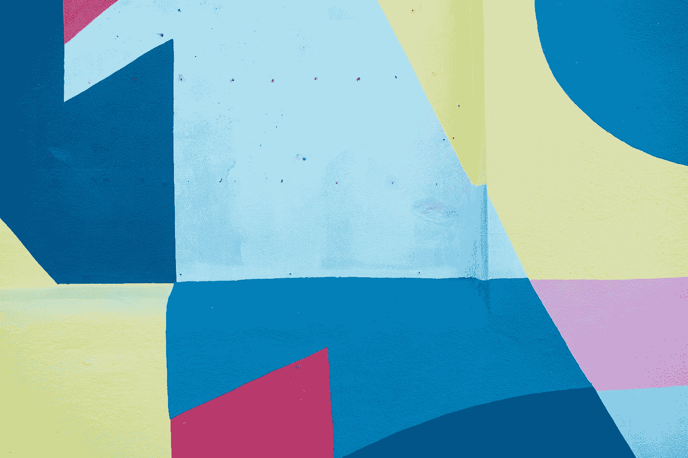
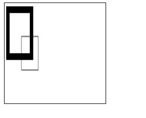
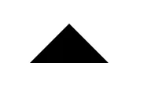
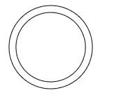

# 如何在 HTML 画布上绘制圆弧和矩形

> 原文：<https://betterprogramming.pub/drawing-shapes-on-html-canvas-arcs-and-rectangles-422680b9b05>

## 用画布元素创造的基础



照片由 [Delila Ziebart](https://unsplash.com/@delilaziebart?utm_source=medium&utm_medium=referral) 在 [Unsplash](https://unsplash.com?utm_source=medium&utm_medium=referral) 上拍摄

HTML `canvas`元素让我们画出形状，并用它们做各种事情。最基本的事情包括添加形状、改变它们的颜色和绘制路径。

在这一部分，我们将看看如何在画布上绘制形状，包括圆弧和矩形

# 网格

画布上的一切都位于一个网格上。这些项目由坐标定位。左上角是原点(0，0)，一切都是相对于那个放置的。通常网格中的一个单位是屏幕上的一个像素。

向右移动时， *x* 坐标变大，向下移动时， *y* 坐标变大。

# 绘制矩形

Canvas 仅支持两种基本形状——矩形和路径。

我们可以通过使用渲染上下文的`fillRect`方法来绘制矩形。它采用四个参数，分别是左上角的 *x* 和 *y* 坐标，以及矩形的宽度和高度。该矩形将用一种颜色填充。

`strokeRect`方法采用与`fillRect`方法相同的参数，让我们画一个矩形轮廓。

最后，还有`clearRect`方法，清除指定的矩形区域，使其完全透明。它采用与其他两种方法相同的参数。

例如，我们可以如下使用这些方法…

```
const canvas = document.querySelector('canvas');
const ctx = canvas.getContext('2d');
ctx.fillRect(5, 5, 80, 80);
ctx.clearRect(15, 15, 60, 60);
ctx.strokeRect(50, 50, 50, 50);
```

…假设我们有以下 HTML …

```
<canvas></canvas>
```

…以及 CSS:

```
canvas {
  width: 200px;
  height: 200px;
  border: 1px solid black;
}
```

`fillRect`绘制一个黑色背景的矩形，在左上角有一个用`clearRect`方法绘制的清晰矩形。黑色矩形的左上角在(5，5)中，大小为 80x80 像素。

这个透明矩形的左上角是(15，15)，它的大小是 60x60 像素。

然后我们用`strokeRect`方法在右下角画出矩形。它的左上角在(50，50)处，大小为 50x50 像素。

最终，我们得到了以下结果:



# 绘制路径

除了矩形，我们还可以画路径，路径是连接在一起的线段。它们可以是不同的形状或颜色。路径也可以是封闭的。

我们通过以下步骤创建路径:

1.  我们创造了道路。
2.  使用绘图命令绘制路径。
3.  然后，我们可以描边或填充路径来渲染它。

我们需要调用一些方法来绘制路径。我们需要调用`beginPath`方法来创建一个新路径。未来的绘图命令将被引导到路径，并建立它。

然后，我们使用其他三种方法来绘制路径。我们用`closePath`方法给路径添加一条直线，到达当前子路径的起点。

我们使用`stroke`的方法通过描绘轮廓来画出形状。然后，如果我们愿意，我们可以使用`fill`方法来填充路径的内容区域。

我们用`moveTo`方法移动到屏幕的坐标，该方法把要移动到的 *x* 和 *y* 坐标作为参数。然后，我们可以用`lineTo`方法从那个坐标到另一个坐标画一条线，该方法使用 *x* 和 *y* 坐标从当前坐标所在的位置画一条线。

例如，我们可以通过书写来画一个三角形:

```
const canvas = document.querySelector('canvas');
const ctx = canvas.getContext('2d');
ctx.beginPath();
ctx.moveTo(100, 50);
ctx.lineTo(50, 100);
ctx.lineTo(150, 100);
ctx.fill();
```

我们首先从(100，50)开始尝试。然后，我们用第一个`lineTo`调用从(100，50)到(50，100)画一条线。然后，我们用`lineTo`方法再次从(50，100)画到(150，100)。最后，我们调用`fill`通过填充路径的内容区域来绘制形状。

最后，我们得到:



# moveTo 方法和弧线

`moveTo`方法便于在不绘制任何东西的情况下移动绘图路径的原点。

它采用我们想要移动到的 *x* 和 *y* 坐标。

我们可以写:

```
const canvas = document.querySelector('canvas');
const ctx = canvas.getContext('2d');
ctx.beginPath();
ctx.moveTo(125, 75);
ctx.arc(75, 75, 50, 0, 2 * Math.PI);
ctx.moveTo(135, 75);
ctx.arc(75, 75, 60, 0, 2 * Math.PI);
ctx.stroke();
```

为了画一个圆，我们用`moveTo`方法移动到圆的最右边的点。然后，我们调用`arc`方法来画圆弧。前两个参数是中心的 *x* 和 *y* 坐标。第三个参数是半径，第四个参数是起始角度，最后一个参数是结束角度。

在上面的代码中，起始角度位于 3 点钟位置。顺时针或逆时针方向是相对于这个点的。

我们还可以传入一个额外的布尔参数来指定我们是否要逆时针绘制。

此外，还有一个`arcTo`方法，它分别为前四个参数取起点和终点的 *x* 和 *y* 坐标。第五个参数是弧的半径。

写完这段代码后，我们得到了下面的圆圈。



```
ctx.moveTo(125, 75);
ctx.arc(75, 75, 50, 0, 2 * Math.PI);
```

这将绘制一个半径为 50 像素的小圆。

```
ctx.moveTo(135, 75);
ctx.arc(75, 75, 60, 0, 2 * Math.PI);
```

这将绘制半径为 60 像素的较大的圆。

有了 canvas 元素，我们可以轻松地绘制形状。有专门画矩形的方法。对于弯曲的形状和线条，我们可以用`arc`和`arcTo`的方法画出来。

根据我们的喜好，形状可以被填充或不被填充。

我们可以使用`moveTo`方法移动到一个给定的坐标，而不用画任何东西。