# 用 SwiftUI 的路径绘图

> 原文：<https://betterprogramming.pub/drawing-with-swiftuis-path-1cb3e57b9ee5>

## 如何使用 SwiftUI 的路径视图绘制直线、曲线和更复杂的图形

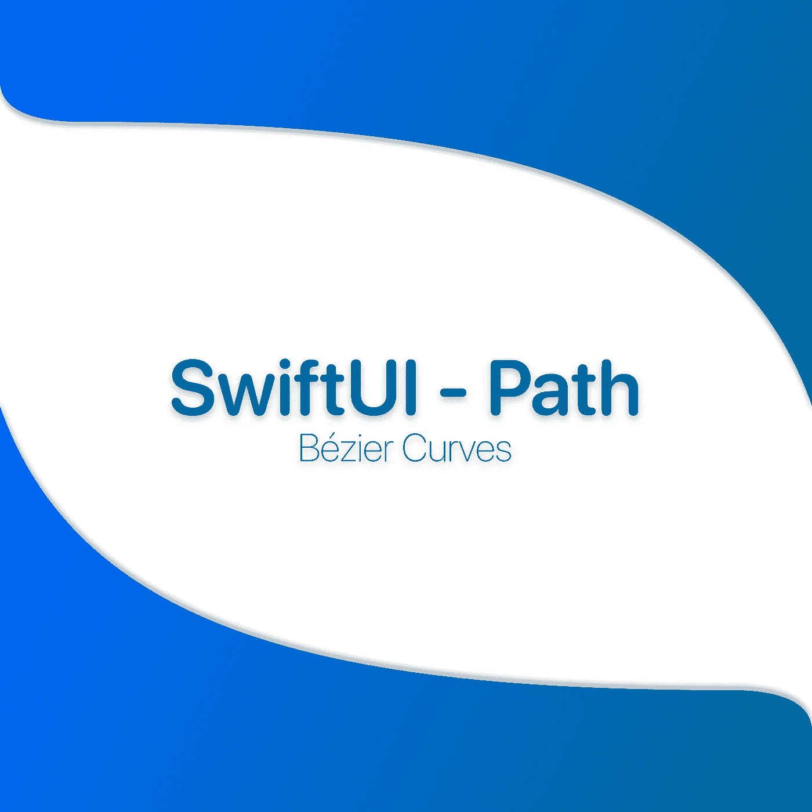

第 4/5 部分

这是我目前的贝塞尔路径系列的第四篇文章。这篇文章主要教你如何使用路径视图，特别是曲线。

# 介绍

在这里，我将教你如何在使用这个对象绘制方法绘制形状时使用路径视图。在您阅读了本系列的第一篇文章之后，这可能会更容易些:[Swift 的贝塞尔基础](https://luizpedrofg.medium.com/b%C3%A9zier-fundaments-for-swift-e8be3eec22fd)。

本文将分为五个部分:

1.  工作场所(设置项目)
2.  画一个简单的形状(理解除了画画我们还需要做什么)
3.  画出我们的第一个曲线形状
4.  画这篇文章横幅！

所以做好准备。用 swift 绘图不会再是外星技术了！

# 工作场所

创建一个空的 SwiftUI 项目后，我所做的就是:

*   将`AccentColor`更改为自定义蓝色(`#006A98`)；
*   创建了三个 Swift 文件和三个空视图(`SquareView`、`DShapeView`、`BannerView`)
*   在`ContentView.swift`中创建了一个标签栏

```
var body: some View {
    TabView {
        SquareView()
            .tabItem {
                Label("Square", systemImage: "1.square.fill")
            }
        DShapeView()
            .tabItem {
                Label("D Shape", systemImage: "2.circle.fill")
            }
        BannerView()
            .tabItem {
                Label("Banner", systemImage: "pencil.circle.fill")
            }
    }
}
```

这样，我们可以很容易地看到我们的三个不同的实现，而无需删除代码。

# 画一个简单的形状

我们在这一部分的目标是使用`drawLine`方法绘制一个简单的蓝色正方形(见下图)。

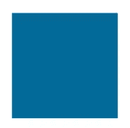

简单的蓝色正方形

在第一个屏幕中(`SquareView`)，我们将从一个空类开始(我们不会使用`viewDidLoad`方法)。

首先，让我们改变我们的身体内容。我们将添加一个`NavigationView`(只是为了给页面添加一个标题)，调用我们的 Path 视图，并添加一些修饰符:路径将被填充的颜色、填充和导航标题。

```
var body: some View {
    NavigationView {
        Path { path in

        }
        .fill(Color.accentColor)
        .padding(20)
        .navigationTitle(Text("Square View"))
    }
}
```

现在我们有了开始画画所需的一切！我们可以准确地看到我们需要做的下一个图像。在这种情况下，我们将使用正值，每次我们增加 X 或 Y 值时，屏幕就会向右或向下移动。因此，我们的四个点将具有以下值:

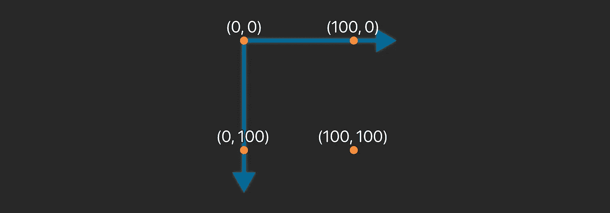

形状点

现在，我们发现了四个点的位置，我们可以将它们转换成代码。在我们的路径视图中，让我们移动到第一个点并添加线条，直到我们再次到达第一个点。

```
path.move(to: .zero)
path.addLine(to: CGPoint(x: 100, y: 0))
path.addLine(to: CGPoint(x: 100, y: 100))
path.addLine(to: CGPoint(x: 0, y: 100))
path.addLine(to: .zero)
path.closeSubpath()
```

另外，不要忘记调用`closeSubpath`方法。这对于避免奇怪的伪像很重要，但当您想要绘制多个与同一个对象不相关的形状/笔画时也很重要。

嘿，这很简单！让我们看看它是如何运行的:

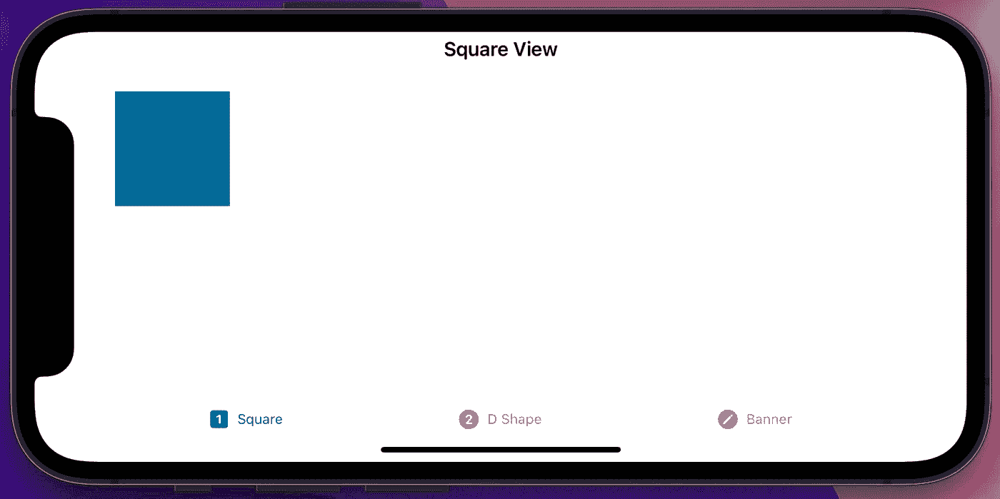

方形模拟器

如果你需要我的完整代码，你可以在这里得到它，在我的 GitHub repo 中。

酷！让我们进入下一个视图，用曲线画些东西！

# 画出我们的第一个曲线形状

我们的第一个曲线形状将是一个简单的“D”形，如下图所示:

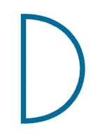

带有蓝色描边的简单“D”形

这样，我们可以展示一个简单的曲线路径，以了解它是如何准确工作的。在这里，我们将最终使用贝塞尔曲线方法！不是仅仅画一条线到一个给定点，我们需要通过这个点我们需要通过目的地点和两个控制点。但是…什么是控制点呢？

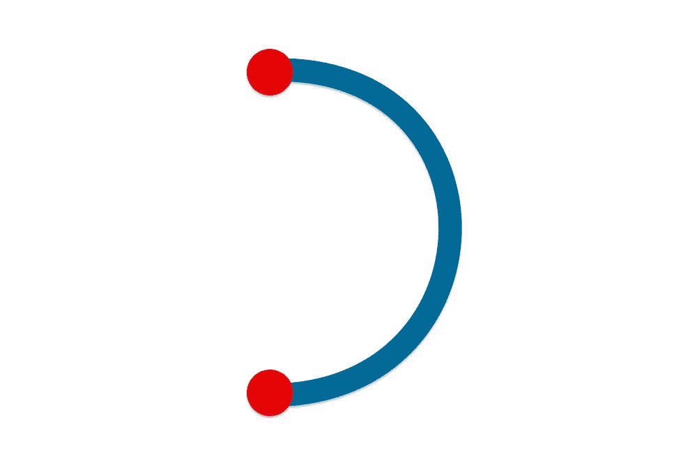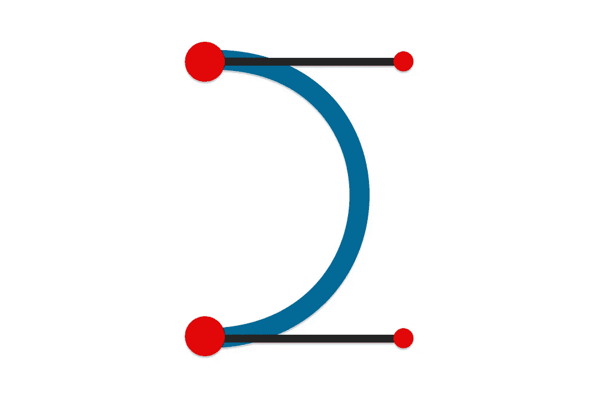

曲线示例及其控制点

我在[这篇文章](https://luizpedrofg.medium.com/b%C3%A9zier-fundaments-for-swift-e8be3eec22fd) 里解释的比较好(如果你没看过，去读吧。这样事情就好办了！)，但这是一种计算曲线中每个点应该在哪里的方法，使用这两个额外的点作为指导！我们可以在上面的图像中看到原点和终点(红色大圆圈)及其控制点(红色小圆圈)。在下图中，我们可以看到在改变控制点的位置时，我们可以用相同的曲线实现什么:

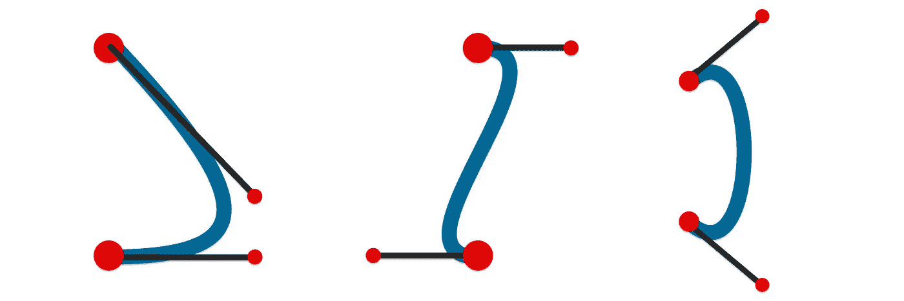

不同控制点位置的示例

好了，现在你已经知道它是如何工作的了，让我们来编码吧！在我们的`DShapeView`中，让我们将我们的`Path`视图移到一个`Shape`中！所以代码看起来会像这样:

```
struct DShapeView: View {
    var body: some View {
        NavigationView {
            DShape()
                .stroke(Color.accentColor, lineWidth: 5)
                .navigationTitle(Text("Banner Shape View"))
                .frame(width: 100, height: 100)
                .offset(x: 25, y: -50)
        }
    }
}struct DShape: Shape {
    func path(in rect: CGRect) -> Path {
        // 
    }
}
```

现在我们已经创建了一个`Shape`，并在视图主体中设置了所有内容，让我们找出我们的点需要哪些值。假设我们设想一个 100x100(宽和高)的框架，我们最终会得到类似下图的结果:

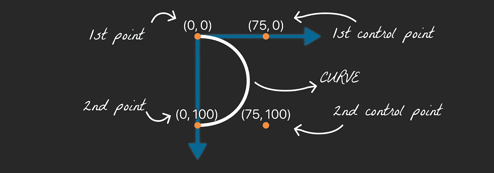

曲线点位置

为了实现我们的“D”形，我们需要:

*   移动到第一点
*   向第二个点添加曲线
*   定义我们的曲线控制点(右上角和右下角)
*   向第一个点添加一条线

让我们在我们的`path`函数中实现这个逻辑:

```
Path { path in
    path.move(to: .zero)
    path.addCurve(
        to: CGPoint(x: 0, y: 100),
        control1: CGPoint(x: 75, y: 0),
        control2: CGPoint(x: 75, y: 100))
    path.addLine(to: .zero)
    path.closeSubpath()
}
```

注意，我们可以使用`rect`参数来确保我们的形状在不同的尺寸下保持一致。但是现在，我将使用绝对值。

让我们在模拟器中运行它:

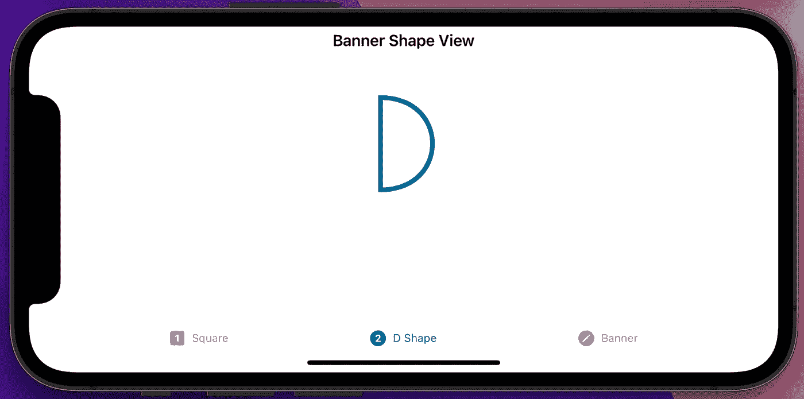

“D”形模拟器

如果你需要我的完整代码，你可以在我的 GitHub repo 中得到它[。](https://github.com/LuizGuerra/Medium-Article-Codes/blob/main/BezierPath/SwiftUI%20Path/SwiftUI%20Path/Views/DShapeView.swift)

不错！让我们做一些更有挑战性的事情吧！

# 绘制这篇文章的横幅

好了，现在我们有了基础，让我们把这篇文章横幅编码为我们新的应用程序背景！但是…从哪里开始呢？像往常一样，让我们把问题分成更小的部分。

正如我们所看到的，现在我们有两个形状要跟踪——顶部和底部。在`BannerView`中，我们将创建代码:

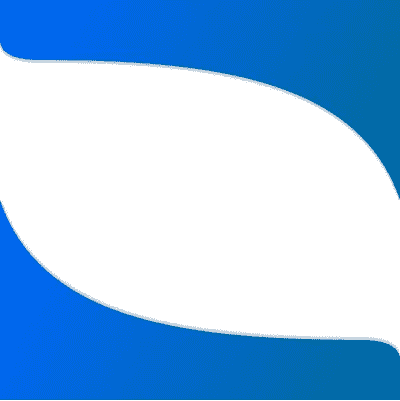

这篇文章横幅

```
struct BannerView: View {
    var body: some View {
        ZStack {
            BannerShape()
                .fill(Color.accentColor)
                .ignoresSafeArea()
            Text("Banner Shape")
                .font(.largeTitle).bold()
                .foregroundColor(Color.accentColor)
        }
    }
}struct BannerShape: Shape {
    func path(in rect: CGRect) -> Path {
        let width = rect.width
        let height = rect.height

        return Path { path in
    }
}
```

通过这段代码，我们在屏幕中间设置了一个文本，我们的新结构`Shape`，以及它在`View`主体中的颜色。

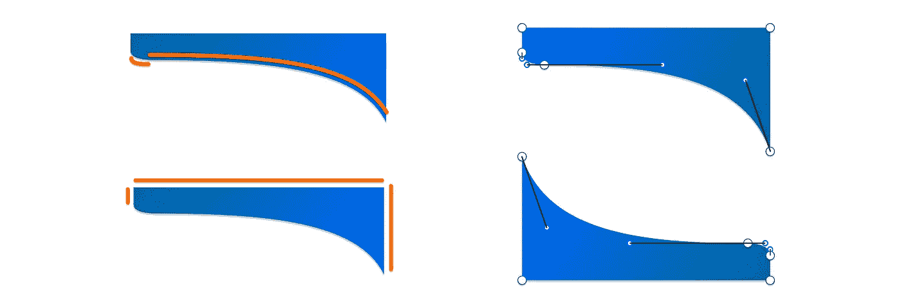

横幅及其线条、曲线、点和控制点

现在，开始编码形状。正如我们在第一个顶部图像中看到的，横幅是由相同的形状制成的，其中一个是镜像的。该形状可以分成三条直线和两条简单的贝塞尔曲线。

我们可以看到，为了达到最佳状态，我们需要:

1.  移动到第一个(我将使用左上角)
2.  在第二行(右上角)添加一行
3.  在第三个位置添加一条线(中间偏右)
4.  向第四点(左上角)添加一条大曲线
5.  向第五点添加一条小曲线(也在左上角)
6.  添加一条线回到第一点。

这一次，对于点位置，我们将使用相对值。[点击此处了解它们是什么以及如何计算](https://luizpedrofg.medium.com/calculating-relative-points-from-different-frame-sizes-6d6560615de5)。综上所述，我们可以将视图的最小和最大位置分别视为 0 和 1，并将我们获得的值乘以宽度或高度，以获得应用程序屏幕上的正确位置。这样，计算将适用于任何屏幕尺寸。

因此，让我们从在我们的`path`方法中添加一些有助于我们的变量开始:

```
func path(in rect: CGRect) -> Path {
    let width = rect.width
    let height = rect.height
}
```

之后，我将添加顶部形状的代码:

```
func path(in rect: CGRect) -> Path {
    // ...
    path.move(to: .zero)
    path.addLine(to: CGPoint(x: rect.width, y: 0))
    path.addLine(to: CGPoint(x: rect.width, y: rect.height*0.3125)) path.addCurve(to: CGPoint(x: 40, y: 75),
                  control1: CGPoint(
                    x: rect.width-40,
                    y: rect.height*0.15625),
                  control2: CGPoint(
                    x: rect.width*3/5,
                    y: rect.height*0.09375))
    path.addCurve(to: CGPoint(x: 0, y: 50),
                  control1: CGPoint(x: 10, y: 75),
                  control2: CGPoint(x: 0, y: 65)) path.addLine(to: .zero)
    path.closeSubpath()
}
```

请注意，乘法运算中使用的所有预编码值都是我之前提到的相对值。底部形状也将使用它们。代码如下:

```
func path(in rect: CGRect) -> Path {
    // ...
    path.move(to: CGPoint(x: 0, y: rect.height*0.6875)) path.addCurve(to: CGPoint(x: width-40, y: height-75),
                  control1: CGPoint(
                    x: 40,
                    y: height*0.84375),
                  control2: CGPoint(
                    x: width*2/5,
                    y: height*0.90625))
    path.addCurve(to: CGPoint(x: width, y: height-50),
                  control1: CGPoint(
                    x: width-10,
                    y: height-75),
                  control2: CGPoint(
                    x: width,
                    y: height-65)) path.addLine(to: CGPoint(x: width, y: height))
    path.addLine(to: CGPoint(x: 0, y: height))
    path.addLine(to: CGPoint(x: 0, y: rect.height*0.6875))
    path.closeSubpath()
}
```

现在，如果我们运行代码，我们将得到以下结果:

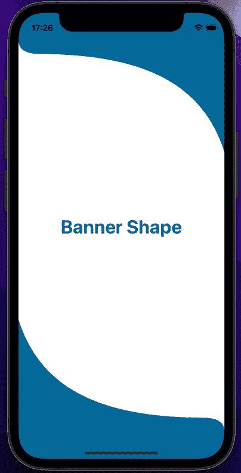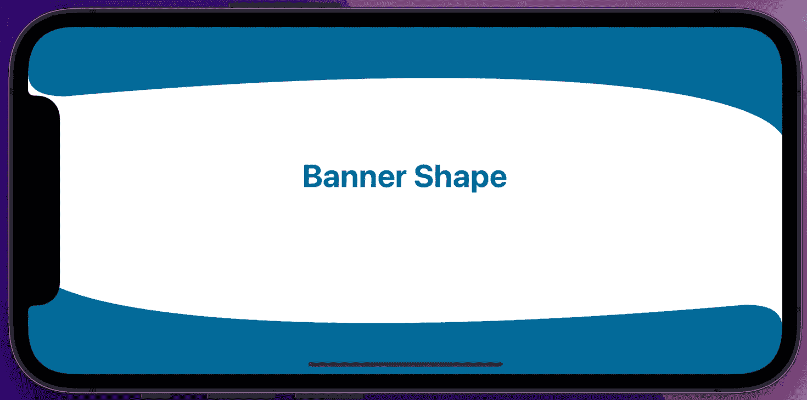

不错！

如果你需要我的完整代码，可以从[我的 GitHub repo](https://github.com/LuizGuerra/Medium-Article-Codes/blob/main/BezierPath/SwiftUI%20Path/SwiftUI%20Path/Views/BannerView.swift) 中获取。

# 结论

SwiftUI 的路径代码是迄今为止最容易使用的，因为你不必等待上下文，在正确的时间添加填充，并且它的样式也非常干净。虽然我没有写过任何关于动画的东西，但是很容易看出，不需要从其他工具导入路径，不需要使用第三方包，就可以拥有移动路径。当然，它们仍然是有用的，但这将完美地适用于较小的东西。

此外，我想链接到[苹果的路径教程](https://developer.apple.com/tutorials/swiftui/drawing-paths-and-shapes)，它展示了编写更复杂的几何图形是多么容易。

```
**Want to Connect?**Feel free to comment here or send me a message on [Twitter](https://twitter.com/LuizPedroGuerra). The article code repository can be found [here](https://github.com/LuizGuerra/Medium-Article-Codes/tree/main/BezierPath/SwiftUI%20Path).
```